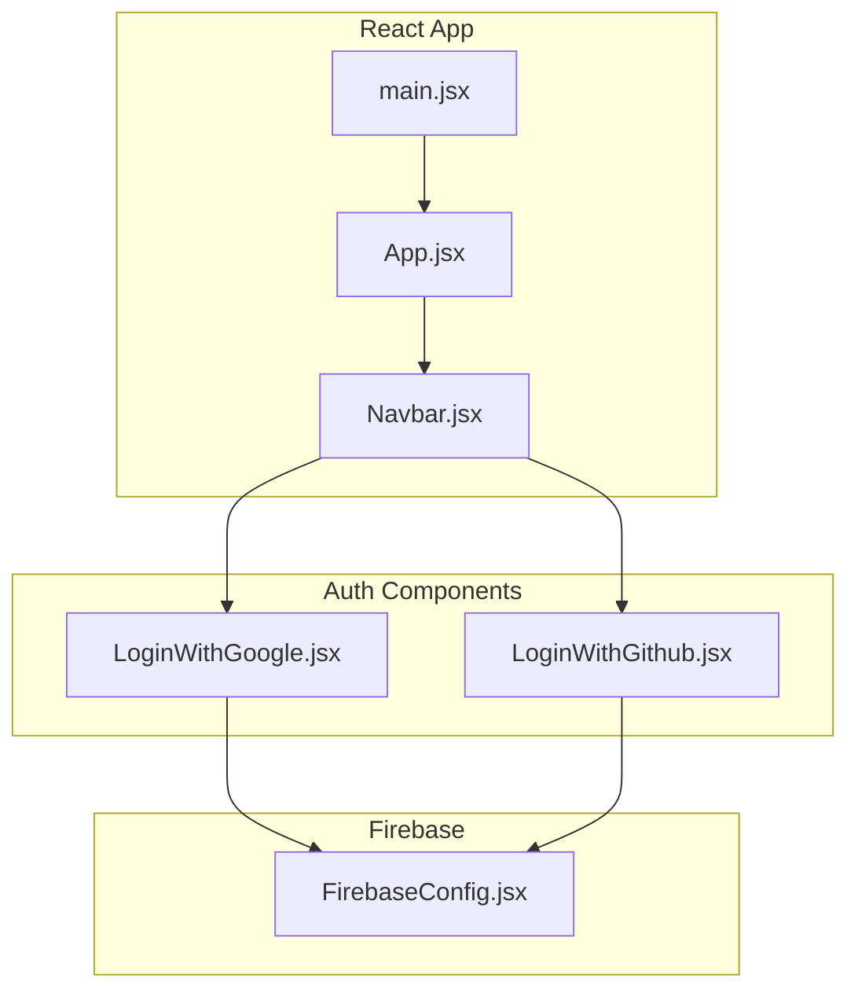
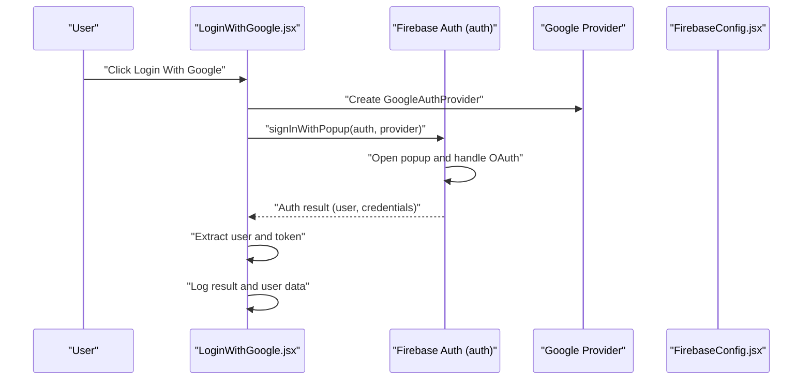
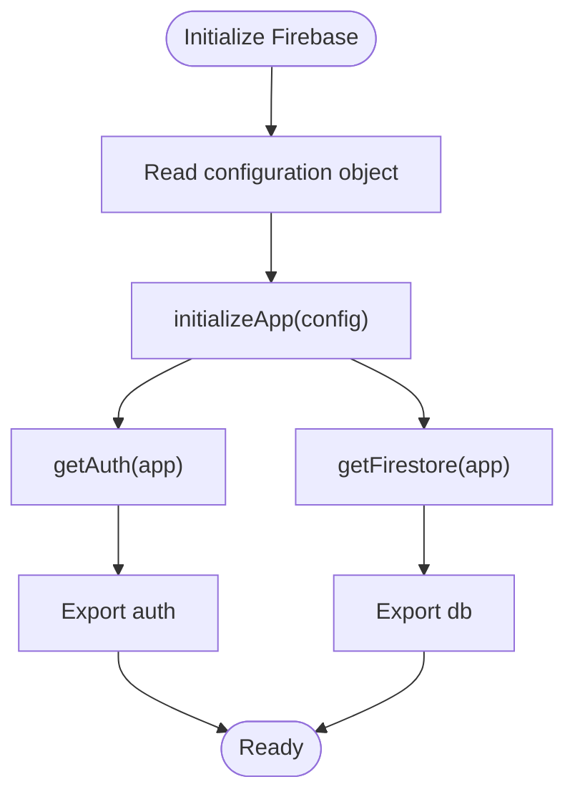
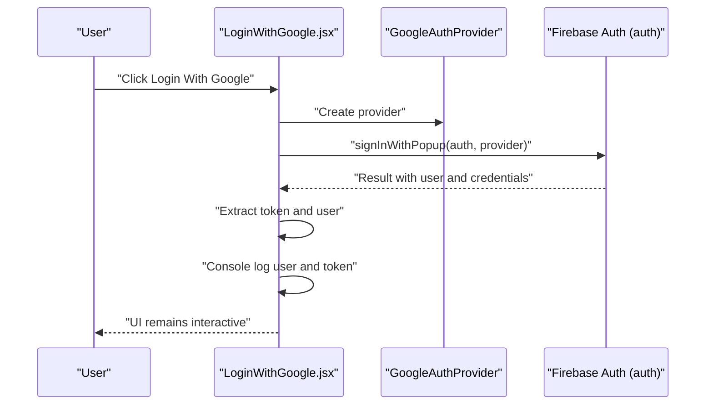
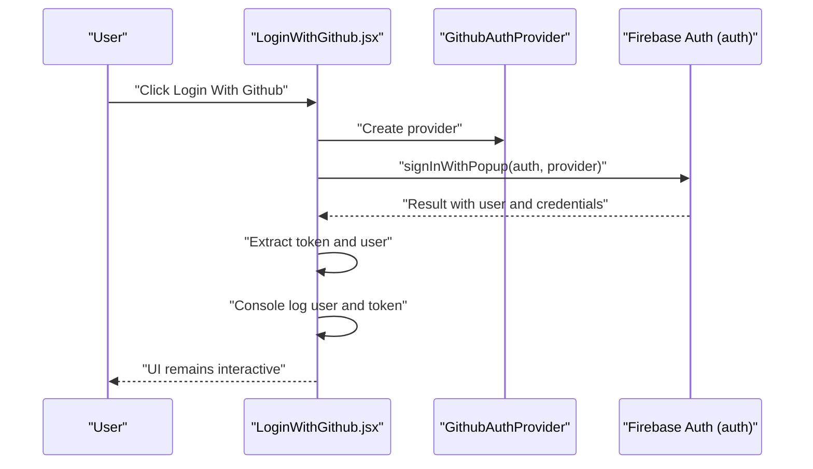
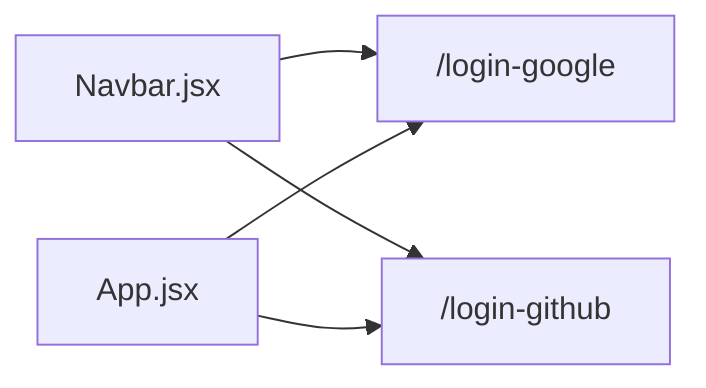
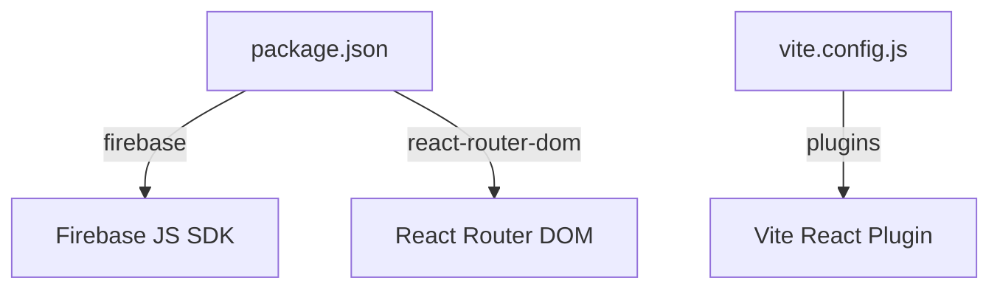

# Authentication Integration

<cite>
**Referenced Files in This Document**
- [FirebaseConfig.jsx](file://src/components/FirebaseConfig.jsx)
- [LoginWithGoogle.jsx](file://src/components/LoginWithGoogle.jsx)
- [LoginWithGithub.jsx](file://src/components/LoginWithGithub.jsx)
- [App.jsx](file://src/App.jsx)
- [Navbar.jsx](file://src/components/Navbar.jsx)
- [main.jsx](file://src/main.jsx)
- [package.json](file://package.json)
- [vite.config.js](file://vite.config.js)
</cite>

## Table of Contents
1. [Introduction](#introduction)
2. [Project Structure](#project-structure)
3. [Core Components](#core-components)
4. [Architecture Overview](#architecture-overview)
5. [Detailed Component Analysis](#detailed-component-analysis)
6. [Dependency Analysis](#dependency-analysis)
7. [Performance Considerations](#performance-considerations)
8. [Security Considerations](#security-considerations)
9. [Troubleshooting Guide](#troubleshooting-guide)
10. [Conclusion](#conclusion)

## Introduction
This document explains the Firebase-based authentication system in the car-rental-frontend application. It covers how Firebase is configured, how OAuth login flows are implemented for Google and GitHub, and how the authentication results are handled within React components. It also addresses security considerations and provides troubleshooting guidance for common issues.

## Project Structure
The authentication system is composed of:
- A Firebase configuration module that initializes the Firebase app and exports authentication and Firestore instances.
- Two React components that trigger OAuth login flows using Firebase’s popup-based authentication.
- A navigation bar that links to the login pages.
- Application entry points and routing configuration.

**Diagram sources**
- [main.jsx](file://src/main.jsx#L1-L13)
- [App.jsx](file://src/App.jsx#L1-L53)
- [Navbar.jsx](file://src/components/Navbar.jsx#L1-L81)
- [FirebaseConfig.jsx](file://src/components/FirebaseConfig.jsx#L1-L26)
- [LoginWithGoogle.jsx](file://src/components/LoginWithGoogle.jsx#L1-L37)
- [LoginWithGithub.jsx](file://src/components/LoginWithGithub.jsx#L1-L35)

**Section sources**
- [main.jsx](file://src/main.jsx#L1-L13)
- [App.jsx](file://src/App.jsx#L1-L53)
- [Navbar.jsx](file://src/components/Navbar.jsx#L1-L81)
- [FirebaseConfig.jsx](file://src/components/FirebaseConfig.jsx#L1-L26)
- [LoginWithGoogle.jsx](file://src/components/LoginWithGoogle.jsx#L1-L37)
- [LoginWithGithub.jsx](file://src/components/LoginWithGithub.jsx#L1-L35)

## Core Components
- FirebaseConfig.jsx
  - Initializes the Firebase app using the Firebase JS SDK.
  - Exports the Firebase Authentication instance and Firestore instance for use across the app.
  - Contains the Firebase project configuration object with API key, project identifiers, and other settings.

- LoginWithGoogle.jsx
  - Imports the Firebase Authentication instance and GoogleAuthProvider.
  - Implements an async handler that opens a popup for Google sign-in.
  - Extracts user and token information from the authentication result and logs them to the console.

- LoginWithGithub.jsx
  - Imports the Firebase Authentication instance and GithubAuthProvider.
  - Implements an async handler that opens a popup for GitHub sign-in.
  - Extracts user and token information from the authentication result and logs them to the console.

- App.jsx and Navbar.jsx
  - Provide navigation to the login pages.
  - App.jsx includes routes for the login components, while Navbar.jsx provides menu entries linking to them.

**Section sources**
- [FirebaseConfig.jsx](file://src/components/FirebaseConfig.jsx#L1-L26)
- [LoginWithGoogle.jsx](file://src/components/LoginWithGoogle.jsx#L1-L37)
- [LoginWithGithub.jsx](file://src/components/LoginWithGithub.jsx#L1-L35)
- [App.jsx](file://src/App.jsx#L1-L53)
- [Navbar.jsx](file://src/components/Navbar.jsx#L1-L81)

## Architecture Overview
The authentication flow uses Firebase’s popup-based OAuth providers. The React components trigger the sign-in process, and Firebase manages the OAuth redirect and popup lifecycle.

**Diagram sources**
- [LoginWithGoogle.jsx](file://src/components/LoginWithGoogle.jsx#L1-L37)
- [FirebaseConfig.jsx](file://src/components/FirebaseConfig.jsx#L1-L26)

**Section sources**
- [LoginWithGoogle.jsx](file://src/components/LoginWithGoogle.jsx#L1-L37)
- [FirebaseConfig.jsx](file://src/components/FirebaseConfig.jsx#L1-L26)

## Detailed Component Analysis

### Firebase Configuration Module
- Initialization
  - Initializes the Firebase app with the provided configuration object.
  - Creates and exports the Authentication instance and Firestore instance.

- Exported Instances
  - auth: Used by login components to initiate OAuth flows.
  - db: Available for Firestore operations (not used in the login components).

**Diagram sources**
- [FirebaseConfig.jsx](file://src/components/FirebaseConfig.jsx#L1-L26)

**Section sources**
- [FirebaseConfig.jsx](file://src/components/FirebaseConfig.jsx#L1-L26)

### Google OAuth Login Component
- Implementation Pattern
  - Uses GoogleAuthProvider to configure the provider.
  - Calls signInWithPopup with the auth instance and provider.
  - Handles the result asynchronously and extracts user and token information.
  - Logs the result and user data to the console.

- Error Handling
  - Wraps the sign-in call in a try/catch block and logs errors.

- Async/Await Pattern
  - Declares the handler as async and awaits the result of signInWithPopup.

**Diagram sources**
- [LoginWithGoogle.jsx](file://src/components/LoginWithGoogle.jsx#L1-L37)
- [FirebaseConfig.jsx](file://src/components/FirebaseConfig.jsx#L1-L26)

**Section sources**
- [LoginWithGoogle.jsx](file://src/components/LoginWithGoogle.jsx#L1-L37)
- [FirebaseConfig.jsx](file://src/components/FirebaseConfig.jsx#L1-L26)

### GitHub OAuth Login Component
- Implementation Pattern
  - Uses GithubAuthProvider to configure the provider.
  - Calls signInWithPopup with the auth instance and provider.
  - Handles the result asynchronously and extracts user and token information.
  - Logs the result and user data to the console.

- Error Handling
  - Wraps the sign-in call in a try/catch block and logs errors.

- Async/Await Pattern
  - Declares the handler as async and awaits the result of signInWithPopup.

**Diagram sources**
- [LoginWithGithub.jsx](file://src/components/LoginWithGithub.jsx#L1-L35)
- [FirebaseConfig.jsx](file://src/components/FirebaseConfig.jsx#L1-L26)

**Section sources**
- [LoginWithGithub.jsx](file://src/components/LoginWithGithub.jsx#L1-L35)
- [FirebaseConfig.jsx](file://src/components/FirebaseConfig.jsx#L1-L26)

### Navigation and Routing Integration
- Navbar.jsx
  - Provides links to the login pages for Google and GitHub.
  - Uses react-router-dom Link components to navigate to the login routes.

- App.jsx
  - Defines routes for the login components under paths such as /login-github and /login-google.
  - Includes the Navbar component in the layout.

**Diagram sources**
- [Navbar.jsx](file://src/components/Navbar.jsx#L1-L81)
- [App.jsx](file://src/App.jsx#L1-L53)

**Section sources**
- [Navbar.jsx](file://src/components/Navbar.jsx#L1-L81)
- [App.jsx](file://src/App.jsx#L1-L53)

## Dependency Analysis
- Runtime Dependencies
  - The application depends on the Firebase JavaScript SDK for authentication and Firestore.
  - The React Router DOM library is used for navigation and routing.

- Build-Time Configuration
  - Vite is configured with the React plugin.

**Diagram sources**
- [package.json](file://package.json#L1-L32)
- [vite.config.js](file://vite.config.js#L1-L8)

**Section sources**
- [package.json](file://package.json#L1-L32)
- [vite.config.js](file://vite.config.js#L1-L8)

## Performance Considerations
- Popup-based authentication is lightweight and suitable for client-side apps.
- Avoid unnecessary re-renders by keeping the login handlers as simple as possible and only updating state when needed.
- Consider debouncing or caching user data after successful authentication to reduce repeated network calls.

## Security Considerations
- API Key Exposure
  - The Firebase configuration object, including the API key, is currently embedded in the client-side code. This exposes the API key to clients and increases risk.
  - Recommendation: Move sensitive configuration to environment variables managed by the build system or server-side proxy. For Vite, use environment variables prefixed appropriately and ensure they are not exposed in the built bundle.

- OAuth Redirect Flows
  - The popup-based OAuth flow is convenient but relies on popups being enabled. Some environments restrict popups, which can break the flow.
  - Recommendation: Provide a fallback route-based flow using signInWithRedirect for environments where popups are blocked.

- Best Practices for Production Deployment
  - Restrict Firebase project permissions and enable appropriate OAuth providers in the Firebase Console.
  - Configure Firebase Hosting and Cloud Functions to enforce HTTPS and secure headers.
  - Implement rate limiting and monitoring for authentication endpoints.
  - Store tokens securely (avoid storing long-lived tokens in local storage) and refresh them as needed.

- Environment Variables
  - The project does not currently use environment variables for Firebase configuration. Add environment variables for Firebase configuration and load them during build or runtime.

**Section sources**
- [FirebaseConfig.jsx](file://src/components/FirebaseConfig.jsx#L1-L26)
- [package.json](file://package.json#L1-L32)

## Troubleshooting Guide
- Popup Blocked
  - Symptom: Clicking the login button does nothing.
  - Cause: Pop-up blockers prevent the OAuth popup from opening.
  - Resolution: Allow pop-ups for the site or switch to a redirect-based flow.

- Incorrect Firebase Configuration
  - Symptom: Authentication fails immediately.
  - Cause: Wrong API key, project ID, or OAuth provider settings.
  - Resolution: Verify the configuration object and provider scopes in the Firebase Console.

- Missing OAuth Providers
  - Symptom: Google or GitHub login buttons do not appear.
  - Cause: OAuth providers not enabled in the Firebase Console.
  - Resolution: Enable Google and GitHub providers in the Firebase Authentication section.

- CORS or Redirect URI Issues
  - Symptom: Redirect loops or OAuth failures after login.
  - Cause: Misconfigured authorized domains or redirect URIs.
  - Resolution: Ensure the app’s domain is added to authorized domains and redirect URIs match the deployed origin.

- Console Logging and Debugging
  - Both login components log the authentication result and user data to the console. Use browser developer tools to inspect logs and verify the presence of user and token information.

**Section sources**
- [LoginWithGoogle.jsx](file://src/components/LoginWithGoogle.jsx#L1-L37)
- [LoginWithGithub.jsx](file://src/components/LoginWithGithub.jsx#L1-L35)

## Conclusion
The car-rental-frontend application integrates Firebase Authentication with simple, popup-based OAuth flows for Google and GitHub. The Firebase configuration is centralized in a dedicated module and exported for use across components. While the current setup demonstrates the core authentication flow, production readiness requires moving sensitive configuration out of client code, enabling robust error handling, and adopting best practices for security and reliability.