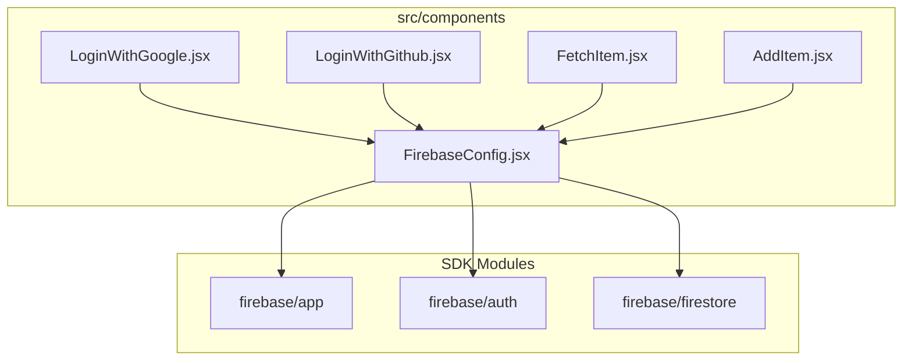
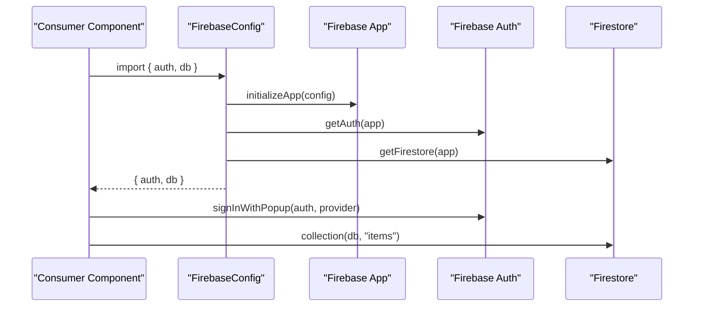
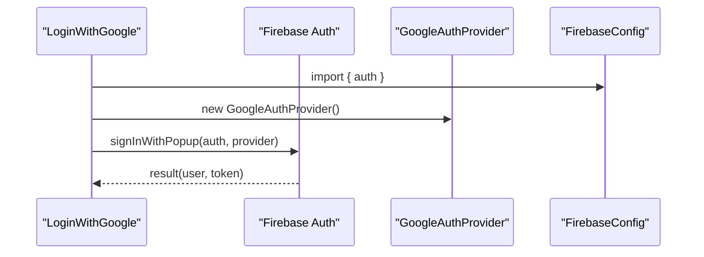
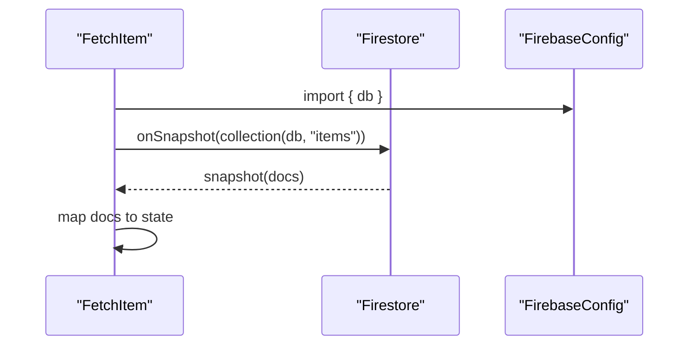
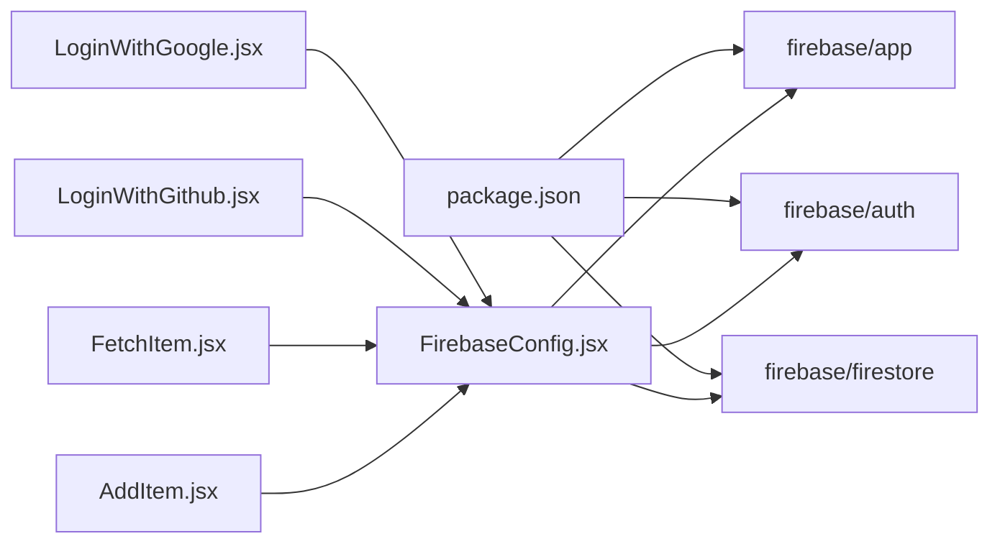

# Firebase Configuration

<cite>
**Referenced Files in This Document**
- [FirebaseConfig.jsx](file://src/components/FirebaseConfig.jsx)
- [LoginWithGoogle.jsx](file://src/components/LoginWithGoogle.jsx)
- [LoginWithGithub.jsx](file://src/components/LoginWithGithub.jsx)
- [FetchItem.jsx](file://src/components/FetchItem.jsx)
- [AddItem.jsx](file://src/components/AddItem.jsx)
- [package.json](file://package.json)
- [vite.config.js](file://vite.config.js)
- [README.md](file://README.md)
</cite>

## Table of Contents
1. [Introduction](#introduction)
2. [Project Structure](#project-structure)
3. [Core Components](#core-components)
4. [Architecture Overview](#architecture-overview)
5. [Detailed Component Analysis](#detailed-component-analysis)
6. [Dependency Analysis](#dependency-analysis)
7. [Performance Considerations](#performance-considerations)
8. [Troubleshooting Guide](#troubleshooting-guide)
9. [Conclusion](#conclusion)
10. [Appendices](#appendices)

## Introduction
This document explains the Firebase configuration used in the car-rental-frontend application. It covers how Firebase is initialized with the configuration object, how the auth and Firestore instances are created and exported, and how they are consumed across components. It also highlights security implications of exposing API keys in client-side code and provides guidance on using environment variables for production. Finally, it documents integration points with the Firebase SDK modules and common setup issues.

## Project Structure
The Firebase configuration is centralized in a dedicated module that initializes Firebase and exports the auth and Firestore instances. Components import these instances to perform authentication and database operations.

**Diagram sources**
- [FirebaseConfig.jsx](file://src/components/FirebaseConfig.jsx#L1-L26)
- [LoginWithGoogle.jsx](file://src/components/LoginWithGoogle.jsx#L1-L37)
- [LoginWithGithub.jsx](file://src/components/LoginWithGithub.jsx#L1-L35)
- [FetchItem.jsx](file://src/components/FetchItem.jsx#L1-L58)
- [AddItem.jsx](file://src/components/AddItem.jsx#L1-L37)

**Section sources**
- [FirebaseConfig.jsx](file://src/components/FirebaseConfig.jsx#L1-L26)
- [LoginWithGoogle.jsx](file://src/components/LoginWithGoogle.jsx#L1-L37)
- [LoginWithGithub.jsx](file://src/components/LoginWithGithub.jsx#L1-L35)
- [FetchItem.jsx](file://src/components/FetchItem.jsx#L1-L58)
- [AddItem.jsx](file://src/components/AddItem.jsx#L1-L37)

## Core Components
- FirebaseConfig module
  - Initializes Firebase using the Firebase app SDK.
  - Creates and exports the auth instance from the Firebase auth SDK.
  - Creates and exports the Firestore instance from the Firebase Firestore SDK.
  - Exports both instances for use by other components.

- Consumer components
  - LoginWithGoogle and LoginWithGithub import the auth instance to sign in users via OAuth providers.
  - FetchItem and AddItem import the db instance to read/write Firestore collections.

**Section sources**
- [FirebaseConfig.jsx](file://src/components/FirebaseConfig.jsx#L1-L26)
- [LoginWithGoogle.jsx](file://src/components/LoginWithGoogle.jsx#L1-L37)
- [LoginWithGithub.jsx](file://src/components/LoginWithGithub.jsx#L1-L35)
- [FetchItem.jsx](file://src/components/FetchItem.jsx#L1-L58)
- [AddItem.jsx](file://src/components/AddItem.jsx#L1-L37)

## Architecture Overview
The Firebase configuration module acts as a singleton provider of auth and Firestore instances. Components depend on this module to access Firebase services.

**Diagram sources**
- [FirebaseConfig.jsx](file://src/components/FirebaseConfig.jsx#L1-L26)
- [LoginWithGoogle.jsx](file://src/components/LoginWithGoogle.jsx#L1-L37)
- [FetchItem.jsx](file://src/components/FetchItem.jsx#L1-L58)

## Detailed Component Analysis

### FirebaseConfig Module
- Initialization
  - Imports the Firebase app initializer and auth/firestore getters.
  - Defines the Firebase configuration object with identifiers such as API key, authDomain, projectId, storageBucket, messagingSenderId, appId, and measurementId.
  - Calls the app initializer with the configuration object.
  - Creates the auth instance bound to the initialized app.
  - Creates the Firestore instance bound to the initialized app.
  - Exports both instances for use by other modules.

- Security note
  - The configuration object currently contains sensitive identifiers in client-side code. This is acceptable for development but must be replaced with environment variables in production.

- SDK modules used
  - Firebase app SDK for initializing the Firebase app.
  - Firebase auth SDK for authentication.
  - Firebase Firestore SDK for database operations.

**Section sources**
- [FirebaseConfig.jsx](file://src/components/FirebaseConfig.jsx#L1-L26)

### Authentication Consumers
- LoginWithGoogle
  - Imports the auth instance from FirebaseConfig.
  - Uses GoogleAuthProvider and signInWithPopup to authenticate users.
  - Handles success and error cases.

- LoginWithGithub
  - Imports the auth instance from FirebaseConfig.
  - Uses GithubAuthProvider and signInWithPopup to authenticate users.
  - Handles success and error cases.

**Diagram sources**
- [LoginWithGoogle.jsx](file://src/components/LoginWithGoogle.jsx#L1-L37)
- [FirebaseConfig.jsx](file://src/components/FirebaseConfig.jsx#L1-L26)

**Section sources**
- [LoginWithGoogle.jsx](file://src/components/LoginWithGoogle.jsx#L1-L37)
- [LoginWithGithub.jsx](file://src/components/LoginWithGithub.jsx#L1-L35)

### Firestore Consumers
- FetchItem
  - Imports the db instance from FirebaseConfig.
  - Subscribes to a Firestore collection snapshot to observe real-time updates.
  - Reads document data and manages local state.

- AddItem
  - Imports the db instance from FirebaseConfig.
  - Adds new documents to a Firestore collection.

**Diagram sources**
- [FetchItem.jsx](file://src/components/FetchItem.jsx#L1-L58)
- [FirebaseConfig.jsx](file://src/components/FirebaseConfig.jsx#L1-L26)

**Section sources**
- [FetchItem.jsx](file://src/components/FetchItem.jsx#L1-L58)
- [AddItem.jsx](file://src/components/AddItem.jsx#L1-L37)

## Dependency Analysis
- Firebase SDK dependencies
  - The project depends on the Firebase JavaScript SDK bundle as indicated by the package manifest.

- Module-level dependencies
  - FirebaseConfig depends on Firebase app, auth, and firestore modules.
  - Consumer components depend on FirebaseConfig for auth and db instances.

**Diagram sources**
- [package.json](file://package.json#L1-L32)
- [FirebaseConfig.jsx](file://src/components/FirebaseConfig.jsx#L1-L26)
- [LoginWithGoogle.jsx](file://src/components/LoginWithGoogle.jsx#L1-L37)
- [LoginWithGithub.jsx](file://src/components/LoginWithGithub.jsx#L1-L35)
- [FetchItem.jsx](file://src/components/FetchItem.jsx#L1-L58)
- [AddItem.jsx](file://src/components/AddItem.jsx#L1-L37)

**Section sources**
- [package.json](file://package.json#L1-L32)

## Performance Considerations
- Initialization cost
  - Initializing Firebase occurs once per module load. Keep the initialization lightweight and avoid repeated initializations.
- Real-time listeners
  - Firestore onSnapshot creates persistent listeners. Ensure to unsubscribe when components unmount to prevent memory leaks.
- Provider usage
  - OAuth sign-in operations are network-bound and should be handled with appropriate loading states and error handling.

[No sources needed since this section provides general guidance]

## Troubleshooting Guide
Common setup issues and resolutions:

- Incorrect API key
  - Symptom: Authentication failures or initialization errors.
  - Resolution: Verify the API key in the configuration object matches the Firebase Console project settings.

- Mismatched authDomain
  - Symptom: Redirect-based OAuth flows fail or redirect loops occur.
  - Resolution: Ensure the authDomain in the configuration matches the Firebase Console project’s authorized domains.

- SDK version compatibility
  - Symptom: Runtime errors or missing methods.
  - Resolution: Align the Firebase SDK version with the project’s runtime and bundler. The project declares a Firebase SDK version in its dependencies.

- Environment variables in production
  - Symptom: Exposure of secrets in client-side bundles.
  - Resolution: Replace hardcoded identifiers with environment variables prefixed for the build tool. For Vite, use a prefix recognized by the framework to inject variables at build time.

- Missing environment variables
  - Symptom: Undefined values causing initialization to fail.
  - Resolution: Provide environment variables at build time and ensure they are present in the deployed environment.

- CORS and origin restrictions
  - Symptom: OAuth redirects blocked by browser policies.
  - Resolution: Configure authorized domains and redirect URIs in the Firebase Console according to the hosting environment.

**Section sources**
- [FirebaseConfig.jsx](file://src/components/FirebaseConfig.jsx#L1-L26)
- [package.json](file://package.json#L1-L32)
- [vite.config.js](file://vite.config.js#L1-L7)

## Conclusion
The car-rental-frontend integrates Firebase by centralizing initialization and exporting auth and Firestore instances for component usage. While the current setup works for development, production deployments must secure sensitive identifiers using environment variables and ensure SDK compatibility. Following the best practices outlined here will improve security, reliability, and maintainability.

## Appendices

### Best Practices for Firebase Project Setup and Configuration Management
- Use environment variables for sensitive identifiers in production builds.
- Restrict authorized domains and redirect URIs in the Firebase Console.
- Keep Firebase SDK versions aligned with project requirements.
- Minimize initialization overhead and avoid redundant initializations.
- Unsubscribe from real-time listeners on component unmount.
- Centralize Firebase configuration in a single module for easy maintenance.

[No sources needed since this section provides general guidance]