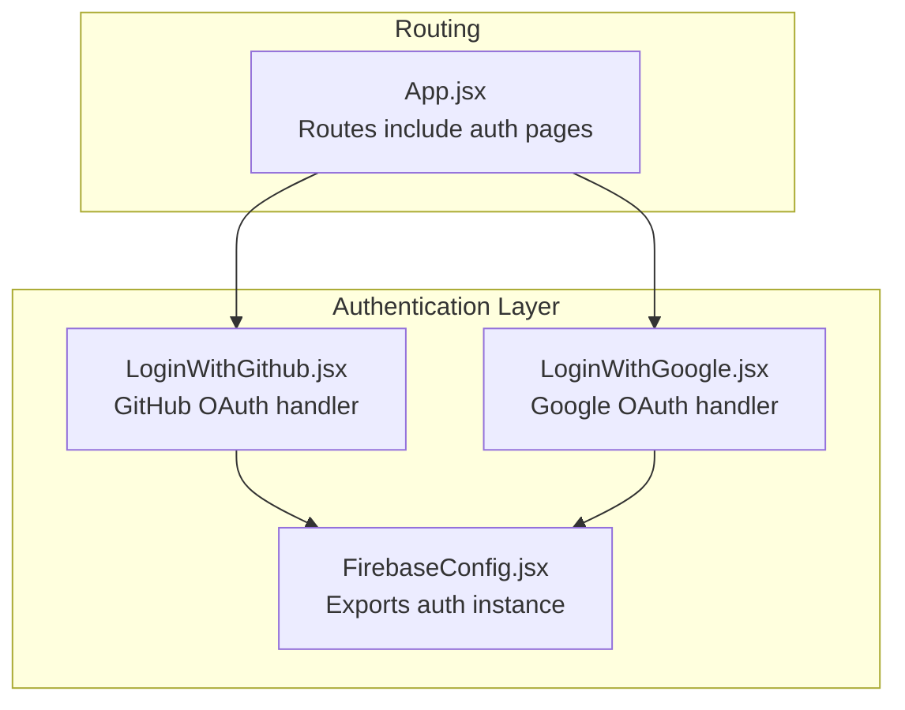
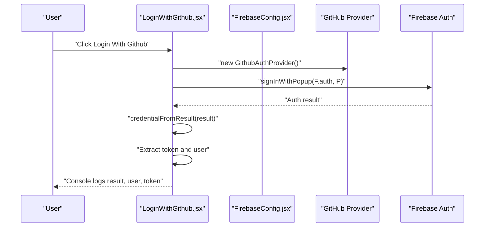
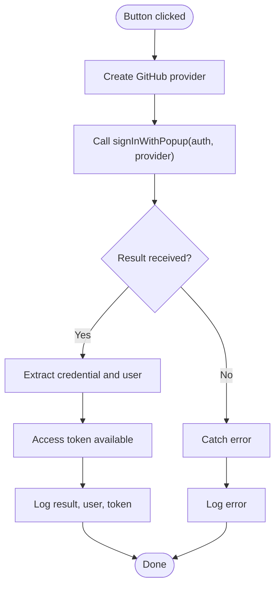
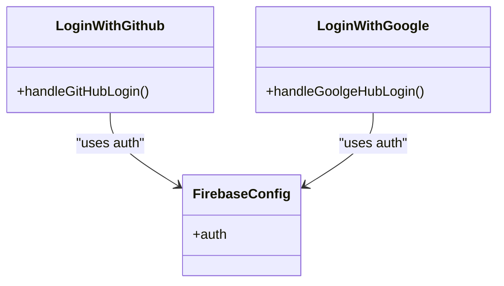
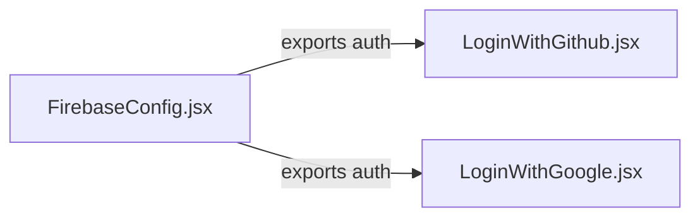
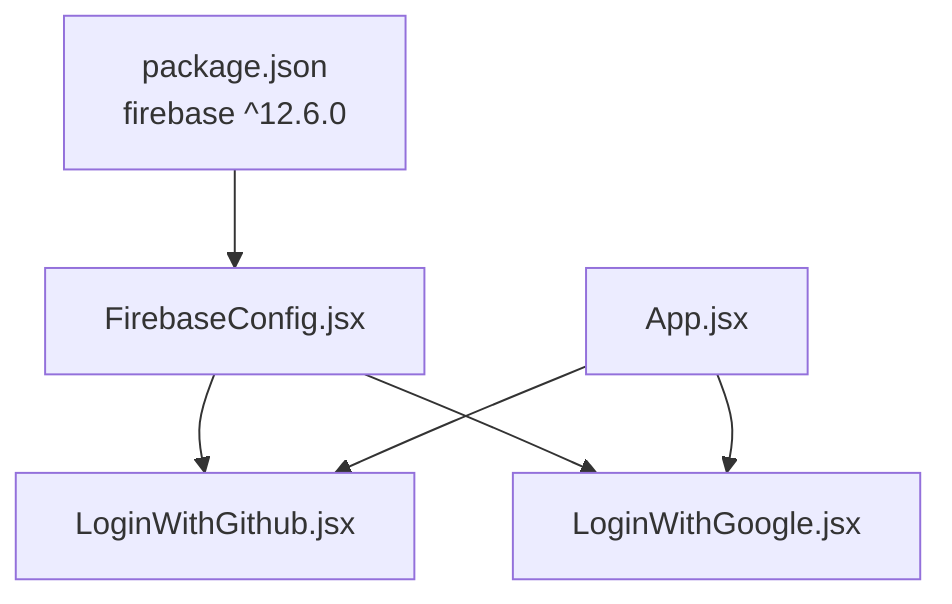

# GitHub Authentication

<cite>
**Referenced Files in This Document**
- [LoginWithGithub.jsx](file://src/components/LoginWithGithub.jsx)
- [LoginWithGoogle.jsx](file://src/components/LoginWithGoogle.jsx)
- [FirebaseConfig.jsx](file://src/components/FirebaseConfig.jsx)
- [App.jsx](file://src/App.jsx)
- [package.json](file://package.json)
</cite>

## Table of Contents
1. [Introduction](#introduction)
2. [Project Structure](#project-structure)
3. [Core Components](#core-components)
4. [Architecture Overview](#architecture-overview)
5. [Detailed Component Analysis](#detailed-component-analysis)
6. [Dependency Analysis](#dependency-analysis)
7. [Performance Considerations](#performance-considerations)
8. [Troubleshooting Guide](#troubleshooting-guide)
9. [Conclusion](#conclusion)

## Introduction
This document explains the GitHub OAuth authentication implementation in the car-rental-frontend application. It focuses on how the LoginWithGithub component integrates with Firebase Authentication using the GitHub provider and the signInWithPopup flow. It also compares the GitHub implementation with the Google counterpart and outlines best practices for UX, error handling, and secure token handling.

## Project Structure
The authentication-related code is organized into small, focused components:
- Firebase initialization and exports are centralized in FirebaseConfig.jsx.
- Two authentication UI components exist: LoginWithGithub.jsx and LoginWithGoogle.jsx.
- App.jsx wires up routes and includes the authentication pages.

**Diagram sources**
- [FirebaseConfig.jsx](file://src/components/FirebaseConfig.jsx#L1-L26)
- [LoginWithGithub.jsx](file://src/components/LoginWithGithub.jsx#L1-L35)
- [LoginWithGoogle.jsx](file://src/components/LoginWithGoogle.jsx#L1-L37)
- [App.jsx](file://src/App.jsx#L1-L56)

**Section sources**
- [FirebaseConfig.jsx](file://src/components/FirebaseConfig.jsx#L1-L26)
- [LoginWithGithub.jsx](file://src/components/LoginWithGithub.jsx#L1-L35)
- [LoginWithGoogle.jsx](file://src/components/LoginWithGoogle.jsx#L1-L37)
- [App.jsx](file://src/App.jsx#L1-L56)

## Core Components
- FirebaseConfig.jsx initializes Firebase and exposes the auth instance used by authentication components.
- LoginWithGithub.jsx implements the GitHub OAuth login flow using GithubAuthProvider and signInWithPopup, and logs user and token data.
- LoginWithGoogle.jsx mirrors the GitHub implementation for Google OAuth.

Key responsibilities:
- Initialize Firebase app and auth.
- Provide a reusable auth instance to consumers.
- Trigger popup-based sign-in with provider selection.
- Extract credentials and user data from the result.
- Provide a simple button-driven UI for triggering login.

**Section sources**
- [FirebaseConfig.jsx](file://src/components/FirebaseConfig.jsx#L1-L26)
- [LoginWithGithub.jsx](file://src/components/LoginWithGithub.jsx#L1-L35)
- [LoginWithGoogle.jsx](file://src/components/LoginWithGoogle.jsx#L1-L37)

## Architecture Overview
The GitHub authentication flow uses Firebase’s browser popup-based OAuth. The component creates a GitHub provider, invokes signInWithPopup against the shared auth instance, and then extracts the credential and user from the result.

**Diagram sources**
- [LoginWithGithub.jsx](file://src/components/LoginWithGithub.jsx#L1-L35)
- [FirebaseConfig.jsx](file://src/components/FirebaseConfig.jsx#L1-L26)

## Detailed Component Analysis

### GitHub Authentication Component
- Imports:
  - The auth instance from FirebaseConfig.jsx.
  - GithubAuthProvider and signInWithPopup from firebase/auth.
- Handler:
  - Creates a new GitHub provider.
  - Calls signInWithPopup with the auth instance and provider.
  - On success:
    - Extracts credential from the result using GithubAuthProvider.credentialFromResult.
    - Retrieves the access token from the credential.
    - Retrieves the user object from the result.
    - Logs the result, user, and token to the console.
  - On error:
    - Logs the caught error to the console.
- UI:
  - Renders a button bound to the handler via onClick.

**Diagram sources**
- [LoginWithGithub.jsx](file://src/components/LoginWithGithub.jsx#L1-L35)

**Section sources**
- [LoginWithGithub.jsx](file://src/components/LoginWithGithub.jsx#L1-L35)

### Google Authentication Component (Comparison)
- Similar structure to GitHub:
  - Imports auth from FirebaseConfig.jsx.
  - Uses GoogleAuthProvider and signInWithPopup.
  - Extracts credential and user similarly.
  - Logs result, user, and token.
- Differences:
  - Uses Google provider instead of GitHub.
  - Button label and handler name differ slightly.

**Diagram sources**
- [LoginWithGithub.jsx](file://src/components/LoginWithGithub.jsx#L1-L35)
- [LoginWithGoogle.jsx](file://src/components/LoginWithGoogle.jsx#L1-L37)
- [FirebaseConfig.jsx](file://src/components/FirebaseConfig.jsx#L1-L26)

**Section sources**
- [LoginWithGoogle.jsx](file://src/components/LoginWithGoogle.jsx#L1-L37)

### Relationship to FirebaseConfig.jsx
- FirebaseConfig.jsx initializes the Firebase app and exports the auth instance.
- Both LoginWithGithub.jsx and LoginWithGoogle.jsx import and use this shared auth instance to perform sign-in operations.

**Diagram sources**
- [FirebaseConfig.jsx](file://src/components/FirebaseConfig.jsx#L1-L26)
- [LoginWithGithub.jsx](file://src/components/LoginWithGithub.jsx#L1-L35)
- [LoginWithGoogle.jsx](file://src/components/LoginWithGoogle.jsx#L1-L37)

**Section sources**
- [FirebaseConfig.jsx](file://src/components/FirebaseConfig.jsx#L1-L26)
- [LoginWithGithub.jsx](file://src/components/LoginWithGithub.jsx#L1-L35)
- [LoginWithGoogle.jsx](file://src/components/LoginWithGoogle.jsx#L1-L37)

## Dependency Analysis
- External dependencies:
  - firebase (v12.6.0) provides Firebase Authentication and Firestore.
- Internal dependencies:
  - LoginWithGithub.jsx depends on FirebaseConfig.jsx for the auth instance.
  - LoginWithGoogle.jsx depends on FirebaseConfig.jsx for the auth instance.
- Routing:
  - App.jsx includes routes for the authentication pages, enabling navigation to the GitHub and Google login components.

**Diagram sources**
- [package.json](file://package.json#L1-L32)
- [FirebaseConfig.jsx](file://src/components/FirebaseConfig.jsx#L1-L26)
- [LoginWithGithub.jsx](file://src/components/LoginWithGithub.jsx#L1-L35)
- [LoginWithGoogle.jsx](file://src/components/LoginWithGoogle.jsx#L1-L37)
- [App.jsx](file://src/App.jsx#L1-L56)

**Section sources**
- [package.json](file://package.json#L1-L32)
- [FirebaseConfig.jsx](file://src/components/FirebaseConfig.jsx#L1-L26)
- [LoginWithGithub.jsx](file://src/components/LoginWithGithub.jsx#L1-L35)
- [LoginWithGoogle.jsx](file://src/components/LoginWithGoogle.jsx#L1-L37)
- [App.jsx](file://src/App.jsx#L1-L56)

## Performance Considerations
- Popup-based OAuth is lightweight and suitable for client-side login flows.
- Avoid unnecessary re-renders by keeping the handler inline or memoized if needed.
- Logging to the console is helpful during development but should be replaced with structured notifications or toast messages in production.

[No sources needed since this section provides general guidance]

## Troubleshooting Guide

Common issues and resolutions:
- Popup blocked by browser:
  - Ensure the click event originates from a user gesture (handled by the button).
  - Advise users to allow popups for the site.
- Incorrect Firebase configuration:
  - Verify the Firebase project configuration matches the deployed origin.
  - Confirm the authDomain and other fields are correct.
- GitHub OAuth app setup:
  - Ensure the GitHub OAuth app is configured with the correct redirect URI matching the Firebase OAuth redirect URL.
  - Confirm the provider is enabled in Firebase Authentication.
- Error handling:
  - The current implementation logs errors to the console. In production, surface user-friendly messages and consider retry prompts.
- Token handling:
  - Access tokens are available via the credential. Store securely and avoid exposing them in logs or URLs.
- UI feedback:
  - The current implementation logs to the console. Consider adding loading indicators and success/error notifications for better UX.

Best practices:
- Replace console logging with user-visible notifications.
- Sanitize and avoid logging sensitive data (tokens, emails).
- Provide clear error messages and retry mechanisms.
- Use HTTPS and secure cookies for token storage if integrating backend APIs.

**Section sources**
- [LoginWithGithub.jsx](file://src/components/LoginWithGithub.jsx#L1-L35)
- [FirebaseConfig.jsx](file://src/components/FirebaseConfig.jsx#L1-L26)

## Conclusion
The GitHub authentication component demonstrates a clean, minimal implementation of Firebase OAuth using a popup flow. It imports the shared auth instance, triggers sign-in with the GitHub provider, and extracts user and token data from the result. The Google counterpart follows the same pattern. For production readiness, enhance UX with notifications, improve error messaging, and harden token handling and configuration checks.