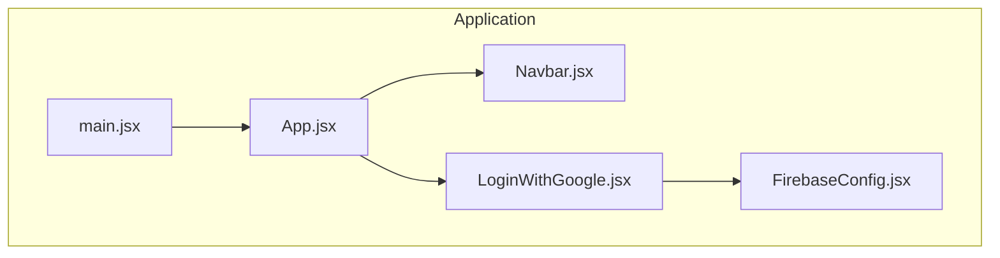
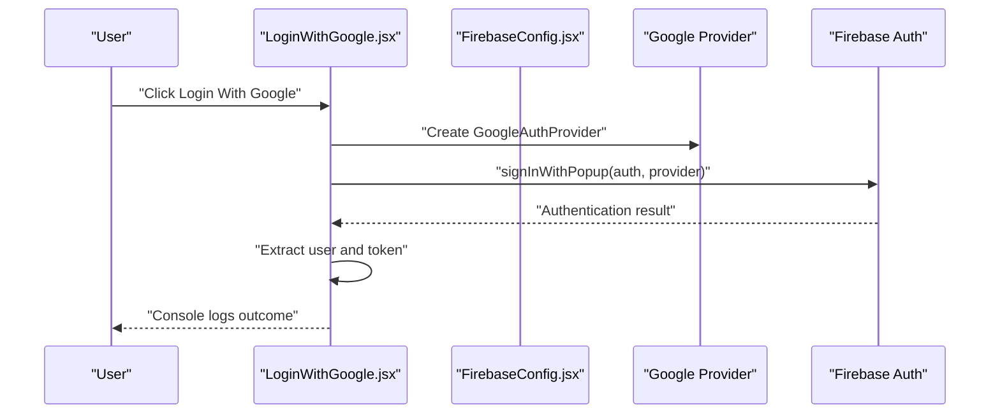
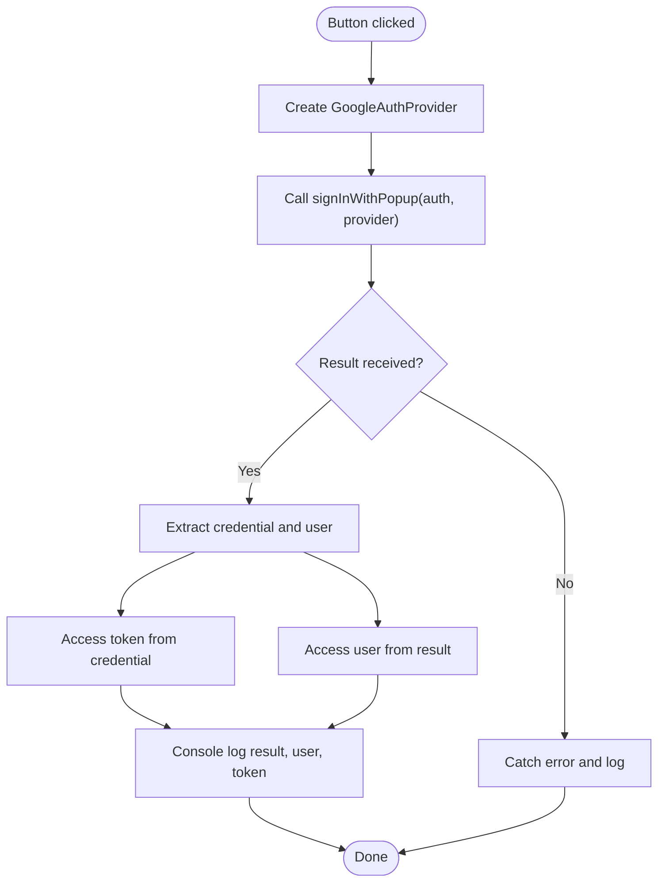
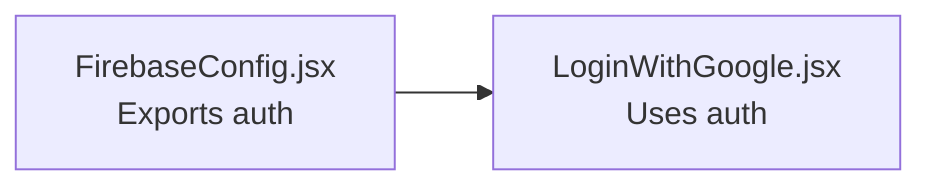
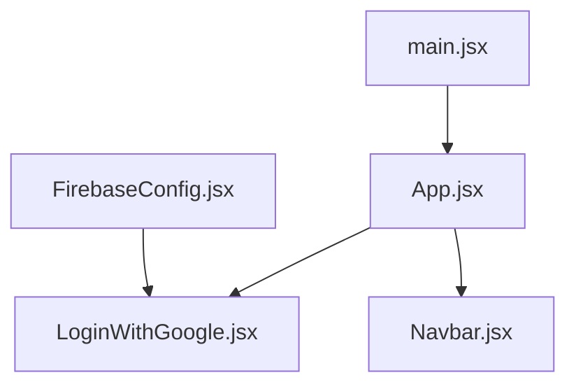

# Google Authentication

<cite>
**Referenced Files in This Document**
- [LoginWithGoogle.jsx](file://src/components/LoginWithGoogle.jsx)
- [FirebaseConfig.jsx](file://src/components/FirebaseConfig.jsx)
- [App.jsx](file://src/App.jsx)
- [main.jsx](file://src/main.jsx)
- [Navbar.jsx](file://src/components/Navbar.jsx)
</cite>

## Table of Contents
1. [Introduction](#introduction)
2. [Project Structure](#project-structure)
3. [Core Components](#core-components)
4. [Architecture Overview](#architecture-overview)
5. [Detailed Component Analysis](#detailed-component-analysis)
6. [Dependency Analysis](#dependency-analysis)
7. [Performance Considerations](#performance-considerations)
8. [Troubleshooting Guide](#troubleshooting-guide)
9. [Conclusion](#conclusion)

## Introduction
This document explains the Google OAuth authentication implementation in the car-rental-frontend application. It focuses on how the LoginWithGoogle component integrates Firebase Authentication to initiate a Google sign-in flow using the popup method, how user data and tokens are extracted from the authentication result, and how the component relates to the shared Firebase configuration instance. It also covers error handling, UI feedback, and best practices for user experience and secure token handling.

## Project Structure
The authentication feature is implemented as a standalone component that depends on a shared Firebase configuration module. The component is integrated into the application’s routing so users can navigate to the login page.

**Diagram sources**
- [main.jsx](file://src/main.jsx#L1-L13)
- [App.jsx](file://src/App.jsx#L1-L56)
- [Navbar.jsx](file://src/components/Navbar.jsx#L1-L81)
- [LoginWithGoogle.jsx](file://src/components/LoginWithGoogle.jsx#L1-L37)
- [FirebaseConfig.jsx](file://src/components/FirebaseConfig.jsx#L1-L26)

**Section sources**
- [main.jsx](file://src/main.jsx#L1-L13)
- [App.jsx](file://src/App.jsx#L1-L56)
- [Navbar.jsx](file://src/components/Navbar.jsx#L1-L81)
- [LoginWithGoogle.jsx](file://src/components/LoginWithGoogle.jsx#L1-L37)
- [FirebaseConfig.jsx](file://src/components/FirebaseConfig.jsx#L1-L26)

## Core Components
- FirebaseConfig.jsx: Initializes Firebase and exports the auth instance used by authentication components.
- LoginWithGoogle.jsx: Implements the Google sign-in flow using GoogleAuthProvider and signInWithPopup, extracts user and token from the result, and logs outcomes to the console.
- App.jsx and main.jsx: Bootstrap the application and integrate the LoginWithGoogle component.
- Navbar.jsx: Provides navigation links to the login pages.

Key responsibilities:
- FirebaseConfig.jsx: Exports a configured auth instance for use across the app.
- LoginWithGoogle.jsx: Handles user interaction, triggers the popup-based sign-in, and processes the result.

**Section sources**
- [FirebaseConfig.jsx](file://src/components/FirebaseConfig.jsx#L1-L26)
- [LoginWithGoogle.jsx](file://src/components/LoginWithGoogle.jsx#L1-L37)
- [App.jsx](file://src/App.jsx#L1-L56)
- [main.jsx](file://src/main.jsx#L1-L13)
- [Navbar.jsx](file://src/components/Navbar.jsx#L1-L81)

## Architecture Overview
The Google authentication flow is initiated by a user action in the LoginWithGoogle component. The component uses the shared auth instance from FirebaseConfig.jsx to open a popup window for Google sign-in. On successful completion, it retrieves the user profile and access token from the authentication result.

**Diagram sources**
- [LoginWithGoogle.jsx](file://src/components/LoginWithGoogle.jsx#L1-L37)
- [FirebaseConfig.jsx](file://src/components/FirebaseConfig.jsx#L1-L26)

## Detailed Component Analysis

### LoginWithGoogle.jsx
- Imports:
  - The auth instance exported by FirebaseConfig.jsx
  - GoogleAuthProvider and signInWithPopup from the Firebase Auth SDK
- Event binding:
  - A button triggers the handleGoolgeHubLogin function on click.
- Async/await pattern:
  - The handler is declared async and awaits the result of signInWithPopup.
- Provider initialization:
  - A GoogleAuthProvider instance is created before invoking the sign-in method.
- Result processing:
  - credentialFromResult is used to extract credentials from the result.
  - The access token is taken from the credential.
  - The user object is taken from the result.
- Error handling:
  - A try/catch block wraps the sign-in call; errors are logged to the console.
- UI feedback:
  - Console logging is used to display the result, user, and token.

Implementation references:
- Import statements and auth/provider imports: [LoginWithGoogle.jsx](file://src/components/LoginWithGoogle.jsx#L1-L10)
- Async handler and popup call: [LoginWithGoogle.jsx](file://src/components/LoginWithGoogle.jsx#L9-L13)
- Credential extraction and token/user access: [LoginWithGoogle.jsx](file://src/components/LoginWithGoogle.jsx#L13-L15)
- Button binding and render: [LoginWithGoogle.jsx](file://src/components/LoginWithGoogle.jsx#L30-L34)
- Error handling: [LoginWithGoogle.jsx](file://src/components/LoginWithGoogle.jsx#L21-L24)

**Diagram sources**
- [LoginWithGoogle.jsx](file://src/components/LoginWithGoogle.jsx#L1-L37)

**Section sources**
- [LoginWithGoogle.jsx](file://src/components/LoginWithGoogle.jsx#L1-L37)

### FirebaseConfig.jsx
- Initializes Firebase using the provided configuration.
- Exports the auth instance for use by authentication components.
- Also exports a Firestore instance (db), though the Google login does not use it.

Implementation references:
- Firebase initialization and auth export: [FirebaseConfig.jsx](file://src/components/FirebaseConfig.jsx#L1-L26)

**Diagram sources**
- [FirebaseConfig.jsx](file://src/components/FirebaseConfig.jsx#L1-L26)
- [LoginWithGoogle.jsx](file://src/components/LoginWithGoogle.jsx#L1-L10)

**Section sources**
- [FirebaseConfig.jsx](file://src/components/FirebaseConfig.jsx#L1-L26)

### App.jsx and main.jsx
- main.jsx renders the application with theme provider and mounts App.
- App registers routes and includes LoginWithGoogle under a dedicated path.

Implementation references:
- Application bootstrap: [main.jsx](file://src/main.jsx#L1-L13)
- Route registration and component inclusion: [App.jsx](file://src/App.jsx#L1-L56)

**Section sources**
- [main.jsx](file://src/main.jsx#L1-L13)
- [App.jsx](file://src/App.jsx#L1-L56)

### Navbar.jsx
- Provides navigation links to various pages, including the Google login route.

Implementation references:
- Navigation link to Google login: [Navbar.jsx](file://src/components/Navbar.jsx#L31-L36)

**Section sources**
- [Navbar.jsx](file://src/components/Navbar.jsx#L1-L81)

## Dependency Analysis
- LoginWithGoogle.jsx depends on FirebaseConfig.jsx for the auth instance.
- App.jsx and main.jsx orchestrate rendering and routing.
- Navbar.jsx provides navigation to the login page.

**Diagram sources**
- [FirebaseConfig.jsx](file://src/components/FirebaseConfig.jsx#L1-L26)
- [LoginWithGoogle.jsx](file://src/components/LoginWithGoogle.jsx#L1-L37)
- [App.jsx](file://src/App.jsx#L1-L56)
- [main.jsx](file://src/main.jsx#L1-L13)
- [Navbar.jsx](file://src/components/Navbar.jsx#L1-L81)

**Section sources**
- [FirebaseConfig.jsx](file://src/components/FirebaseConfig.jsx#L1-L26)
- [LoginWithGoogle.jsx](file://src/components/LoginWithGoogle.jsx#L1-L37)
- [App.jsx](file://src/App.jsx#L1-L56)
- [main.jsx](file://src/main.jsx#L1-L13)
- [Navbar.jsx](file://src/components/Navbar.jsx#L1-L81)

## Performance Considerations
- Popup-based authentication is lightweight and suitable for client-side apps.
- Avoid unnecessary re-renders by keeping the handler function stable and minimizing state updates inside the handler.
- Consider debouncing or disabling the button during authentication to prevent multiple rapid clicks.

[No sources needed since this section provides general guidance]

## Troubleshooting Guide

Common issues and resolutions:
- Popup blocked by browser:
  - Trigger the sign-in from a direct user gesture (e.g., a button click). If the popup is blocked, the sign-in will fail silently. Ensure the user explicitly clicks the login button.
- Incorrect Firebase configuration:
  - Verify the configuration constants match your Firebase project settings. Misconfiguration can cause initialization failures or authentication errors.
- CORS errors:
  - Ensure your Firebase project’s authorized domains include your hosting origin. CORS errors typically occur when the origin is not whitelisted in Firebase settings.
- Insufficient error messaging:
  - The current implementation logs errors to the console. For production, surface user-friendly messages and consider retry prompts or alternative login methods.

Security and UX best practices:
- Do not log sensitive tokens in production environments.
- Store tokens securely (e.g., in memory or secure cookies) and avoid exposing them in URLs or local storage.
- Provide clear UI feedback (loading indicators, disabled buttons) during authentication.
- Offer graceful fallbacks when popups are disabled or blocked.

**Section sources**
- [LoginWithGoogle.jsx](file://src/components/LoginWithGoogle.jsx#L21-L24)

## Conclusion
The Google authentication flow in this application is implemented cleanly with a dedicated component that uses the Firebase Auth SDK to open a popup for Google sign-in. The component extracts user and token data from the authentication result and logs outcomes to the console. It relies on a shared Firebase configuration instance for the auth instance. While functional, the implementation can be enhanced with improved error messaging, UI feedback, and secure token handling for production readiness.