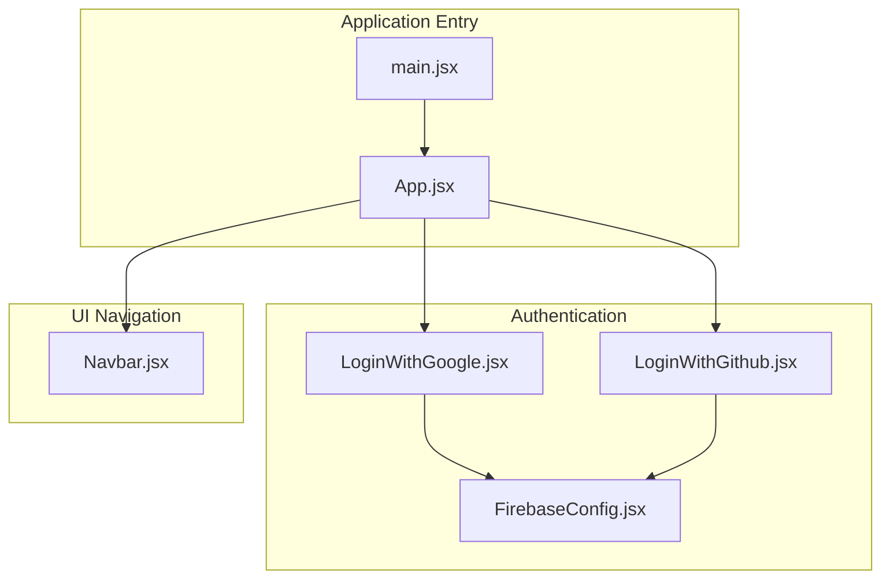
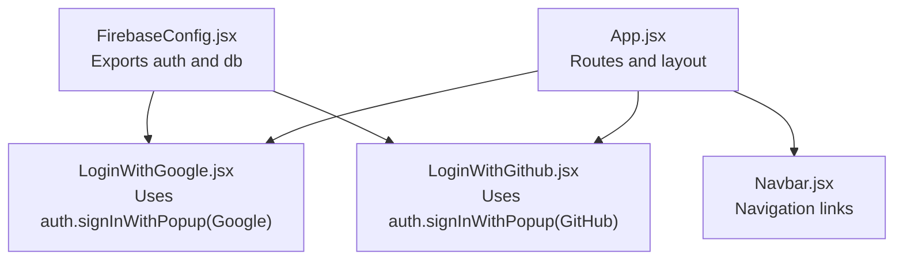
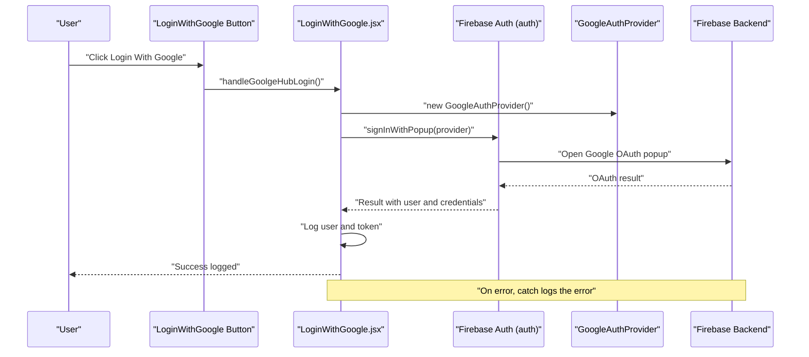
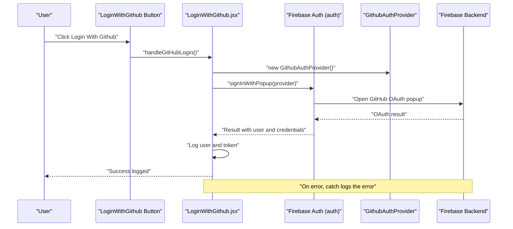
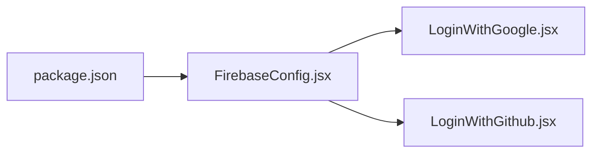

# Authentication Components

<cite>
**Referenced Files in This Document**
- [FirebaseConfig.jsx](file://src/components/FirebaseConfig.jsx)
- [LoginWithGoogle.jsx](file://src/components/LoginWithGoogle.jsx)
- [LoginWithGithub.jsx](file://src/components/LoginWithGithub.jsx)
- [App.jsx](file://src/App.jsx)
- [Navbar.jsx](file://src/components/Navbar.jsx)
- [main.jsx](file://src/main.jsx)
- [package.json](file://package.json)
- [README.md](file://README.md)
</cite>

## Table of Contents
1. [Introduction](#introduction)
2. [Project Structure](#project-structure)
3. [Core Components](#core-components)
4. [Architecture Overview](#architecture-overview)
5. [Detailed Component Analysis](#detailed-component-analysis)
6. [Dependency Analysis](#dependency-analysis)
7. [Performance Considerations](#performance-considerations)
8. [Troubleshooting Guide](#troubleshooting-guide)
9. [Conclusion](#conclusion)

## Introduction
This document explains the authentication components that integrate Firebase for Google and GitHub login flows in the car rental frontend. It covers how the Firebase app is initialized and exported, how the login components render buttons and handle click events, how Firebase authentication methods like signInWithPopup are used, and how to extend the implementation to manage user state, session persistence, and logout. It also provides setup guidance, error handling strategies, security considerations, and solutions for common issues such as popup blockers and CORS configuration.

## Project Structure
The authentication-related files are organized under src/components and are integrated into the main application entry point. The Firebase initialization module exports the authentication instance consumed by the login components. The navigation links route users to the login pages.

**Diagram sources**
- [main.jsx](file://src/main.jsx#L1-L13)
- [App.jsx](file://src/App.jsx#L1-L56)
- [FirebaseConfig.jsx](file://src/components/FirebaseConfig.jsx#L1-L26)
- [LoginWithGoogle.jsx](file://src/components/LoginWithGoogle.jsx#L1-L37)
- [LoginWithGithub.jsx](file://src/components/LoginWithGithub.jsx#L1-L35)
- [Navbar.jsx](file://src/components/Navbar.jsx#L1-L81)

**Section sources**
- [main.jsx](file://src/main.jsx#L1-L13)
- [App.jsx](file://src/App.jsx#L1-L56)
- [FirebaseConfig.jsx](file://src/components/FirebaseConfig.jsx#L1-L26)
- [LoginWithGoogle.jsx](file://src/components/LoginWithGoogle.jsx#L1-L37)
- [LoginWithGithub.jsx](file://src/components/LoginWithGithub.jsx#L1-L35)
- [Navbar.jsx](file://src/components/Navbar.jsx#L1-L81)

## Core Components
- FirebaseConfig.jsx initializes the Firebase app and exports the authentication and Firestore instances. It defines the Firebase configuration object and exposes auth and db for use across the app.
- LoginWithGoogle.jsx renders a button and triggers Google sign-in via a popup provider. It captures the result and logs user and token information.
- LoginWithGithub.jsx renders a button and triggers GitHub sign-in via a popup provider. It captures the result and logs user and token information.
- App.jsx integrates the login components and routes, and Navbar.jsx provides navigation links to the login pages.

Key implementation references:
- Firebase initialization and exports: [FirebaseConfig.jsx](file://src/components/FirebaseConfig.jsx#L1-L26)
- Google login handler and button rendering: [LoginWithGoogle.jsx](file://src/components/LoginWithGoogle.jsx#L1-L37)
- GitHub login handler and button rendering: [LoginWithGithub.jsx](file://src/components/LoginWithGithub.jsx#L1-L35)
- Routing and navigation integration: [App.jsx](file://src/App.jsx#L1-L56), [Navbar.jsx](file://src/components/Navbar.jsx#L1-L81)

**Section sources**
- [FirebaseConfig.jsx](file://src/components/FirebaseConfig.jsx#L1-L26)
- [LoginWithGoogle.jsx](file://src/components/LoginWithGoogle.jsx#L1-L37)
- [LoginWithGithub.jsx](file://src/components/LoginWithGithub.jsx#L1-L35)
- [App.jsx](file://src/App.jsx#L1-L56)
- [Navbar.jsx](file://src/components/Navbar.jsx#L1-L81)

## Architecture Overview
The authentication architecture follows a modular pattern:
- FirebaseConfig initializes Firebase and exposes auth/db.
- Login components depend on auth to perform sign-in with providers.
- App and Navbar coordinate routing and navigation to the login pages.

**Diagram sources**
- [FirebaseConfig.jsx](file://src/components/FirebaseConfig.jsx#L1-L26)
- [LoginWithGoogle.jsx](file://src/components/LoginWithGoogle.jsx#L1-L37)
- [LoginWithGithub.jsx](file://src/components/LoginWithGithub.jsx#L1-L35)
- [App.jsx](file://src/App.jsx#L1-L56)
- [Navbar.jsx](file://src/components/Navbar.jsx#L1-L81)

## Detailed Component Analysis

### FirebaseConfig.jsx
Responsibilities:
- Imports Firebase SDK modules for app initialization, authentication, and Firestore.
- Defines the Firebase configuration object with keys for API, project, auth domain, storage bucket, messaging sender ID, app ID, and measurement ID.
- Initializes the Firebase app and exports the auth and db instances.

Implementation highlights:
- Initialization flow: initializeApp with the configuration object.
- Exports: auth for authentication and db for Firestore.

Security note:
- The configuration currently includes sensitive keys. These should be moved to environment variables in production.

**Section sources**
- [FirebaseConfig.jsx](file://src/components/FirebaseConfig.jsx#L1-L26)

### LoginWithGoogle.jsx
Responsibilities:
- Renders a login button.
- Handles click events to trigger Google sign-in using a popup provider.
- Uses auth from FirebaseConfig and GoogleAuthProvider from Firebase Auth.
- Captures the result and logs user and token information.

Processing logic:
- On button click, construct a GoogleAuthProvider instance.
- Call signInWithPopup with auth and provider.
- Extract credentials and user from the result.
- Log result and user/token for debugging.

Error handling:
- Try/catch around the sign-in operation logs errors to the console.

**Diagram sources**
- [LoginWithGoogle.jsx](file://src/components/LoginWithGoogle.jsx#L1-L37)
- [FirebaseConfig.jsx](file://src/components/FirebaseConfig.jsx#L1-L26)

**Section sources**
- [LoginWithGoogle.jsx](file://src/components/LoginWithGoogle.jsx#L1-L37)

### LoginWithGithub.jsx
Responsibilities:
- Renders a login button.
- Handles click events to trigger GitHub sign-in using a popup provider.
- Uses auth from FirebaseConfig and GithubAuthProvider from Firebase Auth.
- Captures the result and logs user and token information.

Processing logic:
- On button click, construct a GithubAuthProvider instance.
- Call signInWithPopup with auth and provider.
- Extract credentials and user from the result.
- Log result and user/token for debugging.

Error handling:
- Try/catch around the sign-in operation logs errors to the console.

**Diagram sources**
- [LoginWithGithub.jsx](file://src/components/LoginWithGithub.jsx#L1-L35)
- [FirebaseConfig.jsx](file://src/components/FirebaseConfig.jsx#L1-L26)

**Section sources**
- [LoginWithGithub.jsx](file://src/components/LoginWithGithub.jsx#L1-L35)

### App.jsx and Navbar.jsx Integration
- App.jsx includes the login components and routes for GitHub and Google login pages.
- Navbar.jsx provides navigation links to the login pages, enabling users to reach the login components.

Routing and navigation:
- Routes for GitHub and Google login are present in App.jsx comments.
- Navbar.jsx links navigate to the respective login pages.

**Section sources**
- [App.jsx](file://src/App.jsx#L1-L56)
- [Navbar.jsx](file://src/components/Navbar.jsx#L1-L81)

## Dependency Analysis
Direct dependencies:
- LoginWithGoogle.jsx depends on FirebaseConfig.jsx for auth and on Firebase Auth for GoogleAuthProvider and signInWithPopup.
- LoginWithGithub.jsx depends on FirebaseConfig.jsx for auth and on Firebase Auth for GithubAuthProvider and signInWithPopup.
- FirebaseConfig.jsx depends on Firebase SDK modules for app initialization, auth, and Firestore.

External dependencies:
- Firebase SDK is declared in package.json.

**Diagram sources**
- [package.json](file://package.json#L1-L32)
- [FirebaseConfig.jsx](file://src/components/FirebaseConfig.jsx#L1-L26)
- [LoginWithGoogle.jsx](file://src/components/LoginWithGoogle.jsx#L1-L37)
- [LoginWithGithub.jsx](file://src/components/LoginWithGithub.jsx#L1-L35)

**Section sources**
- [package.json](file://package.json#L1-L32)
- [FirebaseConfig.jsx](file://src/components/FirebaseConfig.jsx#L1-L26)
- [LoginWithGoogle.jsx](file://src/components/LoginWithGoogle.jsx#L1-L37)
- [LoginWithGithub.jsx](file://src/components/LoginWithGithub.jsx#L1-L35)

## Performance Considerations
- Popup-based authentication (signInWithPopup) opens a new window/tab. Ensure providers are configured to minimize delays and avoid unnecessary redirects.
- Avoid heavy computations inside event handlers; keep sign-in handlers lightweight and delegate UI updates to React state.
- Consider debouncing repeated clicks to prevent multiple concurrent sign-in attempts.

[No sources needed since this section provides general guidance]

## Troubleshooting Guide

Common issues and resolutions:
- Popup blockers: signInWithPopup requires an explicit user gesture. Trigger the login from a user-initiated event (e.g., button click). If blocked, instruct users to allow popups for the site.
- CORS configuration: When integrating with backend services, configure CORS headers to allow requests from the frontend origin. Ensure the Firebase project allows requests from the deployed domain.
- Environment variables: The current Firebase configuration includes sensitive keys. Move them to environment variables and load them at runtime to avoid exposing secrets in client-side code.
- Error handling: Both login components log errors to the console. Extend error handling to show user-friendly messages and retry mechanisms.

Security considerations:
- Never commit secrets to version control. Use environment variables for Firebase configuration.
- Enforce HTTPS in production to protect tokens and cookies.
- Validate and sanitize user-provided data before storing in Firestore.
- Limit permissions in Firestore rules to reduce risk of unauthorized access.

Setup requirements:
- Firebase project: Create a Firebase project and enable Google and GitHub OAuth providers in the Firebase Console.
- Web app configuration: Register the web app in Firebase and copy the configuration object.
- Environment variables: Store Firebase configuration in environment variables and load them at runtime.
- Dependencies: Ensure Firebase SDK is installed as shown in package.json.

**Section sources**
- [FirebaseConfig.jsx](file://src/components/FirebaseConfig.jsx#L1-L26)
- [LoginWithGoogle.jsx](file://src/components/LoginWithGoogle.jsx#L1-L37)
- [LoginWithGithub.jsx](file://src/components/LoginWithGithub.jsx#L1-L35)
- [package.json](file://package.json#L1-L32)

## Conclusion
The authentication components demonstrate a clean separation of concerns: Firebase initialization in FirebaseConfig.jsx, provider-based sign-in in LoginWithGoogle.jsx and LoginWithGithub.jsx, and integration via App.jsx and Navbar.jsx. To enhance the implementation, add user state management, session persistence, and logout support. Secure the configuration using environment variables and address common issues like popup blockers and CORS. With these improvements, the authentication flow will be robust, user-friendly, and production-ready.