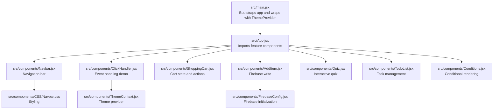
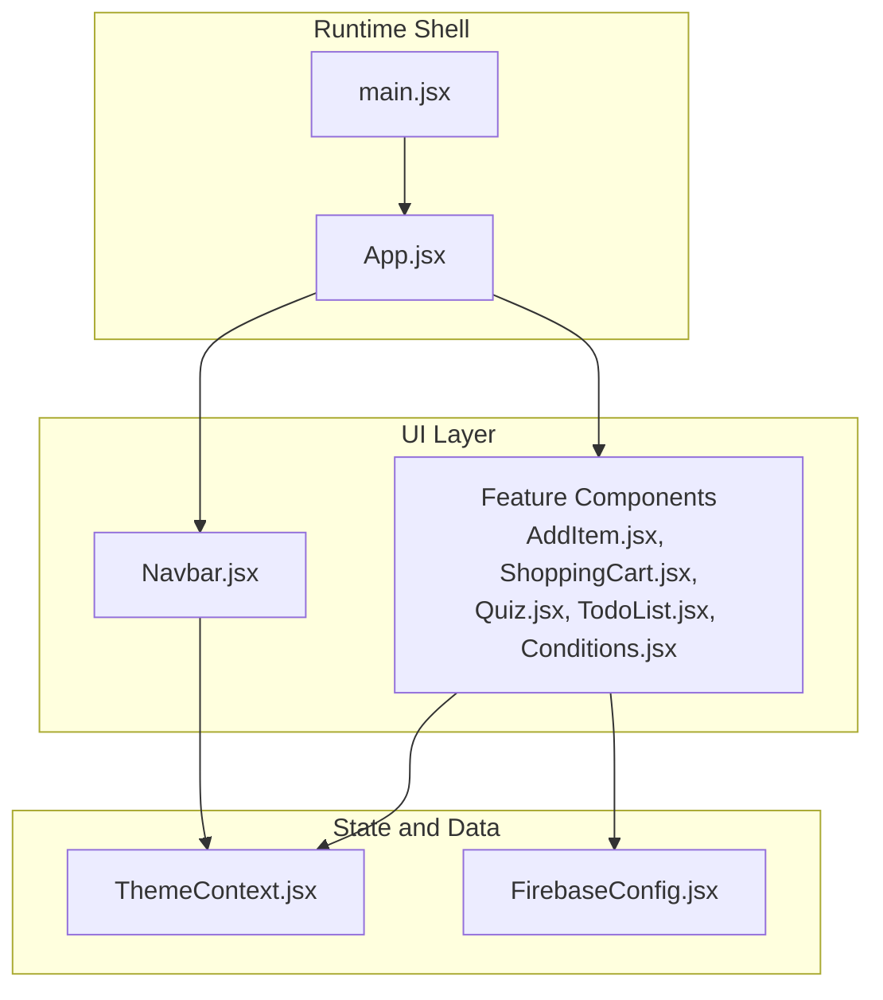
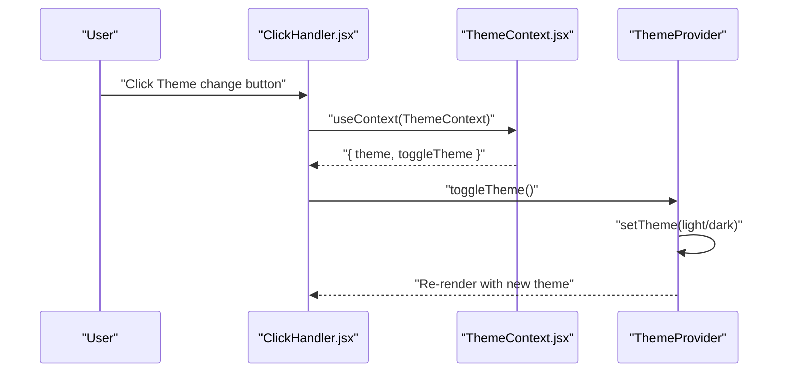
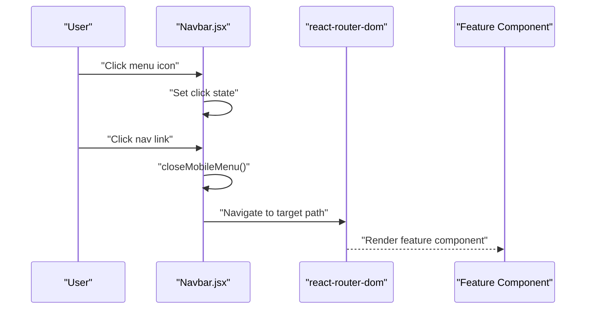
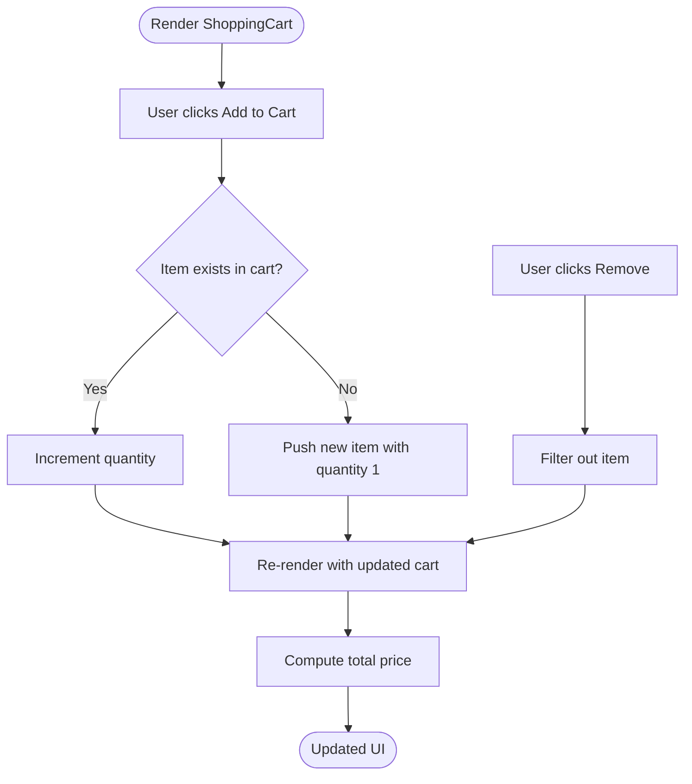
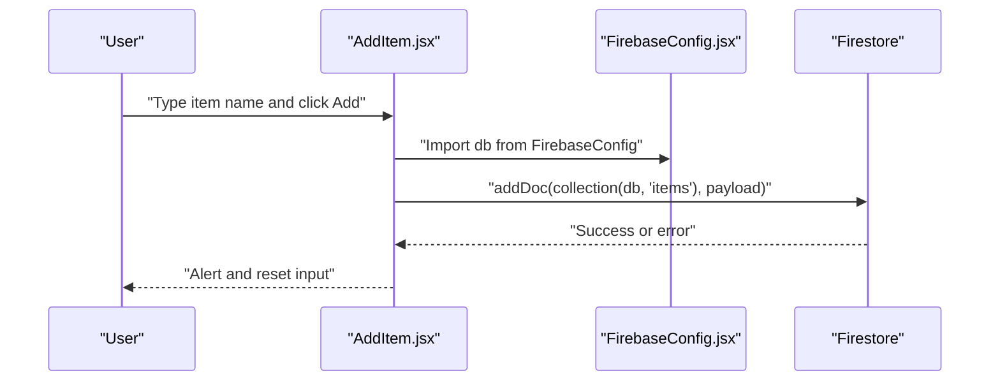
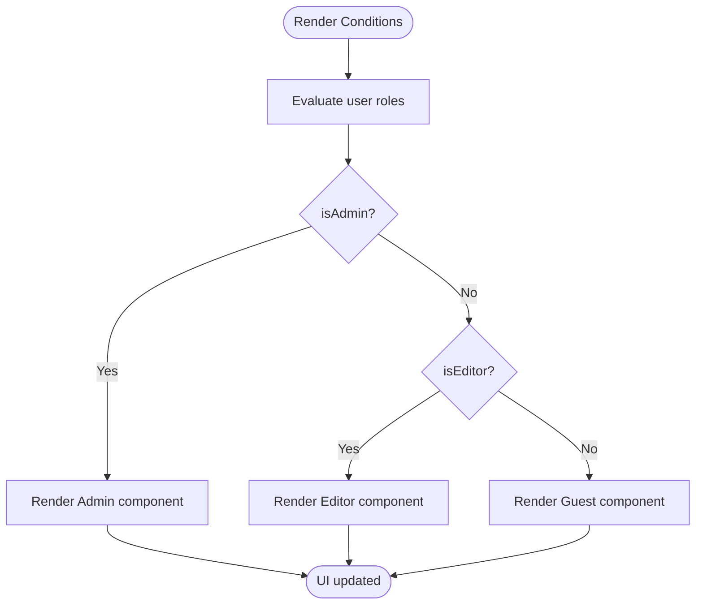
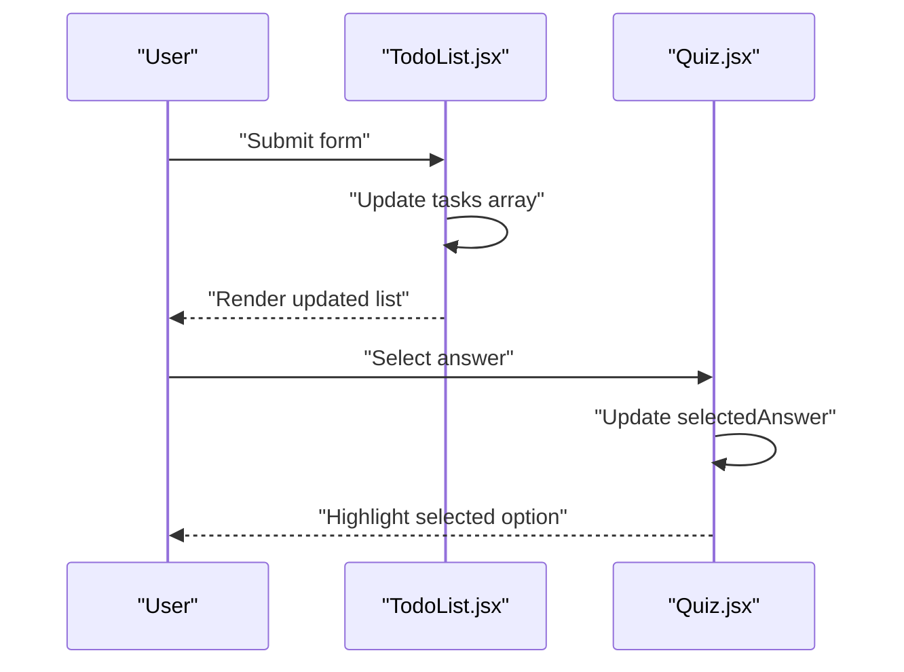
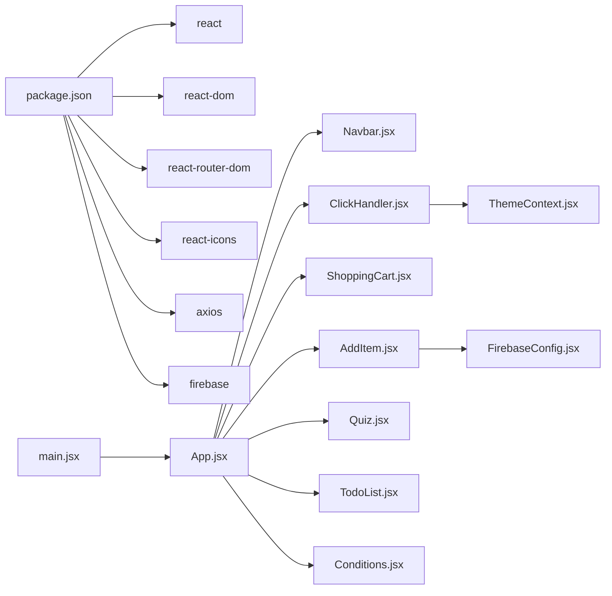

# Component Architecture

<cite>
**Referenced Files in This Document**
- [main.jsx](file://src/main.jsx)
- [App.jsx](file://src/App.jsx)
- [Navbar.jsx](file://src/components/Navbar.jsx)
- [ThemeContext.jsx](file://src/components/ThemeContext.jsx)
- [ClickHandler.jsx](file://src/components/ClickHandler.jsx)
- [ShoppingCart.jsx](file://src/components/ShoppingCart.jsx)
- [AddItem.jsx](file://src/components/AddItem.jsx)
- [FirebaseConfig.jsx](file://src/components/FirebaseConfig.jsx)
- [Quiz.jsx](file://src/components/Quiz.jsx)
- [TodoList.jsx](file://src/components/TodoList.jsx)
- [Conditions.jsx](file://src/components/Conditions.jsx)
- [Navbar.css](file://src/components/CSS/Navbar.css)
- [package.json](file://package.json)
</cite>

## Table of Contents
1. [Introduction](#introduction)
2. [Project Structure](#project-structure)
3. [Core Components](#core-components)
4. [Architecture Overview](#architecture-overview)
5. [Detailed Component Analysis](#detailed-component-analysis)
6. [Dependency Analysis](#dependency-analysis)
7. [Performance Considerations](#performance-considerations)
8. [Troubleshooting Guide](#troubleshooting-guide)
9. [Conclusion](#conclusion)

## Introduction
This document describes the component-based architecture of the car-rental-frontend application. It focuses on a functional component approach using React Hooks, with each .jsx file implementing a single, focused feature or UI element. The application follows a clear hierarchy: main.jsx bootstraps the app and wraps App.jsx with a ThemeProvider. App.jsx currently imports a set of feature components and includes commented routing scaffolding. Components demonstrate consistent patterns around imports, JSX syntax, and event handling. The document also covers how Context API mitigates prop drilling and provides performance optimization tips for rendering and reusability.

## Project Structure
The project is organized around a small set of feature components under src/components. The entry point initializes the React root and applies a global theme provider. App.jsx imports multiple feature components and includes commented route definitions that illustrate how routing could be wired up.

**Diagram sources**
- [main.jsx](file://src/main.jsx#L1-L13)
- [App.jsx](file://src/App.jsx#L1-L53)
- [Navbar.jsx](file://src/components/Navbar.jsx#L1-L81)
- [ClickHandler.jsx](file://src/components/ClickHandler.jsx#L1-L42)
- [ShoppingCart.jsx](file://src/components/ShoppingCart.jsx#L1-L75)
- [AddItem.jsx](file://src/components/AddItem.jsx#L1-L38)
- [Quiz.jsx](file://src/components/Quiz.jsx#L1-L81)
- [TodoList.jsx](file://src/components/TodoList.jsx#L1-L56)
- [Conditions.jsx](file://src/components/Conditions.jsx#L1-L42)
- [Navbar.css](file://src/components/CSS/Navbar.css#L1-L164)
- [ThemeContext.jsx](file://src/components/ThemeContext.jsx#L1-L14)
- [FirebaseConfig.jsx](file://src/components/FirebaseConfig.jsx#L1-L26)

**Section sources**
- [main.jsx](file://src/main.jsx#L1-L13)
- [App.jsx](file://src/App.jsx#L1-L53)

## Core Components
- main.jsx: Creates the React root and renders App wrapped in ThemeProvider. It imports App and ThemeProvider from local components.
- App.jsx: Imports multiple feature components and includes commented route definitions. It currently renders a simple welcome header and does not render the navigation or routes until uncommented.
- ThemeContext.jsx: Provides a ThemeProvider that exposes theme state and a toggle function via a context. ClickHandler consumes this context to apply theme-dependent styles and trigger theme toggles.
- Navbar.jsx: Implements a responsive navigation bar with links to feature routes and mobile menu toggle. Uses react-icons and CSS module styling.
- Feature components: AddItem.jsx integrates Firebase Firestore, ShoppingCart.jsx manages cart state and actions, Quiz.jsx demonstrates interactive state, TodoList.jsx shows form handling and toggling, Conditions.jsx illustrates conditional rendering patterns.

Key architectural observations:
- Single-responsibility: Each .jsx file encapsulates one feature or UI element.
- Functional components with hooks: useState and useContext are used consistently.
- Consistent import structure: Local components are imported relatively; external libraries are from dependencies.
- JSX patterns: Inline styles, event handlers, and conditional rendering are used uniformly across components.

**Section sources**
- [main.jsx](file://src/main.jsx#L1-L13)
- [App.jsx](file://src/App.jsx#L1-L53)
- [ThemeContext.jsx](file://src/components/ThemeContext.jsx#L1-L14)
- [ClickHandler.jsx](file://src/components/ClickHandler.jsx#L1-L42)
- [Navbar.jsx](file://src/components/Navbar.jsx#L1-L81)

## Architecture Overview
The runtime architecture centers on a thin shell that wires providers and routes. The current App.jsx includes feature components but does not render the navigation or activate routing. The commented route definitions indicate a potential future structure where Navbar would be rendered conditionally and Routes would mount feature components.

**Diagram sources**
- [main.jsx](file://src/main.jsx#L1-L13)
- [App.jsx](file://src/App.jsx#L1-L53)
- [Navbar.jsx](file://src/components/Navbar.jsx#L1-L81)
- [ThemeContext.jsx](file://src/components/ThemeContext.jsx#L1-L14)
- [FirebaseConfig.jsx](file://src/components/FirebaseConfig.jsx#L1-L26)
- [AddItem.jsx](file://src/components/AddItem.jsx#L1-L38)
- [ShoppingCart.jsx](file://src/components/ShoppingCart.jsx#L1-L75)
- [Quiz.jsx](file://src/components/Quiz.jsx#L1-L81)
- [TodoList.jsx](file://src/components/TodoList.jsx#L1-L56)
- [Conditions.jsx](file://src/components/Conditions.jsx#L1-L42)

## Detailed Component Analysis

### Theme Provider and Consumer Pattern
The ThemeContext.jsx defines a context with theme state and a toggle function. ClickHandler.jsx consumes the context to read theme and toggle it. This avoids prop drilling by centralizing theme state and exposing it via a provider.

**Diagram sources**
- [ClickHandler.jsx](file://src/components/ClickHandler.jsx#L1-L42)
- [ThemeContext.jsx](file://src/components/ThemeContext.jsx#L1-L14)

**Section sources**
- [ThemeContext.jsx](file://src/components/ThemeContext.jsx#L1-L14)
- [ClickHandler.jsx](file://src/components/ClickHandler.jsx#L1-L42)

### Navigation Component and Routing
Navbar.jsx implements a responsive navigation bar with links to feature routes. It uses react-router-dom Link components and react-icons for icons. The component toggles a mobile menu state and closes the menu on link click.

**Diagram sources**
- [Navbar.jsx](file://src/components/Navbar.jsx#L1-L81)
- [package.json](file://package.json#L12-L19)

**Section sources**
- [Navbar.jsx](file://src/components/Navbar.jsx#L1-L81)
- [Navbar.css](file://src/components/CSS/Navbar.css#L1-L164)

### Shopping Cart Component
ShoppingCart.jsx manages a local cart state, adds/removes items, and computes totals. It demonstrates controlled UI updates and pure functional logic for cart operations.

**Diagram sources**
- [ShoppingCart.jsx](file://src/components/ShoppingCart.jsx#L1-L75)

**Section sources**
- [ShoppingCart.jsx](file://src/components/ShoppingCart.jsx#L1-L75)

### Firebase Integration Example
AddItem.jsx writes data to Firestore using FirebaseConfig.jsx. It uses useState to manage input and handles asynchronous add operations.

**Diagram sources**
- [AddItem.jsx](file://src/components/AddItem.jsx#L1-L38)
- [FirebaseConfig.jsx](file://src/components/FirebaseConfig.jsx#L1-L26)

**Section sources**
- [AddItem.jsx](file://src/components/AddItem.jsx#L1-L38)
- [FirebaseConfig.jsx](file://src/components/FirebaseConfig.jsx#L1-L26)

### Conditional Rendering Patterns
Conditions.jsx demonstrates conditional rendering using logical operators and component composition. It shows how to branch UI based on user roles.

**Diagram sources**
- [Conditions.jsx](file://src/components/Conditions.jsx#L1-L42)

**Section sources**
- [Conditions.jsx](file://src/components/Conditions.jsx#L1-L42)

### Interactive State Management
Quiz.jsx and TodoList.jsx illustrate interactive state management with useState. They demonstrate event handling, controlled inputs, and UI updates.

**Diagram sources**
- [TodoList.jsx](file://src/components/TodoList.jsx#L1-L56)
- [Quiz.jsx](file://src/components/Quiz.jsx#L1-L81)

**Section sources**
- [TodoList.jsx](file://src/components/TodoList.jsx#L1-L56)
- [Quiz.jsx](file://src/components/Quiz.jsx#L1-L81)

## Dependency Analysis
External dependencies include React, React DOM, react-router-dom, react-icons, axios, and firebase. These are declared in package.json. Internally, components depend on each other through imports and context.

**Diagram sources**
- [package.json](file://package.json#L12-L19)
- [main.jsx](file://src/main.jsx#L1-L13)
- [App.jsx](file://src/App.jsx#L1-L53)
- [ClickHandler.jsx](file://src/components/ClickHandler.jsx#L1-L42)
- [ThemeContext.jsx](file://src/components/ThemeContext.jsx#L1-L14)
- [AddItem.jsx](file://src/components/AddItem.jsx#L1-L38)
- [FirebaseConfig.jsx](file://src/components/FirebaseConfig.jsx#L1-L26)
- [Navbar.jsx](file://src/components/Navbar.jsx#L1-L81)
- [ShoppingCart.jsx](file://src/components/ShoppingCart.jsx#L1-L75)
- [Quiz.jsx](file://src/components/Quiz.jsx#L1-L81)
- [TodoList.jsx](file://src/components/TodoList.jsx#L1-L56)
- [Conditions.jsx](file://src/components/Conditions.jsx#L1-L42)

**Section sources**
- [package.json](file://package.json#L12-L19)

## Performance Considerations
- Prefer local state for UI-only concerns: Components like TodoList.jsx and ShoppingCart.jsx keep state local, reducing unnecessary prop propagation.
- Memoization for derived data: Compute totals and derived values lazily or memoize expensive computations to avoid reflows.
- Conditional rendering: Use early returns and conditional branches to prevent rendering heavy subtrees when not needed.
- Event handler binding: Bind handlers in component scope or use stable references to avoid extra renders.
- Context granularity: Keep context providers minimal and only wrap components that need the shared state.
- Avoid unnecessary re-renders: Use shallow equality checks and stable arrays/objects when passing props to child components.
- CSS-in-JS vs. static CSS: For static styles, prefer CSS modules or styled components to reduce inline style churn.

[No sources needed since this section provides general guidance]

## Troubleshooting Guide
- Theme not applying: Ensure ThemeProvider wraps the component tree and that consumers use useContext correctly.
- Navigation not working: Verify react-router-dom is installed and that routes are properly configured in App.jsx.
- Firebase errors: Confirm FirebaseConfig.jsx exports initialized db and that AddItem.jsx imports it correctly.
- Styling issues: Check Navbar.css media queries and ensure the component imports the stylesheet.
- Prop drilling symptoms: Introduce a context provider (as seen with ThemeContext.jsx) to lift shared state.

**Section sources**
- [ThemeContext.jsx](file://src/components/ThemeContext.jsx#L1-L14)
- [ClickHandler.jsx](file://src/components/ClickHandler.jsx#L1-L42)
- [AddItem.jsx](file://src/components/AddItem.jsx#L1-L38)
- [FirebaseConfig.jsx](file://src/components/FirebaseConfig.jsx#L1-L26)
- [Navbar.jsx](file://src/components/Navbar.jsx#L1-L81)
- [Navbar.css](file://src/components/CSS/Navbar.css#L1-L164)

## Conclusion
The car-rental-frontend employs a clean, component-based architecture centered on functional components and React Hooks. Each .jsx file adheres to single-responsibility, and the application demonstrates consistent patterns in imports, JSX, and event handling. The ThemeContext.jsx shows how Context API mitigates prop drilling, while components like AddItem.jsx and ShoppingCart.jsx illustrate state management and data integration. The commented routing structure in App.jsx indicates a clear path toward a routed application. Following the outlined performance and troubleshooting guidance will help maintain a scalable and efficient component ecosystem.