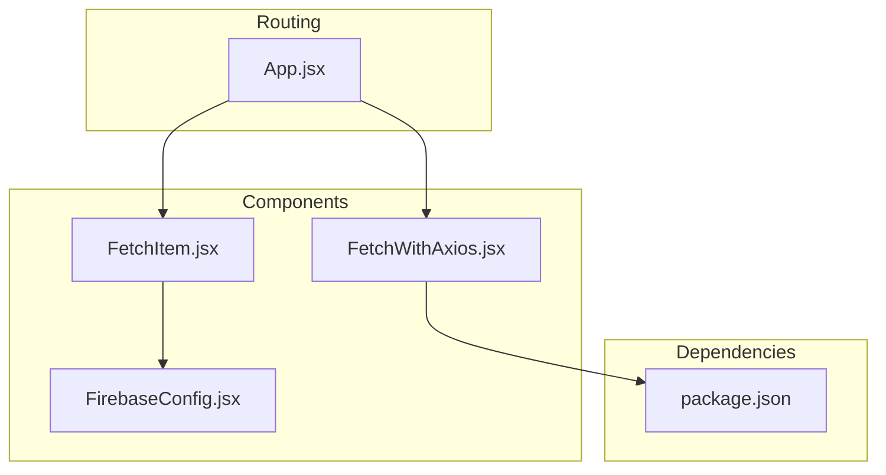
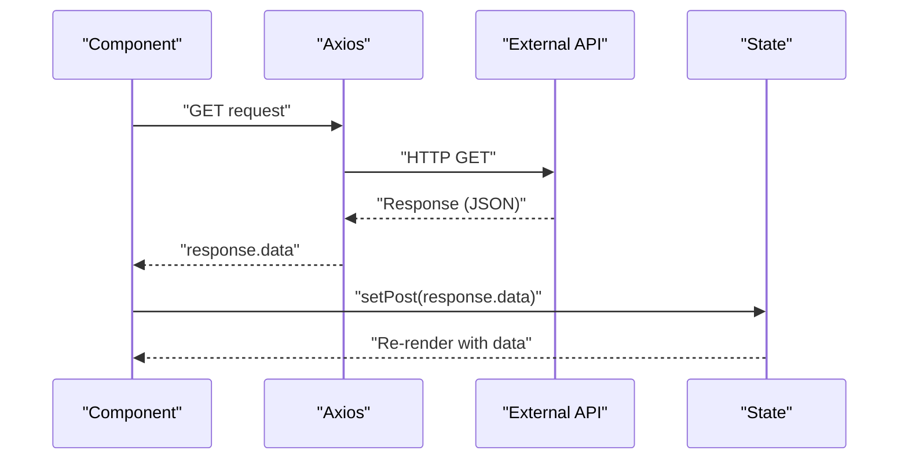
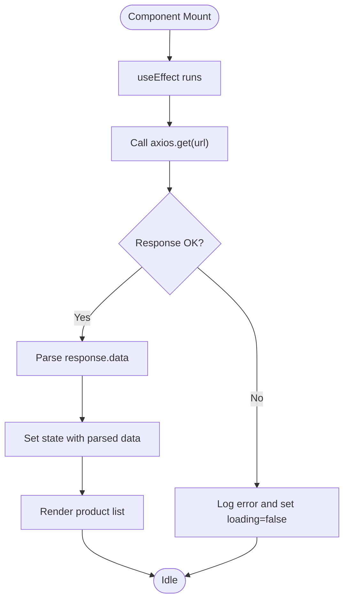
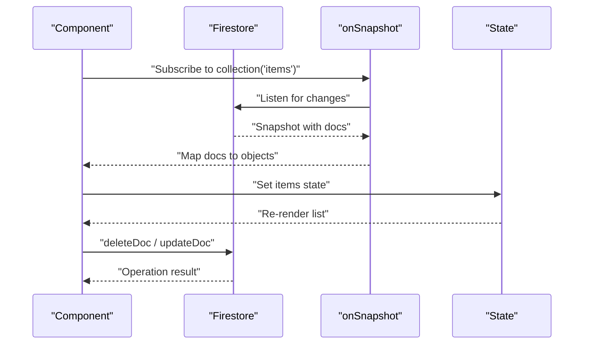
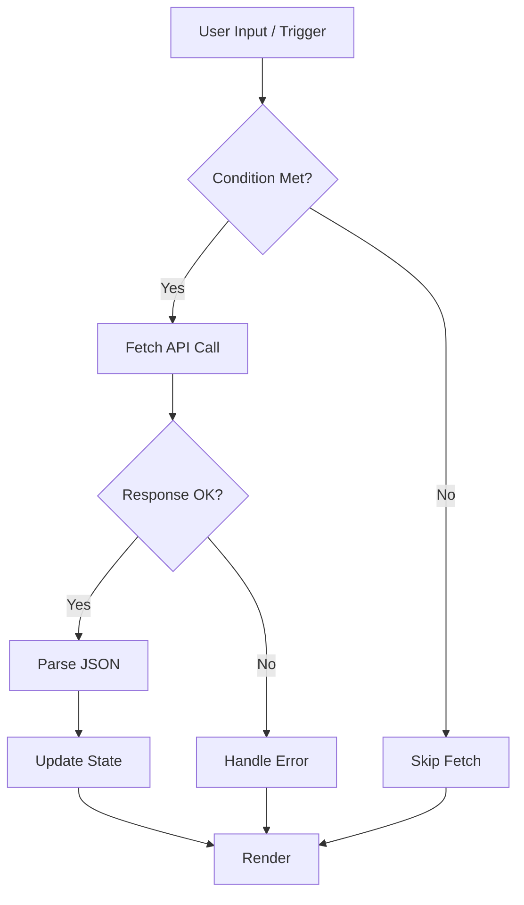
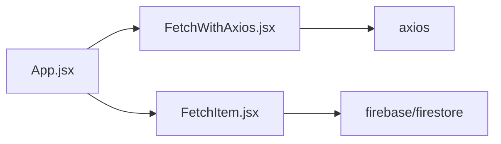
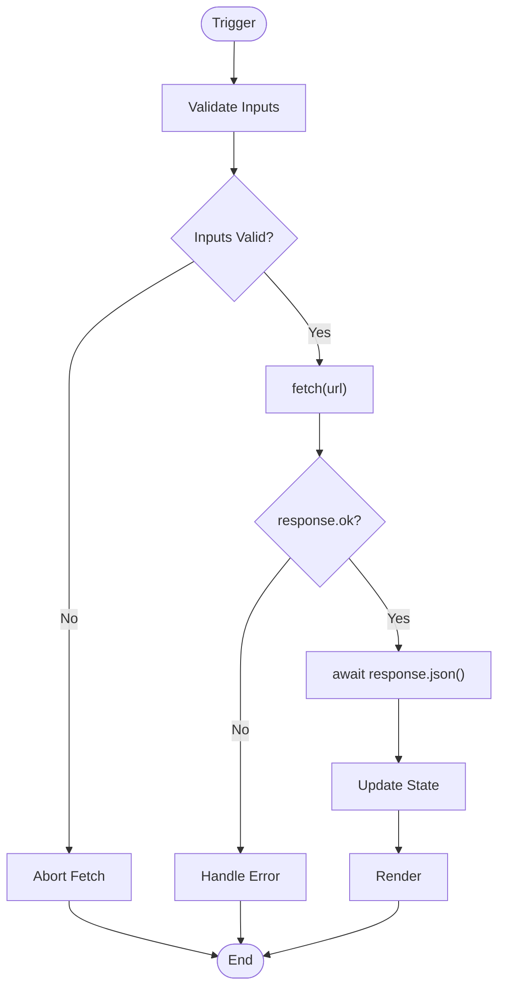

# Data Fetching Components

<cite>
**Referenced Files in This Document**
- [FetchWithAxios.jsx](file://src/components/FetchWithAxios.jsx)
- [FetchItem.jsx](file://src/components/FetchItem.jsx)
- [FirebaseConfig.jsx](file://src/components/FirebaseConfig.jsx)
- [App.jsx](file://src/App.jsx)
- [package.json](file://package.json)
- [README.md](file://README.md)
</cite>

## Table of Contents
1. [Introduction](#introduction)
2. [Project Structure](#project-structure)
3. [Core Components](#core-components)
4. [Architecture Overview](#architecture-overview)
5. [Detailed Component Analysis](#detailed-component-analysis)
6. [Dependency Analysis](#dependency-analysis)
7. [Performance Considerations](#performance-considerations)
8. [Troubleshooting Guide](#troubleshooting-guide)
9. [Conclusion](#conclusion)
10. [Appendices](#appendices)

## Introduction
This document explains the data fetching components in the project, focusing on:
- Native Fetch API usage patterns (via a commented example in the codebase)
- Axios-based data fetching
- Integration with React’s useEffect for side effects and state updates
- Request configuration, response handling, and JSON parsing
- Security considerations, API endpoint management, and environment-based URL configuration
- Performance optimization strategies such as request cancellation, caching, and retry mechanisms
- Comparative analysis of Fetch vs Axios in terms of usability, browser support, and feature richness

The repository demonstrates two distinct approaches to data fetching:
- Axios-based component that performs a GET request to a public API endpoint
- Firebase-based component that listens to real-time Firestore snapshots

## Project Structure
The relevant files for data fetching are located under src/components. The App routes include both components, enabling quick comparison and testing.

**Diagram sources**
- [App.jsx](file://src/App.jsx#L1-L56)
- [FetchWithAxios.jsx](file://src/components/FetchWithAxios.jsx#L1-L42)
- [FetchItem.jsx](file://src/components/FetchItem.jsx#L1-L106)
- [FirebaseConfig.jsx](file://src/components/FirebaseConfig.jsx#L1-L26)
- [package.json](file://package.json#L1-L32)

**Section sources**
- [App.jsx](file://src/App.jsx#L1-L56)
- [package.json](file://package.json#L1-L32)

## Core Components
- FetchWithAxios.jsx: Demonstrates GET request using Axios, loading state handling, error logging, and rendering fetched data.
- FetchItem.jsx: Uses Firebase Firestore onSnapshot to listen to real-time updates and manage local state for editing/deleting items.
- FirebaseConfig.jsx: Initializes Firebase and exports Firestore instance for use by components.
- App.jsx: Routes include both components for demonstration.

Key implementation patterns observed:
- useEffect for side effects and initial data load
- useState for managing data, loading, and error states
- Conditional rendering based on loading and error states
- JSON parsing via response.data for Axios
- Real-time subscription via onSnapshot for Firebase

**Section sources**
- [FetchWithAxios.jsx](file://src/components/FetchWithAxios.jsx#L1-L42)
- [FetchItem.jsx](file://src/components/FetchItem.jsx#L1-L106)
- [FirebaseConfig.jsx](file://src/components/FirebaseConfig.jsx#L1-L26)
- [App.jsx](file://src/App.jsx#L1-L56)

## Architecture Overview
The data fetching architecture combines:
- Axios-based GET requests to external APIs
- Firebase Firestore real-time subscriptions
- React hooks for state and lifecycle management

**Diagram sources**
- [FetchWithAxios.jsx](file://src/components/FetchWithAxios.jsx#L1-L42)

## Detailed Component Analysis

### FetchWithAxios.jsx
- Purpose: Fetch product data from a public API endpoint using Axios and display it.
- Implementation highlights:
  - Uses useEffect to trigger a GET request on mount
  - Manages loading state and logs errors
  - Parses JSON from response.data and stores it in state
  - Renders product list with title, price, and image

**Diagram sources**
- [FetchWithAxios.jsx](file://src/components/FetchWithAxios.jsx#L1-L42)

**Section sources**
- [FetchWithAxios.jsx](file://src/components/FetchWithAxios.jsx#L1-L42)

### FetchItem.jsx
- Purpose: Manage a list of items stored in Firestore, with edit/delete capabilities.
- Implementation highlights:
  - Uses onSnapshot to subscribe to Firestore collection updates
  - Converts snapshot docs to plain objects and sets state
  - Provides handlers for delete and update operations
  - Uses local state to control edit mode and input field

**Diagram sources**
- [FetchItem.jsx](file://src/components/FetchItem.jsx#L1-L106)
- [FirebaseConfig.jsx](file://src/components/FirebaseConfig.jsx#L1-L26)

**Section sources**
- [FetchItem.jsx](file://src/components/FetchItem.jsx#L1-L106)
- [FirebaseConfig.jsx](file://src/components/FirebaseConfig.jsx#L1-L26)

### Conceptual Overview
- Native Fetch API pattern: The codebase includes a commented example of a Fetch-based API call with loading, error, and JSON parsing states. This demonstrates a conventional Fetch workflow suitable for custom endpoints or internal APIs.
- Conditional fetching logic: The commented example shows how to guard against empty inputs and conditionally trigger requests based on component state or props.
- Environment-based URLs: The commented example references environment variables for base URLs, illustrating how to centralize endpoint configuration.

[No sources needed since this diagram shows conceptual workflow, not actual code structure]

## Dependency Analysis
- Axios dependency: The project depends on Axios for HTTP requests.
- Firebase dependency: The project depends on Firebase for real-time data synchronization.
- Routing: App.jsx includes both components to demonstrate their usage.

**Diagram sources**
- [package.json](file://package.json#L1-L32)
- [FetchWithAxios.jsx](file://src/components/FetchWithAxios.jsx#L1-L42)
- [FetchItem.jsx](file://src/components/FetchItem.jsx#L1-L106)
- [App.jsx](file://src/App.jsx#L1-L56)

**Section sources**
- [package.json](file://package.json#L1-L32)
- [App.jsx](file://src/App.jsx#L1-L56)

## Performance Considerations
- Request cancellation:
  - Axios supports cancellation via AbortController. Wrap requests in a cancellable function and cancel on unmount to prevent state updates after component unmount.
  - Example pattern: create a controller in useEffect, pass it to axios, and abort in cleanup.
- Caching strategies:
  - Use in-memory caches keyed by URL to avoid redundant requests.
  - Combine with React state updates to minimize re-renders.
- Retry mechanisms:
  - Implement exponential backoff for transient failures.
  - Limit retries and surface user-friendly errors.
- Loading states:
  - Maintain a loading flag during requests to avoid stale UI.
  - Debounce rapid triggers to reduce network churn.
- Error handling:
  - Normalize error messages and surface actionable feedback.
  - Distinguish between network errors, timeouts, and server errors.

[No sources needed since this section provides general guidance]

## Troubleshooting Guide
- Axios GET request fails:
  - Verify endpoint availability and CORS configuration.
  - Inspect error logs and ensure response.data is used for JSON payloads.
- Firebase snapshot not updating:
  - Confirm Firestore rules allow reads/writes.
  - Ensure the component remains mounted while listening; unsubscribe on cleanup.
- Memory leaks:
  - Always cancel in-flight requests and unsubscribe from listeners in useEffect cleanup.
- Environment variables:
  - If using environment-based URLs, ensure variables are prefixed correctly and injected by the build tool.

**Section sources**
- [FetchWithAxios.jsx](file://src/components/FetchWithAxios.jsx#L1-L42)
- [FetchItem.jsx](file://src/components/FetchItem.jsx#L1-L106)

## Conclusion
The project showcases two complementary data fetching strategies:
- Axios-based GET requests for external APIs with straightforward state management and JSON parsing
- Firebase real-time subscriptions for reactive, synchronized data

Both approaches leverage React hooks for side effects and state updates. For production-grade applications, combine these patterns with robust error handling, cancellation, caching, and retry strategies. Centralize endpoint configuration and enforce security policies appropriate to your environment.

[No sources needed since this section summarizes without analyzing specific files]

## Appendices

### Appendix A: Fetch API Pattern (from codebase)
- The codebase includes a commented example demonstrating a Fetch-based API call with:
  - Loading state management
  - Error handling
  - JSON parsing via response.json()
  - Conditional fetching logic
  - Environment-based URL configuration

[No sources needed since this diagram shows conceptual workflow, not actual code structure]

### Appendix B: Security Considerations
- Prefer HTTPS endpoints for all data transfers.
- Avoid embedding secrets in client-side code; use backend proxies for sensitive operations.
- Enforce Firestore rules and restrict access to authenticated users where applicable.
- Sanitize and validate all incoming data before rendering.

[No sources needed since this section provides general guidance]

### Appendix C: Environment-Based URL Configuration
- The commented example demonstrates environment-based URL usage, aligning with best practices for configurable endpoints across development, staging, and production environments.

[No sources needed since this section provides general guidance]