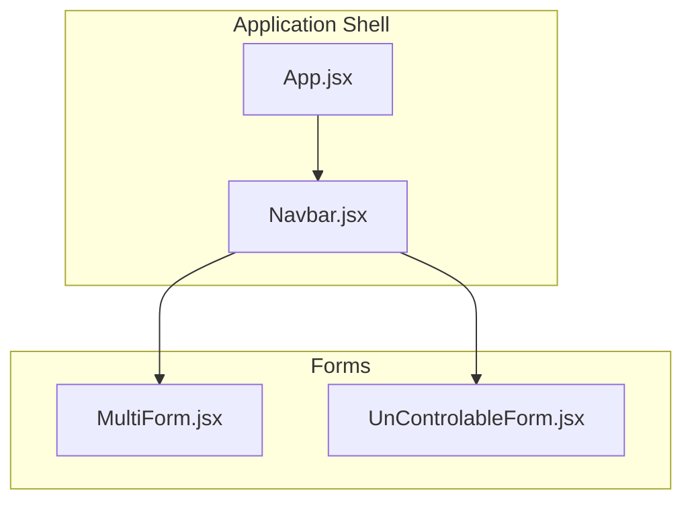
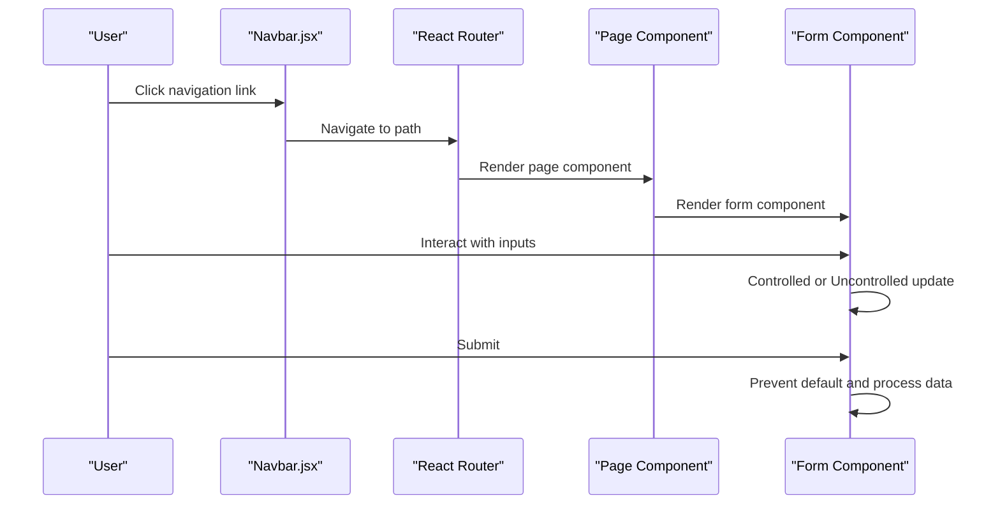
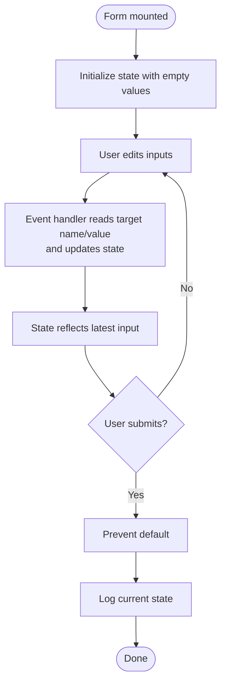
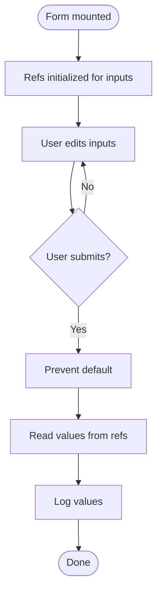
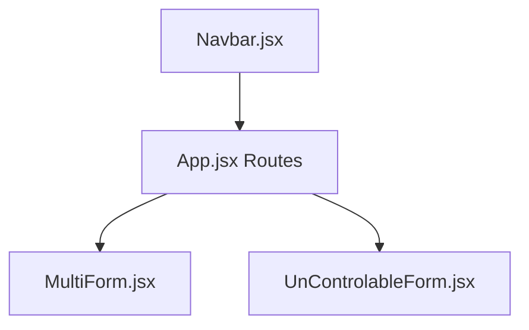
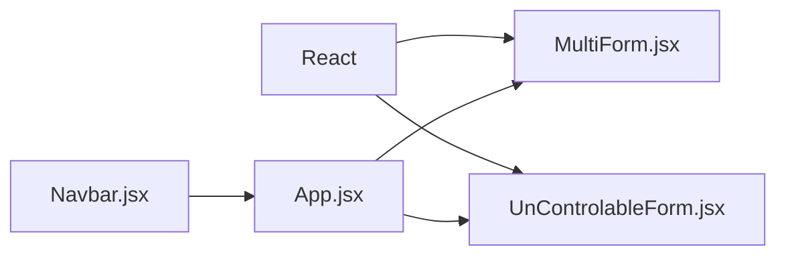

# Form Handling Components

<cite>
**Referenced Files in This Document**
- [MultiForm.jsx](file://src/components/MultiForm.jsx)
- [UnControlableForm.jsx](file://src/components/UnControlableForm.jsx)
- [App.jsx](file://src/App.jsx)
- [Navbar.jsx](file://src/components/Navbar.jsx)
</cite>

## Table of Contents
1. [Introduction](#introduction)
2. [Project Structure](#project-structure)
3. [Core Components](#core-components)
4. [Architecture Overview](#architecture-overview)
5. [Detailed Component Analysis](#detailed-component-analysis)
6. [Dependency Analysis](#dependency-analysis)
7. [Performance Considerations](#performance-considerations)
8. [Troubleshooting Guide](#troubleshooting-guide)
9. [Conclusion](#conclusion)

## Introduction
This document explains the form handling components in the application, focusing on two patterns:
- Controlled form using React state hooks
- Uncontrolled form using refs

It covers implementation differences, data binding strategies, use cases, integration with React Hooks, accessibility considerations, and user experience best practices. It also addresses common issues such as uncontrolled input warnings, form reset behavior, and ref management, along with performance tips and guidance on choosing between controlled and uncontrolled patterns.

## Project Structure
The form components are standalone React functional components located under src/components. They are integrated into the application via routing and navigation.

**Diagram sources**
- [App.jsx](file://src/App.jsx#L1-L56)
- [Navbar.jsx](file://src/components/Navbar.jsx#L1-L81)
- [MultiForm.jsx](file://src/components/MultiForm.jsx#L1-L70)
- [UnControlableForm.jsx](file://src/components/UnControlableForm.jsx#L1-L40)

**Section sources**
- [App.jsx](file://src/App.jsx#L1-L56)
- [Navbar.jsx](file://src/components/Navbar.jsx#L1-L81)

## Core Components
- Controlled form (MultiForm.jsx): Uses React state to manage form inputs. Each input’s value is bound to state, and changes update state via event handlers. Submission prevents default and logs the collected state.
- Uncontrolled form (UnControlableForm.jsx): Uses refs to read input values directly from DOM nodes on submit. No state updates during typing.

Key implementation highlights:
- Controlled form: state initialization, handler to update state, submit handler to prevent default and log state.
- Uncontrolled form: refs initialized for each field, submit handler reads values from refs.

**Section sources**
- [MultiForm.jsx](file://src/components/MultiForm.jsx#L1-L70)
- [UnControlableForm.jsx](file://src/components/UnControlableForm.jsx#L1-L40)

## Architecture Overview
The forms are rendered conditionally through routing. The navigation links in Navbar.jsx route to the form pages. App.jsx defines routes and includes the form components.

**Diagram sources**
- [Navbar.jsx](file://src/components/Navbar.jsx#L1-L81)
- [App.jsx](file://src/App.jsx#L22-L56)
- [MultiForm.jsx](file://src/components/MultiForm.jsx#L1-L70)
- [UnControlableForm.jsx](file://src/components/UnControlableForm.jsx#L1-L40)

## Detailed Component Analysis

### Controlled Form: MultiForm.jsx
- State management: A single state object holds all input values. Updates are performed by spreading the previous state and setting the changed field.
- Event handling: A single handler updates state for any input by reading the target’s name and value.
- Submission: Prevents default browser behavior and logs the current state.
- Accessibility: Inputs have names and placeholders; labels are present for improved semantics.

**Diagram sources**
- [MultiForm.jsx](file://src/components/MultiForm.jsx#L1-L70)

Implementation notes:
- Data binding strategy: Controlled via props (value) and event handlers (onChange).
- Validation and errors: Not implemented in the current component; validation would typically be added by introducing validation state and conditional rendering of error messages.
- Submission handling: Logs state; in practice, this would dispatch to a backend service and handle success/error states.
- Accessibility: Ensure labels are associated with inputs and consider aria attributes for dynamic feedback.

Common enhancements (not present in current code):
- Validation state and error messages
- Form reset behavior (clear state)
- Controlled vs uncontrolled toggling

**Section sources**
- [MultiForm.jsx](file://src/components/MultiForm.jsx#L1-L70)

### Uncontrolled Form: UnControlableForm.jsx
- Ref management: Each input has a dedicated ref. Values are accessed via ref.current.value on submit.
- Submission: Prevents default and logs values read from refs.
- Simplicity: Minimal React state; relies on DOM for current values.

**Diagram sources**
- [UnControlableForm.jsx](file://src/components/UnControlableForm.jsx#L1-L40)

Implementation notes:
- Data binding strategy: Uncontrolled via refs; value is not managed by React state.
- Validation and errors: Not implemented; validation would require checking input validity and displaying feedback.
- Submission handling: Logs values; in practice, this would trigger network requests and state updates.
- Accessibility: Ensure labels and roles are appropriate; consider aria-live regions for dynamic feedback.

Common enhancements (not present in current code):
- Validation and error messaging
- Programmatic reset using refs
- Controlled vs uncontrolled toggling

**Section sources**
- [UnControlableForm.jsx](file://src/components/UnControlableForm.jsx#L1-L40)

### Routing and Navigation Integration
- Navbar.jsx provides navigation links to the form pages.
- App.jsx defines routes and includes the form components. The routes for the forms are present in the commented-out router configuration.

**Diagram sources**
- [Navbar.jsx](file://src/components/Navbar.jsx#L1-L81)
- [App.jsx](file://src/App.jsx#L22-L56)

**Section sources**
- [Navbar.jsx](file://src/components/Navbar.jsx#L1-L81)
- [App.jsx](file://src/App.jsx#L22-L56)

## Dependency Analysis
- Both components depend on React hooks:
  - MultiForm.jsx uses useState.
  - UnControlableForm.jsx uses useRef.
- App.jsx imports both components and includes them in routes.
- Navbar.jsx renders links to the form routes.

**Diagram sources**
- [MultiForm.jsx](file://src/components/MultiForm.jsx#L1-L70)
- [UnControlableForm.jsx](file://src/components/UnControlableForm.jsx#L1-L40)
- [App.jsx](file://src/App.jsx#L1-L56)
- [Navbar.jsx](file://src/components/Navbar.jsx#L1-L81)

**Section sources**
- [MultiForm.jsx](file://src/components/MultiForm.jsx#L1-L70)
- [UnControlableForm.jsx](file://src/components/UnControlableForm.jsx#L1-L40)
- [App.jsx](file://src/App.jsx#L1-L56)
- [Navbar.jsx](file://src/components/Navbar.jsx#L1-L81)

## Performance Considerations
- Controlled form:
  - Re-renders occur on every keystroke due to state updates. For forms with many fields or frequent updates, consider:
    - Debouncing input handlers
    - Splitting the form into smaller components
    - Using separate state slices for different sections
- Uncontrolled form:
  - Avoids frequent re-renders by reading values only on submit. However, it does not provide reactive UI updates while typing.
- General:
  - Memoize expensive computations derived from form state.
  - Use keys appropriately when rendering lists of inputs.
  - Minimize unnecessary state updates by batching or conditional updates.

[No sources needed since this section provides general guidance]

## Troubleshooting Guide
- Uncontrolled input warnings:
  - Symptom: Warnings about inputs changing from uncontrolled to controlled.
  - Cause: An input was initially uncontrolled (no value prop) and later became controlled (with value prop).
  - Fix: Ensure inputs either remain uncontrolled (no value prop) or are always controlled (set initial empty value).
  - Reference: The controlled component sets values on inputs; ensure initial state is defined to avoid mixed modes.
- Form reset behavior:
  - Controlled form: Reset by clearing the state object.
  - Uncontrolled form: Reset by clearing refs’ values programmatically or by resetting the form element.
- Ref management:
  - Ensure refs are initialized before accessing ref.current.
  - Avoid storing refs in state; keep them as mutable references.
- Accessibility:
  - Always associate labels with inputs.
  - Provide meaningful error messages and announce dynamic feedback to assistive technologies.
- Validation and error feedback:
  - Controlled form: Track validation state and render error messages conditionally.
  - Uncontrolled form: Validate on submit and surface errors to the user.

**Section sources**
- [MultiForm.jsx](file://src/components/MultiForm.jsx#L1-L70)
- [UnControlableForm.jsx](file://src/components/UnControlableForm.jsx#L1-L40)

## Conclusion
- Choose controlled forms when you need reactive UI updates, centralized validation, and programmatic manipulation of input values.
- Choose uncontrolled forms when simplicity and minimal re-renders are priorities, and when validation occurs primarily on submit.
- Integrate both patterns thoughtfully with React Hooks, ensure robust error handling, and prioritize accessibility and user experience.

[No sources needed since this section summarizes without analyzing specific files]