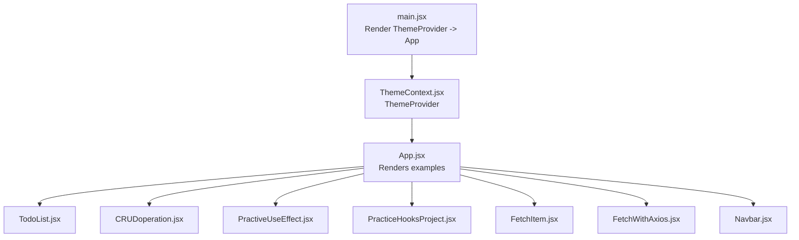
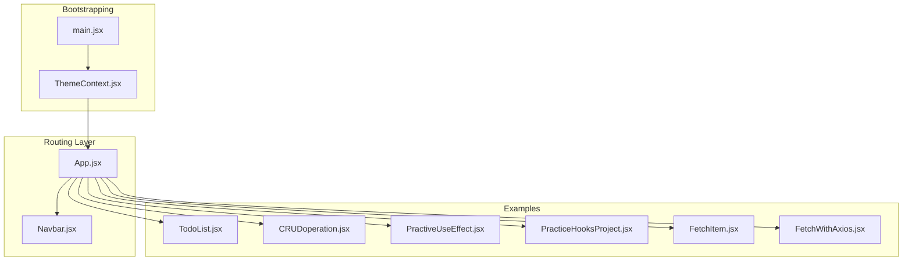
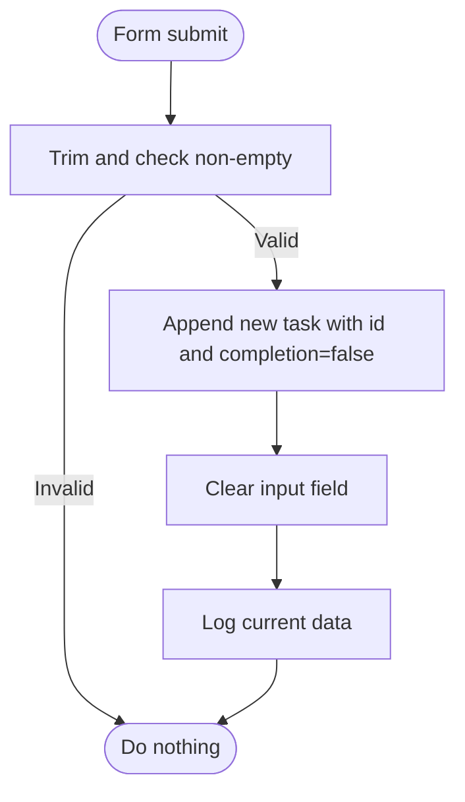
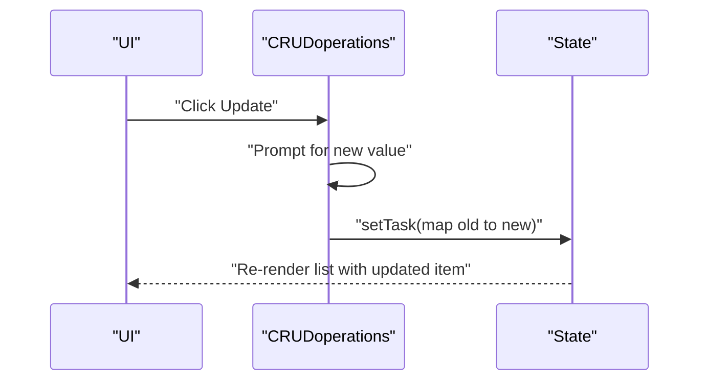
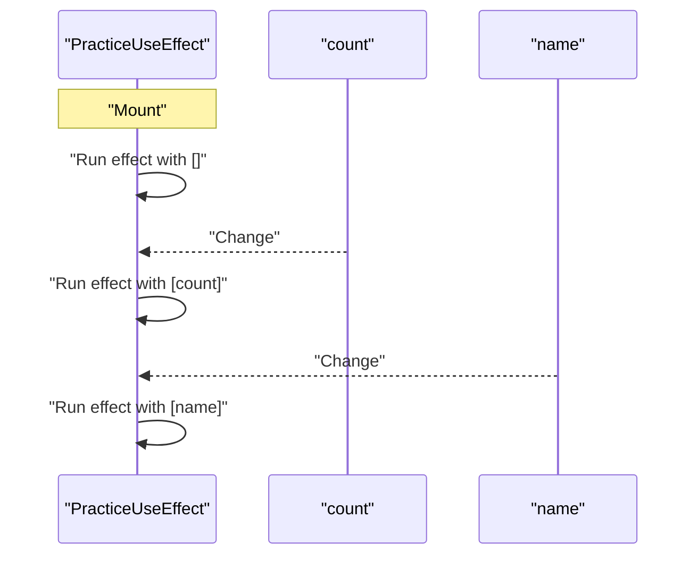
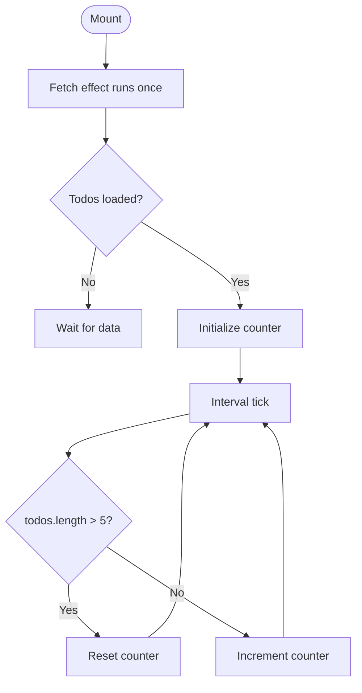
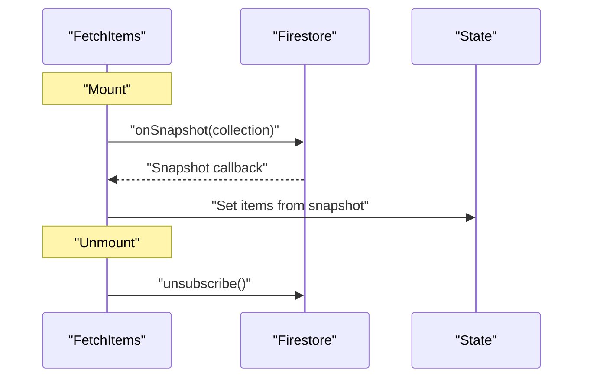
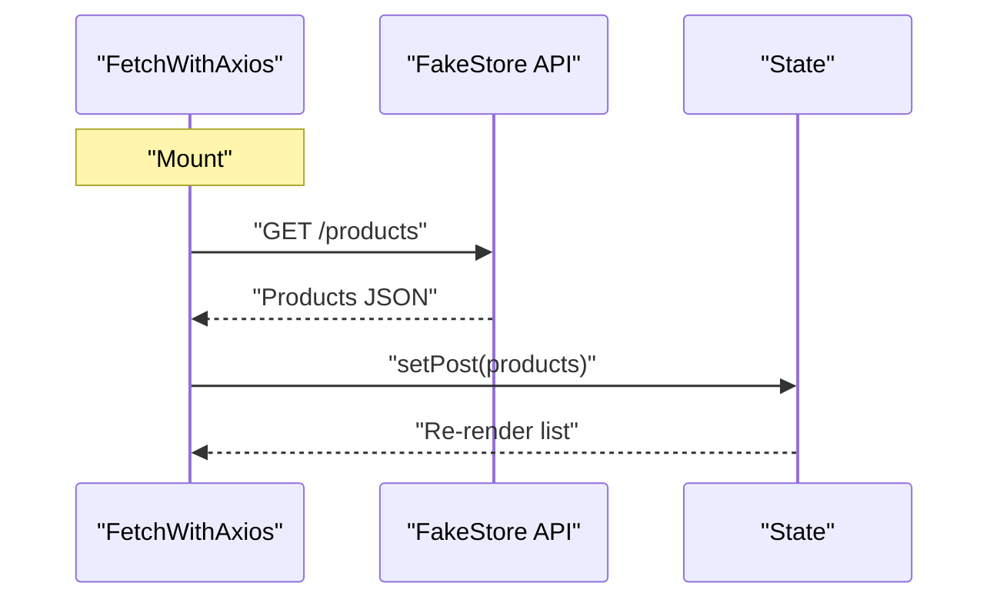
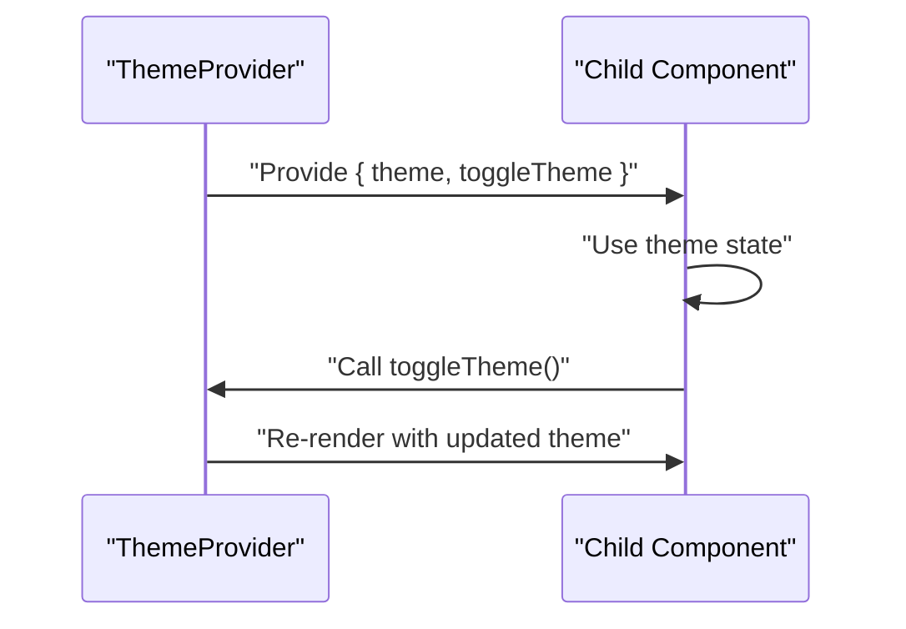
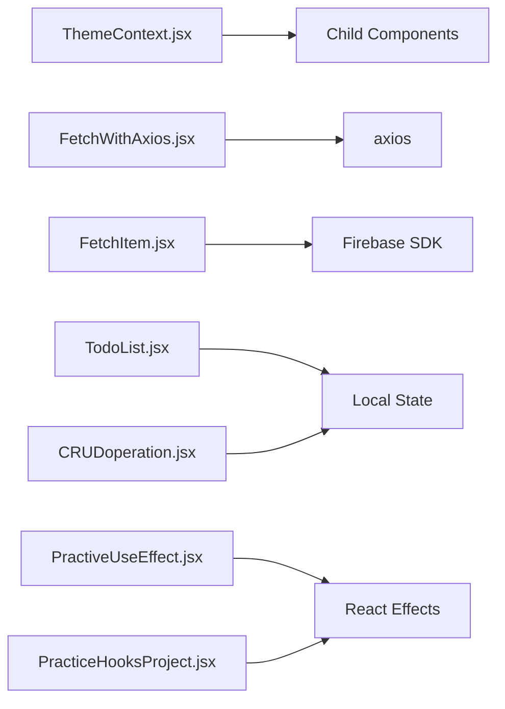

# Stateful Components

<cite>
**Referenced Files in This Document**
- [main.jsx](file://src/main.jsx)
- [App.jsx](file://src/App.jsx)
- [Navbar.jsx](file://src/components/Navbar.jsx)
- [ThemeContext.jsx](file://src/components/ThemeContext.jsx)
- [TodoList.jsx](file://src/components/TodoList.jsx)
- [CRUDoperation.jsx](file://src/components/CRUDoperation.jsx)
- [PractiveUseEffect.jsx](file://src/components/PractiveUseEffect.jsx)
- [PracticeHooksProject.jsx](file://src/components/PracticeHooksProject.jsx)
- [FetchItem.jsx](file://src/components/FetchItem.jsx)
- [FetchWithAxios.jsx](file://src/components/FetchWithAxios.jsx)
</cite>

## Table of Contents
1. [Introduction](#introduction)
2. [Project Structure](#project-structure)
3. [Core Components](#core-components)
4. [Architecture Overview](#architecture-overview)
5. [Detailed Component Analysis](#detailed-component-analysis)
6. [Dependency Analysis](#dependency-analysis)
7. [Performance Considerations](#performance-considerations)
8. [Troubleshooting Guide](#troubleshooting-guide)
9. [Conclusion](#conclusion)
10. [Appendices](#appendices)

## Introduction
This document explains how stateful components are built using React’s useState and useEffect hooks across several examples in the repository. It focuses on:
- State initialization and update patterns
- Conditional rendering and event handling
- Lifecycle effects and cleanup
- Parent-child relationships and data flow
- Performance optimization and debugging strategies
- Testing state transitions and handling asynchronous updates

The covered components include TodoList.jsx for task management, CRUDoperation.jsx for mock data operations, and PractiveUseEffect.jsx for lifecycle effects. Additional context is provided from ThemeContext.jsx, PracticeHooksProject.jsx, FetchItem.jsx, and FetchWithAxios.jsx to illustrate broader patterns.

## Project Structure
The application bootstraps the app with a theme provider and renders a set of example pages. Routing is present but many routes are commented out in the main App component, while others are rendered inline. The Navbar component manages mobile menu state and links to various pages.

**Diagram sources**
- [main.jsx](file://src/main.jsx#L1-L13)
- [App.jsx](file://src/App.jsx#L1-L56)
- [Navbar.jsx](file://src/components/Navbar.jsx#L1-L81)
- [ThemeContext.jsx](file://src/components/ThemeContext.jsx#L1-L14)
- [TodoList.jsx](file://src/components/TodoList.jsx#L1-L56)
- [CRUDoperation.jsx](file://src/components/CRUDoperation.jsx#L1-L77)
- [PractiveUseEffect.jsx](file://src/components/PractiveUseEffect.jsx#L106-L149)
- [PracticeHooksProject.jsx](file://src/components/PracticeHooksProject.jsx#L1-L88)
- [FetchItem.jsx](file://src/components/FetchItem.jsx#L1-L106)
- [FetchWithAxios.jsx](file://src/components/FetchWithAxios.jsx#L1-L42)

**Section sources**
- [main.jsx](file://src/main.jsx#L1-L13)
- [App.jsx](file://src/App.jsx#L1-L56)
- [Navbar.jsx](file://src/components/Navbar.jsx#L1-L81)

## Core Components
This section highlights the primary stateful components and their responsibilities.

- TodoList.jsx
  - Manages a list of tasks with local state and form submission.
  - Demonstrates controlled input, conditional rendering, and toggling completion.
  - Snippet paths:
    - [State initialization](file://src/components/TodoList.jsx#L5-L6)
    - [Event handlers and updates](file://src/components/TodoList.jsx#L8-L19)
    - [Conditional rendering and toggling](file://src/components/TodoList.jsx#L42-L51)

- CRUDoperation.jsx
  - Simulates CRUD operations on a local array of tasks.
  - Uses useEffect to log state changes and demonstrates add/update/delete actions.
  - Snippet paths:
    - [State and effect](file://src/components/CRUDoperation.jsx#L1-L9)
    - [Add task](file://src/components/CRUDoperation.jsx#L10-L18)
    - [Delete task](file://src/components/CRUDoperation.jsx#L20-L25)
    - [Update task](file://src/components/CRUDoperation.jsx#L27-L38)

- PractiveUseEffect.jsx
  - Demonstrates useEffect with different dependency arrays and cleanup.
  - Snippet paths:
    - [Empty dependency effect](file://src/components/PractiveUseEffect.jsx#L113-L115)
    - [Single dependency effect](file://src/components/PractiveUseEffect.jsx#L118-L120)
    - [Multiple dependency effect](file://src/components/PractiveUseEffect.jsx#L122-L125)

- PracticeHooksProject.jsx
  - Shows derived state and multiple effects managing counters and filtering.
  - Snippet paths:
    - [State declarations](file://src/components/PracticeHooksProject.jsx#L11-L13)
    - [Fetch effect with cleanup](file://src/components/PracticeHooksProject.jsx#L16-L24)
    - [Auto-increment effect](file://src/components/PracticeHooksProject.jsx#L26-L36)
    - [Derived state effect](file://src/components/PracticeHooksProject.jsx#L38-L42)
    - [Update functions](file://src/components/PracticeHooksProject.jsx#L45-L59)

- ThemeContext.jsx
  - Provides theme state and a toggle function via context.
  - Snippet paths:
    - [Context creation and provider](file://src/components/ThemeContext.jsx#L1-L14)

- FetchItem.jsx
  - Uses Firestore onSnapshot to keep state in sync with remote data.
  - Demonstrates cleanup via unsubscribe and CRUD-like updates/deletes.
  - Snippet paths:
    - [State and effect](file://src/components/FetchItem.jsx#L11-L26)
    - [Cleanup](file://src/components/FetchItem.jsx#L25-L26)
    - [Update handler](file://src/components/FetchItem.jsx#L38-L54)
    - [Edit flow](file://src/components/FetchItem.jsx#L58-L61)

- FetchWithAxios.jsx
  - Fetches data on mount and renders a list.
  - Snippet paths:
    - [State and effect](file://src/components/FetchWithAxios.jsx#L1-L21)
    - [Rendering list](file://src/components/FetchWithAxios.jsx#L22-L37)

**Section sources**
- [TodoList.jsx](file://src/components/TodoList.jsx#L1-L56)
- [CRUDoperation.jsx](file://src/components/CRUDoperation.jsx#L1-L77)
- [PractiveUseEffect.jsx](file://src/components/PractiveUseEffect.jsx#L106-L149)
- [PracticeHooksProject.jsx](file://src/components/PracticeHooksProject.jsx#L1-L88)
- [ThemeContext.jsx](file://src/components/ThemeContext.jsx#L1-L14)
- [FetchItem.jsx](file://src/components/FetchItem.jsx#L1-L106)
- [FetchWithAxios.jsx](file://src/components/FetchWithAxios.jsx#L1-L42)

## Architecture Overview
The application follows a simple composition model:
- main.jsx wraps the app in ThemeProvider so child components can consume theme state.
- App.jsx conditionally renders examples; many routes are available but mostly commented out.
- Navbar.jsx manages UI state for mobile menu and navigates to example pages.

**Diagram sources**
- [main.jsx](file://src/main.jsx#L1-L13)
- [ThemeContext.jsx](file://src/components/ThemeContext.jsx#L1-L14)
- [App.jsx](file://src/App.jsx#L1-L56)
- [Navbar.jsx](file://src/components/Navbar.jsx#L1-L81)
- [TodoList.jsx](file://src/components/TodoList.jsx#L1-L56)
- [CRUDoperation.jsx](file://src/components/CRUDoperation.jsx#L1-L77)
- [PractiveUseEffect.jsx](file://src/components/PractiveUseEffect.jsx#L106-L149)
- [PracticeHooksProject.jsx](file://src/components/PracticeHooksProject.jsx#L1-L88)
- [FetchItem.jsx](file://src/components/FetchItem.jsx#L1-L106)
- [FetchWithAxios.jsx](file://src/components/FetchWithAxios.jsx#L1-L42)

## Detailed Component Analysis

### TodoList.jsx: Task Management with Local State
- State initialization
  - Two pieces of state: task input and the list of tasks.
  - Snippet path: [State initialization](file://src/components/TodoList.jsx#L5-L6)
- Event handling and updates
  - Controlled input updates the task state.
  - Submit handler prevents default, validates input, and appends a new task with an id and completion flag.
  - Snippet path: [Event handlers and updates](file://src/components/TodoList.jsx#L8-L19)
- Conditional rendering
  - Renders a list of tasks and applies styles based on completion.
  - Snippet path: [Conditional rendering and toggling](file://src/components/TodoList.jsx#L42-L51)
- Toggle logic
  - Maps over the list to flip the completion flag for a specific id.
  - Snippet path: [Toggle function](file://src/components/TodoList.jsx#L21-L27)

**Diagram sources**
- [TodoList.jsx](file://src/components/TodoList.jsx#L8-L19)

**Section sources**
- [TodoList.jsx](file://src/components/TodoList.jsx#L1-L56)

### CRUDoperation.jsx: Mock Data Operations
- State and effect
  - Maintains a tasks array and logs updates when the array changes.
  - Snippet path: [State and effect](file://src/components/CRUDoperation.jsx#L1-L9)
- Add task
  - Validates input, creates a new array, updates state, and clears input.
  - Snippet path: [Add task](file://src/components/CRUDoperation.jsx#L10-L18)
- Delete task
  - Filters out the item at the given index and updates state.
  - Snippet path: [Delete task](file://src/components/CRUDoperation.jsx#L20-L25)
- Update task
  - Prompts for a new value, maps over the array to replace the item at the index, and updates state.
  - Snippet path: [Update task](file://src/components/CRUDoperation.jsx#L27-L38)

**Diagram sources**
- [CRUDoperation.jsx](file://src/components/CRUDoperation.jsx#L27-L38)

**Section sources**
- [CRUDoperation.jsx](file://src/components/CRUDoperation.jsx#L1-L77)

### PractiveUseEffect.jsx: Lifecycle Effects and Cleanup
- Empty dependency effect
  - Runs once on mount; useful for initialization.
  - Snippet path: [Empty dependency effect](file://src/components/PractiveUseEffect.jsx#L113-L115)
- Single dependency effect
  - Runs when a specific state changes.
  - Snippet path: [Single dependency effect](file://src/components/PractiveUseEffect.jsx#L118-L120)
- Multiple dependency effect
  - Runs when any of the listed states change.
  - Snippet path: [Multiple dependency effect](file://src/components/PractiveUseEffect.jsx#L122-L125)

**Diagram sources**
- [PractiveUseEffect.jsx](file://src/components/PractiveUseEffect.jsx#L113-L125)

**Section sources**
- [PractiveUseEffect.jsx](file://src/components/PractiveUseEffect.jsx#L106-L149)

### PracticeHooksProject.jsx: Derived State and Asynchronous Updates
- State declarations
  - Todos, counter, and completedCount.
  - Snippet path: [State declarations](file://src/components/PracticeHooksProject.jsx#L11-L13)
- Fetch effect with cleanup
  - Simulates an API call and sets state; includes cleanup to prevent updates after unmount.
  - Snippet path: [Fetch effect with cleanup](file://src/components/PracticeHooksProject.jsx#L16-L24)
- Auto-increment effect
  - Sets up an interval and resets the counter when todos exceed a threshold.
  - Snippet path: [Auto-increment effect](file://src/components/PracticeHooksProject.jsx#L26-L36)
- Derived state effect
  - Computes completedCount from todos.
  - Snippet path: [Derived state effect](file://src/components/PracticeHooksProject.jsx#L38-L42)
- Update functions
  - Adds a todo and toggles completion.
  - Snippet path: [Update functions](file://src/components/PracticeHooksProject.jsx#L45-L59)

**Diagram sources**
- [PracticeHooksProject.jsx](file://src/components/PracticeHooksProject.jsx#L16-L36)

**Section sources**
- [PracticeHooksProject.jsx](file://src/components/PracticeHooksProject.jsx#L1-L88)

### FetchItem.jsx: Remote Data Synchronization with Cleanup
- State and effect
  - Initializes items and edit state; subscribes to Firestore snapshot.
  - Snippet path: [State and effect](file://src/components/FetchItem.jsx#L11-L26)
- Cleanup
  - Returns unsubscribe to stop listening when component unmounts.
  - Snippet path: [Cleanup](file://src/components/FetchItem.jsx#L25-L26)
- Update and delete
  - Handles editing and updating documents; deletes documents.
  - Snippet paths: [Update handler](file://src/components/FetchItem.jsx#L38-L54), [Edit flow](file://src/components/FetchItem.jsx#L58-L61)

**Diagram sources**
- [FetchItem.jsx](file://src/components/FetchItem.jsx#L11-L26)

**Section sources**
- [FetchItem.jsx](file://src/components/FetchItem.jsx#L1-L106)

### FetchWithAxios.jsx: Asynchronous Fetch on Mount
- State and effect
  - Declares state for posts and loading; fetches data on mount.
  - Snippet path: [State and effect](file://src/components/FetchWithAxios.jsx#L1-L21)
- Rendering
  - Maps over posts to render a list.
  - Snippet path: [Rendering list](file://src/components/FetchWithAxios.jsx#L22-L37)

**Diagram sources**
- [FetchWithAxios.jsx](file://src/components/FetchWithAxios.jsx#L1-L21)

**Section sources**
- [FetchWithAxios.jsx](file://src/components/FetchWithAxios.jsx#L1-L42)

### ThemeContext.jsx and Navbar.jsx: Parent-Child State Sharing
- ThemeContext.jsx
  - Creates a context with theme state and a toggle function.
  - Snippet path: [Context creation and provider](file://src/components/ThemeContext.jsx#L1-L14)
- Navbar.jsx
  - Uses state to control mobile menu visibility and links to example pages.
  - Snippet path: [State and handlers](file://src/components/Navbar.jsx#L6-L11)

**Diagram sources**
- [ThemeContext.jsx](file://src/components/ThemeContext.jsx#L1-L14)

**Section sources**
- [ThemeContext.jsx](file://src/components/ThemeContext.jsx#L1-L14)
- [Navbar.jsx](file://src/components/Navbar.jsx#L1-L81)

## Dependency Analysis
- Coupling and cohesion
  - Components are loosely coupled; each manages its own state and effects.
  - ThemeContext.jsx centralizes theme state for child components.
- External dependencies
  - FetchItem.jsx depends on Firestore SDK for real-time synchronization.
  - FetchWithAxios.jsx depends on axios for HTTP requests.
- Potential circular dependencies
  - None observed among the analyzed files.

**Diagram sources**
- [ThemeContext.jsx](file://src/components/ThemeContext.jsx#L1-L14)
- [FetchWithAxios.jsx](file://src/components/FetchWithAxios.jsx#L1-L42)
- [FetchItem.jsx](file://src/components/FetchItem.jsx#L1-L106)
- [TodoList.jsx](file://src/components/TodoList.jsx#L1-L56)
- [CRUDoperation.jsx](file://src/components/CRUDoperation.jsx#L1-L77)
- [PractiveUseEffect.jsx](file://src/components/PractiveUseEffect.jsx#L106-L149)
- [PracticeHooksProject.jsx](file://src/components/PracticeHooksProject.jsx#L1-L88)

**Section sources**
- [ThemeContext.jsx](file://src/components/ThemeContext.jsx#L1-L14)
- [FetchWithAxios.jsx](file://src/components/FetchWithAxios.jsx#L1-L42)
- [FetchItem.jsx](file://src/components/FetchItem.jsx#L1-L106)
- [TodoList.jsx](file://src/components/TodoList.jsx#L1-L56)
- [CRUDoperation.jsx](file://src/components/CRUDoperation.jsx#L1-L77)
- [PractiveUseEffect.jsx](file://src/components/PractiveUseEffect.jsx#L106-L149)
- [PracticeHooksProject.jsx](file://src/components/PracticeHooksProject.jsx#L1-L88)

## Performance Considerations
- Avoid unnecessary re-renders
  - Use dependency arrays in useEffect to limit effect runs.
  - Prefer functional updates when deriving state from previous state.
  - Memoize expensive computations with useMemo when appropriate.
- Derived state
  - Compute derived values in effects or selectors to avoid recomputing on every render.
- Asynchronous updates
  - Cancel or guard async updates to prevent state updates after unmount.
- Conditional rendering
  - Render lists efficiently by minimizing DOM nodes and using keys.

[No sources needed since this section provides general guidance]

## Troubleshooting Guide
- Common issues and remedies
  - Infinite loops in effects: Ensure correct dependency arrays and clean up intervals/timeouts.
  - Stale closures: Capture latest state in callbacks or use functional updates.
  - Memory leaks: Always return cleanup functions for subscriptions and intervals.
  - Debugging state changes: Use useEffect logs and browser devtools to inspect state transitions.
- Specific examples from the codebase
  - TodoList.jsx logs current data after adding a task; use this pattern to track state progression.
    - Snippet path: [Logging after add](file://src/components/TodoList.jsx#L17-L17)
  - PracticeHooksProject.jsx uses an isMounted flag to avoid setting state after unmount.
    - Snippet path: [Cleanup guard](file://src/components/PracticeHooksProject.jsx#L17-L24)
  - FetchItem.jsx unsubscribes from Firestore on unmount.
    - Snippet path: [Cleanup subscription](file://src/components/FetchItem.jsx#L25-L26)

**Section sources**
- [TodoList.jsx](file://src/components/TodoList.jsx#L1-L56)
- [PracticeHooksProject.jsx](file://src/components/PracticeHooksProject.jsx#L1-L88)
- [FetchItem.jsx](file://src/components/FetchItem.jsx#L1-L106)

## Conclusion
These examples demonstrate robust patterns for building stateful React components:
- Initialize state thoughtfully and update it with pure functions.
- Use useEffect to manage side effects and always clean up.
- Derive state where possible to reduce redundant updates.
- Share state across components via context when appropriate.
- Test state transitions by observing logs and rendering differences, and handle asynchronous updates carefully.

[No sources needed since this section summarizes without analyzing specific files]

## Appendices

### Best Practices Checklist
- Use dependency arrays in useEffect to control when effects run.
- Prefer functional updates for state derived from previous state.
- Always return cleanup functions for subscriptions and timers.
- Avoid mutating arrays/objects directly; spread or clone to create new references.
- Use keys for list items and minimize re-renders by controlling props and state granularity.

[No sources needed since this section provides general guidance]