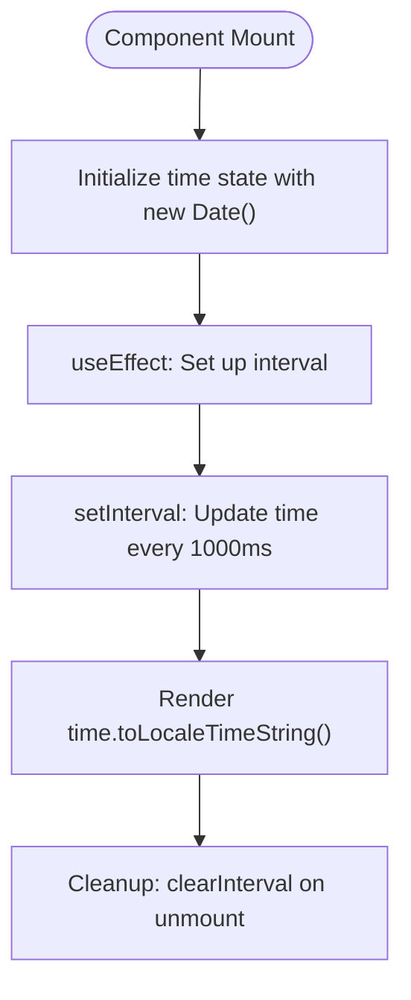
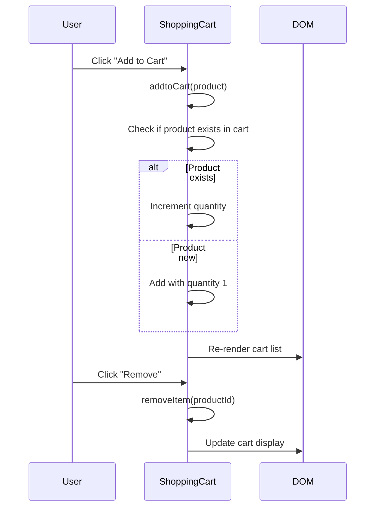
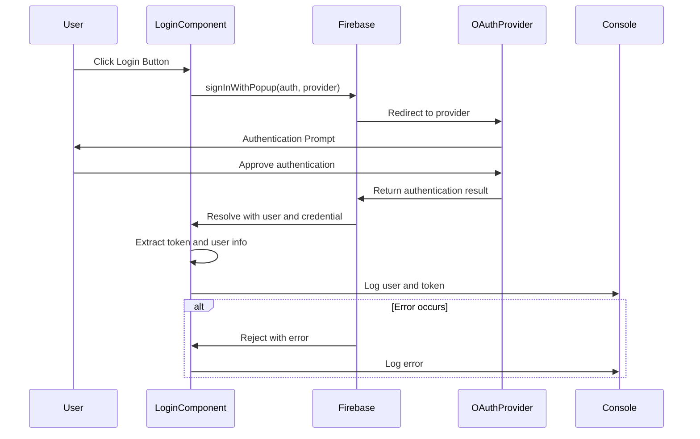
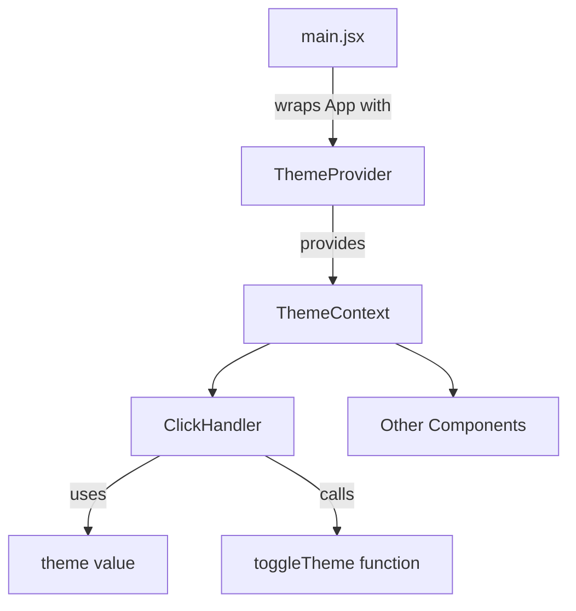

# UI Components

<cite>
**Referenced Files in This Document**   
- [Navbar.jsx](file://src/components/Navbar.jsx)
- [Navbar.css](file://src/components/CSS/Navbar.css)
- [AnalogClock.jsx](file://src/components/AnalogClock.jsx)
- [ThemeContext.jsx](file://src/components/ThemeContext.jsx)
- [ShoppingCart.jsx](file://src/components/ShoppingCart.jsx)
- [AddtoCart.css](file://src/components/AddtoCart.css)
- [Quiz.jsx](file://src/components/Quiz.jsx)
- [LoginWithGithub.jsx](file://src/components/LoginWithGithub.jsx)
- [LoginWithGoogle.jsx](file://src/components/LoginWithGoogle.jsx)
- [ClickHandler.jsx](file://src/components/ClickHandler.jsx)
- [Conditions.jsx](file://src/components/Conditions.jsx)
- [FetchItem.jsx](file://src/components/FetchItem.jsx)
- [FirebaseConfig.jsx](file://src/components/FirebaseConfig.jsx)
- [App.jsx](file://src/App.jsx)
- [main.jsx](file://src/main.jsx)
</cite>

## Table of Contents
1. [Introduction](#introduction)
2. [Core UI Components](#core-ui-components)
3. [Navigation and Layout](#navigation-and-layout)
4. [Interactive and Dynamic Components](#interactive-and-dynamic-components)
5. [Authentication Components](#authentication-components)
6. [State Management and Context Integration](#state-management-and-context-integration)
7. [Styling and Responsive Design](#styling-and-responsive-design)
8. [Component Integration and Routing](#component-integration-and-routing)
9. [Performance and Re-rendering Considerations](#performance-and-re-rendering-considerations)
10. [Accessibility and Theming Guidelines](#accessibility-and-theming-guidelines)
11. [Common Issues and Debugging Tips](#common-issues-and-debugging-tips)
12. [Conclusion](#conclusion)

## Introduction
The car-rental-frontend application features a modular component architecture built with React, emphasizing reusable UI elements, responsive design, and integration with external services like Firebase. This documentation provides a comprehensive overview of the UI components, detailing their visual appearance, behavior, user interaction patterns, and implementation strategies. Special focus is given to navigation, theming, authentication, and dynamic rendering patterns across components such as Navbar.jsx, AnalogClock.jsx, and ShoppingCart.jsx.

## Core UI Components

This section analyzes the primary UI components in the application, their structure, props, and interaction patterns.

### AnalogClock Component
The AnalogClock component (implemented as DigitalClock in code) renders a real-time digital clock interface that updates every second. Despite its name, it displays time in digital format rather than analog.

The component uses React's `useState` and `useEffect` hooks to manage and update the current time. On mount, an interval is set to refresh the time state every 1000 milliseconds. The cleanup function ensures the interval is cleared when the component unmounts, preventing memory leaks.

Visual appearance includes a large font size (45px) for the time display, with separate lines for the time, day, and year. The layout is minimalistic, using inline styles rather than external CSS.



**Diagram sources**
- [AnalogClock.jsx](file://src/components/AnalogClock.jsx#L1-L28)

**Section sources**
- [AnalogClock.jsx](file://src/components/AnalogClock.jsx#L1-L28)

### ShoppingCart Component
The ShoppingCart component implements a product listing and cart management system. It displays a list of products that users can add to a cart, view cart items, and remove items.

The component maintains cart state using `useState`, with functions to add items (checking for duplicates), remove items, and calculate total price. Products are defined as a static array within the component.

Visual styling is managed through AddtoCart.css, which defines responsive layouts, product cards, and cart item styling. The component uses conditional rendering to show "No items in the cart" when empty.



**Diagram sources**
- [ShoppingCart.jsx](file://src/components/ShoppingCart.jsx#L1-L75)
- [AddtoCart.css](file://src/components/AddtoCart.css#L1-L126)

**Section sources**
- [ShoppingCart.jsx](file://src/components/ShoppingCart.jsx#L1-L75)
- [AddtoCart.css](file://src/components/AddtoCart.css#L1-L126)

## Navigation and Layout

### Navbar Component
The Navbar component serves as the primary navigation interface, built with React Router for client-side routing. It features a responsive design with mobile menu toggle functionality.

Key visual elements include:
- A branded logo with a car icon (FaCar) and "CAR RENTAL" text
- Navigation links to various app features (Quiz App, Shopping Cart, Login options, etc.)
- Login and Sign Up buttons
- Mobile menu toggle using FaBars/FaTimes icons

The component uses React's `useState` to manage the mobile menu open/closed state. Click handlers manage menu toggling and navigation, with `closeMobileMenu` called after each navigation to collapse the mobile menu.

Styling is implemented in Navbar.css using CSS variables for theming, backdrop filters for glass-morphism effects, and flexbox for layout. The navbar is position: sticky for persistent visibility.

```mermaid
classDiagram
class Navbar {
+click : boolean
+handleClick() : void
+closeMobileMenu() : void
}
class Link {
+to : string
+onClick : function
}
class FaCar
class FaBars
class FaTimes
Navbar --> Link : "uses for navigation"
Navbar --> FaCar : "displays in logo"
Navbar --> FaBars : "mobile menu icon"
Navbar --> FaTimes : "close menu icon"
Navbar --> "CSS Variables" : "uses for theming"
```

**Diagram sources**
- [Navbar.jsx](file://src/components/Navbar.jsx#L1-L81)
- [Navbar.css](file://src/components/CSS/Navbar.css#L1-L164)

**Section sources**
- [Navbar.jsx](file://src/components/Navbar.jsx#L1-L81)
- [Navbar.css](file://src/components/CSS/Navbar.css#L1-L164)

## Interactive and Dynamic Components

### ClickHandler Component
The ClickHandler component demonstrates event handling and theme context integration. It features a clickable element that triggers an alert and a theme toggle button.

The component uses `useContext` to access the ThemeContext for dynamic theme switching. The theme affects the background color of a display area, showing real-time UI updates based on context changes.

Event handling includes inline onClick handlers and demonstrates closure usage in event callbacks.

**Section sources**
- [ClickHandler.jsx](file://src/components/ClickHandler.jsx#L1-L42)
- [ThemeContext.jsx](file://src/components/ThemeContext.jsx#L1-L14)

### Conditions Component
The Conditions component illustrates conditional rendering patterns in React. It demonstrates various approaches including ternary operators, logical && operators, and commented-out switch statements.

The component renders different UI elements based on user role properties (isAdmin, isEditor), showcasing component composition with Admin, Editor, and Guest sub-components.

**Section sources**
- [Conditions.jsx](file://src/components/Conditions.jsx#L1-L42)

### Quiz Component
The Quiz component implements a multi-question quiz interface with state management for current question, selected answers, and scoring.

Key features include:
- Array of question objects with text, answer options, and correct answers
- State variables for current question index, selected answer, score, and quiz completion
- Placeholder functions for answer selection, next question, and quiz completion

The UI displays one question at a time with clickable answer buttons that highlight the selected option.

**Section sources**
- [Quiz.jsx](file://src/components/Quiz.jsx#L1-L81)

## Authentication Components

### LoginWithGithub and LoginWithGoogle Components
These components implement social authentication using Firebase OAuth providers. Both follow the same pattern:

1. Import Firebase authentication modules
2. Create a provider instance (GithubAuthProvider or GoogleAuthProvider)
3. Implement an async login function using signInWithPopup
4. Handle success (logging user and token info) and error cases
5. Render a button that triggers the login flow

The components demonstrate proper error handling with try-catch blocks and provide feedback through console logging.



**Diagram sources**
- [LoginWithGithub.jsx](file://src/components/LoginWithGithub.jsx#L1-L35)
- [LoginWithGoogle.jsx](file://src/components/LoginWithGoogle.jsx#L1-L37)
- [FirebaseConfig.jsx](file://src/components/FirebaseConfig.jsx#L1-L26)

**Section sources**
- [LoginWithGithub.jsx](file://src/components/LoginWithGithub.jsx#L1-L35)
- [LoginWithGoogle.jsx](file://src/components/LoginWithGoogle.jsx#L1-L37)
- [FirebaseConfig.jsx](file://src/components/FirebaseConfig.jsx#L1-L26)

## State Management and Context Integration

### ThemeContext Implementation
The ThemeContext component provides a global theme state management solution using React Context API.

Key elements:
- ThemeContext created with `createContext()`
- ThemeProvider component that holds theme state ("light" or "dark") and toggle function
- Provider wraps the app in main.jsx, making theme available to all children

The context is consumed in components like ClickHandler using `useContext(ThemeContext)`.



**Diagram sources**
- [ThemeContext.jsx](file://src/components/ThemeContext.jsx#L1-L14)
- [main.jsx](file://src/main.jsx#L1-L13)
- [ClickHandler.jsx](file://src/components/ClickHandler.jsx#L1-L42)

**Section sources**
- [ThemeContext.jsx](file://src/components/ThemeContext.jsx#L1-L14)
- [main.jsx](file://src/main.jsx#L1-L13)

## Styling and Responsive Design

### CSS Architecture
The application uses component-specific CSS files for styling, following a modular approach:

- Navbar.css: Styles for navigation bar with responsive mobile menu
- AddtoCart.css: Styles for shopping cart interface with product cards and cart items
- Global styles in index.css and App.css

Key styling techniques:
- CSS variables in :root for theming
- Flexbox for layout (display: flex)
- Responsive design with media queries (mobile menu at max-width: 768px)
- Hover effects and transitions for interactive elements
- Glass-morphism effects using backdrop-filter and rgba backgrounds

The mobile menu uses a sliding animation with transform and transition properties, revealing the navigation links from the left when active.

**Section sources**
- [Navbar.css](file://src/components/CSS/Navbar.css#L1-L164)
- [AddtoCart.css](file://src/components/AddtoCart.css#L1-L126)
- [index.css](file://src/index.css)
- [App.css](file://src/App.css)

## Component Integration and Routing

### Application Routing Structure
The App.jsx file defines the routing structure using React Router, though currently commented out. The intended structure includes:

- Route for home page with welcome message
- Routes for each feature component (AddItem, CRUDoperation, etc.)
- Specific routes for authentication, shopping cart, and quiz functionality

The Navbar component contains corresponding Link elements that match these routes, creating a consistent navigation experience.

The main.jsx file sets up the root rendering with StrictMode and ThemeProvider, ensuring context availability throughout the app.

**Section sources**
- [App.jsx](file://src/App.jsx#L1-L53)
- [main.jsx](file://src/main.jsx#L1-L13)
- [Navbar.jsx](file://src/components/Navbar.jsx#L1-L81)

## Performance and Re-rendering Considerations

### State Management Patterns
The components use React's useState hook for local state management. Key considerations:

- ShoppingCart uses functional updates (`SetCart(prevCart => ...)`) to ensure access to latest state
- AnalogClock properly cleans up interval in useEffect return function
- FetchItem uses onSnapshot for real-time Firebase data updates with proper cleanup

Potential performance improvements:
- Memoization of expensive calculations (e.g., getTotalPrice in ShoppingCart)
- Use of useCallback for event handlers to prevent unnecessary re-renders
- Consideration of React.memo for child components

The current implementation may cause unnecessary re-renders when parent components update, as inline functions and objects are created on each render.

**Section sources**
- [AnalogClock.jsx](file://src/components/AnalogClock.jsx#L1-L28)
- [ShoppingCart.jsx](file://src/components/ShoppingCart.jsx#L1-L75)
- [FetchItem.jsx](file://src/components/FetchItem.jsx#L1-L106)

## Accessibility and Theming Guidelines

### Accessibility Features
Current accessibility considerations:
- Semantic HTML elements (nav, button, table)
- Keyboard navigable links and buttons
- Sufficient color contrast in light/dark themes
- Descriptive button text

Potential improvements:
- ARIA labels for interactive elements
- Focus management for mobile menu
- Screen reader support for dynamic content updates
- Keyboard navigation for quiz answers

### Theming System
The theming system allows users to toggle between light and dark modes:

- Theme state stored in ThemeContext
- ThemeProvider wraps the entire application
- Components consume theme via useContext
- Visual elements update based on theme value

The system could be extended to support:
- User preference persistence (localStorage)
- System preference detection (prefers-color-scheme)
- Additional theme variants
- Themed CSS custom properties

**Section sources**
- [ThemeContext.jsx](file://src/components/ThemeContext.jsx#L1-L14)
- [ClickHandler.jsx](file://src/components/ClickHandler.jsx#L1-L42)
- [main.jsx](file://src/main.jsx#L1-L13)

## Common Issues and Debugging Tips

### Style Scoping Issues
Potential issues:
- Global styles in AddtoCart.css affecting other components
- CSS specificity conflicts
- Reset styles (*) applied globally

Solutions:
- Use CSS modules or styled-components for better scoping
- Implement BEM naming convention
- Limit global styles to true resets

### Event Propagation Problems
Potential issues:
- Mobile menu closing when clicking links (prevented by closeMobileMenu calls)
- Event handling in nested components
- Memory leaks from unclosed intervals

Debugging tips:
- Use browser dev tools to inspect event listeners
- Check for missing cleanup functions in useEffect
- Verify event propagation with e.stopPropagation() when needed

### Firebase Integration Issues
Common problems:
- Authentication popup blocking
- Firestore permission errors
- Missing or incorrect firebaseConfig

Debugging approach:
- Check browser console for error messages
- Verify Firebase project configuration
- Test authentication flows in incognito mode

**Section sources**
- [Navbar.jsx](file://src/components/Navbar.jsx#L1-L81)
- [AnalogClock.jsx](file://src/components/AnalogClock.jsx#L1-L28)
- [FirebaseConfig.jsx](file://src/components/FirebaseConfig.jsx#L1-L26)

## Conclusion
The car-rental-frontend application demonstrates a well-structured React component architecture with clear separation of concerns. Key strengths include responsive navigation, modular component design, and integration with Firebase services. The theming system provides a foundation for user preference customization, while the routing structure enables feature-rich navigation. To enhance the application, consider improving accessibility, optimizing performance with memoization, and strengthening style encapsulation. The codebase provides a solid foundation for a car rental interface with extensible patterns for future development.