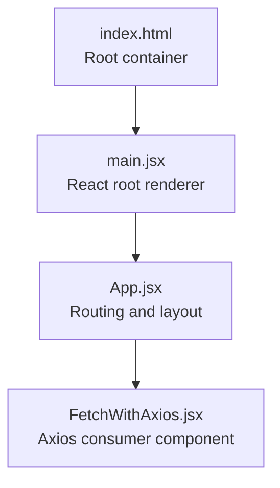
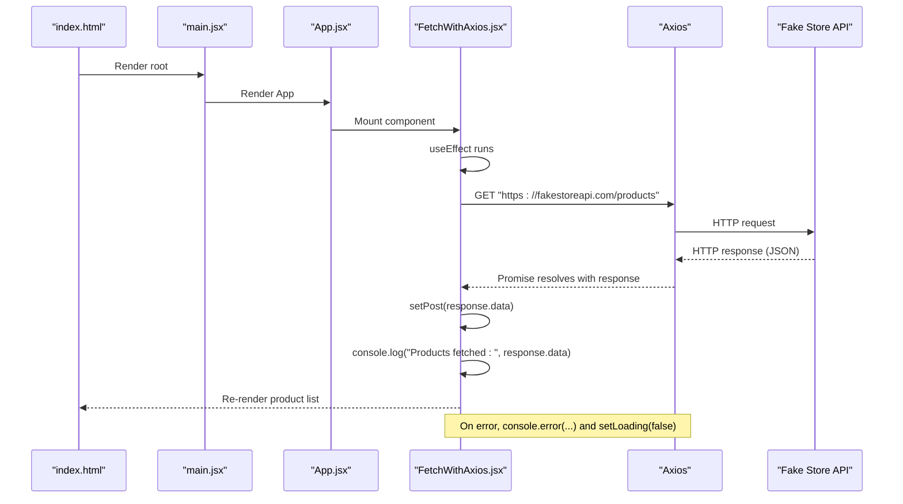
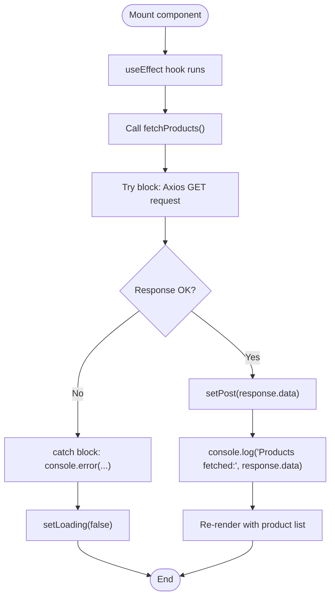
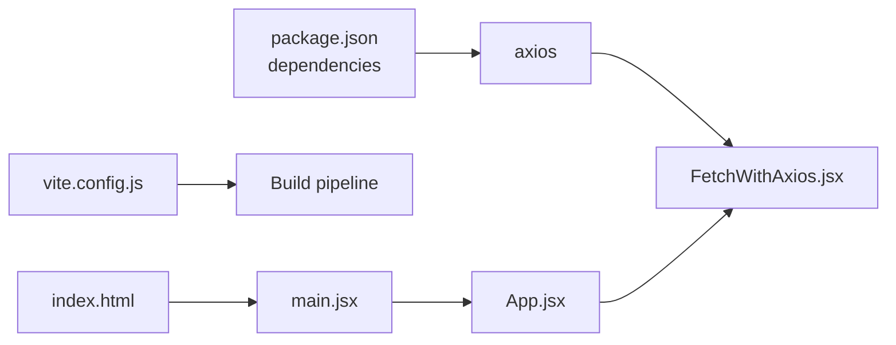

# Axios Integration

<cite>
**Referenced Files in This Document**
- [FetchWithAxios.jsx](file://src/components/FetchWithAxios.jsx)
- [App.jsx](file://src/App.jsx)
- [main.jsx](file://src/main.jsx)
- [package.json](file://package.json)
- [index.html](file://index.html)
- [vite.config.js](file://vite.config.js)
</cite>

## Table of Contents
1. [Introduction](#introduction)
2. [Project Structure](#project-structure)
3. [Core Components](#core-components)
4. [Architecture Overview](#architecture-overview)
5. [Detailed Component Analysis](#detailed-component-analysis)
6. [Dependency Analysis](#dependency-analysis)
7. [Performance Considerations](#performance-considerations)
8. [Troubleshooting Guide](#troubleshooting-guide)
9. [Conclusion](#conclusion)
10. [Appendices](#appendices)

## Introduction
This document explains how the Axios integration in FetchWithAxios.jsx consumes RESTful data from the external Fake Store API. It focuses on the asynchronous fetchProducts function performing a GET request to the endpoint, how component state is managed with useState and useEffect, and how Axios simplifies promise handling, automatic JSON parsing, and structured error responses. It also highlights practical examples from the code (response.data access, error logging, and rendering product title, price, and image), and discusses common issues such as network errors, incorrect loading state initialization, and CORS considerations. Finally, it outlines best practices for abstracting Axios calls into services, adding interceptors, and managing API endpoints in environment variables.

## Project Structure
The Axios integration is implemented in a single functional component that is rendered by the application’s root entry point. The component is included in the routing configuration and mounted by the React root renderer.

**Diagram sources**
- [index.html](file://index.html#L1-L13)
- [main.jsx](file://src/main.jsx#L1-L13)
- [App.jsx](file://src/App.jsx#L1-L56)
- [FetchWithAxios.jsx](file://src/components/FetchWithAxios.jsx#L1-L42)

**Section sources**
- [index.html](file://index.html#L1-L13)
- [main.jsx](file://src/main.jsx#L1-L13)
- [App.jsx](file://src/App.jsx#L1-L56)
- [FetchWithAxios.jsx](file://src/components/FetchWithAxios.jsx#L1-L42)

## Core Components
- FetchWithAxios.jsx: Implements the Axios GET request to the Fake Store API, manages component state, and renders product data.
- App.jsx: Declares the route for the Axios component.
- main.jsx: Mounts the application and renders the root component.
- package.json: Declares Axios as a runtime dependency.

Key implementation references:
- Axios import and GET request: [FetchWithAxios.jsx](file://src/components/FetchWithAxios.jsx#L1-L20)
- State management with useState: [FetchWithAxios.jsx](file://src/components/FetchWithAxios.jsx#L5-L7)
- useEffect trigger on mount: [FetchWithAxios.jsx](file://src/components/FetchWithAxios.jsx#L18-L20)
- Rendering product fields (title, price, image): [FetchWithAxios.jsx](file://src/components/FetchWithAxios.jsx#L26-L35)
- Axios dependency declaration: [package.json](file://package.json#L12-L19)

**Section sources**
- [FetchWithAxios.jsx](file://src/components/FetchWithAxios.jsx#L1-L42)
- [App.jsx](file://src/App.jsx#L1-L56)
- [main.jsx](file://src/main.jsx#L1-L13)
- [package.json](file://package.json#L12-L19)

## Architecture Overview
The component follows a straightforward data-fetching pattern:
- On mount, useEffect triggers fetchProducts.
- fetchProducts uses Axios to perform a GET request to the Fake Store API.
- On success, response.data is stored in state and logged to the console.
- On failure, the error is logged to the console and the loading state is updated.
- The component re-renders to display product cards with title, price, and image.

**Diagram sources**
- [index.html](file://index.html#L1-L13)
- [main.jsx](file://src/main.jsx#L1-L13)
- [App.jsx](file://src/App.jsx#L1-L56)
- [FetchWithAxios.jsx](file://src/components/FetchWithAxios.jsx#L1-L42)

## Detailed Component Analysis

### FetchWithAxios.jsx: Axios Consumer
- Imports:
  - React hooks: useEffect, useState
  - Axios library
- State:
  - post: array to hold product data
  - loading: array initialized for loading state (see Troubleshooting)
- fetchProducts:
  - Performs an async GET request to the Fake Store API endpoint
  - On success: sets post to response.data, logs the fetched data
  - On error: logs the error and sets loading to false
- useEffect:
  - Invokes fetchProducts on component mount
- Rendering:
  - Maps over post to render product title, price, and image

**Diagram sources**
- [FetchWithAxios.jsx](file://src/components/FetchWithAxios.jsx#L1-L42)

**Section sources**
- [FetchWithAxios.jsx](file://src/components/FetchWithAxios.jsx#L1-L42)

### Axios-Specific Benefits Observed in Practice
- Simplified promise handling:
  - Uses async/await for readable request flow
  - No manual .then/.catch chaining in this component
- Automatic JSON parsing:
  - response.data provides parsed JavaScript objects directly
- Structured error responses:
  - Errors are caught and logged; loading state can be updated accordingly

Concrete examples from the code:
- Accessing response.data: [FetchWithAxios.jsx](file://src/components/FetchWithAxios.jsx#L10-L12)
- Error logging: [FetchWithAxios.jsx](file://src/components/FetchWithAxios.jsx#L13-L15)
- Rendering product fields:
  - Title: [FetchWithAxios.jsx](file://src/components/FetchWithAxios.jsx#L29)
  - Price: [FetchWithAxios.jsx](file://src/components/FetchWithAxios.jsx#L30)
  - Image: [FetchWithAxios.jsx](file://src/components/FetchWithAxios.jsx#L31)

**Section sources**
- [FetchWithAxios.jsx](file://src/components/FetchWithAxios.jsx#L1-L42)

### Best Practices for Axios Integration
- Abstract Axios calls into a service module:
  - Move the GET request to a dedicated service file (e.g., api/products.js) to centralize endpoint logic and reduce duplication across components.
- Add interceptors:
  - Global request/response interceptors can standardize headers, authentication tokens, and error handling.
- Manage API endpoints in environment variables:
  - Define the base URL in environment variables (e.g., VITE_API_BASE_URL) and reference it in the service module.
- Centralize configuration:
  - Create a shared Axios instance with defaults (timeout, headers) and reuse it across the app.

[No sources needed since this section provides general guidance]

## Dependency Analysis
- Runtime dependencies:
  - Axios is declared in package.json and imported in the component
- Build-time dependencies:
  - Vite plugin for React is configured in vite.config.js
- Application bootstrap:
  - index.html provides the root container
  - main.jsx mounts the React root and wraps the app in theme provider
  - App.jsx defines routes and includes the Axios component route

**Diagram sources**
- [package.json](file://package.json#L12-L19)
- [vite.config.js](file://vite.config.js#L1-L8)
- [index.html](file://index.html#L1-L13)
- [main.jsx](file://src/main.jsx#L1-L13)
- [App.jsx](file://src/App.jsx#L1-L56)
- [FetchWithAxios.jsx](file://src/components/FetchWithAxios.jsx#L1-L42)

**Section sources**
- [package.json](file://package.json#L12-L19)
- [vite.config.js](file://vite.config.js#L1-L8)
- [index.html](file://index.html#L1-L13)
- [main.jsx](file://src/main.jsx#L1-L13)
- [App.jsx](file://src/App.jsx#L1-L56)
- [FetchWithAxios.jsx](file://src/components/FetchWithAxios.jsx#L1-L42)

## Performance Considerations
- Network latency and retries:
  - Consider adding retry logic or exponential backoff for transient failures.
- Caching:
  - Implement caching strategies (e.g., in-memory cache or localStorage) to avoid repeated requests for the same data.
- Loading indicators:
  - Improve UX by setting loading to a boolean flag and rendering a spinner while data is being fetched.
- Pagination:
  - If the API supports pagination, fetch data incrementally to reduce initial payload size.

[No sources needed since this section provides general guidance]

## Troubleshooting Guide
Common issues and resolutions observed in the component:

- Network errors:
  - Symptom: Errors logged to the console during fetch.
  - Resolution: Ensure the endpoint is reachable and handle errors gracefully by updating state and displaying user-friendly messages.

- Incorrect loading state initialization:
  - Symptom: loading is initialized as an array instead of a boolean.
  - Impact: Setting loading to false may not behave as expected because arrays are truthy in JavaScript.
  - Resolution: Initialize loading as a boolean (true/false) and toggle it appropriately during fetch lifecycle.

- Potential CORS considerations:
  - Symptom: Cross-origin request failures when calling external APIs.
  - Resolution: Verify that the API allows cross-origin requests from your origin. For development, consider using a proxy or enabling CORS on the server if you control it.

- Rendering issues:
  - Symptom: Images failing to load or empty fields.
  - Resolution: Validate that the response contains the expected fields (title, price, image). Add defensive checks and fallbacks for missing data.

- Route integration:
  - Symptom: Component not visible in the UI.
  - Resolution: Confirm that the route for the Axios component is defined and active in the routing configuration.

Concrete references:
- Error logging and loading state update: [FetchWithAxios.jsx](file://src/components/FetchWithAxios.jsx#L13-L16)
- Loading state initialization as an array: [FetchWithAxios.jsx](file://src/components/FetchWithAxios.jsx#L5-L7)
- Rendering product fields: [FetchWithAxios.jsx](file://src/components/FetchWithAxios.jsx#L26-L35)
- Route inclusion: [App.jsx](file://src/App.jsx#L37-L39)

**Section sources**
- [FetchWithAxios.jsx](file://src/components/FetchWithAxios.jsx#L1-L42)
- [App.jsx](file://src/App.jsx#L1-L56)

## Conclusion
FetchWithAxios.jsx demonstrates a clean, minimal Axios integration for consuming RESTful data from the Fake Store API. It showcases async/await usage, automatic JSON parsing via response.data, and structured error handling. While the component is straightforward, improvements such as correcting the loading state initialization, adding robust error handling, and abstracting Axios calls into a service would enhance maintainability and reliability. Adopting environment variables for endpoints, adding interceptors, and implementing caching and loading indicators would further elevate the integration quality.

[No sources needed since this section summarizes without analyzing specific files]

## Appendices

### Appendix A: How to Run and Verify
- Start the development server using the configured Vite script.
- Open the browser and navigate to the route that renders the Axios component.
- Observe the console logs for successful fetch and any error logs.
- Verify that product cards render with title, price, and image.

**Section sources**
- [package.json](file://package.json#L1-L31)
- [vite.config.js](file://vite.config.js#L1-L8)
- [index.html](file://index.html#L1-L13)
- [main.jsx](file://src/main.jsx#L1-L13)
- [App.jsx](file://src/App.jsx#L1-L56)
- [FetchWithAxios.jsx](file://src/components/FetchWithAxios.jsx#L1-L42)