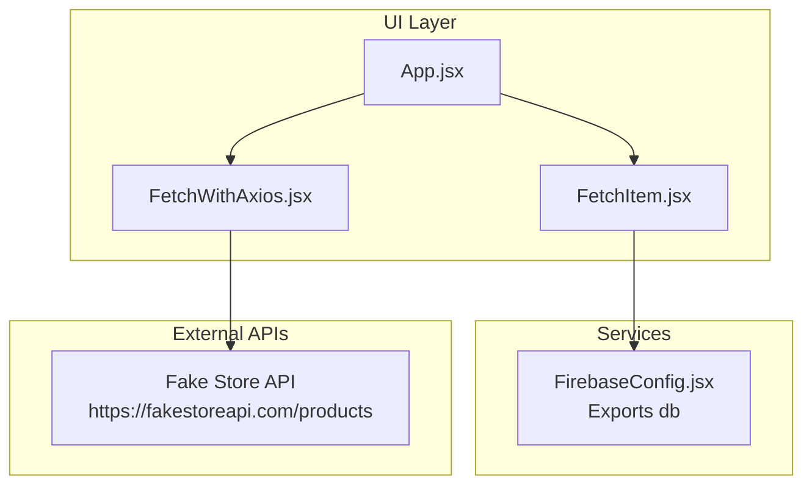
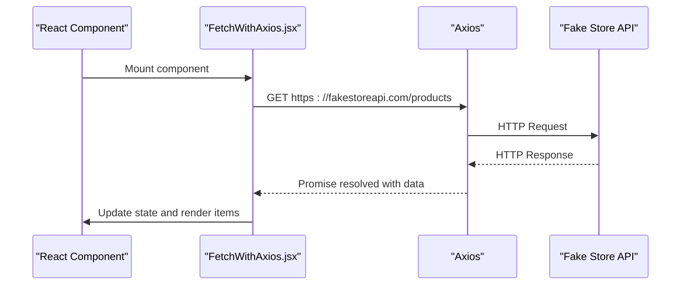
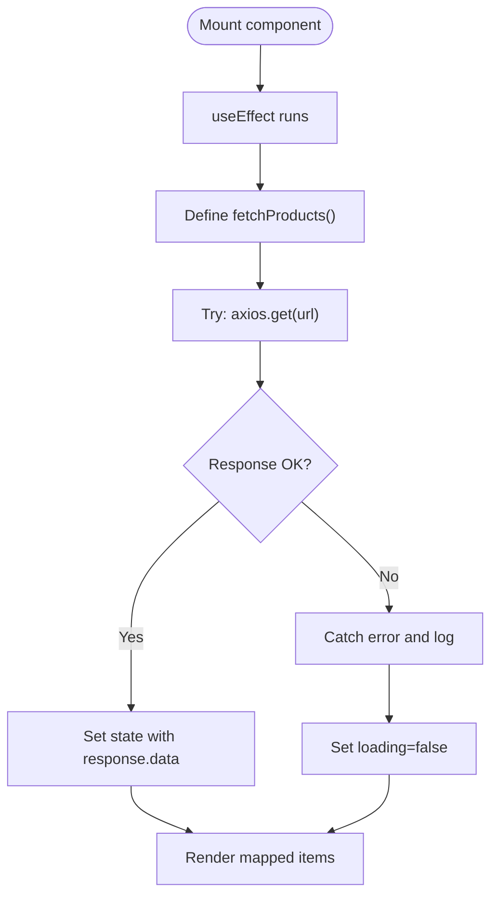
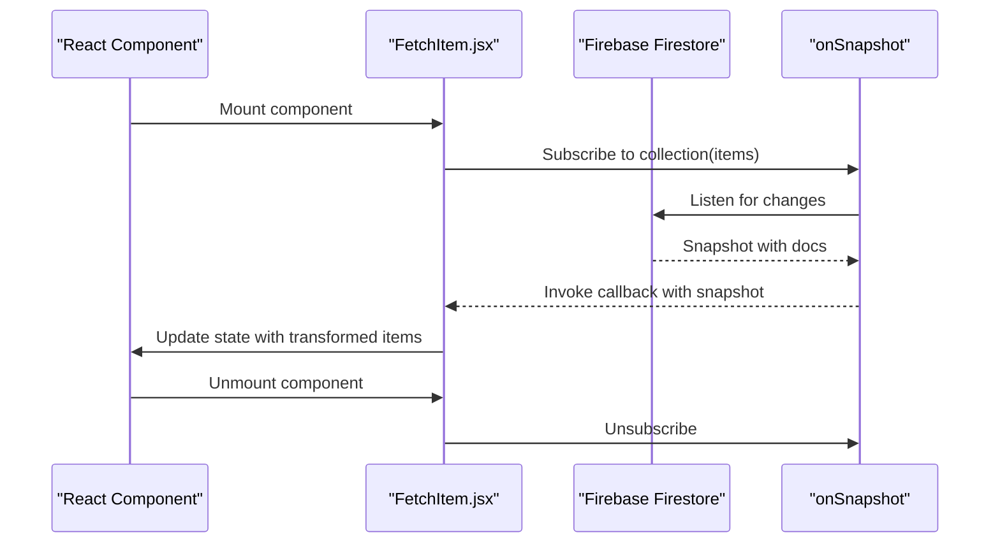
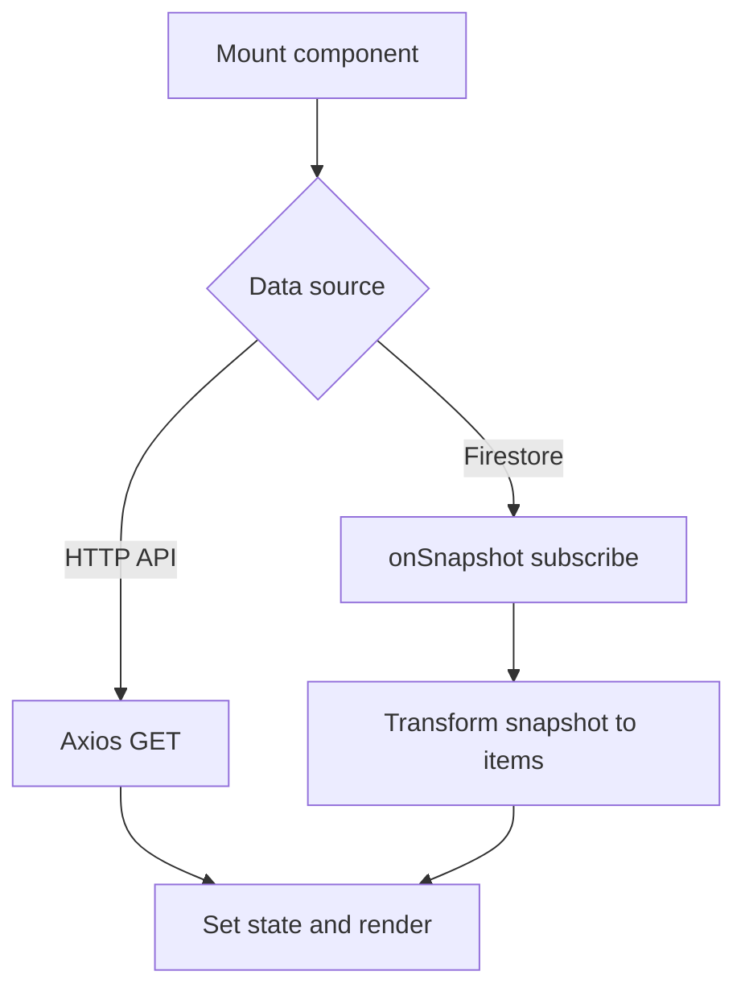
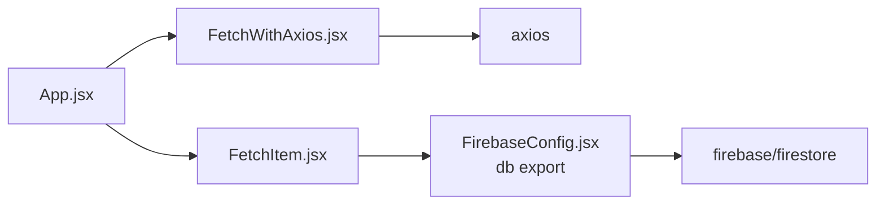

# Data Fetching

<cite>
**Referenced Files in This Document**
- [FetchWithAxios.jsx](file://src/components/FetchWithAxios.jsx)
- [FetchItem.jsx](file://src/components/FetchItem.jsx)
- [FirebaseConfig.jsx](file://src/components/FirebaseConfig.jsx)
- [App.jsx](file://src/App.jsx)
- [main.jsx](file://src/main.jsx)
- [package.json](file://package.json)
</cite>

## Table of Contents
1. [Introduction](#introduction)
2. [Project Structure](#project-structure)
3. [Core Components](#core-components)
4. [Architecture Overview](#architecture-overview)
5. [Detailed Component Analysis](#detailed-component-analysis)
6. [Dependency Analysis](#dependency-analysis)
7. [Performance Considerations](#performance-considerations)
8. [Troubleshooting Guide](#troubleshooting-guide)
9. [Conclusion](#conclusion)

## Introduction
This document explains the data fetching mechanisms in the car-rental-frontend application, focusing on two distinct approaches:
- Native Fetch API via React’s useEffect lifecycle in a Firebase-backed component
- Axios library usage inside a dedicated component for remote API calls

It compares syntax differences, error handling approaches, and response processing patterns. It also documents configuration options (headers, request parameters, timeouts), lifecycle integration with useEffect, common issues (CORS, network failures, loading states), and performance optimization techniques (request cancellation, caching, retries). Finally, it outlines best practices for abstracting data fetching into custom hooks or service layers.

## Project Structure
The application is a React + Vite project with a small set of components demonstrating different data fetching strategies. The relevant files for this document are:
- FetchWithAxios.jsx: Demonstrates Axios-based GET requests and basic error logging
- FetchItem.jsx: Uses Firebase Firestore onSnapshot for real-time data updates
- FirebaseConfig.jsx: Initializes Firebase and exports the Firestore database instance
- App.jsx: Imports and routes to the data-fetching components
- main.jsx: Renders the application tree
- package.json: Declares axios and Firebase dependencies

**Diagram sources**
- [App.jsx](file://src/App.jsx#L1-L53)
- [FetchWithAxios.jsx](file://src/components/FetchWithAxios.jsx#L1-L42)
- [FetchItem.jsx](file://src/components/FetchItem.jsx#L1-L106)
- [FirebaseConfig.jsx](file://src/components/FirebaseConfig.jsx#L1-L26)

**Section sources**
- [App.jsx](file://src/App.jsx#L1-L53)
- [main.jsx](file://src/main.jsx#L1-L13)
- [package.json](file://package.json#L1-L32)

## Core Components
- FetchWithAxios.jsx
  - Purpose: Fetches product data from a remote API using Axios and renders a list of items.
  - Lifecycle: Uses useEffect with an empty dependency array to fetch on mount.
  - Error handling: Catches errors and logs them; sets a loading flag in the catch block.
  - Response processing: Stores the response payload into state and maps over it to render.
  - Configuration: Uses axios.get with a URL; no explicit headers or timeout configured in the component.
- FetchItem.jsx
  - Purpose: Subscribes to Firestore collection updates using onSnapshot and displays items.
  - Lifecycle: Uses useEffect with an empty dependency array to subscribe on mount; returns an unsubscribe function to clean up.
  - Error handling: Catches errors during delete/update operations and logs them.
  - Response processing: Transforms snapshot docs into an array of items with ids and data.
  - Configuration: Uses Firebase Firestore; no external HTTP client configuration here.

**Section sources**
- [FetchWithAxios.jsx](file://src/components/FetchWithAxios.jsx#L1-L42)
- [FetchItem.jsx](file://src/components/FetchItem.jsx#L1-L106)
- [FirebaseConfig.jsx](file://src/components/FirebaseConfig.jsx#L1-L26)

## Architecture Overview
The application demonstrates two complementary data fetching strategies:
- Remote HTTP API via Axios (external REST endpoint)
- Real-time Firestore subscription via onSnapshot (local backend abstraction)

**Diagram sources**
- [FetchWithAxios.jsx](file://src/components/FetchWithAxios.jsx#L1-L42)

## Detailed Component Analysis

### FetchWithAxios.jsx: Axios-based GET Requests
- Lifecycle integration
  - useEffect runs once on mount to trigger data fetch.
  - fetchProducts is an async function that performs the GET request.
- Syntax differences vs native fetch
  - Axios returns a promise resolved with a response object containing data, status, headers, etc.
  - Native fetch returns a Response object requiring manual .json() parsing.
- Error handling
  - Try/catch around axios.get; logs error and sets loading state.
  - Consider adding explicit checks for response.ok and structured error messages.
- Response processing
  - Assigns response.data to state and maps over it to render.
- Configuration options
  - Headers: Not configured in component; can be added via axios.defaults or per-request config.
  - Request parameters: Not used in component; can pass params via axios.get(url, { params }).
  - Timeout: Not configured in component; can set via axios.get(url, { timeout }) or defaults.
- Practical examples
  - GET request: axios.get('https://fakestoreapi.com/products')
  - Loading state: useState([]) and setting false in catch block
  - Data display: map over items to render title, price, image

**Diagram sources**
- [FetchWithAxios.jsx](file://src/components/FetchWithAxios.jsx#L1-L42)

**Section sources**
- [FetchWithAxios.jsx](file://src/components/FetchWithAxios.jsx#L1-L42)

### FetchItem.jsx: Firestore onSnapshot Subscription
- Lifecycle integration
  - useEffect subscribes to collection updates on mount.
  - Returns an unsubscribe function to tear down the listener on unmount.
- Syntax differences vs HTTP clients
  - No HTTP request; uses Firestore SDK to subscribe to real-time updates.
  - Snapshot-based data transformation: snapshot.docs -> array of items with ids and data.
- Error handling
  - Catches errors during delete/update operations and logs them.
- Response processing
  - Maps snapshot docs to include id and data for rendering.
- Configuration options
  - No HTTP headers or timeouts; Firestore configuration is centralized in FirebaseConfig.jsx.

**Diagram sources**
- [FetchItem.jsx](file://src/components/FetchItem.jsx#L1-L106)
- [FirebaseConfig.jsx](file://src/components/FirebaseConfig.jsx#L1-L26)

**Section sources**
- [FetchItem.jsx](file://src/components/FetchItem.jsx#L1-L106)
- [FirebaseConfig.jsx](file://src/components/FirebaseConfig.jsx#L1-L26)

### Conceptual Overview
- Both components demonstrate useEffect-driven data fetching on mount.
- FetchWithAxios focuses on remote HTTP GET requests and basic error logging.
- FetchItem focuses on real-time Firestore subscriptions and CRUD operations.

[No sources needed since this diagram shows conceptual workflow, not actual code structure]

## Dependency Analysis
- External libraries
  - axios: Used by FetchWithAxios.jsx for HTTP requests.
  - firebase/firestore: Used by FetchItem.jsx and FirebaseConfig.jsx for real-time data.
- Internal dependencies
  - FetchItem.jsx imports db from FirebaseConfig.jsx.
  - App.jsx imports both components and routes to them.

**Diagram sources**
- [FetchWithAxios.jsx](file://src/components/FetchWithAxios.jsx#L1-L42)
- [FetchItem.jsx](file://src/components/FetchItem.jsx#L1-L106)
- [FirebaseConfig.jsx](file://src/components/FirebaseConfig.jsx#L1-L26)
- [App.jsx](file://src/App.jsx#L1-L53)
- [package.json](file://package.json#L1-L32)

**Section sources**
- [package.json](file://package.json#L1-L32)
- [App.jsx](file://src/App.jsx#L1-L53)

## Performance Considerations
- Request cancellation
  - Axios: Use CancelTokenSource to cancel in-flight requests on unmount or route change.
  - Native fetch: Use AbortController to abort fetch requests.
- Caching strategies
  - Axios: Configure interceptors to cache responses keyed by URL and ETag/Last-Modified.
  - Firestore: onSnapshot maintains local cache; consider offline persistence in Firebase initialization.
- Error retry mechanisms
  - Axios: Implement exponential backoff with retry counts; configure defaults for retries.
  - Native fetch: Wrap fetch in a retry function with delays.
- Loading state management
  - Normalize loading state across components (e.g., boolean flag) and ensure cleanup on unmount.
- Network failure handling
  - Distinguish transient vs permanent errors; surface user-friendly messages.
- CORS
  - Axios and fetch both rely on server-side CORS configuration; ensure the remote API allows requests from your origin.

[No sources needed since this section provides general guidance]

## Troubleshooting Guide
- CORS errors
  - Symptom: Preflight or blocked request in browser console/network tab.
  - Resolution: Configure the remote API to accept requests from your origin; verify Access-Control-Allow-Origin header.
- Network failures
  - Symptom: Uncaught exceptions in try/catch blocks; loading state remains true.
  - Resolution: Ensure catch blocks set loading=false and display user feedback; add retry logic.
- Loading state management
  - Issue: Loading state not reset on error.
  - Fix: Explicitly set loading=false in catch blocks; reset loading=true before each request.
- Firestore subscription leaks
  - Issue: Memory leaks or duplicate listeners.
  - Fix: Always return unsubscribe in useEffect cleanup; ensure subscription is torn down on unmount.
- Axios configuration pitfalls
  - Issue: Missing headers or timeouts causing unexpected behavior.
  - Fix: Set axios defaults or per-request config; define global headers and timeout consistently.

**Section sources**
- [FetchWithAxios.jsx](file://src/components/FetchWithAxios.jsx#L1-L42)
- [FetchItem.jsx](file://src/components/FetchItem.jsx#L1-L106)

## Conclusion
The car-rental-frontend showcases two complementary data fetching patterns:
- Axios-based HTTP GET requests for remote APIs with straightforward lifecycle integration and error logging.
- Firestore onSnapshot for real-time, reactive data updates with automatic subscription cleanup.

For production-grade applications, augment these patterns with request cancellation, caching, robust retry logic, and normalized loading/error states. Abstract shared logic into custom hooks or service layers to improve maintainability and reusability.