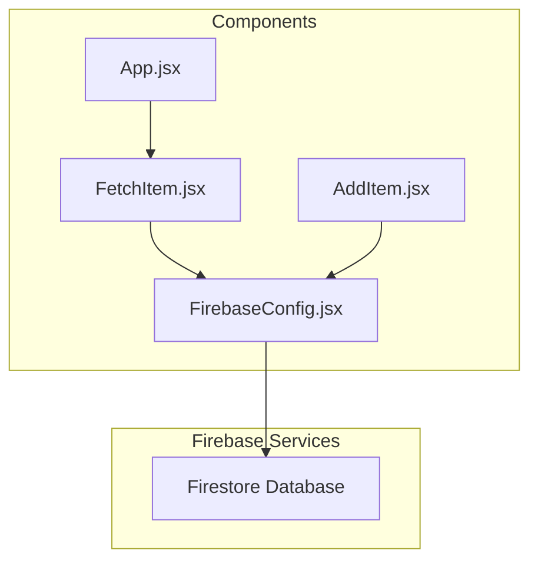
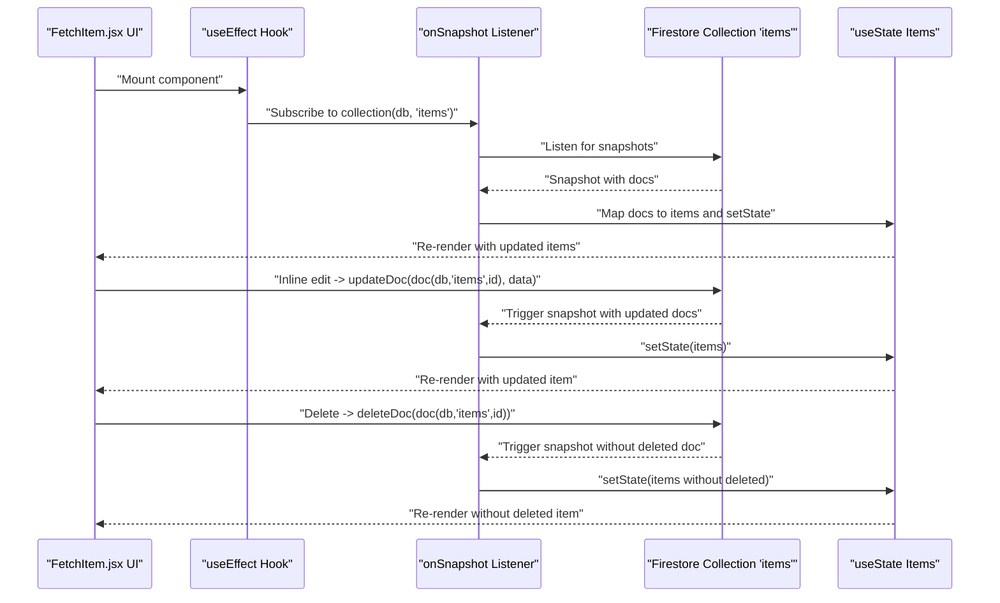
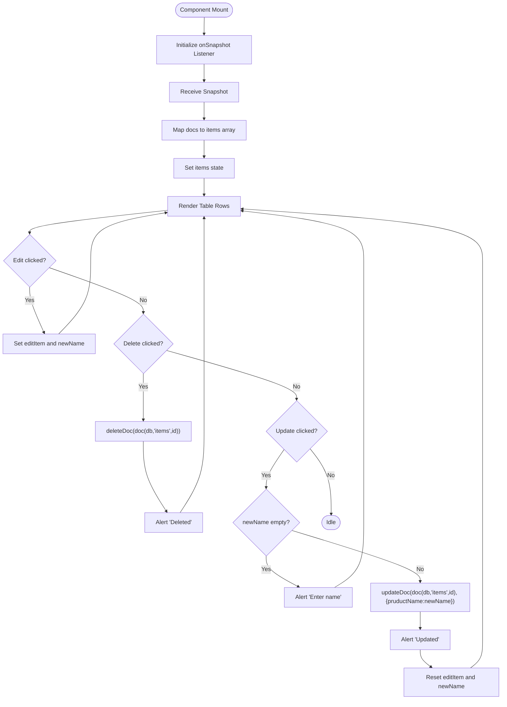
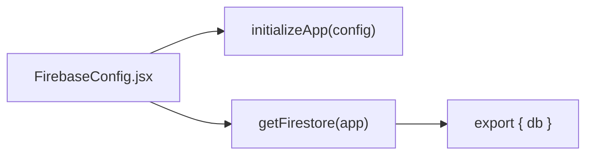
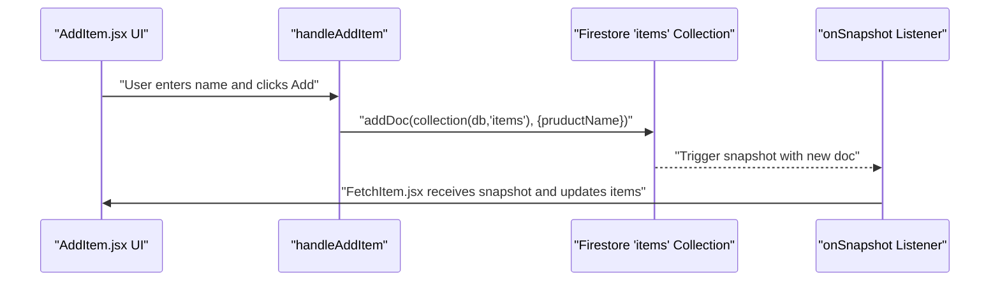
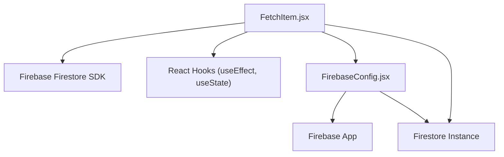

# Fetch API Implementation

<cite>
**Referenced Files in This Document**
- [FetchItem.jsx](file://src/components/FetchItem.jsx)
- [FirebaseConfig.jsx](file://src/components/FirebaseConfig.jsx)
- [AddItem.jsx](file://src/components/AddItem.jsx)
- [App.jsx](file://src/App.jsx)
</cite>

## Table of Contents
1. [Introduction](#introduction)
2. [Project Structure](#project-structure)
3. [Core Components](#core-components)
4. [Architecture Overview](#architecture-overview)
5. [Detailed Component Analysis](#detailed-component-analysis)
6. [Dependency Analysis](#dependency-analysis)
7. [Performance Considerations](#performance-considerations)
8. [Troubleshooting Guide](#troubleshooting-guide)
9. [Conclusion](#conclusion)

## Introduction
This document explains the Fetch API implementation in FetchItem.jsx, focusing on its integration with Firebase Firestore via the onSnapshot listener from the Firebase SDK. It clarifies how real-time data synchronization is achieved using Firestore’s real-time updates instead of traditional HTTP polling. The document details the use of useEffect for initializing the listener and proper cleanup via unsubscribe to prevent memory leaks. It also covers the state management pattern using useState for items, edit mode, and form input, and provides concrete examples from the code for data retrieval, inline editing of product names, update operations via updateDoc, and deletion using deleteDoc. Finally, it addresses common issues such as error handling in Firebase operations, validation before updates, and alert-based user feedback, along with best practices for structuring Firestore-connected components and optimizing re-renders.

## Project Structure
FetchItem.jsx is part of the components directory and integrates with FirebaseConfig.jsx to access the Firestore database. The component is rendered within the application via App.jsx. Related components demonstrate complementary Firestore operations such as adding items.

**Diagram sources**
- [FetchItem.jsx](file://src/components/FetchItem.jsx#L1-L106)
- [FirebaseConfig.jsx](file://src/components/FirebaseConfig.jsx#L1-L26)
- [AddItem.jsx](file://src/components/AddItem.jsx#L1-L37)
- [App.jsx](file://src/App.jsx#L1-L56)

**Section sources**
- [FetchItem.jsx](file://src/components/FetchItem.jsx#L1-L106)
- [FirebaseConfig.jsx](file://src/components/FirebaseConfig.jsx#L1-L26)
- [AddItem.jsx](file://src/components/AddItem.jsx#L1-L37)
- [App.jsx](file://src/App.jsx#L1-L56)

## Core Components
- FetchItem.jsx: Implements real-time data synchronization using Firestore’s onSnapshot listener, manages state for items, edit mode, and input, and provides inline editing and deletion capabilities.
- FirebaseConfig.jsx: Initializes Firebase and exports the Firestore database instance used by components.
- AddItem.jsx: Demonstrates adding new documents to the Firestore collection, complementing FetchItem.jsx’s real-time updates.
- App.jsx: Integrates FetchItem.jsx into the application routing.

Key responsibilities:
- Real-time synchronization: onSnapshot listener in FetchItem.jsx.
- State management: useState for items, edit mode, and input.
- CRUD operations: inline editing and deletion in FetchItem.jsx; add operation in AddItem.jsx.
- Cleanup: useEffect cleanup returning unsubscribe in FetchItem.jsx.

**Section sources**
- [FetchItem.jsx](file://src/components/FetchItem.jsx#L1-L106)
- [FirebaseConfig.jsx](file://src/components/FirebaseConfig.jsx#L1-L26)
- [AddItem.jsx](file://src/components/AddItem.jsx#L1-L37)
- [App.jsx](file://src/App.jsx#L1-L56)

## Architecture Overview
The component architecture centers around Firestore’s real-time capabilities. FetchItem.jsx subscribes to changes in the “items” collection and updates local state automatically. Inline editing and deletion are performed using Firestore SDK methods, while the database instance is provided by FirebaseConfig.jsx.

**Diagram sources**
- [FetchItem.jsx](file://src/components/FetchItem.jsx#L1-L106)
- [FirebaseConfig.jsx](file://src/components/FirebaseConfig.jsx#L1-L26)

## Detailed Component Analysis

### FetchItem.jsx: Real-Time Synchronization and State Management
- Real-time synchronization:
  - Uses onSnapshot(collection(db, "items"), ...) to subscribe to real-time updates.
  - Processes snapshot.docs to build an array of items with id and data.
  - Updates state with SetItems to reflect Firestore changes immediately.
- Cleanup:
  - Returns unsubscribe() in useEffect cleanup to prevent memory leaks when the component unmounts.
- State management:
  - items: Array of Firestore documents mapped to plain objects.
  - editItem: Tracks the id of the item currently in edit mode.
  - newName: Controlled input value for inline editing.
- Inline editing:
  - handleEditClick sets editItem and newName to the selected item’s values.
  - handleUpdate validates newName, then calls updateDoc to persist changes.
  - After successful update, resets editItem and newName and alerts the user.
- Deletion:
  - handleDelete calls deleteDoc with a document reference and alerts the user upon success.
- Rendering:
  - Displays items in a table with Edit/Update/Delete actions.
  - Switches between static name and an input field when editItem matches the row id.

**Diagram sources**
- [FetchItem.jsx](file://src/components/FetchItem.jsx#L1-L106)

**Section sources**
- [FetchItem.jsx](file://src/components/FetchItem.jsx#L1-L106)

### FirebaseConfig.jsx: Database Initialization
- Initializes Firebase app and exports Firestore database instance.
- Provides db to components for Firestore operations.

**Diagram sources**
- [FirebaseConfig.jsx](file://src/components/FirebaseConfig.jsx#L1-L26)

**Section sources**
- [FirebaseConfig.jsx](file://src/components/FirebaseConfig.jsx#L1-L26)

### AddItem.jsx: Complementary Firestore Add Operation
- Adds new documents to the “items” collection using addDoc.
- Resets input after successful addition.

**Diagram sources**
- [AddItem.jsx](file://src/components/AddItem.jsx#L1-L37)
- [FetchItem.jsx](file://src/components/FetchItem.jsx#L1-L106)
- [FirebaseConfig.jsx](file://src/components/FirebaseConfig.jsx#L1-L26)

**Section sources**
- [AddItem.jsx](file://src/components/AddItem.jsx#L1-L37)
- [FetchItem.jsx](file://src/components/FetchItem.jsx#L1-L106)
- [FirebaseConfig.jsx](file://src/components/FirebaseConfig.jsx#L1-L26)

### App.jsx: Component Integration
- Imports and renders FetchItem.jsx within the application layout.
- Routing is present but commented out; FetchItem.jsx is currently rendered directly.

**Section sources**
- [App.jsx](file://src/App.jsx#L1-L56)

## Dependency Analysis
- FetchItem.jsx depends on:
  - Firebase Firestore SDK methods: collection, doc, onSnapshot, updateDoc, deleteDoc.
  - React hooks: useEffect, useState.
  - FirebaseConfig.jsx for the db instance.
- FirebaseConfig.jsx depends on:
  - Firebase app initialization and Firestore service export.

**Diagram sources**
- [FetchItem.jsx](file://src/components/FetchItem.jsx#L1-L106)
- [FirebaseConfig.jsx](file://src/components/FirebaseConfig.jsx#L1-L26)

**Section sources**
- [FetchItem.jsx](file://src/components/FetchItem.jsx#L1-L106)
- [FirebaseConfig.jsx](file://src/components/FirebaseConfig.jsx#L1-L26)

## Performance Considerations
- Real-time listeners:
  - onSnapshot triggers re-renders on every change; keep UI lightweight and avoid unnecessary computations inside render loops.
- State updates:
  - Use minimal state updates; the component already maps snapshot docs to items efficiently.
- Cleanup:
  - Always return unsubscribe in useEffect to prevent memory leaks and redundant listeners.
- Validation:
  - Validate inputs before update operations to reduce failed writes and subsequent re-renders.
- UI responsiveness:
  - Consider debouncing or batching updates if many edits occur rapidly.
- Error handling:
  - Centralize error logging/alerts to avoid repeated console logs and improve UX.

[No sources needed since this section provides general guidance]

## Troubleshooting Guide
Common issues and resolutions:
- Memory leaks:
  - Ensure useEffect cleanup returns unsubscribe to stop listening when the component unmounts.
- Validation errors:
  - Prevent empty updates by checking input length before calling updateDoc.
- Error handling:
  - Wrap Firestore operations in try/catch blocks and log errors for debugging.
- User feedback:
  - Use alerts or toast notifications to inform users of success or failure.
- Data consistency:
  - Confirm Firestore rules allow read/write operations for the “items” collection.
- Naming mismatches:
  - Verify field names match Firestore documents; the component references pruductName.

**Section sources**
- [FetchItem.jsx](file://src/components/FetchItem.jsx#L1-L106)

## Conclusion
FetchItem.jsx demonstrates a clean, real-time Firestore integration using onSnapshot for live updates, useState for state management, and useEffect for listener lifecycle control. The component supports inline editing and deletion via updateDoc and deleteDoc, with basic validation and user feedback. By following the cleanup pattern and validating inputs, developers can build reliable, responsive Firestore-connected UIs. The complementary AddItem.jsx shows how to add new documents, completing the CRUD cycle.

[No sources needed since this section summarizes without analyzing specific files]