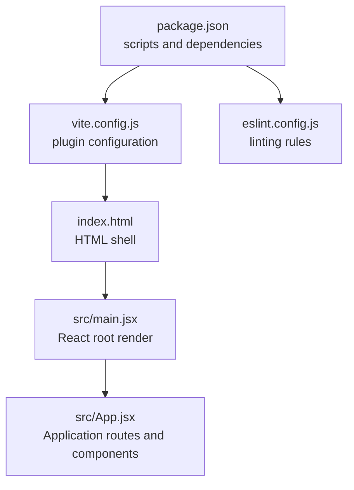
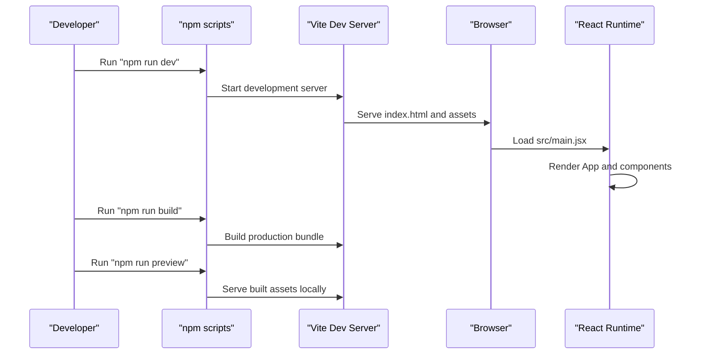
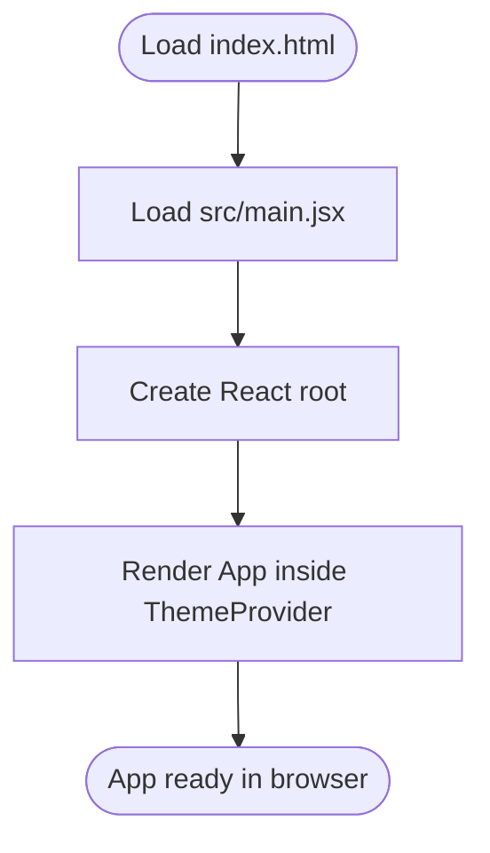
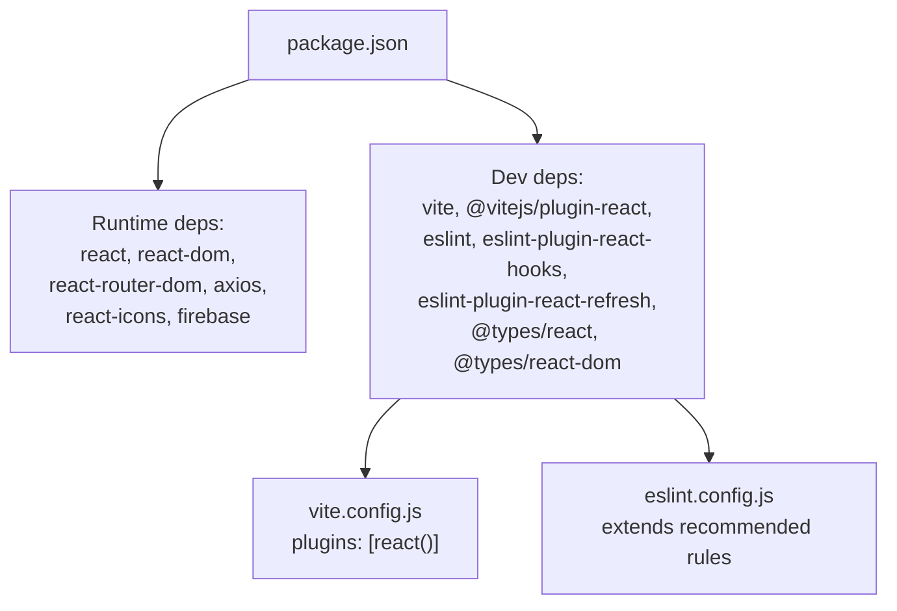

# Development Setup

<cite>
**Referenced Files in This Document**
- [package.json](file://package.json)
- [vite.config.js](file://vite.config.js)
- [eslint.config.js](file://eslint.config.js)
- [README.md](file://README.md)
- [index.html](file://index.html)
- [src/main.jsx](file://src/main.jsx)
- [src/App.jsx](file://src/App.jsx)
</cite>

## Table of Contents
1. [Introduction](#introduction)
2. [Project Structure](#project-structure)
3. [Core Components](#core-components)
4. [Architecture Overview](#architecture-overview)
5. [Detailed Component Analysis](#detailed-component-analysis)
6. [Dependency Analysis](#dependency-analysis)
7. [Performance Considerations](#performance-considerations)
8. [Troubleshooting Guide](#troubleshooting-guide)
9. [Conclusion](#conclusion)

## Introduction
This section explains how to set up and run the car-rental-frontend development environment locally. It covers cloning the repository, installing dependencies, running the development server, and understanding the purpose of each script in the package.json scripts section. It also documents the Vite configuration and ESLint setup, along with troubleshooting tips and performance best practices.

## Project Structure
The project is a React application configured with Vite. The key files involved in development setup are:
- package.json: Defines scripts, dependencies, and devDependencies.
- vite.config.js: Configures Vite and enables the React plugin.
- eslint.config.js: Configures ESLint rules and recommended presets.
- index.html: Provides the HTML shell and mounts the React app.
- src/main.jsx: Initializes the React root and renders the App inside a theme provider.
- src/App.jsx: The main application component.

**Diagram sources**
- [package.json](file://package.json#L1-L32)
- [vite.config.js](file://vite.config.js#L1-L8)
- [index.html](file://index.html#L1-L14)
- [src/main.jsx](file://src/main.jsx#L1-L13)
- [src/App.jsx](file://src/App.jsx#L1-L53)
- [eslint.config.js](file://eslint.config.js#L1-L30)

**Section sources**
- [package.json](file://package.json#L1-L32)
- [vite.config.js](file://vite.config.js#L1-L8)
- [eslint.config.js](file://eslint.config.js#L1-L30)
- [index.html](file://index.html#L1-L14)
- [src/main.jsx](file://src/main.jsx#L1-L13)
- [src/App.jsx](file://src/App.jsx#L1-L53)

## Core Components
- Scripts in package.json:
  - dev: Starts the Vite development server with hot module replacement.
  - build: Produces a production-ready static build.
  - lint: Runs ESLint across the project to check code quality.
  - preview: Locally serves the production build for testing.
- Vite configuration:
  - Uses @vitejs/plugin-react to enable fast refresh and JSX transformations.
- ESLint configuration:
  - Extends recommended rules for JavaScript and React hooks.
  - Integrates React Refresh and browser globals.

**Section sources**
- [package.json](file://package.json#L6-L11)
- [vite.config.js](file://vite.config.js#L1-L8)
- [eslint.config.js](file://eslint.config.js#L1-L30)

## Architecture Overview
The development workflow connects the scripts, Vite, and React runtime as follows:

**Diagram sources**
- [package.json](file://package.json#L6-L11)
- [index.html](file://index.html#L1-L14)
- [src/main.jsx](file://src/main.jsx#L1-L13)
- [src/App.jsx](file://src/App.jsx#L1-L53)

## Detailed Component Analysis

### Step-by-Step Local Setup
- Clone the repository to your machine.
- Install dependencies using your package manager.
- Start the development server with the dev script.
- Open the local URL shown by the development server.
- Optionally run lint to validate code style and build to produce a production bundle.

Purpose of package.json scripts:
- dev: Starts the Vite development server with hot module replacement for rapid iteration.
- build: Generates an optimized production build for distribution.
- lint: Executes ESLint to enforce code quality and style rules.
- preview: Serves the production build locally to test deployment-like behavior.

Vite configuration highlights:
- The React plugin is enabled to support JSX and fast refresh during development.
- The configuration exports a default Vite config object with plugin registration.

ESLint configuration highlights:
- Extends recommended rules for JavaScript and React hooks.
- Integrates React Refresh and browser globals.
- Ignores the dist directory by default.

**Section sources**
- [package.json](file://package.json#L6-L11)
- [vite.config.js](file://vite.config.js#L1-L8)
- [eslint.config.js](file://eslint.config.js#L1-L30)
- [README.md](file://README.md#L1-L17)

### How the App Mounts and Renders
- index.html defines the root container and loads the main entry script.
- src/main.jsx creates the React root and renders the App wrapped in a theme provider.
- src/App.jsx is the primary component; routing and additional pages are present as commented examples.

**Diagram sources**
- [index.html](file://index.html#L1-L14)
- [src/main.jsx](file://src/main.jsx#L1-L13)
- [src/App.jsx](file://src/App.jsx#L1-L53)

**Section sources**
- [index.html](file://index.html#L1-L14)
- [src/main.jsx](file://src/main.jsx#L1-L13)
- [src/App.jsx](file://src/App.jsx#L1-L53)

## Dependency Analysis
- Runtime dependencies include React, React DOM, React Router, Axios, React Icons, and Firebase.
- Dev dependencies include Vite, @vitejs/plugin-react, ESLint, and related plugins.
- The React Compiler is intentionally disabled in the template to preserve development and build performance.

**Diagram sources**
- [package.json](file://package.json#L12-L30)
- [vite.config.js](file://vite.config.js#L1-L8)
- [eslint.config.js](file://eslint.config.js#L1-L30)

**Section sources**
- [package.json](file://package.json#L12-L30)
- [README.md](file://README.md#L10-L17)

## Performance Considerations
- Use the dev script for iterative development; it provides fast refresh and hot reloading.
- Avoid enabling the React Compiler in development as recommended by the template.
- Keep dependencies updated and avoid unnecessary plugins to minimize build overhead.
- Use the preview script to validate production builds locally before deployment.

[No sources needed since this section provides general guidance]

## Troubleshooting Guide
Common setup issues and resolutions:
- Missing dependencies:
  - Symptom: Errors when running scripts or importing modules.
  - Resolution: Install dependencies using your package manager and retry.
- Port conflicts:
  - Symptom: Development server fails to start due to a port already in use.
  - Resolution: Change the port in Vite configuration or stop the conflicting service.
- ESLint errors:
  - Symptom: Linting fails during npm run lint.
  - Resolution: Fix reported issues or adjust rules in eslint.config.js if appropriate.
- Application does not render:
  - Symptom: Blank page or missing UI.
  - Resolution: Verify index.html root element exists and src/main.jsx is loaded; ensure React and ReactDOM are installed.

**Section sources**
- [package.json](file://package.json#L6-L11)
- [vite.config.js](file://vite.config.js#L1-L8)
- [eslint.config.js](file://eslint.config.js#L1-L30)
- [index.html](file://index.html#L1-L14)
- [src/main.jsx](file://src/main.jsx#L1-L13)

## Conclusion
You now have the essential steps to set up and run the car-rental-frontend locally, understand the purpose of each script, and leverage Vite and ESLint configurations effectively. Use the dev script for daily development, lint to maintain code quality, and preview to validate production builds.