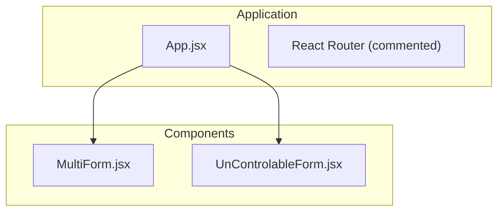
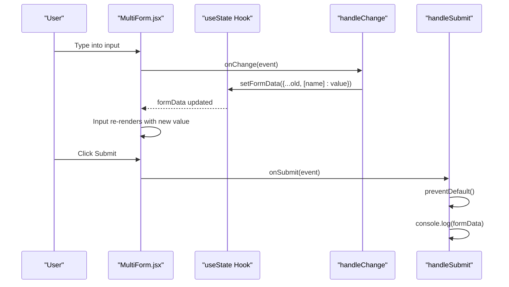
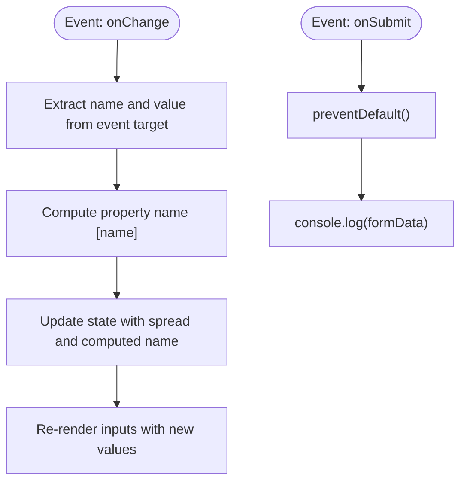
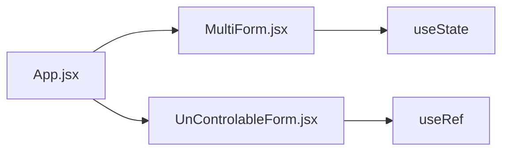

# Controlled Forms

<cite>
**Referenced Files in This Document**
- [MultiForm.jsx](file://src/components/MultiForm.jsx)
- [UnControlableForm.jsx](file://src/components/UnControlableForm.jsx)
- [App.jsx](file://src/App.jsx)
- [PractiveUseEffect.jsx](file://src/components/PractiveUseEffect.jsx)
- [ThemeContext.jsx](file://src/components/ThemeContext.jsx)
</cite>

## Table of Contents
1. [Introduction](#introduction)
2. [Project Structure](#project-structure)
3. [Core Components](#core-components)
4. [Architecture Overview](#architecture-overview)
5. [Detailed Component Analysis](#detailed-component-analysis)
6. [Dependency Analysis](#dependency-analysis)
7. [Performance Considerations](#performance-considerations)
8. [Troubleshooting Guide](#troubleshooting-guide)
9. [Conclusion](#conclusion)

## Introduction
This document explains controlled forms in the car-rental-frontend application, focusing on the MultiForm.jsx component as the primary example. Controlled components keep form inputs synchronized with React state, enabling real-time validation, feedback, and integration with global state or context. We will analyze how state is initialized, updated via event handlers, bound to inputs, and submitted while preventing default behavior. We will also compare controlled vs uncontrolled patterns and provide best practices for state structure, naming conventions, and debugging.

## Project Structure
The controlled form example lives under src/components and is integrated into the main application routing. The MultiForm component demonstrates controlled inputs, while UnControlableForm.jsx illustrates an alternative pattern using refs. The App component wires these components into routes for demonstration.

**Diagram sources**
- [App.jsx](file://src/App.jsx#L1-L56)
- [MultiForm.jsx](file://src/components/MultiForm.jsx#L1-L70)
- [UnControlableForm.jsx](file://src/components/UnControlableForm.jsx#L1-L40)

**Section sources**
- [App.jsx](file://src/App.jsx#L1-L56)

## Core Components
- MultiForm.jsx: Demonstrates controlled inputs bound to state, dynamic updates using computed property names, and form submission with default behavior prevented.
- UnControlableForm.jsx: Demonstrates uncontrolled inputs using refs to read values at submit time.
- PractiveUseEffect.jsx: Provides a simple controlled input example that can inform best practices for two-way binding.
- ThemeContext.jsx: Shows how global state can be combined with controlled forms for theme-aware UI.

Key controlled form concepts illustrated:
- Two-way data binding: inputs derive their value from state and update state on change.
- Dynamic state updates using computed property names to target the correct field.
- Preventing default form submission and logging submitted data.
- Debugging via console logs during change and submit events.

**Section sources**
- [MultiForm.jsx](file://src/components/MultiForm.jsx#L1-L70)
- [UnControlableForm.jsx](file://src/components/UnControlableForm.jsx#L1-L40)
- [PractiveUseEffect.jsx](file://src/components/PractiveUseEffect.jsx#L106-L149)
- [ThemeContext.jsx](file://src/components/ThemeContext.jsx#L1-L14)

## Architecture Overview
The controlled form pattern centers on a single state object holding all field values. Each input is bound to a specific field, and a shared handler updates the state using a computed property name. On submit, the form prevents the default reload, and the current state is logged for inspection.

**Diagram sources**
- [MultiForm.jsx](file://src/components/MultiForm.jsx#L1-L70)

## Detailed Component Analysis

### MultiForm.jsx: Controlled Inputs and Submission
- State initialization: A single state object holds all form fields.
- Two-way binding: Each input’s value prop reads from state, and onChange triggers a handler that updates state.
- Dynamic updates: The handler extracts the field name and value from the event and uses a computed property name to update the correct field.
- Submission: The submit handler prevents the default page reload and logs the current state.

**Diagram sources**
- [MultiForm.jsx](file://src/components/MultiForm.jsx#L1-L70)

Implementation highlights:
- Controlled binding: Inputs receive value from state and update state on change.
- Dynamic state update: Computed property names enable a single handler to manage multiple fields.
- Logging for debugging: Console logs show event target, field name/value, and updated state.
- Submission behavior: Default action is prevented; submitted data is logged.

Best practices demonstrated:
- Keep state flat and keyed by field names.
- Use consistent naming for input name attributes and state keys.
- Use spread operator to preserve other fields when updating a single field.

Common pitfalls avoided:
- Avoid separate state per field; prefer a single state object for simplicity.
- Ensure preventDefault is called to avoid page reloads during development.

**Section sources**
- [MultiForm.jsx](file://src/components/MultiForm.jsx#L1-L70)

### UnControlableForm.jsx: Uncontrolled Pattern Comparison
- Uses refs to capture input values at submit time.
- Submits values by reading ref.current.value.
- Demonstrates an alternative approach where React does not manage input state.

Why compare?
- Controlled forms are preferred for validation, real-time feedback, and integration with global state/context.
- Uncontrolled forms can be simpler for read-only scenarios but lack built-in synchronization.

**Section sources**
- [UnControlableForm.jsx](file://src/components/UnControlableForm.jsx#L1-L40)

### Practical Example: Controlled Input Pattern
PractiveUseEffect.jsx shows a simple controlled input with value and onChange, reinforcing the two-way binding concept used in MultiForm.jsx.

**Section sources**
- [PractiveUseEffect.jsx](file://src/components/PractiveUseEffect.jsx#L106-L149)

### Global State Integration: ThemeContext
While not a form, ThemeContext.jsx demonstrates how global state can be combined with controlled components. For example, controlled inputs could react to theme changes or persist preferences alongside form state.

**Section sources**
- [ThemeContext.jsx](file://src/components/ThemeContext.jsx#L1-L14)

## Dependency Analysis
- MultiForm.jsx depends on React’s useState to manage form state.
- App.jsx integrates MultiForm.jsx into the application, making it available via route configuration.
- UnControlableForm.jsx is independent and serves as a contrast to controlled patterns.

**Diagram sources**
- [App.jsx](file://src/App.jsx#L1-L56)
- [MultiForm.jsx](file://src/components/MultiForm.jsx#L1-L70)
- [UnControlableForm.jsx](file://src/components/UnControlableForm.jsx#L1-L40)

**Section sources**
- [App.jsx](file://src/App.jsx#L1-L56)
- [MultiForm.jsx](file://src/components/MultiForm.jsx#L1-L70)
- [UnControlableForm.jsx](file://src/components/UnControlableForm.jsx#L1-L40)

## Performance Considerations
- Small forms: Single state object is efficient and easy to manage.
- Large forms: Consider splitting state into smaller chunks or using useReducer for complex updates to reduce unnecessary re-renders.
- Event handler reuse: Using a single handler with computed property names avoids multiple handlers and keeps code DRY.
- Avoid excessive logging: While helpful for debugging, remove or gate console logs in production builds.

[No sources needed since this section provides general guidance]

## Troubleshooting Guide
Common issues and resolutions:
- State not updating: Verify that the input name attribute matches the state key and that the handler uses a computed property name to target the correct field.
- Partial updates: Ensure the spread operator preserves other fields when updating a single field.
- Submitting empty data: Confirm preventDefault is called and that the form is not reloaded.
- Debugging: Use console logs to inspect event target, field name, and updated state during onChange and onSubmit.

Practical debugging steps:
- Inspect event target and field name/value during onChange.
- Log the updated state after setting it.
- Log the final formData on submit to confirm correctness.

**Section sources**
- [MultiForm.jsx](file://src/components/MultiForm.jsx#L1-L70)

## Conclusion
Controlled forms provide strong guarantees around state synchronization, validation, and integration with global state or context. MultiForm.jsx exemplifies a clean, reusable pattern: a single state object, a shared handler with computed property names, and explicit submission handling with logging. For larger applications, consider splitting state or adopting useReducer to optimize performance and maintainability. Compare with UnControlableForm.jsx to appreciate the benefits of controlled components for real-time feedback and robust integrations.