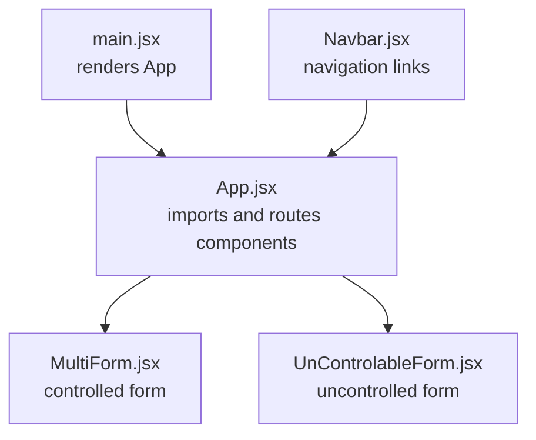
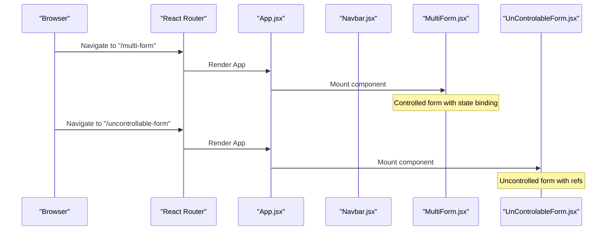
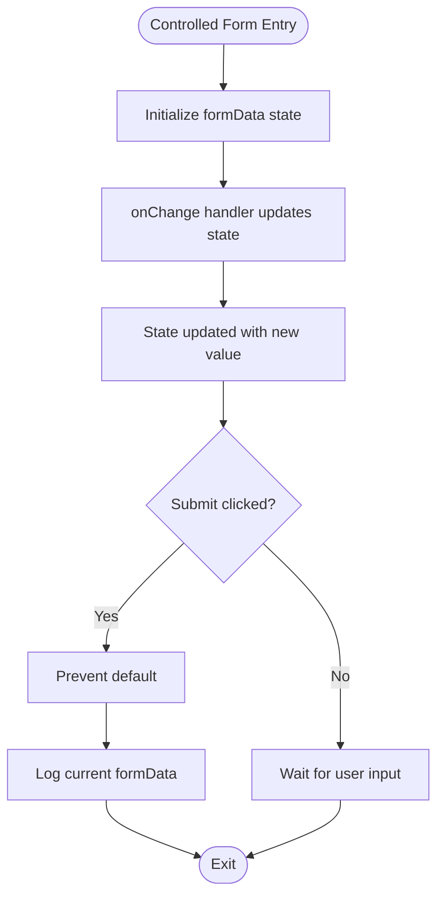
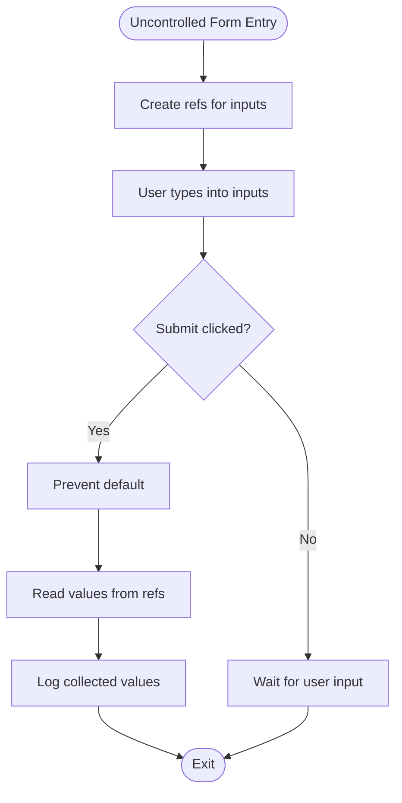
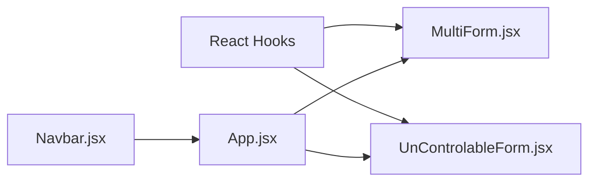
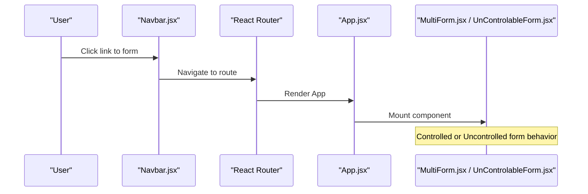
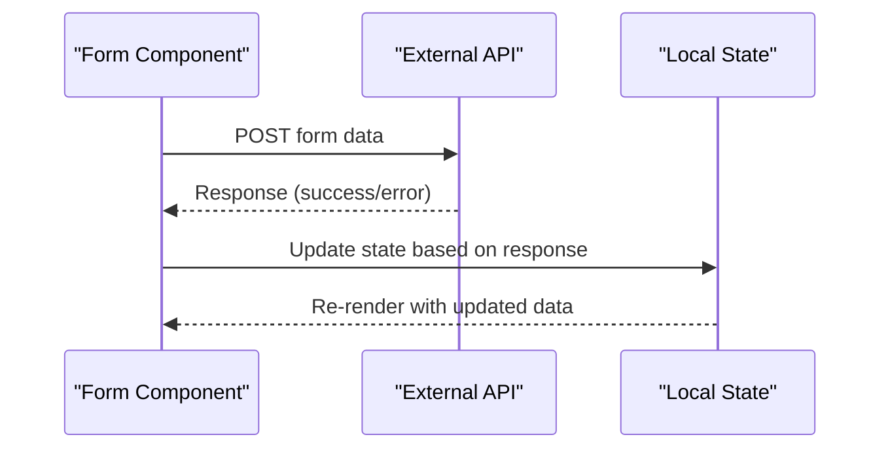

# Form Handling

<cite>
**Referenced Files in This Document**
- [MultiForm.jsx](file://src/components/MultiForm.jsx)
- [UnControlableForm.jsx](file://src/components/UnControlableForm.jsx)
- [App.jsx](file://src/App.jsx)
- [main.jsx](file://src/main.jsx)
- [Navbar.jsx](file://src/components/Navbar.jsx)
- [FetchWithAxios.jsx](file://src/components/FetchWithAxios.jsx)
</cite>

## Table of Contents
1. [Introduction](#introduction)
2. [Project Structure](#project-structure)
3. [Core Components](#core-components)
4. [Architecture Overview](#architecture-overview)
5. [Detailed Component Analysis](#detailed-component-analysis)
6. [Dependency Analysis](#dependency-analysis)
7. [Performance Considerations](#performance-considerations)
8. [Troubleshooting Guide](#troubleshooting-guide)
9. [Conclusion](#conclusion)
10. [Appendices](#appendices)

## Introduction
This document explains form handling patterns in the car-rental-frontend application, focusing on controlled and uncontrolled components. It compares the MultiForm.jsx (controlled) and UnControlableForm.jsx (uncontrolled) implementations, detailing state management, submission handling, validation approaches, and the use of refs versus value/state binding. It also provides guidance on choosing between patterns, addressing common issues such as form reset behavior, accessibility, and performance, and outlines best practices for integrating forms with external services or state management systems.

## Project Structure
The form handling examples are located under src/components and are integrated into the application via routing and navigation. The main entry point renders the application with theme provider wrapping.

**Diagram sources**
- [main.jsx](file://src/main.jsx#L1-L13)
- [App.jsx](file://src/App.jsx#L1-L53)
- [MultiForm.jsx](file://src/components/MultiForm.jsx#L1-L70)
- [UnControlableForm.jsx](file://src/components/UnControlableForm.jsx#L1-L40)
- [Navbar.jsx](file://src/components/Navbar.jsx#L1-L81)

**Section sources**
- [main.jsx](file://src/main.jsx#L1-L13)
- [App.jsx](file://src/App.jsx#L1-L53)
- [Navbar.jsx](file://src/components/Navbar.jsx#L1-L81)

## Core Components
- Controlled form (MultiForm.jsx): Uses React state to manage input values and updates via event handlers. Submission logs the current state.
- Uncontrolled form (UnControlableForm.jsx): Uses refs to read input values during submission. No state binding on inputs.

Key differences:
- Controlled: value is bound to state; onChange updates state; submission reads state.
- Uncontrolled: value is read from DOM via refs; submission reads ref values.

Practical examples from the repository:
- Controlled: state initialization, handler updating state, submit logging state.
- Uncontrolled: ref creation, submit reading ref values.

**Section sources**
- [MultiForm.jsx](file://src/components/MultiForm.jsx#L1-L70)
- [UnControlableForm.jsx](file://src/components/UnControlableForm.jsx#L1-L40)

## Architecture Overview
The application renders the main App component, which includes navigation. The MultiForm and UnControlableForm components are available via routes. The controlled component manages form state internally, while the uncontrolled component accesses DOM values directly.

**Diagram sources**
- [App.jsx](file://src/App.jsx#L1-L53)
- [Navbar.jsx](file://src/components/Navbar.jsx#L1-L81)
- [MultiForm.jsx](file://src/components/MultiForm.jsx#L1-L70)
- [UnControlableForm.jsx](file://src/components/UnControlableForm.jsx#L1-L40)

## Detailed Component Analysis

### Controlled Form: MultiForm.jsx
- State management:
  - Initializes a formData object with fields for name, email, and password.
  - handleChange extracts the field name and value from the event target and updates formData accordingly.
- Submission handling:
  - handleSubmit prevents default behavior and logs the current formData.
- Validation approaches:
  - The component currently logs values and submission; no client-side validation is implemented in this file.
- Accessibility:
  - Inputs are labeled; ensure labels are associated with inputs for screen readers.
- Performance:
  - Updating state on each keystroke causes re-render; consider debouncing for heavy validation.

**Diagram sources**
- [MultiForm.jsx](file://src/components/MultiForm.jsx#L1-L70)

**Section sources**
- [MultiForm.jsx](file://src/components/MultiForm.jsx#L1-L70)

### Uncontrolled Form: UnControlableForm.jsx
- Ref usage:
  - Declares refs for name, email, and password.
  - Reads values via ref.current.value during submission.
- Submission handling:
  - Prevents default and logs collected values.
- Validation approaches:
  - No built-in validation in this file; validation would need to be added in handleSubmit.
- Accessibility:
  - Ensure labels are present for inputs to support assistive technologies.
- Performance:
  - Avoids frequent state updates; suitable for simple forms or when integrating with external libraries.

**Diagram sources**
- [UnControlableForm.jsx](file://src/components/UnControlableForm.jsx#L1-L40)

**Section sources**
- [UnControlableForm.jsx](file://src/components/UnControlableForm.jsx#L1-L40)

### Practical Examples and Patterns
- Controlled pattern:
  - State initialization and update via handleChange.
  - Submission handler prevents default and logs state.
  - Suitable for forms requiring real-time validation or multi-step workflows.
- Uncontrolled pattern:
  - Refs capture values at submission time.
  - Good for simple forms or when integrating with third-party DOM APIs.

Validation and error messaging:
- Add validation inside handlers or submission functions.
- Display messages near inputs or at the top of the form.
- Use aria attributes for accessibility (e.g., aria-invalid, aria-describedby).

Form reset behavior:
- Controlled: reset state to initial values.
- Uncontrolled: reset refs by accessing DOM or re-mounting the component.

Integration with external services:
- Controlled: submit state to backend; update state on success/failure.
- Uncontrolled: collect values via refs and send to backend; update state after successful submission.

**Section sources**
- [MultiForm.jsx](file://src/components/MultiForm.jsx#L1-L70)
- [UnControlableForm.jsx](file://src/components/UnControlableForm.jsx#L1-L40)

## Dependency Analysis
- MultiForm.jsx depends on React’s useState hook.
- UnControlableForm.jsx depends on React’s useRef hook.
- App.jsx imports both components and includes routing for them.
- Navbar.jsx provides navigation links to the forms.

**Diagram sources**
- [MultiForm.jsx](file://src/components/MultiForm.jsx#L1-L70)
- [UnControlableForm.jsx](file://src/components/UnControlableForm.jsx#L1-L40)
- [App.jsx](file://src/App.jsx#L1-L53)
- [Navbar.jsx](file://src/components/Navbar.jsx#L1-L81)

**Section sources**
- [MultiForm.jsx](file://src/components/MultiForm.jsx#L1-L70)
- [UnControlableForm.jsx](file://src/components/UnControlableForm.jsx#L1-L40)
- [App.jsx](file://src/App.jsx#L1-L53)
- [Navbar.jsx](file://src/components/Navbar.jsx#L1-L81)

## Performance Considerations
- Controlled forms:
  - Frequent state updates can cause re-renders; consider debouncing input handlers for expensive validations.
  - Memoization of derived values can help reduce unnecessary computations.
- Uncontrolled forms:
  - Minimal state updates; efficient for simple forms.
  - Avoid excessive DOM reads; batch reads if needed.
- General:
  - Prefer controlled components for complex validation and multi-step flows.
  - Use refs sparingly; ensure they are only used when necessary.

[No sources needed since this section provides general guidance]

## Troubleshooting Guide
Common issues and resolutions:
- Form does not reset:
  - Controlled: reset state to initial values in a reset handler.
  - Uncontrolled: reset refs by accessing DOM or re-mounting the component.
- Accessibility problems:
  - Ensure labels are associated with inputs; use aria-invalid and aria-describedby for error feedback.
- Validation not triggered:
  - Controlled: add validation in handleChange or handleSubmit.
  - Uncontrolled: add validation in handleSubmit before reading refs.
- External service integration:
  - Controlled: submit state and update state on success/failure.
  - Uncontrolled: collect values via refs and send to backend; update state after successful submission.

[No sources needed since this section provides general guidance]

## Conclusion
The car-rental-frontend demonstrates two fundamental form handling patterns:
- Controlled forms (MultiForm.jsx) centralize state management and are ideal for complex validation and multi-step workflows.
- Uncontrolled forms (UnControlableForm.jsx) read values directly from the DOM via refs and are suitable for simple forms or when integrating with external libraries.

Choose controlled forms for robust validation and state synchronization, and uncontrolled forms for straightforward submissions. Apply best practices for accessibility, reset behavior, and performance, and integrate with external services by submitting state or collected values and updating state upon completion.

[No sources needed since this section summarizes without analyzing specific files]

## Appendices

### Appendix A: Routing and Navigation
- The App component imports both forms and includes routes for them.
- The Navbar component provides links to navigate to the forms.

**Diagram sources**
- [App.jsx](file://src/App.jsx#L1-L53)
- [Navbar.jsx](file://src/components/Navbar.jsx#L1-L81)

**Section sources**
- [App.jsx](file://src/App.jsx#L1-L53)
- [Navbar.jsx](file://src/components/Navbar.jsx#L1-L81)

### Appendix B: External Service Integration Pattern
- The application includes a component that fetches data from an external API using axios. This pattern can be adapted for form submission:
  - Controlled: submit state to backend; update state on success/failure.
  - Uncontrolled: collect values via refs and send to backend; update state after successful submission.

**Diagram sources**
- [FetchWithAxios.jsx](file://src/components/FetchWithAxios.jsx#L1-L42)

**Section sources**
- [FetchWithAxios.jsx](file://src/components/FetchWithAxios.jsx#L1-L42)