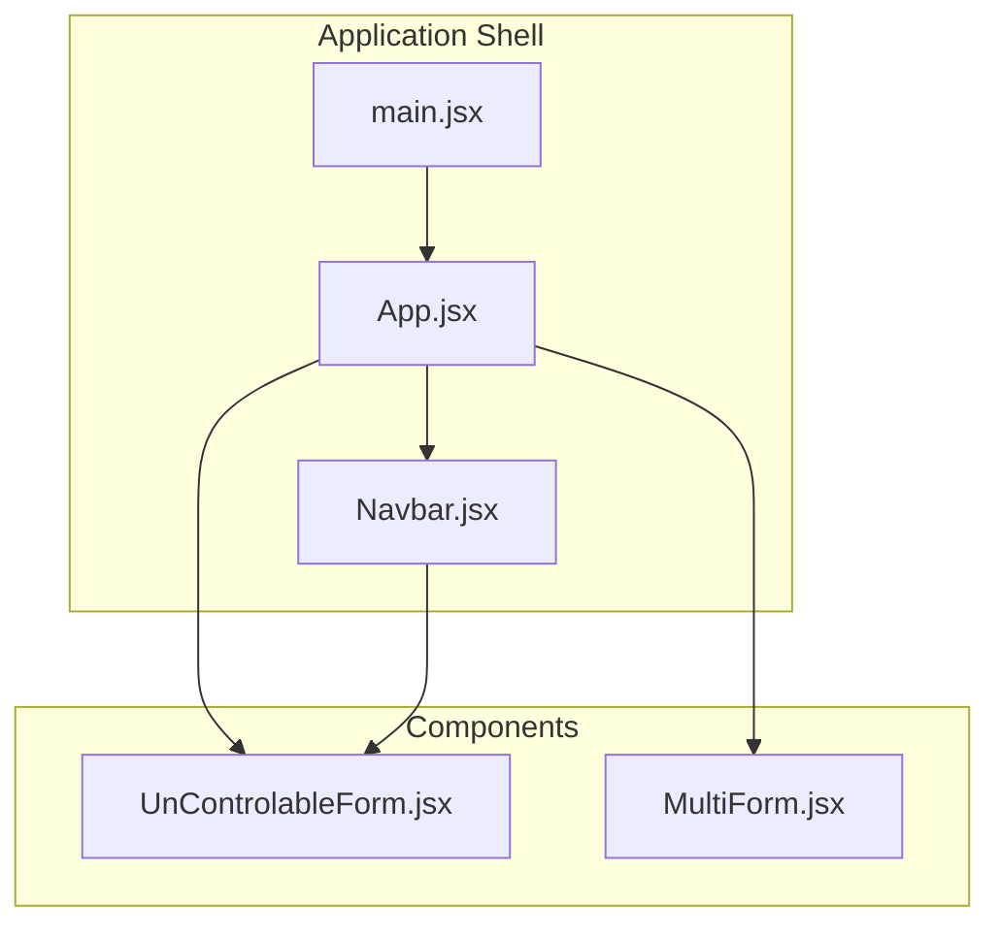
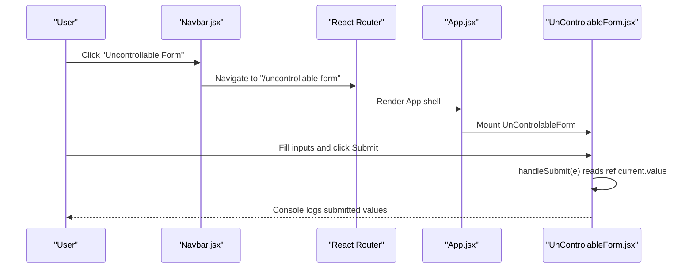
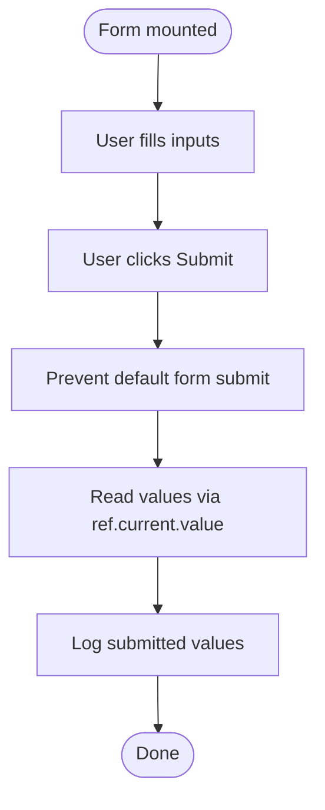
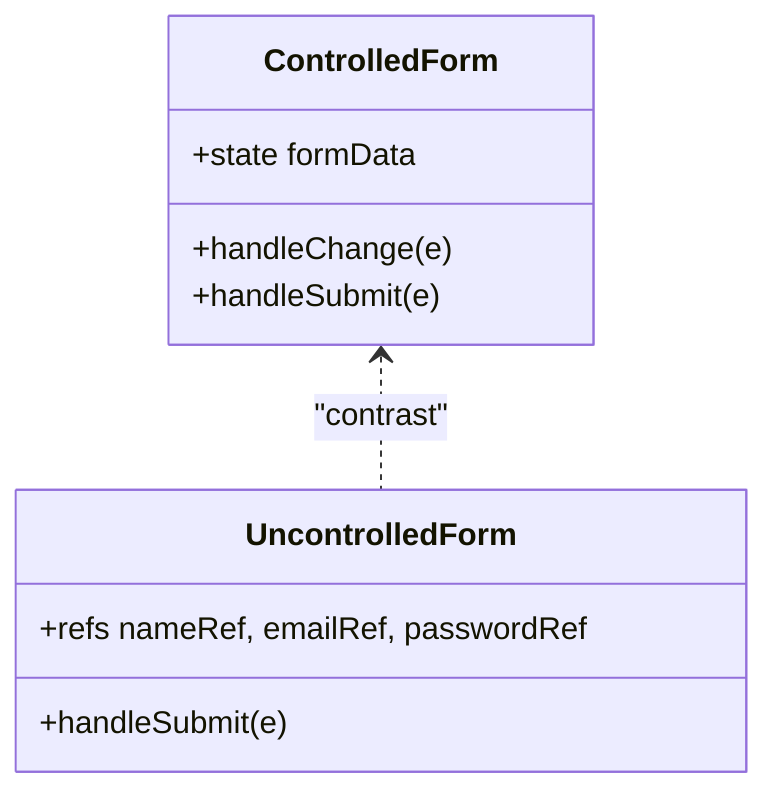
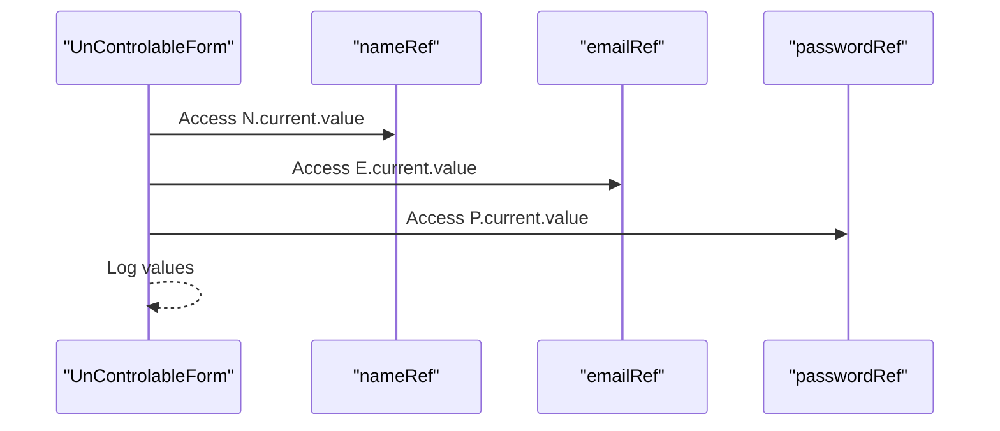
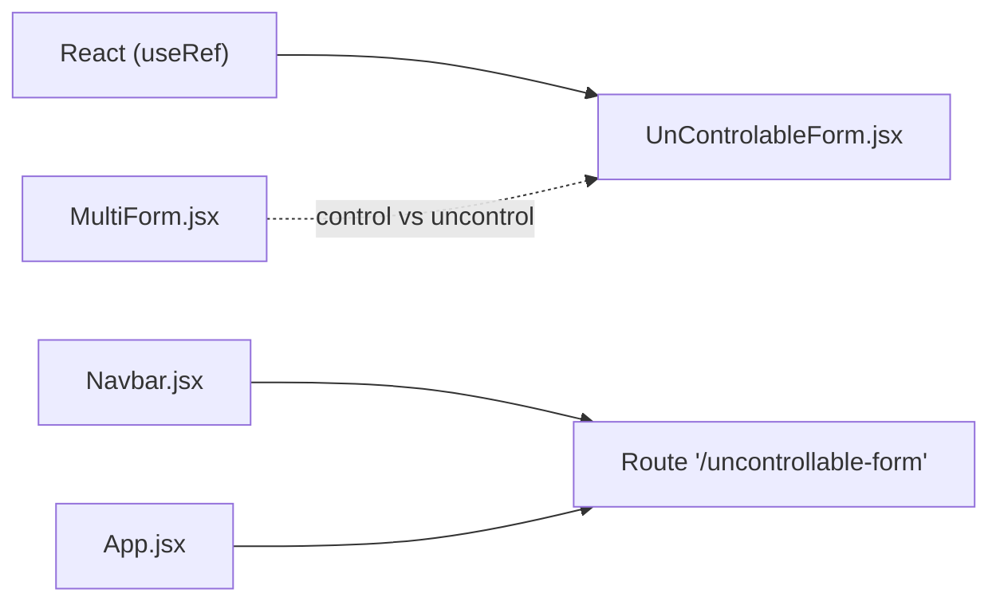

# Uncontrolled Forms

<cite>
**Referenced Files in This Document**
- [UnControlableForm.jsx](file://src/components/UnControlableForm.jsx)
- [App.jsx](file://src/App.jsx)
- [Navbar.jsx](file://src/components/Navbar.jsx)
- [MultiForm.jsx](file://src/components/MultiForm.jsx)
</cite>

## Table of Contents
1. [Introduction](#introduction)
2. [Project Structure](#project-structure)
3. [Core Components](#core-components)
4. [Architecture Overview](#architecture-overview)
5. [Detailed Component Analysis](#detailed-component-analysis)
6. [Dependency Analysis](#dependency-analysis)
7. [Performance Considerations](#performance-considerations)
8. [Troubleshooting Guide](#troubleshooting-guide)
9. [Conclusion](#conclusion)

## Introduction
This document explains uncontrolled forms in the car-rental-frontend application, focusing on how UnControlableForm.jsx demonstrates managing form data using refs instead of React state. It shows how useRef initializes references to DOM elements and how handleSubmit accesses input values via ref.current.value during form submission. It contrasts this approach with controlled components, highlights reduced re-renders and simpler setup for one-time submissions, and covers use cases such as integrating with third-party libraries, handling file inputs, or migrating legacy code. It also addresses common issues like lack of real-time validation, difficulty in dynamic value setting, and potential ref null errors, along with best practices for initializing refs, ensuring DOM attachment before access, and combining uncontrolled inputs with controlled behaviors when needed.

## Project Structure
The uncontrolled form example is implemented as a standalone component and integrated into the application’s routing via the navigation bar. The component is defined under src/components and exported for use in the application shell.

**Diagram sources**
- [main.jsx](file://src/main.jsx#L1-L13)
- [App.jsx](file://src/App.jsx#L1-L56)
- [Navbar.jsx](file://src/components/Navbar.jsx#L1-L81)
- [UnControlableForm.jsx](file://src/components/UnControlableForm.jsx#L1-L40)
- [MultiForm.jsx](file://src/components/MultiForm.jsx#L1-L69)

**Section sources**
- [main.jsx](file://src/main.jsx#L1-L13)
- [App.jsx](file://src/App.jsx#L1-L56)
- [Navbar.jsx](file://src/components/Navbar.jsx#L1-L81)
- [UnControlableForm.jsx](file://src/components/UnControlableForm.jsx#L1-L40)
- [MultiForm.jsx](file://src/components/MultiForm.jsx#L1-L69)

## Core Components
- UnControlableForm.jsx: Demonstrates uncontrolled form behavior using useRef to store references to DOM inputs and accessing values via ref.current.value during submission.
- MultiForm.jsx: Provides a controlled form example for comparison, using React state and event handlers to update values.

Key implementation highlights:
- useRef creates references to DOM nodes for name, email, and password inputs.
- handleSubmit prevents default form submission and reads values directly from the DOM via ref.current.value.
- Controlled counterpart uses useState and onChange handlers to manage form state.

**Section sources**
- [UnControlableForm.jsx](file://src/components/UnControlableForm.jsx#L1-L40)
- [MultiForm.jsx](file://src/components/MultiForm.jsx#L1-L69)

## Architecture Overview
The uncontrolled form is rendered as part of the application’s UI and navigable via the Navbar. The routing configuration in App.jsx includes a route to UnControlableForm, while Navbar.jsx exposes a link to navigate to it.

**Diagram sources**
- [Navbar.jsx](file://src/components/Navbar.jsx#L63-L80)
- [App.jsx](file://src/App.jsx#L31-L55)
- [UnControlableForm.jsx](file://src/components/UnControlableForm.jsx#L9-L16)

## Detailed Component Analysis

### UnControlableForm.jsx: Uncontrolled Inputs and Ref-Based Submission
- useRef initialization: Three refs are created for name, email, and password inputs.
- DOM attachment: Each input receives a ref prop pointing to its corresponding ref.
- Submission logic: handleSubmit prevents default submission and extracts values via ref.current.value.
- Output: Values are logged to the console for demonstration.

**Diagram sources**
- [UnControlableForm.jsx](file://src/components/UnControlableForm.jsx#L5-L16)

**Section sources**
- [UnControlableForm.jsx](file://src/components/UnControlableForm.jsx#L1-L40)

### Comparison with Controlled Components: MultiForm.jsx
- Controlled approach: Uses useState to store form data and updates it via onChange handlers.
- Benefits: Real-time validation, dynamic value setting, and easier integration with controlled UI patterns.
- Trade-offs: More frequent re-renders due to state updates on every keystroke.

**Diagram sources**
- [MultiForm.jsx](file://src/components/MultiForm.jsx#L1-L69)
- [UnControlableForm.jsx](file://src/components/UnControlableForm.jsx#L1-L40)

**Section sources**
- [MultiForm.jsx](file://src/components/MultiForm.jsx#L1-L69)

### Practical Example: Extracting Name, Email, and Password
- During submission, the component reads:
  - Name: ref.current.value from the name input
  - Email: ref.current.value from the email input
  - Password: ref.current.value from the password input
- These values are logged to the console for demonstration.

**Diagram sources**
- [UnControlableForm.jsx](file://src/components/UnControlableForm.jsx#L9-L16)

**Section sources**
- [UnControlableForm.jsx](file://src/components/UnControlableForm.jsx#L9-L16)

## Dependency Analysis
- UnControlableForm.jsx depends on React’s useRef hook.
- Routing integration:
  - Navbar.jsx defines the navigation link to the uncontrolled form route.
  - App.jsx includes the route definition for the uncontrolled form page.
- Controlled comparison:
  - MultiForm.jsx provides a controlled form example for contrast.

**Diagram sources**
- [UnControlableForm.jsx](file://src/components/UnControlableForm.jsx#L1-L40)
- [Navbar.jsx](file://src/components/Navbar.jsx#L63-L80)
- [App.jsx](file://src/App.jsx#L31-L55)
- [MultiForm.jsx](file://src/components/MultiForm.jsx#L1-L69)

**Section sources**
- [UnControlableForm.jsx](file://src/components/UnControlableForm.jsx#L1-L40)
- [Navbar.jsx](file://src/components/Navbar.jsx#L63-L80)
- [App.jsx](file://src/App.jsx#L31-L55)
- [MultiForm.jsx](file://src/components/MultiForm.jsx#L1-L69)

## Performance Considerations
- Reduced re-renders: Uncontrolled forms avoid frequent state updates on input changes, minimizing re-renders compared to controlled components.
- Simpler setup for one-time submissions: Ideal for scenarios where immediate access to values is needed without maintaining state.
- Trade-offs: Controlled components offer better real-time validation and dynamic value manipulation, which may justify extra renders in interactive forms.

[No sources needed since this section provides general guidance]

## Troubleshooting Guide
Common issues and remedies:
- Lack of real-time validation: Uncontrolled inputs do not automatically trigger state updates; validation must be implemented manually in handleSubmit or via external libraries.
- Difficulty in dynamic value setting: Setting values programmatically requires manipulating DOM via ref.current; ensure refs are initialized and attached before access.
- Potential ref null errors: Access ref.current only after the DOM node is mounted. Avoid reading values in effect hooks before the component mounts or in render phases where refs may be null.
- Third-party integrations: When integrating with libraries that expect direct DOM access, uncontrolled inputs simplify passing refs to external APIs.
- File inputs: For file uploads, use ref.current.files to access selected files; ensure the input type is file and handle file validation and upload logic in handleSubmit.

Best practices:
- Initialize refs with useRef(null) and attach them to inputs.
- Ensure DOM attachment before accessing ref.current by reading values in handleSubmit or after mount.
- Combine uncontrolled inputs with controlled behaviors when needed (e.g., show a controlled message while keeping inputs uncontrolled).
- Validate and sanitize values in handleSubmit before processing.

**Section sources**
- [UnControlableForm.jsx](file://src/components/UnControlableForm.jsx#L5-L16)

## Conclusion
Uncontrolled forms in car-rental-frontend demonstrate a straightforward approach to form handling using refs for direct DOM access. They reduce re-renders and simplify setup for one-time submissions, making them suitable for scenarios involving third-party libraries, file inputs, or legacy code migration. However, they come with trade-offs such as lack of real-time validation and challenges in dynamic value setting. By following best practices—initializing refs correctly, ensuring DOM attachment, and combining uncontrolled inputs with controlled behaviors—the uncontrolled pattern can be effectively used alongside controlled components for optimal UX and performance.