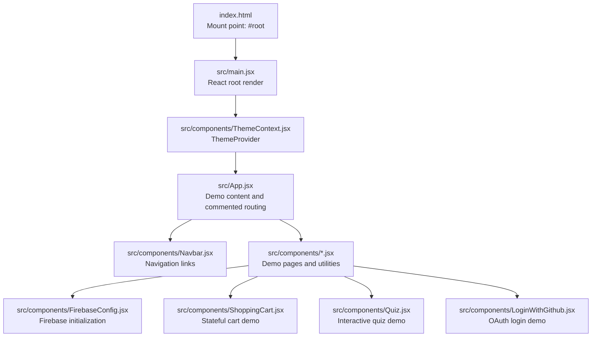
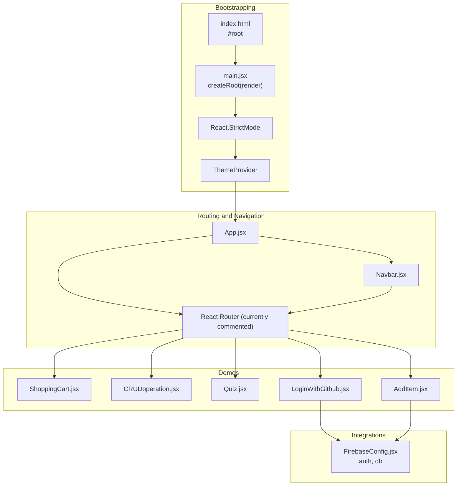
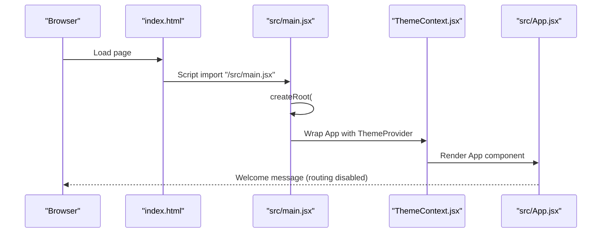
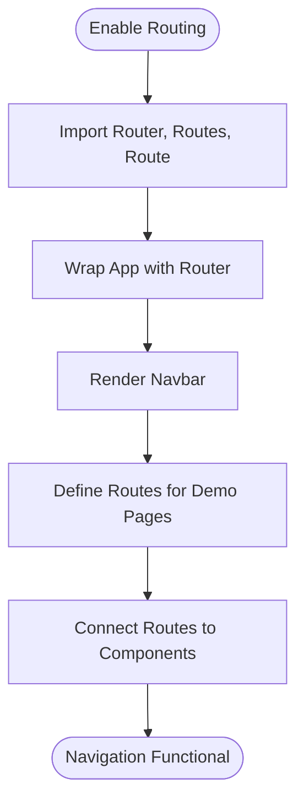
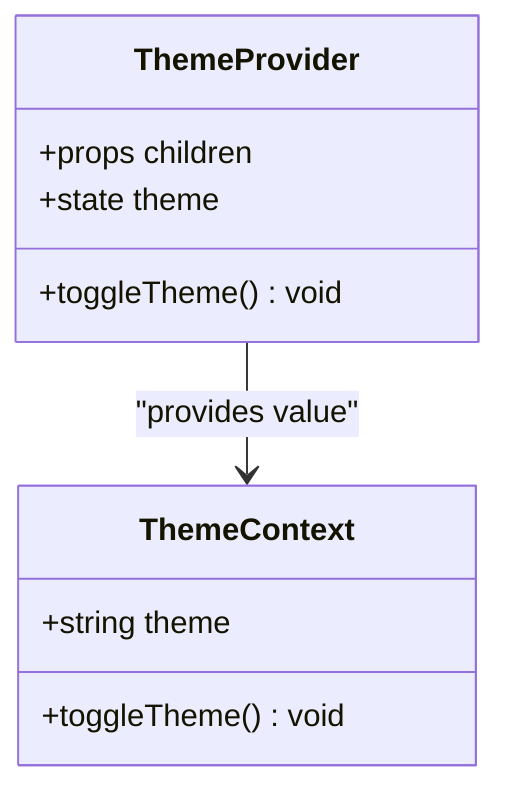
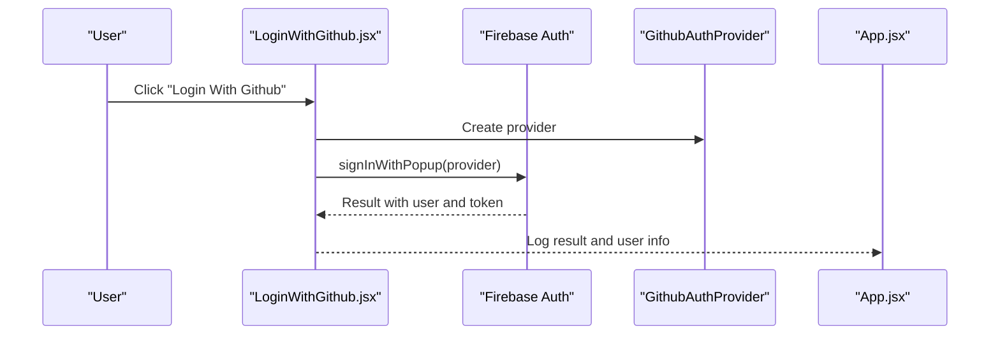
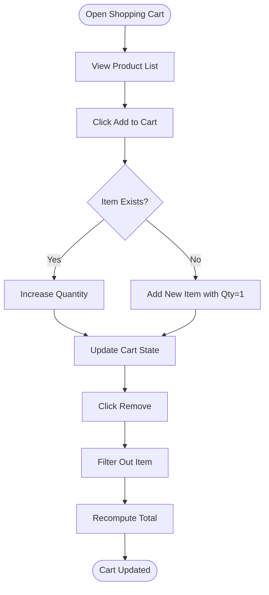
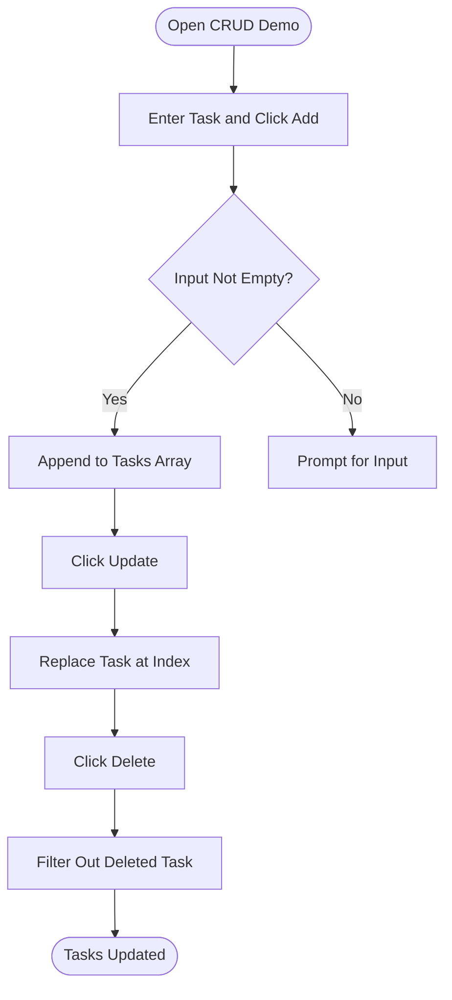
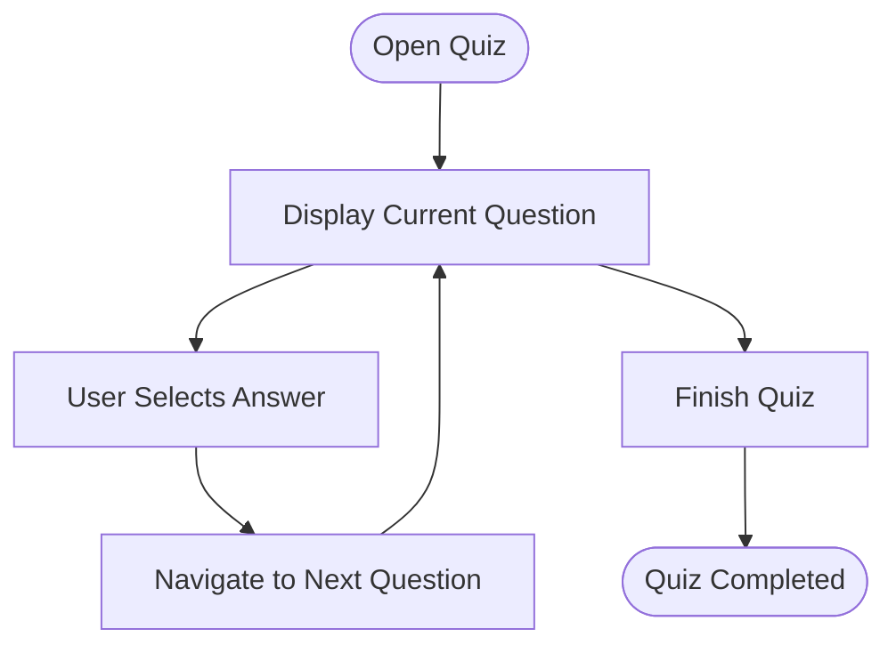
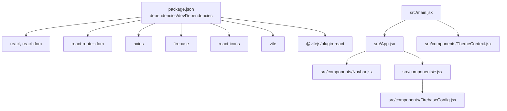

# Project Overview

<cite>
**Referenced Files in This Document**
- [README.md](file://README.md)
- [package.json](file://package.json)
- [vite.config.js](file://vite.config.js)
- [index.html](file://index.html)
- [src/main.jsx](file://src/main.jsx)
- [src/App.jsx](file://src/App.jsx)
- [src/components/ThemeContext.jsx](file://src/components/ThemeContext.jsx)
- [src/components/Navbar.jsx](file://src/components/Navbar.jsx)
- [src/components/FirebaseConfig.jsx](file://src/components/FirebaseConfig.jsx)
- [src/components/AddItem.jsx](file://src/components/AddItem.jsx)
- [src/components/CRUDoperation.jsx](file://src/components/CRUDoperation.jsx)
- [src/components/LoginWithGithub.jsx](file://src/components/LoginWithGithub.jsx)
- [src/components/ShoppingCart.jsx](file://src/components/ShoppingCart.jsx)
- [src/components/Quiz.jsx](file://src/components/Quiz.jsx)
</cite>

## Table of Contents
1. [Introduction](#introduction)
2. [Project Structure](#project-structure)
3. [Core Components](#core-components)
4. [Architecture Overview](#architecture-overview)
5. [Detailed Component Analysis](#detailed-component-analysis)
6. [Dependency Analysis](#dependency-analysis)
7. [Performance Considerations](#performance-considerations)
8. [Troubleshooting Guide](#troubleshooting-guide)
9. [Conclusion](#conclusion)

## Introduction
This section introduces the car-rental-frontend project as a React-based learning and demonstration application. It showcases frontend development concepts such as component architecture, state management, authentication, and routing. Despite the project name suggesting a car rental system, it functions primarily as a demo application containing multiple interactive examples (e.g., shopping cart, quiz app, CRUD operations, authentication flows). The project uses React with Vite as the build toolchain and demonstrates modern frontend patterns suitable for educational purposes.

Key characteristics:
- Purpose: Educational demo application focusing on React fundamentals and integrations.
- Technology stack: React, Vite, React Router, Firebase, Axios, and React Icons.
- Build tool: Vite configured with the React plugin.
- Demo nature: Intended for learning rather than production deployment.

**Section sources**
- [README.md](file://README.md#L1-L17)
- [package.json](file://package.json#L1-L32)

## Project Structure
The project follows a conventional React + Vite layout:
- Root HTML file defines the mount point for the React application.
- Application bootstrap occurs in main.jsx, which renders the root App component inside React StrictMode and wraps it with a ThemeProvider.
- App.jsx currently renders a welcome message and includes a commented-out routing structure that would wire up multiple demo pages.
- Components are organized under src/components, covering UI utilities, demos, and integrations (e.g., Firebase, authentication, shopping cart, quiz).

**Diagram sources**
- [index.html](file://index.html#L1-L14)
- [src/main.jsx](file://src/main.jsx#L1-L13)
- [src/components/ThemeContext.jsx](file://src/components/ThemeContext.jsx#L1-L14)
- [src/App.jsx](file://src/App.jsx#L1-L53)
- [src/components/Navbar.jsx](file://src/components/Navbar.jsx#L1-L81)
- [src/components/FirebaseConfig.jsx](file://src/components/FirebaseConfig.jsx#L1-L26)
- [src/components/ShoppingCart.jsx](file://src/components/ShoppingCart.jsx#L1-L75)
- [src/components/Quiz.jsx](file://src/components/Quiz.jsx#L1-L81)
- [src/components/LoginWithGithub.jsx](file://src/components/LoginWithGithub.jsx#L1-L35)

**Section sources**
- [index.html](file://index.html#L1-L14)
- [src/main.jsx](file://src/main.jsx#L1-L13)
- [src/App.jsx](file://src/App.jsx#L1-L53)

## Core Components
This section highlights the core building blocks that bootstrap and structure the application.

- Bootstrapping and rendering:
  - index.html defines the DOM container for the React app.
  - main.jsx creates the React root and renders App wrapped by ThemeProvider, enabling global theming across components.
  - StrictMode is used during rendering to surface potential issues early in development.

- Routing and navigation:
  - App.jsx imports React Router and includes a commented-out routing structure that would connect multiple demo pages via routes and a shared Navbar.
  - Navbar.jsx provides navigation links to various demo pages and mobile-friendly menu toggling.

- Theming:
  - ThemeContext.jsx defines a simple light/dark theme toggle via a context provider, allowing child components to consume and switch themes.

- Authentication and backend integrations:
  - FirebaseConfig.jsx initializes Firebase services (auth and Firestore) and exports instances for use across components.
  - LoginWithGithub.jsx demonstrates OAuth login using Firebase Auth with a popup-based provider.

- Demo pages:
  - AddItem.jsx integrates Firestore to add data entries.
  - CRUDoperation.jsx demonstrates local state-based CRUD operations.
  - ShoppingCart.jsx implements a shopping cart with add/remove/update logic and computed totals.
  - Quiz.jsx presents a basic quiz interface with state placeholders for selection and progression.

**Section sources**
- [index.html](file://index.html#L1-L14)
- [src/main.jsx](file://src/main.jsx#L1-L13)
- [src/App.jsx](file://src/App.jsx#L1-L53)
- [src/components/ThemeContext.jsx](file://src/components/ThemeContext.jsx#L1-L14)
- [src/components/Navbar.jsx](file://src/components/Navbar.jsx#L1-L81)
- [src/components/FirebaseConfig.jsx](file://src/components/FirebaseConfig.jsx#L1-L26)
- [src/components/LoginWithGithub.jsx](file://src/components/LoginWithGithub.jsx#L1-L35)
- [src/components/AddItem.jsx](file://src/components/AddItem.jsx#L1-L38)
- [src/components/CRUDoperation.jsx](file://src/components/CRUDoperation.jsx#L1-L77)
- [src/components/ShoppingCart.jsx](file://src/components/ShoppingCart.jsx#L1-L75)
- [src/components/Quiz.jsx](file://src/components/Quiz.jsx#L1-L81)

## Architecture Overview
The application architecture centers around a single-page React app with Vite’s fast refresh and hot module replacement. The routing is currently disabled (commented) to keep the demo minimal, while the Navbar remains present to illustrate navigation. ThemeProvider enables a global theme toggle across components. Firebase is integrated for authentication and data persistence demonstrations.

**Diagram sources**
- [index.html](file://index.html#L1-L14)
- [src/main.jsx](file://src/main.jsx#L1-L13)
- [src/App.jsx](file://src/App.jsx#L1-L53)
- [src/components/Navbar.jsx](file://src/components/Navbar.jsx#L1-L81)
- [src/components/ShoppingCart.jsx](file://src/components/ShoppingCart.jsx#L1-L75)
- [src/components/CRUDoperation.jsx](file://src/components/CRUDoperation.jsx#L1-L77)
- [src/components/Quiz.jsx](file://src/components/Quiz.jsx#L1-L81)
- [src/components/LoginWithGithub.jsx](file://src/components/LoginWithGithub.jsx#L1-L35)
- [src/components/AddItem.jsx](file://src/components/AddItem.jsx#L1-L38)
- [src/components/FirebaseConfig.jsx](file://src/components/FirebaseConfig.jsx#L1-L26)

## Detailed Component Analysis

### Bootstrapping and Rendering Flow
This sequence illustrates how the app starts and mounts the UI.

**Diagram sources**
- [index.html](file://index.html#L1-L14)
- [src/main.jsx](file://src/main.jsx#L1-L13)
- [src/components/ThemeContext.jsx](file://src/components/ThemeContext.jsx#L1-L14)
- [src/App.jsx](file://src/App.jsx#L1-L53)

**Section sources**
- [index.html](file://index.html#L1-L14)
- [src/main.jsx](file://src/main.jsx#L1-L13)
- [src/App.jsx](file://src/App.jsx#L1-L53)

### Routing and Navigation
The routing structure is present as commented code in App.jsx, indicating planned pages and routes. Enabling routing would connect the Navbar to individual demo components.

Common issues when enabling routing:
- Missing BrowserRouter import or incorrect router wrapping.
- Incorrect route paths or missing trailing slashes causing navigation mismatches.
- Missing Link components or incorrect Link to props in Navbar.
- Conflicting route order leading to unintended fallbacks.

**Section sources**
- [src/App.jsx](file://src/App.jsx#L1-L53)
- [src/components/Navbar.jsx](file://src/components/Navbar.jsx#L1-L81)

### Theming with ThemeProvider
ThemeContext.jsx provides a simple light/dark theme toggle via a context provider. Components can consume the theme and toggle function to adapt UI appearance globally.

**Diagram sources**
- [src/components/ThemeContext.jsx](file://src/components/ThemeContext.jsx#L1-L14)

**Section sources**
- [src/components/ThemeContext.jsx](file://src/components/ThemeContext.jsx#L1-L14)
- [src/main.jsx](file://src/main.jsx#L1-L13)

### Authentication with Firebase (GitHub Login)
LoginWithGithub.jsx demonstrates OAuth login using Firebase Auth with a popup-based provider. FirebaseConfig.jsx initializes Firebase services and exports auth/db instances.

Potential issues:
- Missing or invalid Firebase configuration values.
- Popup blocked by browser security policies.
- Missing GitHub OAuth app setup or scopes.

**Diagram sources**
- [src/components/LoginWithGithub.jsx](file://src/components/LoginWithGithub.jsx#L1-L35)
- [src/components/FirebaseConfig.jsx](file://src/components/FirebaseConfig.jsx#L1-L26)

**Section sources**
- [src/components/LoginWithGithub.jsx](file://src/components/LoginWithGithub.jsx#L1-L35)
- [src/components/FirebaseConfig.jsx](file://src/components/FirebaseConfig.jsx#L1-L26)

### Shopping Cart Demo
ShoppingCart.jsx demonstrates stateful cart operations including adding items, updating quantities, removing items, and computing totals.

**Diagram sources**
- [src/components/ShoppingCart.jsx](file://src/components/ShoppingCart.jsx#L1-L75)

**Section sources**
- [src/components/ShoppingCart.jsx](file://src/components/ShoppingCart.jsx#L1-L75)

### CRUD Operations Demo
CRUDoperation.jsx shows local state-based operations for managing tasks (add, update, delete) with console logs for visibility.

**Diagram sources**
- [src/components/CRUDoperation.jsx](file://src/components/CRUDoperation.jsx#L1-L77)

**Section sources**
- [src/components/CRUDoperation.jsx](file://src/components/CRUDoperation.jsx#L1-L77)

### Quiz App Demo
Quiz.jsx defines a static quiz interface with state placeholders for selection and progression. It demonstrates state management and conditional rendering.

**Diagram sources**
- [src/components/Quiz.jsx](file://src/components/Quiz.jsx#L1-L81)

**Section sources**
- [src/components/Quiz.jsx](file://src/components/Quiz.jsx#L1-L81)

## Dependency Analysis
External dependencies and their roles:
- React and React DOM: Core UI library and renderer.
- Vite: Build tool and dev server with fast refresh.
- @vitejs/plugin-react: Enables React Fast Refresh.
- react-router-dom: Client-side routing for SPA navigation.
- axios: HTTP client for API requests.
- firebase: Authentication and Firestore integration.
- react-icons: Iconography for UI elements.

Internal relationships:
- main.jsx depends on App.jsx and ThemeContext.jsx.
- App.jsx imports multiple demo components and Navbar.
- Demo components depend on FirebaseConfig.jsx for auth/db.
- Navbar.jsx depends on react-router-dom Link for navigation.

**Diagram sources**
- [package.json](file://package.json#L1-L32)
- [src/main.jsx](file://src/main.jsx#L1-L13)
- [src/App.jsx](file://src/App.jsx#L1-L53)
- [src/components/ThemeContext.jsx](file://src/components/ThemeContext.jsx#L1-L14)
- [src/components/Navbar.jsx](file://src/components/Navbar.jsx#L1-L81)
- [src/components/FirebaseConfig.jsx](file://src/components/FirebaseConfig.jsx#L1-L26)

**Section sources**
- [package.json](file://package.json#L1-L32)
- [vite.config.js](file://vite.config.js#L1-L8)

## Performance Considerations
Development performance:
- Vite provides fast refresh and optimized builds. The template disables React Compiler by default to preserve dev/build performance, as noted in the README.
- Using React StrictMode helps detect unsafe lifecycles and other issues early, which can indirectly improve stability during development.

Production optimizations:
- Enable React Compiler in production builds when appropriate to reduce bundle size and improve runtime performance.
- Split large components into smaller, memoized pieces to minimize re-renders.
- Lazy-load heavy demo components to reduce initial bundle size.
- Prefer server-side rendering (SSR) or static site generation (SSG) if SEO and performance are critical.
- Minimize unnecessary state updates and use efficient data structures for cart and quiz demos.

[No sources needed since this section provides general guidance]

## Troubleshooting Guide
Common issues and resolutions:
- Routing not working:
  - Ensure Router is enabled and wrapped around App.
  - Verify route paths match Navbar Link to props.
  - Confirm react-router-dom is installed and imported correctly.

- Firebase errors:
  - Validate Firebase configuration values and ensure environment variables are set.
  - Check that the Firebase project is initialized and auth/db instances are exported.

- Authentication popups blocked:
  - Allow popups for the site or trigger login from a user gesture.
  - Verify OAuth app settings and redirect URIs.

- Hot reload issues:
  - Restart the Vite dev server if changes do not reflect immediately.
  - Clear browser cache or open an incognito window.

**Section sources**
- [src/App.jsx](file://src/App.jsx#L1-L53)
- [src/components/FirebaseConfig.jsx](file://src/components/FirebaseConfig.jsx#L1-L26)
- [README.md](file://README.md#L1-L17)

## Conclusion
The car-rental-frontend project serves as a comprehensive learning resource for React developers, demonstrating component architecture, state management, routing, theming, and authentication integrations. While named after a car rental system, it functions as a demo application showcasing practical frontend patterns. Developers can enable routing, expand demo pages, and apply production optimizations to evolve it into a more complete application.

[No sources needed since this section summarizes without analyzing specific files]