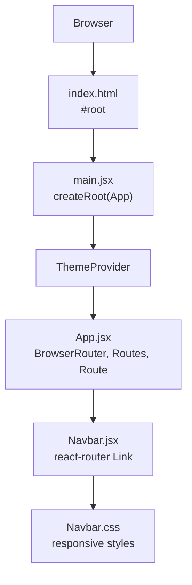
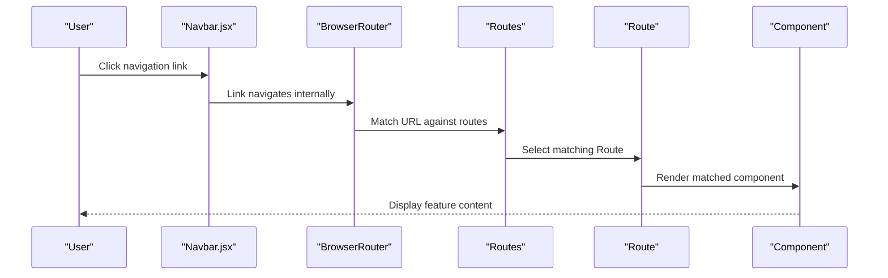
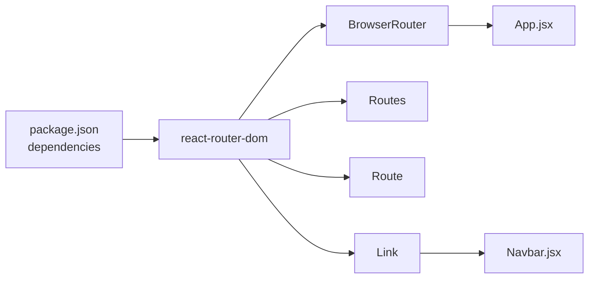

# Routing & Navigation

<cite>
**Referenced Files in This Document**
- [main.jsx](file://src/main.jsx)
- [App.jsx](file://src/App.jsx)
- [Navbar.jsx](file://src/components/Navbar.jsx)
- [Navbar.css](file://src/components/CSS/Navbar.css)
- [package.json](file://package.json)
- [vite.config.js](file://vite.config.js)
- [index.html](file://index.html)
</cite>

## Table of Contents
1. [Introduction](#introduction)
2. [Project Structure](#project-structure)
3. [Core Components](#core-components)
4. [Architecture Overview](#architecture-overview)
5. [Detailed Component Analysis](#detailed-component-analysis)
6. [Dependency Analysis](#dependency-analysis)
7. [Performance Considerations](#performance-considerations)
8. [Troubleshooting Guide](#troubleshooting-guide)
9. [Conclusion](#conclusion)

## Introduction
This document explains the routing and navigation system in the car-rental-frontend application. It focuses on how React Router DOM is implemented using BrowserRouter, Routes, and Route components, and how the Navbar integrates with routing to provide navigation across major features. It also covers the current state of routes, navigation flow, mobile-responsive behavior, and practical guidance for extending the routing system with best practices and performance considerations.

## Project Structure
The routing and navigation system spans a small set of files:
- Application bootstrap and provider setup in main.jsx
- Top-level routing container in App.jsx (commented configuration)
- Navigation bar in Navbar.jsx with links to routes
- Styles for responsive navigation in Navbar.css
- Dependencies declared in package.json
- Build configuration in vite.config.js
- Root HTML page in index.html

**Diagram sources**
- [index.html](file://index.html#L1-L14)
- [main.jsx](file://src/main.jsx#L1-L13)
- [App.jsx](file://src/App.jsx#L1-L52)
- [Navbar.jsx](file://src/components/Navbar.jsx#L1-L81)
- [Navbar.css](file://src/components/CSS/Navbar.css#L1-L164)

**Section sources**
- [main.jsx](file://src/main.jsx#L1-L13)
- [App.jsx](file://src/App.jsx#L1-L52)
- [Navbar.jsx](file://src/components/Navbar.jsx#L1-L81)
- [Navbar.css](file://src/components/CSS/Navbar.css#L1-L164)
- [package.json](file://package.json#L1-L32)
- [vite.config.js](file://vite.config.js#L1-L8)
- [index.html](file://index.html#L1-L14)

## Core Components
- BrowserRouter, Routes, Route: Implemented in App.jsx with commented configuration indicating the intended routes.
- Navbar: Provides navigation links to features and handles mobile menu toggling.
- ThemeProvider: Wraps the app for theme context (not part of routing, but affects rendering).

Key observations:
- The current App.jsx exports a component that does not render the commented routing configuration. The commented block shows the intended routes and their components.
- Navbar.jsx renders a set of Link components pointing to the same paths shown in the commented App.jsx routes.
- The commented configuration demonstrates a mix of absolute and relative paths, with some missing leading slashes.

**Section sources**
- [App.jsx](file://src/App.jsx#L1-L52)
- [Navbar.jsx](file://src/components/Navbar.jsx#L1-L81)
- [main.jsx](file://src/main.jsx#L1-L13)

## Architecture Overview
The routing architecture is currently configured in a commented block within App.jsx. The Navbar.jsx provides navigation links that match the intended route paths. The ThemeProvider wraps the App to enable theme switching.

**Diagram sources**
- [App.jsx](file://src/App.jsx#L1-L52)
- [Navbar.jsx](file://src/components/Navbar.jsx#L1-L81)

## Detailed Component Analysis

### App.jsx: Routing Container
- Imports: BrowserRouter, Routes, Route, Navbar, and feature components.
- Current behavior: Renders a simple welcome message and includes a commented block with the intended routing configuration.
- Intended routes (from comments):
  - Home "/"
  - Feature pages: "/add-item", "/crud", "/click-handler", "/conditions", "/fetch-item", "/fetch-axios", "/multi-form", "/practice-effect", "/todo", "/uncontrollable-form"
  - Authentication: "/login-github", "/login-google"
  - Additional features: "digital-clock", "shopping-cart", "quiz-app"
- Notes:
  - Some paths in the comment are missing leading slashes (e.g., "digital-clock"), while others are absolute (e.g., "/login-google").
  - The commented configuration shows a container div wrapping Routes, which is a common pattern.

Practical guidance:
- Uncomment and activate the routing block to enable navigation.
- Normalize paths to either absolute or relative consistently.
- Wrap Routes in a container element to keep layout consistent.

**Section sources**
- [App.jsx](file://src/App.jsx#L1-L52)

### Navbar.jsx: Navigation Links and Mobile Menu
- Uses Link from react-router-dom to navigate to feature routes.
- Maintains a local state for mobile menu toggle.
- On desktop, displays a horizontal list of links.
- On mobile (below 768px), transforms into a vertical overlay menu controlled by the toggle state.
- Includes buttons for Login and Sign Up.

Active link behavior:
- The Navbar uses Link components for navigation. While there is no explicit active class binding in the provided code, Link components automatically manage navigation. For active link highlighting, you can integrate ActiveLink or use a hook like useLocation to conditionally apply classes.

Mobile responsiveness:
- The CSS defines a hamburger menu icon and a slide-in menu for smaller screens.
- The toggle logic switches the menu’s visibility class.

**Section sources**
- [Navbar.jsx](file://src/components/Navbar.jsx#L1-L81)
- [Navbar.css](file://src/components/CSS/Navbar.css#L1-L164)

### main.jsx: Provider and Root Rendering
- Creates the root and renders the App wrapped in ThemeProvider.
- Does not include BrowserRouter at the top level.

Implication:
- If routing is activated in App.jsx, the BrowserRouter must be present at the top level. Since it is currently commented in App.jsx, the app does not yet use client-side routing.

**Section sources**
- [main.jsx](file://src/main.jsx#L1-L13)

## Dependency Analysis
- React Router DOM: Declared in package.json under dependencies.
- Build tooling: Vite configuration enables React plugin; no special routing configuration is required.
- Runtime dependencies: react-router-dom is required for BrowserRouter, Routes, Route, and Link.

**Diagram sources**
- [package.json](file://package.json#L1-L32)
- [App.jsx](file://src/App.jsx#L1-L52)
- [Navbar.jsx](file://src/components/Navbar.jsx#L1-L81)

**Section sources**
- [package.json](file://package.json#L1-L32)
- [vite.config.js](file://vite.config.js#L1-L8)

## Performance Considerations
- Client-side routing overhead: React Router DOM performs in-memory navigation, minimizing network requests. The primary cost is component rendering and re-rendering of the matched route.
- Lazy loading opportunities:
  - Use dynamic imports with React.lazy and Suspense to split bundles for heavy components.
  - Example pattern: wrap Route elements with lazy-loaded components to defer loading until navigation occurs.
- Bundle size:
  - Keep the number of imported components per route reasonable.
  - Group related features under shared layouts or containers to reduce duplication.
- CSS and assets:
  - Ensure Navbar.css is scoped appropriately to avoid unnecessary reflows.
  - Minimize heavy assets in route components to improve perceived performance.

[No sources needed since this section provides general guidance]

## Troubleshooting Guide
Common issues and resolutions:

- Route not found errors:
  - Cause: Mismatch between Link paths and Route paths (e.g., missing leading slash).
  - Resolution: Align all paths to a consistent style (absolute vs. relative) and ensure Routes include the intended paths.

- Navigation blocking:
  - Cause: Missing BrowserRouter at the top level.
  - Resolution: Activate the commented routing block in App.jsx and ensure BrowserRouter is included at the top level.

- Active link highlighting:
  - Symptom: No visual indication of the current page.
  - Resolution: Integrate ActiveLink or use a hook to detect the current location and apply an active class to the appropriate Link.

- Mobile menu not closing:
  - Symptom: Menu remains open after navigation.
  - Resolution: Call the close handler on each Link click to reset the mobile menu state.

- Layout shifts:
  - Symptom: Content jumps when menu opens.
  - Resolution: Ensure the body does not scroll when the menu is open and maintain consistent spacing in Navbar.css.

**Section sources**
- [App.jsx](file://src/App.jsx#L1-L52)
- [Navbar.jsx](file://src/components/Navbar.jsx#L1-L81)
- [Navbar.css](file://src/components/CSS/Navbar.css#L1-L164)

## Conclusion
The car-rental-frontend currently includes a commented routing configuration and a fully functional Navbar with mobile-responsive behavior. To enable client-side routing:
- Activate the routing block in App.jsx and ensure BrowserRouter is at the top level.
- Normalize route paths and confirm that all Link destinations in Navbar.jsx match the Routes.
- Consider lazy loading for heavy components and implement active link highlighting for better UX.
- Monitor bundle sizes and optimize asset usage for performance.

[No sources needed since this section summarizes without analyzing specific files]