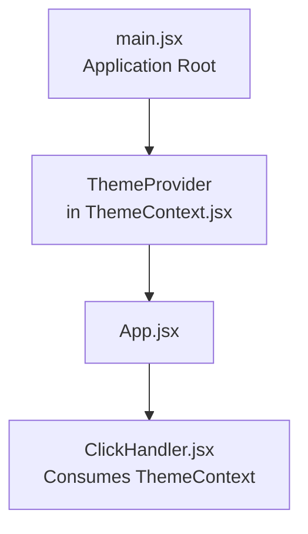
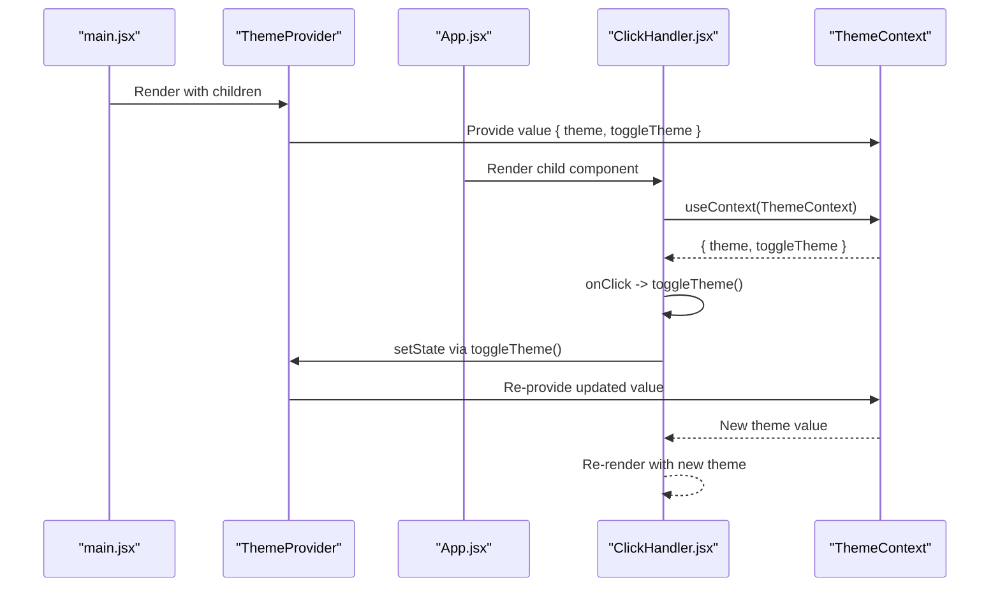
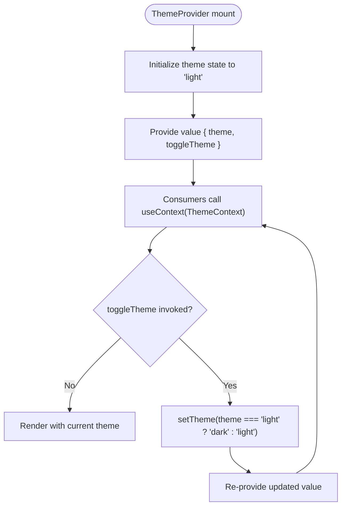
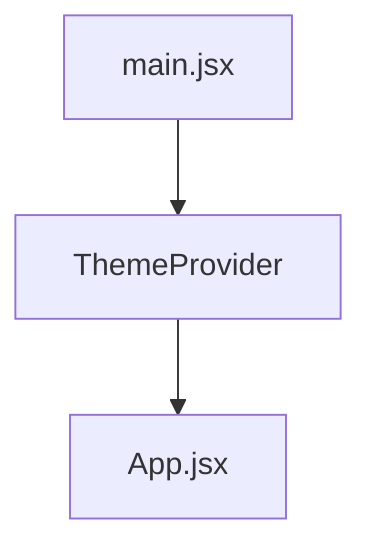
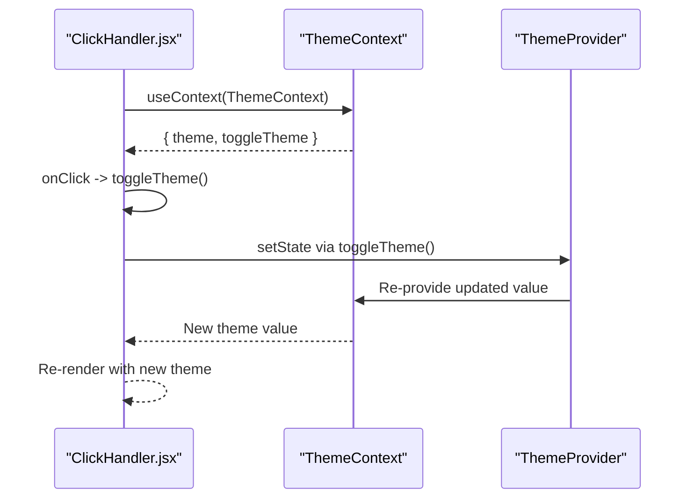
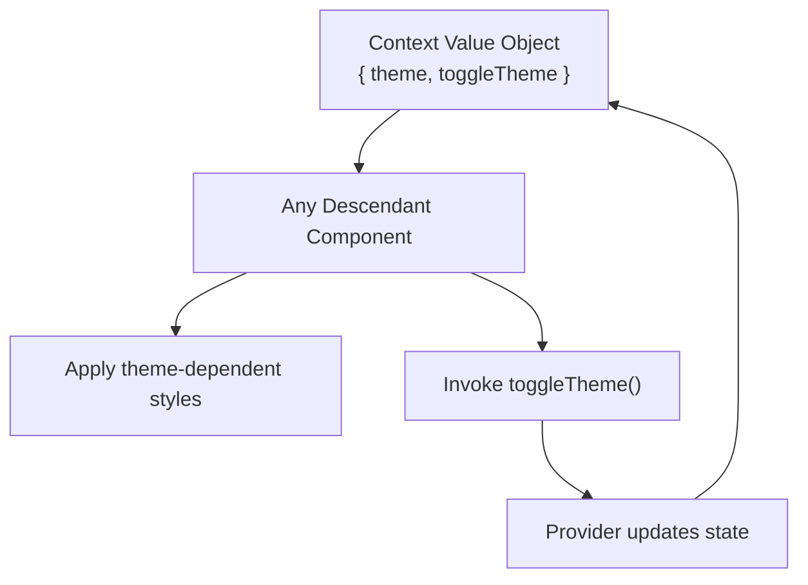
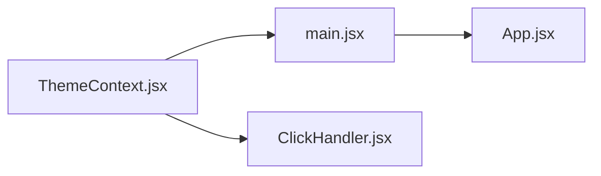

# Context API State Management

<cite>
**Referenced Files in This Document**
- [ThemeContext.jsx](file://src/components/ThemeContext.jsx)
- [main.jsx](file://src/main.jsx)
- [App.jsx](file://src/App.jsx)
- [ClickHandler.jsx](file://src/components/ClickHandler.jsx)
- [keyNotes.md](file://src/keyNotes.md)
</cite>

## Table of Contents
1. [Introduction](#introduction)
2. [Project Structure](#project-structure)
3. [Core Components](#core-components)
4. [Architecture Overview](#architecture-overview)
5. [Detailed Component Analysis](#detailed-component-analysis)
6. [Dependency Analysis](#dependency-analysis)
7. [Performance Considerations](#performance-considerations)
8. [Troubleshooting Guide](#troubleshooting-guide)
9. [Conclusion](#conclusion)

## Introduction
This document explains the Context API implementation for managing global theme state (light/dark mode) across the application. It covers the creation of the ThemeContext, the ThemeProvider component that holds and exposes the theme state, and how components consume the theme via the useContext hook. It also illustrates the data flow during theme toggling, re-render behavior, and best practices to avoid common pitfalls such as missing providers and unnecessary re-renders.

## Project Structure
The theme state is centralized in a dedicated context module and consumed by components throughout the app. The provider is mounted at the application root so all components can access the theme.

**Diagram sources**
- [main.jsx](file://src/main.jsx#L1-L12)
- [ThemeContext.jsx](file://src/components/ThemeContext.jsx#L1-L14)
- [App.jsx](file://src/App.jsx#L1-L53)
- [ClickHandler.jsx](file://src/components/ClickHandler.jsx#L1-L41)

**Section sources**
- [main.jsx](file://src/main.jsx#L1-L12)
- [ThemeContext.jsx](file://src/components/ThemeContext.jsx#L1-L14)
- [App.jsx](file://src/App.jsx#L1-L53)

## Core Components
- ThemeContext: Created with React.createContext() to define a context object for theme state.
- ThemeProvider: A component that wraps children with a Provider and exposes the current theme and a toggle function.
- Consumers: Components that use useContext to read the theme and trigger theme changes.

Key implementation details:
- Context initialization: [ThemeContext.jsx](file://src/components/ThemeContext.jsx#L1-L3)
- Provider setup and value object: [ThemeContext.jsx](file://src/components/ThemeContext.jsx#L4-L13)
- Application root wrapping: [main.jsx](file://src/main.jsx#L8-L12)
- Consumer usage: [ClickHandler.jsx](file://src/components/ClickHandler.jsx#L7-L8)

**Section sources**
- [ThemeContext.jsx](file://src/components/ThemeContext.jsx#L1-L14)
- [main.jsx](file://src/main.jsx#L8-L12)
- [ClickHandler.jsx](file://src/components/ClickHandler.jsx#L7-L8)

## Architecture Overview
The theme state flows from the ThemeProvider down to all descendants. When a consumer triggers a toggle, the provider’s state updates, causing all consumers to re-render with the new theme value.

**Diagram sources**
- [main.jsx](file://src/main.jsx#L8-L12)
- [ThemeContext.jsx](file://src/components/ThemeContext.jsx#L4-L13)
- [ClickHandler.jsx](file://src/components/ClickHandler.jsx#L7-L8)

## Detailed Component Analysis

### ThemeContext and ThemeProvider
- Purpose: Centralize theme state and expose a toggle function to consumers.
- Implementation pattern:
  - Creates a context with createContext().
  - Uses useState to manage the theme string ("light" or "dark").
  - Defines a toggle function that flips the theme.
  - Exposes a value object containing theme and toggleTheme to descendants.

**Diagram sources**
- [ThemeContext.jsx](file://src/components/ThemeContext.jsx#L4-L13)

**Section sources**
- [ThemeContext.jsx](file://src/components/ThemeContext.jsx#L1-L14)

### Application Root Wrapping
- The application is wrapped by ThemeProvider at the root level so all components can access the theme.
- The provider renders App as a child.

**Diagram sources**
- [main.jsx](file://src/main.jsx#L8-L12)

**Section sources**
- [main.jsx](file://src/main.jsx#L8-L12)

### Consumer Component Using ThemeContext
- A consumer component reads the current theme and invokes toggleTheme to switch modes.
- The component conditionally applies styles based on the theme value.

**Diagram sources**
- [ClickHandler.jsx](file://src/components/ClickHandler.jsx#L7-L8)
- [ThemeContext.jsx](file://src/components/ThemeContext.jsx#L4-L13)

**Section sources**
- [ClickHandler.jsx](file://src/components/ClickHandler.jsx#L7-L8)

### Conceptual Overview
- Context value object: { theme, toggleTheme }.
- Consumers access theme to style UI and call toggleTheme to update state.
- The provider ensures all consumers receive the latest theme value.

[No sources needed since this diagram shows conceptual workflow, not actual code structure]

## Dependency Analysis
- ThemeContext.jsx exports ThemeContext and ThemeProvider.
- main.jsx imports ThemeProvider and wraps the App component.
- ClickHandler.jsx imports ThemeContext and uses useContext to read the theme and toggle function.

**Diagram sources**
- [ThemeContext.jsx](file://src/components/ThemeContext.jsx#L1-L14)
- [main.jsx](file://src/main.jsx#L1-L12)
- [ClickHandler.jsx](file://src/components/ClickHandler.jsx#L1-L41)

**Section sources**
- [ThemeContext.jsx](file://src/components/ThemeContext.jsx#L1-L14)
- [main.jsx](file://src/main.jsx#L1-L12)
- [ClickHandler.jsx](file://src/components/ClickHandler.jsx#L1-L41)

## Performance Considerations
- Avoid inline object spreading in the Provider value prop:
  - Current implementation passes a new object { theme, toggleTheme } on each render. This can cause unnecessary re-renders in consumers because the object identity changes each time.
  - Recommended fix: Memoize the value object using useMemo to preserve identity when theme and toggleTheme have not changed.
  - Reference: [ThemeContext.jsx](file://src/components/ThemeContext.jsx#L10-L10)

- Alternative approach for complex state:
  - The repository includes a note demonstrating useReducer with Context for complex state. While not currently used here, it can help avoid frequent re-renders by batching updates and centralizing logic.
  - Reference: [keyNotes.md](file://src/keyNotes.md#L1-L29)

- Practical memoization strategy:
  - Wrap the value object in useMemo and depend on theme and toggleTheme to keep the object reference stable across renders.
  - Reference: [ThemeContext.jsx](file://src/components/ThemeContext.jsx#L4-L13)

**Section sources**
- [ThemeContext.jsx](file://src/components/ThemeContext.jsx#L4-L13)
- [keyNotes.md](file://src/keyNotes.md#L1-L29)

## Troubleshooting Guide
- Missing Provider Error:
  - Symptoms: "Cannot read property 'theme' of undefined" or similar when using useContext.
  - Cause: A component tries to use ThemeContext without being a descendant of ThemeProvider.
  - Fix: Ensure the component tree is wrapped by ThemeProvider at the root.
  - References:
    - [main.jsx](file://src/main.jsx#L8-L12)
    - [ClickHandler.jsx](file://src/components/ClickHandler.jsx#L7-L8)

- Unnecessary Re-renders:
  - Cause: Passing a new object reference in the Provider value prop on every render.
  - Impact: Consumers re-render even when theme has not changed.
  - Fix: Memoize the value object with useMemo to preserve identity.
  - References:
    - [ThemeContext.jsx](file://src/components/ThemeContext.jsx#L10-L10)
    - [ThemeContext.jsx](file://src/components/ThemeContext.jsx#L4-L13)

- Inline Toggle Function Issues:
  - Cause: Defining toggleTheme inline in the provider component can lead to re-creating the function on each render, potentially causing extra re-renders in consumers who depend on the function identity.
  - Fix: Move toggleTheme outside the provider component or memoize it with useCallback to keep the function identity stable.
  - References:
    - [ThemeContext.jsx](file://src/components/ThemeContext.jsx#L6-L8)
    - [ThemeContext.jsx](file://src/components/ThemeContext.jsx#L4-L13)

**Section sources**
- [main.jsx](file://src/main.jsx#L8-L12)
- [ClickHandler.jsx](file://src/components/ClickHandler.jsx#L7-L8)
- [ThemeContext.jsx](file://src/components/ThemeContext.jsx#L4-L13)

## Conclusion
The ThemeContext implementation provides a clean, centralized way to manage light/dark mode across the application. By wrapping the app with ThemeProvider at the root and consuming the context in components, the theme state is consistently available. To optimize performance and reliability, memoize the context value object and ensure the provider is present throughout the component tree. These practices prevent unnecessary re-renders and missing provider errors while keeping the code maintainable.