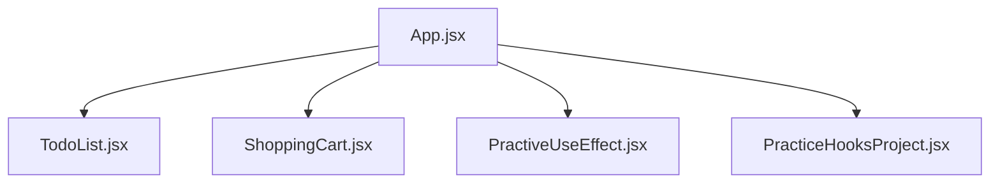
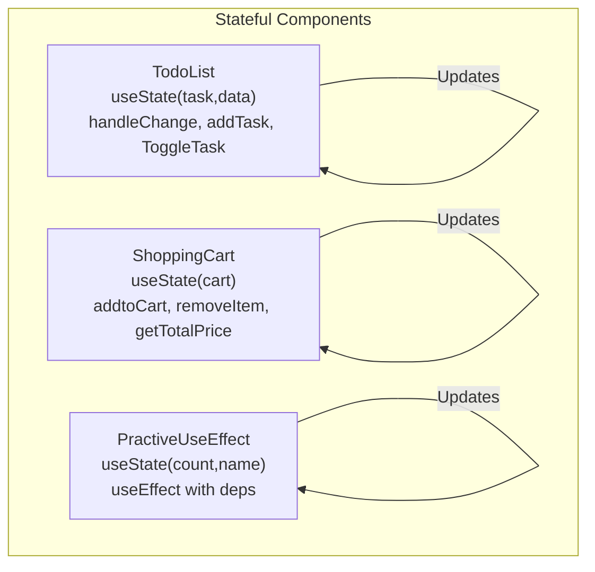
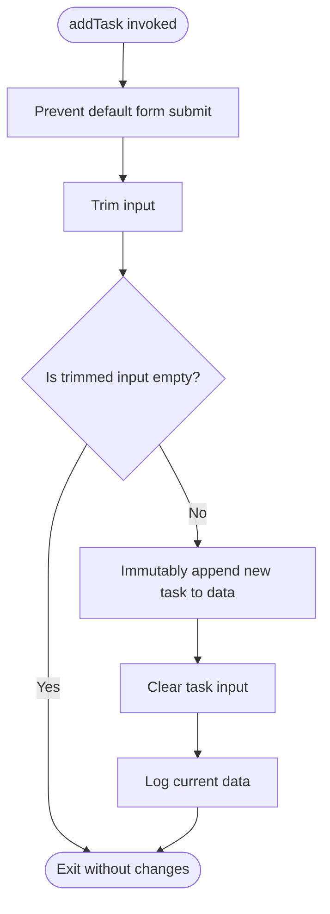
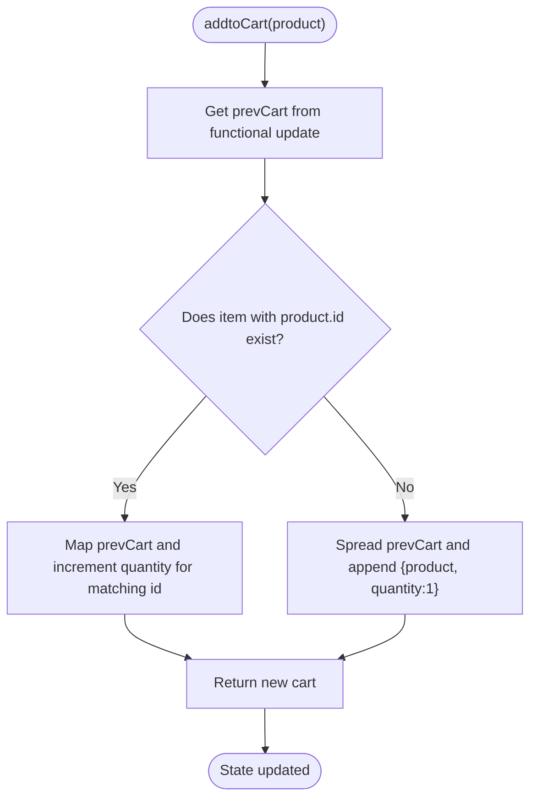
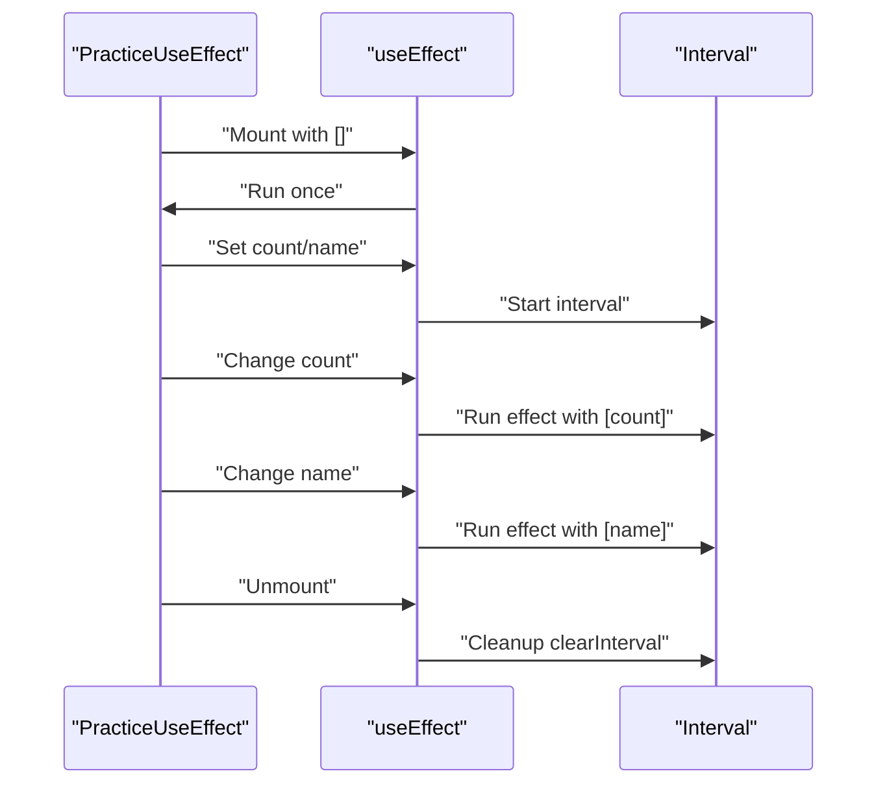
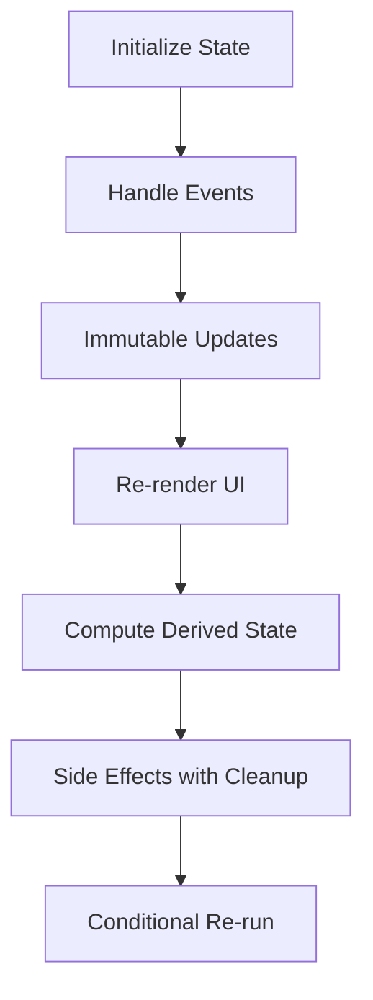
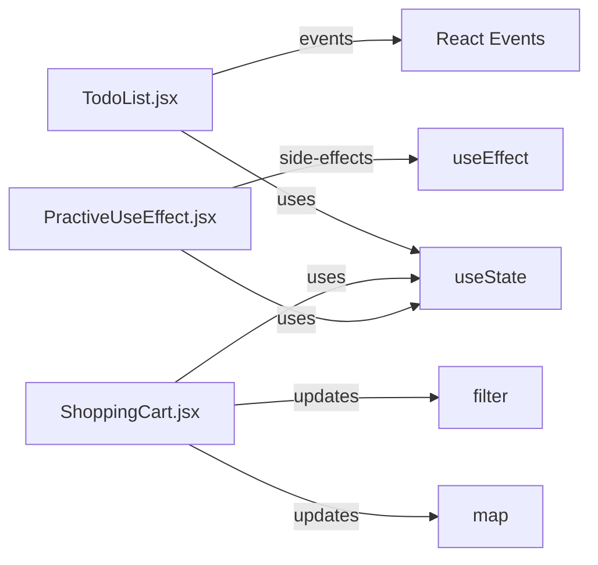

# Local Component State Management

<cite>
**Referenced Files in This Document**
- [TodoList.jsx](file://src/components/TodoList.jsx)
- [ShoppingCart.jsx](file://src/components/ShoppingCart.jsx)
- [PractiveUseEffect.jsx](file://src/components/PractiveUseEffect.jsx)
- [PracticeHooksProject.jsx](file://src/components/PracticeHooksProject.jsx)
- [App.jsx](file://src/App.jsx)
</cite>

## Table of Contents
1. [Introduction](#introduction)
2. [Project Structure](#project-structure)
3. [Core Components](#core-components)
4. [Architecture Overview](#architecture-overview)
5. [Detailed Component Analysis](#detailed-component-analysis)
6. [Dependency Analysis](#dependency-analysis)
7. [Performance Considerations](#performance-considerations)
8. [Troubleshooting Guide](#troubleshooting-guide)
9. [Conclusion](#conclusion)

## Introduction
This document explains local component state management using React’s useState and useEffect hooks, focusing on three components:
- TodoList: demonstrates managing multiple state variables for form input and a task list, immutable updates, and toggling completion status.
- ShoppingCart: demonstrates complex object updates, deduplication and quantity increments, filtering to remove items, and computing derived state.
- PractiveUseEffect: demonstrates useEffect usage patterns, dependency arrays, and cleanup functions to avoid infinite loops and resource leaks.

The goal is to provide practical guidance on initializing state, updating state immutably, deriving state from existing state, and using effects safely and efficiently.

## Project Structure
The relevant components are located under src/components and integrated into the main App component. The TodoList and ShoppingCart components are rendered conditionally in the App routes, while PractiveUseEffect is included as part of the main page rendering.

**Diagram sources**
- [App.jsx](file://src/App.jsx#L22-L56)
- [TodoList.jsx](file://src/components/TodoList.jsx#L1-L56)
- [ShoppingCart.jsx](file://src/components/ShoppingCart.jsx#L1-L75)
- [PractiveUseEffect.jsx](file://src/components/PractiveUseEffect.jsx#L106-L149)
- [PracticeHooksProject.jsx](file://src/components/PracticeHooksProject.jsx#L1-L88)

**Section sources**
- [App.jsx](file://src/App.jsx#L22-L56)

## Core Components
- TodoList: Manages a task input string and a list of tasks. It handles adding tasks and toggling completion status using immutable updates.
- ShoppingCart: Manages a shopping cart with items that include product details and quantity. It adds items, increments quantities when duplicates are detected, removes items, and computes total price.
- PractiveUseEffect: Demonstrates useEffect with empty, single, and multiple dependencies, and includes a cleanup function to prevent memory leaks.

**Section sources**
- [TodoList.jsx](file://src/components/TodoList.jsx#L1-L56)
- [ShoppingCart.jsx](file://src/components/ShoppingCart.jsx#L1-L75)
- [PractiveUseEffect.jsx](file://src/components/PractiveUseEffect.jsx#L106-L149)

## Architecture Overview
The components are standalone functional components that rely on React’s built-in hooks for state and side effects. They do not share state directly; instead, they encapsulate their own state and expose simple event handlers to update it.

**Diagram sources**
- [TodoList.jsx](file://src/components/TodoList.jsx#L1-L56)
- [ShoppingCart.jsx](file://src/components/ShoppingCart.jsx#L1-L75)
- [PractiveUseEffect.jsx](file://src/components/PractiveUseEffect.jsx#L106-L149)

## Detailed Component Analysis

### TodoList.jsx: Managing Form Input and Task List
- State initialization:
  - task: string for the input field.
  - data: array of task objects with id, name, and completed.
- Event handlers:
  - handleChange: updates the task state from the input.
  - addTask: prevents default submission, validates non-empty input, immutably appends a new task object to data, and clears the input.
- ToggleTask:
  - Maps over data to produce a new array with the matching item’s completed flag flipped, ensuring immutability.
- Rendering:
  - Displays a form with an input bound to task and a submit handler.
  - Renders a list of tasks with a button to toggle completion, reflecting completion status visually.

**Diagram sources**
- [TodoList.jsx](file://src/components/TodoList.jsx#L12-L19)

Best practices shown:
- Immutable updates using spread operator and map to avoid mutating existing objects.
- Conditional rendering based on completion status.
- Controlled input binding to state.

Common pitfalls avoided:
- No direct mutation of data; always returns a new array/object.
- Using Date.now() for a simple unique id (consider a dedicated id generator in production).

**Section sources**
- [TodoList.jsx](file://src/components/TodoList.jsx#L1-L56)

### ShoppingCart.jsx: Complex Object Updates and Derived State
- State initialization:
  - cart: array of cart items, each containing product fields plus quantity.
- addtoCart:
  - Uses a functional update to derive the next cart state from previous state.
  - Checks for an existing item by id; if found, increments quantity; otherwise, appends a new item with quantity initialized to 1.
- removeItem:
  - Uses filter to produce a new cart array excluding the item with the given id.
- getTotalPrice:
  - Computes derived state by reducing cart items to total price using price and quantity.

**Diagram sources**
- [ShoppingCart.jsx](file://src/components/ShoppingCart.jsx#L15-L29)

Best practices shown:
- Functional updates to ensure updates reflect the latest state.
- Immutable updates with spread and map/filter to avoid mutations.
- Derived state computed from existing state (getTotalPrice).

Common pitfalls avoided:
- No direct mutation of cart items.
- Explicitly handling both increment and append paths.

**Section sources**
- [ShoppingCart.jsx](file://src/components/ShoppingCart.jsx#L1-L75)

### PractiveUseEffect.jsx: useEffect Patterns and Cleanup
- Component initializes two state variables: count and name.
- Three useEffect scenarios are demonstrated:
  - Empty dependency array: runs once after initial mount.
  - Single dependency: runs when the specific dependency changes.
  - Multiple dependencies: runs when any listed dependency changes.
- Cleanup functions:
  - Clear intervals and cancel asynchronous work to prevent memory leaks and unexpected behavior.

**Diagram sources**
- [PractiveUseEffect.jsx](file://src/components/PractiveUseEffect.jsx#L108-L149)

Best practices shown:
- Use empty dependency array for one-time setup.
- Include only necessary dependencies to avoid unnecessary re-runs.
- Provide cleanup functions for timers and subscriptions.

**Section sources**
- [PractiveUseEffect.jsx](file://src/components/PractiveUseEffect.jsx#L106-L149)

### Conceptual Overview
- State initialization: Initialize state with appropriate defaults for primitive and object/array types.
- Event-driven updates: Use controlled components and event handlers to update state immutably.
- Derived state: Compute derived values from existing state to keep UI synchronized.
- Effects: Use useEffect for side effects with precise dependency arrays and cleanup.

[No sources needed since this diagram shows conceptual workflow, not actual code structure]

## Dependency Analysis
- TodoList depends on:
  - useState for task and data.
  - React’s synthetic events for input and form submission.
- ShoppingCart depends on:
  - useState for cart.
  - Array methods map and filter for immutable updates.
  - Functional updates to ensure correctness across renders.
- PractiveUseEffect depends on:
  - useState for count and name.
  - useEffect with various dependency arrays and cleanup.

**Diagram sources**
- [TodoList.jsx](file://src/components/TodoList.jsx#L1-L56)
- [ShoppingCart.jsx](file://src/components/ShoppingCart.jsx#L1-L75)
- [PractiveUseEffect.jsx](file://src/components/PractiveUseEffect.jsx#L106-L149)

**Section sources**
- [TodoList.jsx](file://src/components/TodoList.jsx#L1-L56)
- [ShoppingCart.jsx](file://src/components/ShoppingCart.jsx#L1-L75)
- [PractiveUseEffect.jsx](file://src/components/PractiveUseEffect.jsx#L106-L149)

## Performance Considerations
- Prefer functional updates when the new state depends on the previous state to avoid stale closures and ensure correctness across rapid updates.
- Use immutable updates (spread, map, filter) to minimize unnecessary re-renders and to enable React to optimize reconciliation.
- Keep dependency arrays in useEffect minimal and accurate to prevent excessive re-runs.
- Avoid heavy computations inside render; compute derived state outside of render or memoize expensive calculations.
- Batch related state updates when possible to reduce re-renders.

[No sources needed since this section provides general guidance]

## Troubleshooting Guide
Common issues and remedies:
- Stale closures in effects:
  - Use functional updates for state that depends on previous values.
  - Ensure dependencies in useEffect include all values read inside the effect.
- Missing dependencies:
  - Add missing values to the dependency array to trigger the effect when they change.
  - Remove unused dependencies to avoid unnecessary re-runs.
- Infinite loops:
  - Provide cleanup functions for timers and subscriptions.
  - Avoid updating state in a way that causes immediate re-trigger of the same effect.
- Performance impacts:
  - Use immutable updates to help React detect real changes.
  - Defer heavy work to requestAnimationFrame or microtasks when appropriate.
  - Consider splitting state into smaller chunks to limit re-renders.

**Section sources**
- [ShoppingCart.jsx](file://src/components/ShoppingCart.jsx#L15-L29)
- [PractiveUseEffect.jsx](file://src/components/PractiveUseEffect.jsx#L106-L149)

## Conclusion
These components demonstrate robust patterns for local state management:
- TodoList shows controlled inputs, immutable updates, and toggling derived from existing state.
- ShoppingCart illustrates complex object updates, deduplication, filtering, and derived state computation.
- PractiveUseEffect showcases safe usage of useEffect with precise dependencies and cleanup.

Adopting functional updates, immutable patterns, and careful dependency management leads to predictable, efficient, and maintainable React applications.