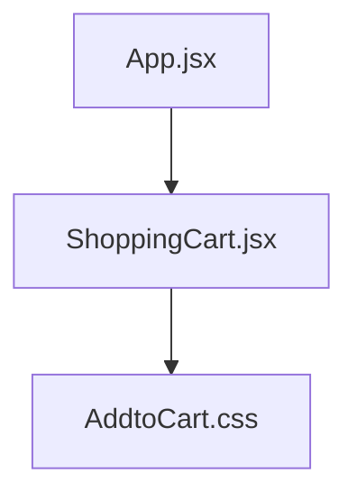
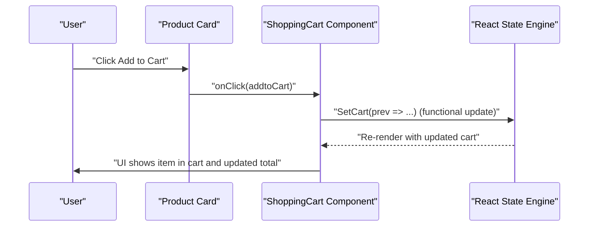
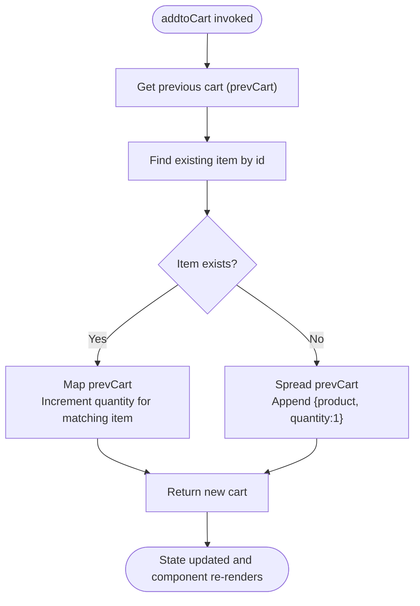
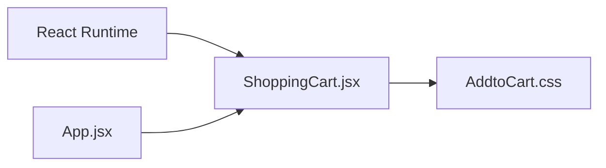

# ShoppingCart State Management

<cite>
**Referenced Files in This Document**
- [ShoppingCart.jsx](file://src/components/ShoppingCart.jsx)
- [AddtoCart.css](file://src/components/AddtoCart.css)
- [App.jsx](file://src/App.jsx)
</cite>

## Table of Contents
1. [Introduction](#introduction)
2. [Project Structure](#project-structure)
3. [Core Components](#core-components)
4. [Architecture Overview](#architecture-overview)
5. [Detailed Component Analysis](#detailed-component-analysis)
6. [Dependency Analysis](#dependency-analysis)
7. [Performance Considerations](#performance-considerations)
8. [Troubleshooting Guide](#troubleshooting-guide)
9. [Conclusion](#conclusion)

## Introduction
This document explains the state management of the ShoppingCart component using React’s useState. It focuses on how the cart state is initialized, how items are added and removed, how quantities are updated immutably, and how derived state (total price) is computed. It also covers UI re-rendering behavior, common pitfalls, and best practices for robust and performant cart operations.

## Project Structure
The ShoppingCart component resides under src/components and is styled via a dedicated CSS module. It is integrated into the main application shell, though routing is commented out in the current App configuration.

**Diagram sources**
- [App.jsx](file://src/App.jsx#L1-L56)
- [ShoppingCart.jsx](file://src/components/ShoppingCart.jsx#L1-L74)
- [AddtoCart.css](file://src/components/AddtoCart.css#L1-L126)

**Section sources**
- [App.jsx](file://src/App.jsx#L1-L56)
- [ShoppingCart.jsx](file://src/components/ShoppingCart.jsx#L1-L74)
- [AddtoCart.css](file://src/components/AddtoCart.css#L1-L126)

## Core Components
- State initialization: The cart state is initialized as an empty array using useState.
- Static product list: A local constant array of products is used for rendering product cards.
- Event handlers:
  - addtoCart: Adds a product to the cart or increments its quantity if already present.
  - removeItem: Removes an item from the cart by filtering by ID.
- Derived state computation: getTotalPrice computes the total cost from the current cart contents.

Key implementation references:
- State initialization and handler declarations: [ShoppingCart.jsx](file://src/components/ShoppingCart.jsx#L9-L35)
- Rendering product list and cart UI: [ShoppingCart.jsx](file://src/components/ShoppingCart.jsx#L36-L73)
- Styling for cart and product list: [AddtoCart.css](file://src/components/AddtoCart.css#L35-L126)

**Section sources**
- [ShoppingCart.jsx](file://src/components/ShoppingCart.jsx#L9-L35)
- [ShoppingCart.jsx](file://src/components/ShoppingCart.jsx#L36-L73)
- [AddtoCart.css](file://src/components/AddtoCart.css#L35-L126)

## Architecture Overview
The component follows a unidirectional data flow:
- User interacts with product cards to add items.
- Handlers update the cart state immutably.
- React re-renders the component tree, reflecting the updated cart and derived totals.

**Diagram sources**
- [ShoppingCart.jsx](file://src/components/ShoppingCart.jsx#L36-L73)

## Detailed Component Analysis

### State Initialization and Data Model
- Cart state: Initialized as an empty array. Each item in the cart is expected to have at least id, name, price, and quantity fields.
- Static products: A local array of product objects is used to render product cards. These are not part of the cart state but drive the initial UI.

References:
- [ShoppingCart.jsx](file://src/components/ShoppingCart.jsx#L9-L11)
- [ShoppingCart.jsx](file://src/components/ShoppingCart.jsx#L3-L7)

**Section sources**
- [ShoppingCart.jsx](file://src/components/ShoppingCart.jsx#L3-L11)

### addtoCart: Immutable Updates and Conditional Logic
Behavior:
- Functional state update: Uses a function form of setState to compute the next cart based on the previous cart snapshot.
- Existence check: Uses find to locate an existing item by id.
- Quantity increment: If found, uses map to produce a new array with the matched item’s quantity incremented.
- New item addition: If not found, spreads the previous cart and appends a new item with quantity set to 1.
- Immutability: No direct mutation; new arrays and objects are returned.

**Diagram sources**
- [ShoppingCart.jsx](file://src/components/ShoppingCart.jsx#L12-L29)

References:
- [ShoppingCart.jsx](file://src/components/ShoppingCart.jsx#L12-L29)

**Section sources**
- [ShoppingCart.jsx](file://src/components/ShoppingCart.jsx#L12-L29)

### removeItem: Filtering by ID
Behavior:
- Functional state update: Filters the previous cart to exclude the item whose id equals the provided productId.
- Immutability: Returns a new array without mutating the original.

References:
- [ShoppingCart.jsx](file://src/components/ShoppingCart.jsx#L30-L32)

**Section sources**
- [ShoppingCart.jsx](file://src/components/ShoppingCart.jsx#L30-L32)

### getTotalPrice: Derived State Calculation
Behavior:
- Computes the total price by reducing the cart array.
- For each item, multiplies price by quantity and accumulates the sum.
- Note: The current implementation treats price as a string. If numeric arithmetic is desired, conversion should be applied.

References:
- [ShoppingCart.jsx](file://src/components/ShoppingCart.jsx#L33-L35)

**Section sources**
- [ShoppingCart.jsx](file://src/components/ShoppingCart.jsx#L33-L35)

### UI Re-rendering and Conditional Rendering
- Product list: Rendered from the static products array.
- Cart list: Conditionally renders “No items” when cart length is zero; otherwise renders each cart item and the total.
- Event binding: Buttons trigger addtoCart and removeItem with appropriate arguments.

References:
- [ShoppingCart.jsx](file://src/components/ShoppingCart.jsx#L36-L73)

**Section sources**
- [ShoppingCart.jsx](file://src/components/ShoppingCart.jsx#L36-L73)

### Styling and Layout
- Product cards and buttons are styled via AddtoCart.css.
- Cart items and remove buttons are styled separately for clarity and responsiveness.

References:
- [AddtoCart.css](file://src/components/AddtoCart.css#L35-L126)

**Section sources**
- [AddtoCart.css](file://src/components/AddtoCart.css#L35-L126)

## Dependency Analysis
- Internal dependencies:
  - ShoppingCart depends on React’s useState for state management.
  - The component imports its own stylesheet for presentation.
- External integration:
  - App integrates ShoppingCart into the application shell. Routing to the ShoppingCart route is currently commented out.

**Diagram sources**
- [ShoppingCart.jsx](file://src/components/ShoppingCart.jsx#L1-L74)
- [AddtoCart.css](file://src/components/AddtoCart.css#L1-L126)
- [App.jsx](file://src/App.jsx#L1-L56)

**Section sources**
- [ShoppingCart.jsx](file://src/components/ShoppingCart.jsx#L1-L74)
- [AddtoCart.css](file://src/components/AddtoCart.css#L1-L126)
- [App.jsx](file://src/App.jsx#L1-L56)

## Performance Considerations
- Functional updates: Using function form of setState ensures updates are based on the latest snapshot, preventing stale closure issues when multiple updates are batched.
- Immutability: Spreading arrays and cloning objects prevents accidental shared mutable state, improving predictability and enabling efficient re-renders.
- Derived calculations: getTotalPrice runs on demand during render. For large carts, consider memoizing the total using useMemo to avoid recomputation on every render.
- Rendering costs: Mapping over cart and products is O(n). If performance becomes a concern, consider:
  - Virtualizing long lists.
  - Memoizing product and cart item components.
  - Avoiding unnecessary re-computation of totals by caching derived values.

[No sources needed since this section provides general guidance]

## Troubleshooting Guide
Common issues and resolutions:
- Missing dependencies in event handlers:
  - Ensure that event handlers are declared inside the component so they capture the current props/state. Inline arrow functions bound to event handlers are acceptable here because they close over the current component state.
- Incorrect object spreading:
  - When adding a new item, spread the product and set quantity to 1. When incrementing quantity, spread the matched item and update only the quantity field.
- Mutating state directly:
  - Never push or splice into the cart array directly. Always return a new array from SetCart.
- Price type mismatch:
  - The current price is stored as a string. If arithmetic is performed, convert to a number before multiplication to avoid unexpected behavior.
- Re-render loops:
  - Avoid computing heavy derived values inside render unless memoized. Consider extracting totals to a memoized selector if the cart grows large.
- Conditional rendering:
  - The component conditionally renders “No items” when cart length is zero. Ensure the condition remains accurate after removals.

References:
- [ShoppingCart.jsx](file://src/components/ShoppingCart.jsx#L12-L35)
- [ShoppingCart.jsx](file://src/components/ShoppingCart.jsx#L36-L73)

**Section sources**
- [ShoppingCart.jsx](file://src/components/ShoppingCart.jsx#L12-L35)
- [ShoppingCart.jsx](file://src/components/ShoppingCart.jsx#L36-L73)

## Conclusion
The ShoppingCart component demonstrates clean, immutable state updates using functional setState. It initializes an empty cart, manages add/remove operations safely, and computes a derived total. By adhering to immutable update patterns and considering performance optimizations like memoization, the component remains predictable and scalable. The UI re-renders reliably in response to state changes, driven by user interactions with product cards and cart controls.