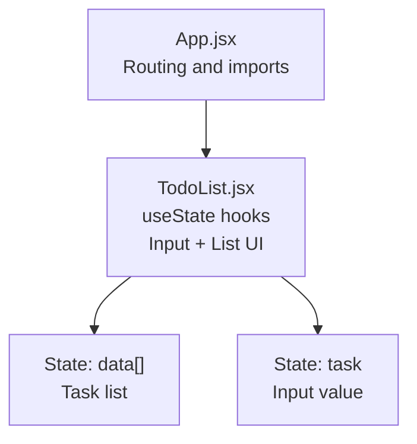
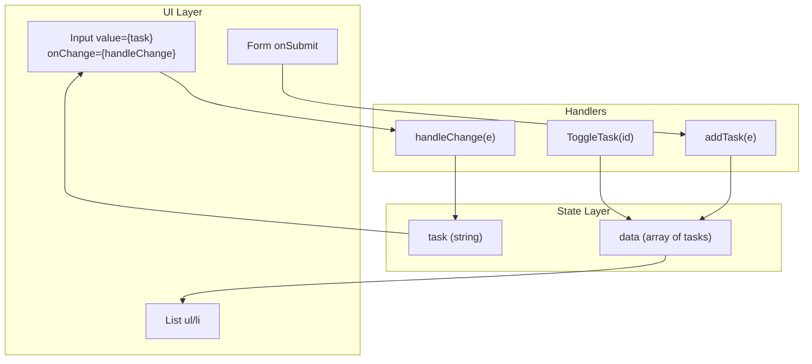
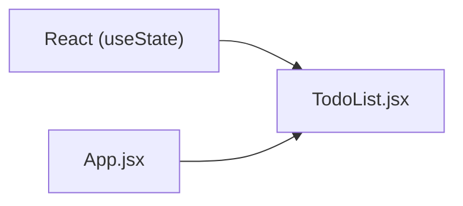

# TodoList State Management

<cite>
**Referenced Files in This Document**
- [TodoList.jsx](file://src/components/TodoList.jsx)
- [App.jsx](file://src/App.jsx)
- [PracticeHooksProject.jsx](file://src/components/PracticeHooksProject.jsx)
- [CRUDoperation.jsx](file://src/components/CRUDoperation.jsx)
</cite>

## Table of Contents
1. [Introduction](#introduction)
2. [Project Structure](#project-structure)
3. [Core Components](#core-components)
4. [Architecture Overview](#architecture-overview)
5. [Detailed Component Analysis](#detailed-component-analysis)
6. [Dependency Analysis](#dependency-analysis)
7. [Performance Considerations](#performance-considerations)
8. [Troubleshooting Guide](#troubleshooting-guide)
9. [Conclusion](#conclusion)

## Introduction
This document explains the TodoList component’s state management using React’s useState hook. It focuses on initializing two state variables—task for capturing user input and data for storing the list of tasks—and details the handleChange, addTask, and ToggleTask functions. It also covers controlled input behavior, immutable updates, conditional rendering, dynamic styling based on completion status, and common pitfalls such as stale console logs due to asynchronous state updates and React batching.

## Project Structure
The TodoList component resides under src/components and is integrated into the application routing in App.jsx. The component uses React’s built-in hooks to manage local state and render a simple todo list interface.

**Diagram sources**
- [App.jsx](file://src/App.jsx#L1-L56)
- [TodoList.jsx](file://src/components/TodoList.jsx#L1-L56)

**Section sources**
- [App.jsx](file://src/App.jsx#L1-L56)
- [TodoList.jsx](file://src/components/TodoList.jsx#L1-L56)

## Core Components
- State initialization:
  - task: string, initialized to an empty string, bound to the input field to create a controlled input.
  - data: array, initialized to an empty array, stores the list of tasks.
- Event handlers:
  - handleChange: updates task state from the input’s value.
  - addTask: prevents default form submission, validates input, immutably appends a new task object with a unique id, name, and completion status, and clears the input.
  - ToggleTask: maps over data to flip the completed status of a specific task while preserving immutability.
- Conditional rendering and dynamic styling:
  - The list renders each task with inline style based on completion status.
  - Buttons reflect the current completion state.

Key implementation references:
- State initialization and controlled input: [TodoList.jsx](file://src/components/TodoList.jsx#L5-L10)
- handleChange: [TodoList.jsx](file://src/components/TodoList.jsx#L8-L10)
- addTask: [TodoList.jsx](file://src/components/TodoList.jsx#L12-L19)
- ToggleTask: [TodoList.jsx](file://src/components/TodoList.jsx#L21-L27)
- Conditional rendering and dynamic styling: [TodoList.jsx](file://src/components/TodoList.jsx#L42-L51)

**Section sources**
- [TodoList.jsx](file://src/components/TodoList.jsx#L1-L56)

## Architecture Overview
The TodoList component is self-contained and relies on React’s useState for local state. It does not depend on external libraries or context providers. The component’s lifecycle is minimal—no useEffect is used—so state updates are purely user-driven.

**Diagram sources**
- [TodoList.jsx](file://src/components/TodoList.jsx#L1-L56)

## Detailed Component Analysis

### State Initialization and Controlled Input
- task is initialized to an empty string and bound to the input element’s value, ensuring React controls the input state.
- handleChange updates task using the event target’s value, maintaining controlled input behavior.

Implementation references:
- Controlled input binding: [TodoList.jsx](file://src/components/TodoList.jsx#L32-L39)
- handleChange: [TodoList.jsx](file://src/components/TodoList.jsx#L8-L10)

Best practices demonstrated:
- Controlled input avoids uncontrolled components and ensures predictable state updates.

**Section sources**
- [TodoList.jsx](file://src/components/TodoList.jsx#L1-L56)

### addTask: Validation, Immutable Updates, and Default Prevention
- Prevents default form submission to keep the page from reloading.
- Validates input using a trim check to ensure non-empty tasks.
- Creates a new task object with a unique id, name, and completion status.
- Immutably updates data by spreading existing items and appending the new task.
- Clears the input after successful addition.

Implementation references:
- addTask handler and validation: [TodoList.jsx](file://src/components/TodoList.jsx#L12-L19)
- Immutable append with spread operator: [TodoList.jsx](file://src/components/TodoList.jsx#L15-L15)

Comparison with functional updates:
- The current implementation directly spreads the previous array. For scenarios where multiple updates occur rapidly, functional updates can help avoid reading stale state. See patterns in [PracticeHooksProject.jsx](file://src/components/PracticeHooksProject.jsx#L45-L59) and [CRUDoperation.jsx](file://src/components/CRUDoperation.jsx#L10-L17).

**Section sources**
- [TodoList.jsx](file://src/components/TodoList.jsx#L1-L56)
- [PracticeHooksProject.jsx](file://src/components/PracticeHooksProject.jsx#L45-L59)
- [CRUDoperation.jsx](file://src/components/CRUDoperation.jsx#L10-L17)

### ToggleTask: Immutable Completion Toggling
- Maps over data to locate the task by id and flips its completed status.
- Uses the spread operator to preserve immutability for unchanged items.

Implementation references:
- ToggleTask: [TodoList.jsx](file://src/components/TodoList.jsx#L21-L27)

Comparison with functional updates:
- Functional updates can be used here as well to avoid potential stale reads in edge cases. See [PracticeHooksProject.jsx](file://src/components/PracticeHooksProject.jsx#L53-L59).

**Section sources**
- [TodoList.jsx](file://src/components/TodoList.jsx#L1-L56)
- [PracticeHooksProject.jsx](file://src/components/PracticeHooksProject.jsx#L53-L59)

### Conditional Rendering and Dynamic Styling
- The list renders each item with a key derived from the task id.
- Inline style dynamically sets color based on completion status.
- Button text reflects completion state.

Implementation references:
- Conditional rendering and dynamic styling: [TodoList.jsx](file://src/components/TodoList.jsx#L42-L51)

**Section sources**
- [TodoList.jsx](file://src/components/TodoList.jsx#L1-L56)

### Practical Code Example Paths
- Controlled input binding and submit handler: [TodoList.jsx](file://src/components/TodoList.jsx#L32-L41)
- Immutable task addition: [TodoList.jsx](file://src/components/TodoList.jsx#L12-L19)
- Immutable completion toggle: [TodoList.jsx](file://src/components/TodoList.jsx#L21-L27)
- Conditional rendering and dynamic styling: [TodoList.jsx](file://src/components/TodoList.jsx#L42-L51)

**Section sources**
- [TodoList.jsx](file://src/components/TodoList.jsx#L1-L56)

## Dependency Analysis
- Internal dependencies:
  - TodoList.jsx depends on React’s useState for local state.
  - The component does not import or rely on external libraries.
- Routing integration:
  - App.jsx imports TodoList and includes it in routes, enabling navigation to the component.

**Diagram sources**
- [TodoList.jsx](file://src/components/TodoList.jsx#L1-L56)
- [App.jsx](file://src/App.jsx#L1-L56)

**Section sources**
- [TodoList.jsx](file://src/components/TodoList.jsx#L1-L56)
- [App.jsx](file://src/App.jsx#L1-L56)

## Performance Considerations
- Spread operator usage ensures immutability and avoids accidental mutations, which helps React reconcile efficiently.
- Using unique ids (e.g., timestamps) for tasks improves list reconciliation performance.
- Avoid unnecessary re-renders by keeping handlers stable and relying on React’s internal batching for state updates.

[No sources needed since this section provides general guidance]

## Troubleshooting Guide

Common issue: Stale console.log(data) after addTask
- Symptom: Logging data immediately after setData shows the previous state.
- Cause: setState is asynchronous, and console.log executes before the state update completes.
- Mitigation:
  - Use useEffect to log state changes after they commit:
    - Example pattern: [CRUDoperation.jsx](file://src/components/CRUDoperation.jsx#L6-L8)
  - Or log inside the addTask handler after clearing the input to observe the immediate effect:
    - Current behavior: [TodoList.jsx](file://src/components/TodoList.jsx#L12-L19)

React batching and state visibility
- React batches multiple state updates within the same event handler for performance. This can delay when logs reflect the updated state.
- Best practice: rely on re-renders and effects for side effects rather than synchronous logging.

Immutability pitfalls
- Avoid direct mutation of data (e.g., push or splice). Always spread existing items and create a new array.
- Verified pattern in component: [TodoList.jsx](file://src/components/TodoList.jsx#L15-L15)

Functional updates for reliability
- When rapid updates occur, prefer functional updates to avoid stale reads:
  - Example patterns: [PracticeHooksProject.jsx](file://src/components/PracticeHooksProject.jsx#L45-L59), [CRUDoperation.jsx](file://src/components/CRUDoperation.jsx#L10-L17)

**Section sources**
- [TodoList.jsx](file://src/components/TodoList.jsx#L12-L19)
- [CRUDoperation.jsx](file://src/components/CRUDoperation.jsx#L6-L8)
- [PracticeHooksProject.jsx](file://src/components/PracticeHooksProject.jsx#L45-L59)

## Conclusion
The TodoList component demonstrates clean, idiomatic React state management with useState. It uses controlled inputs, immutable updates, and conditional rendering with dynamic styling. By understanding asynchronous state updates and React’s batching, developers can avoid common pitfalls and write robust, predictable UI logic.

[No sources needed since this section summarizes without analyzing specific files]