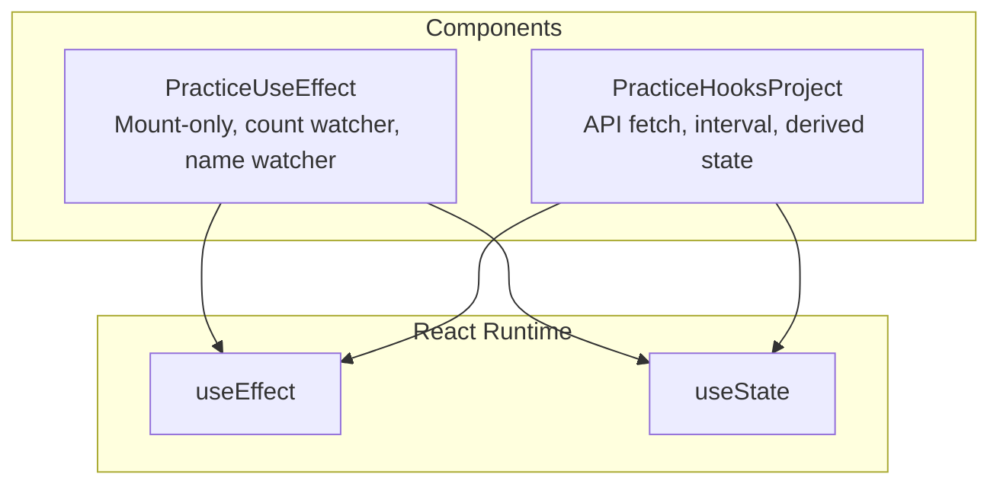
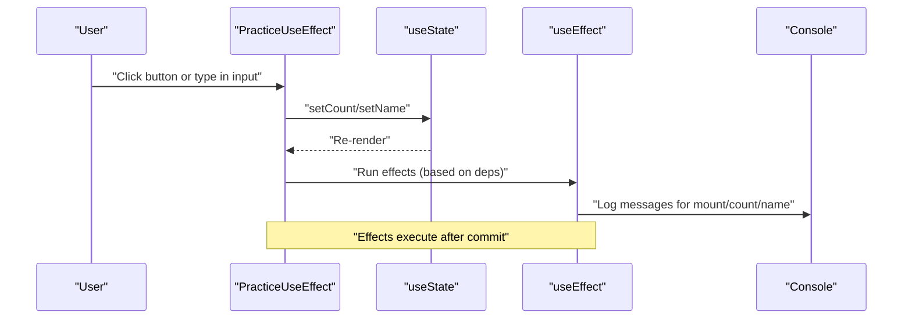
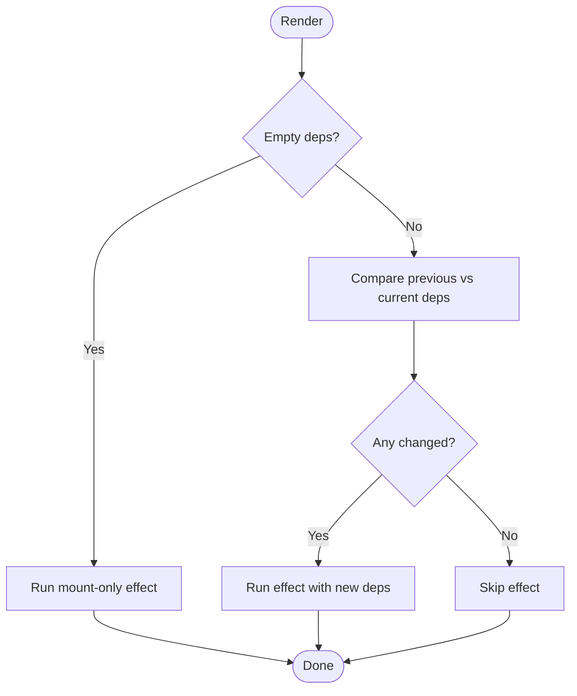
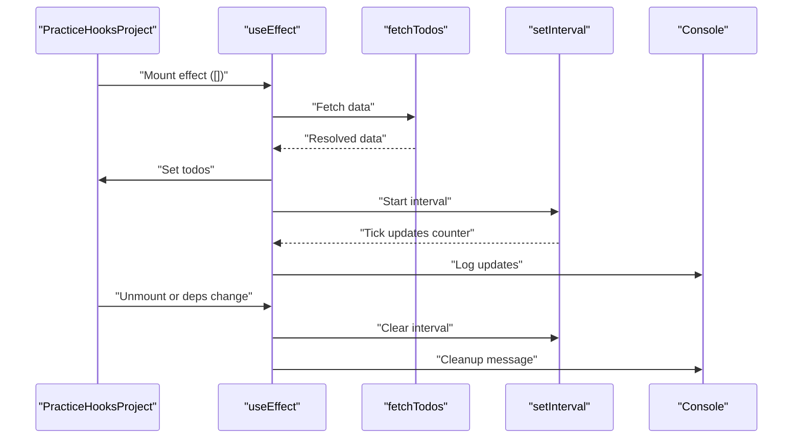
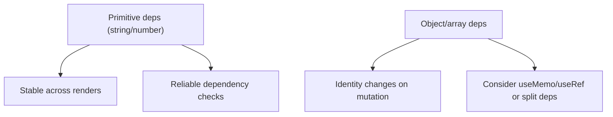

# useEffect Hook Usage and Patterns

<cite>
**Referenced Files in This Document**
- [PractiveUseEffect.jsx](file://src/components/PractiveUseEffect.jsx)
- [PracticeHooksProject.jsx](file://src/components/PracticeHooksProject.jsx)
</cite>

## Table of Contents
1. [Introduction](#introduction)
2. [Project Structure](#project-structure)
3. [Core Components](#core-components)
4. [Architecture Overview](#architecture-overview)
5. [Detailed Component Analysis](#detailed-component-analysis)
6. [Dependency Analysis](#dependency-analysis)
7. [Performance Considerations](#performance-considerations)
8. [Troubleshooting Guide](#troubleshooting-guide)
9. [Conclusion](#conclusion)

## Introduction
This document explains practical useEffect patterns demonstrated in the repository’s components, focusing on:
- Running effects only on mount
- Watching specific state changes
- Responding to user input changes
- Proper dependency arrays to avoid infinite loops
- How React compares dependencies using referential equality
- Best practices for debugging and maintaining effects
- When to use useEffect versus alternatives and how to test side effects in development

## Project Structure
The useEffect practice is implemented in a single component file with additional examples in another component that demonstrates cleanup and derived state patterns.

**Diagram sources**
- [PractiveUseEffect.jsx](file://src/components/PractiveUseEffect.jsx#L106-L149)
- [PracticeHooksProject.jsx](file://src/components/PracticeHooksProject.jsx#L1-L87)

**Section sources**
- [PractiveUseEffect.jsx](file://src/components/PractiveUseEffect.jsx#L106-L149)
- [PracticeHooksProject.jsx](file://src/components/PracticeHooksProject.jsx#L1-L87)

## Core Components
- PracticeUseEffect: Demonstrates three useEffect patterns:
  - Mount-only effect with an empty dependency array
  - Effect watching a numeric state
  - Effect watching a string state
- PracticeHooksProject: Demonstrates:
  - Fetching data on mount
  - Using intervals with cleanup
  - Deriving state from props/state

These components serve as practical examples for teaching useEffect patterns and best practices.

**Section sources**
- [PractiveUseEffect.jsx](file://src/components/PractiveUseEffect.jsx#L106-L149)
- [PracticeHooksProject.jsx](file://src/components/PracticeHooksProject.jsx#L1-L87)

## Architecture Overview
The components orchestrate state updates and side effects. Effects run after renders, reacting to state changes or mounting. Cleanup functions prevent leaks and stale behavior.

**Diagram sources**
- [PractiveUseEffect.jsx](file://src/components/PractiveUseEffect.jsx#L106-L149)

## Detailed Component Analysis

### PracticeUseEffect: Three useEffect Patterns
- Mount-only effect (empty dependency array): Logs a message when the component mounts.
- Count watcher effect (dependency on a numeric state): Logs whenever the count state changes.
- Name watcher effect (dependency on a string state): Logs whenever the name state changes.

**Diagram sources**
- [PractiveUseEffect.jsx](file://src/components/PractiveUseEffect.jsx#L112-L125)

Implementation highlights:
- Mount-only effect: See [PractiveUseEffect.jsx](file://src/components/PractiveUseEffect.jsx#L112-L115)
- Count watcher: See [PractiveUseEffect.jsx](file://src/components/PractiveUseEffect.jsx#L117-L120)
- Name watcher: See [PractiveUseEffect.jsx](file://src/components/PractiveUseEffect.jsx#L122-L125)

Key takeaways:
- Empty dependency array runs only on mount.
- Single primitive dependency runs when that value changes.
- Effects log to help debug execution timing.

**Section sources**
- [PractiveUseEffect.jsx](file://src/components/PractiveUseEffect.jsx#L112-L125)

### PracticeHooksProject: Cleanup and Derived State
- API fetch on mount: Simulates fetching data and sets state, with a cleanup to avoid updating state after unmount.
- Interval with cleanup: Starts a timer and clears it on unmount or when dependencies change.
- Derived state: Computes a derived value from the main dataset.

**Diagram sources**
- [PracticeHooksProject.jsx](file://src/components/PracticeHooksProject.jsx#L1-L42)

Implementation highlights:
- Mount-only fetch: See [PracticeHooksProject.jsx](file://src/components/PracticeHooksProject.jsx#L15-L24)
- Interval with cleanup: See [PracticeHooksProject.jsx](file://src/components/PracticeHooksProject.jsx#L26-L36)
- Derived state: See [PracticeHooksProject.jsx](file://src/components/PracticeHooksProject.jsx#L38-L42)

**Section sources**
- [PracticeHooksProject.jsx](file://src/components/PracticeHooksProject.jsx#L1-L42)

## Dependency Analysis
React compares dependencies using referential equality. Primitive values (strings, numbers) are safe in dependency arrays because they are immutable and compare by value semantics at the language level. Objects and arrays are compared by identity, so wrapping them in refs or memoizing them prevents unnecessary re-runs.

[No sources needed since this diagram shows conceptual workflow, not actual code structure]

Common pitfalls and remedies:
- Missing dependencies leads to stale closures. Always include every value read inside the effect in the dependency array.
- Overly broad dependencies cause frequent re-runs. Narrow to the minimal set of values that drive the effect.
- Omitting the dependency array causes the effect to run after every render. Prefer explicit arrays to avoid unintended behavior.

Best practices:
- Always specify correct dependencies.
- Use console logs to confirm when effects run.
- Separate unrelated effects for clarity and maintainability.
- Use cleanup functions for subscriptions, intervals, or timers.

**Section sources**
- [PractiveUseEffect.jsx](file://src/components/PractiveUseEffect.jsx#L112-L125)
- [PracticeHooksProject.jsx](file://src/components/PracticeHooksProject.jsx#L26-L36)

## Performance Considerations
- Prefer precise dependencies to minimize re-execution.
- Use memoization helpers (e.g., useMemo/useCallback) when passing objects/functions to avoid identity churn.
- Split complex effects into smaller, focused effects to improve readability and reduce unnecessary work.

[No sources needed since this section provides general guidance]

## Troubleshooting Guide
- Debugging effect execution: Use console logs to observe when effects run and what values they see.
- Infinite loops: Verify dependencies and avoid mutating state directly inside effects without proper guards.
- Stale closures: Ensure all values used inside the effect are included in the dependency array.
- Memory leaks: Always clean up subscriptions, intervals, and listeners in the cleanup function.

Examples in the repository:
- Mount-only logging: See [PractiveUseEffect.jsx](file://src/components/PractiveUseEffect.jsx#L112-L115)
- Cleanup example (commented): See [PractiveUseEffect.jsx](file://src/components/PractiveUseEffect.jsx#L20-L55)
- Interval cleanup: See [PracticeHooksProject.jsx](file://src/components/PracticeHooksProject.jsx#L26-L36)

**Section sources**
- [PractiveUseEffect.jsx](file://src/components/PractiveUseEffect.jsx#L20-L55)
- [PractiveUseEffect.jsx](file://src/components/PractiveUseEffect.jsx#L112-L125)
- [PracticeHooksProject.jsx](file://src/components/PracticeHooksProject.jsx#L26-L36)

## Conclusion
The repository provides clear, practical examples of useEffect patterns:
- Mount-only effects for initialization
- Watchers for specific state changes
- Cleanup for subscriptions and intervals
- Derived state computation
Use precise dependencies, separate unrelated effects, and leverage console logs for debugging. These patterns help write predictable, efficient, and maintainable React code.