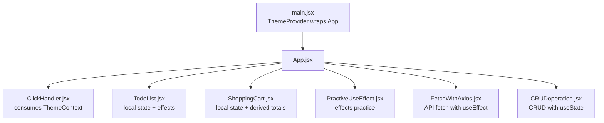
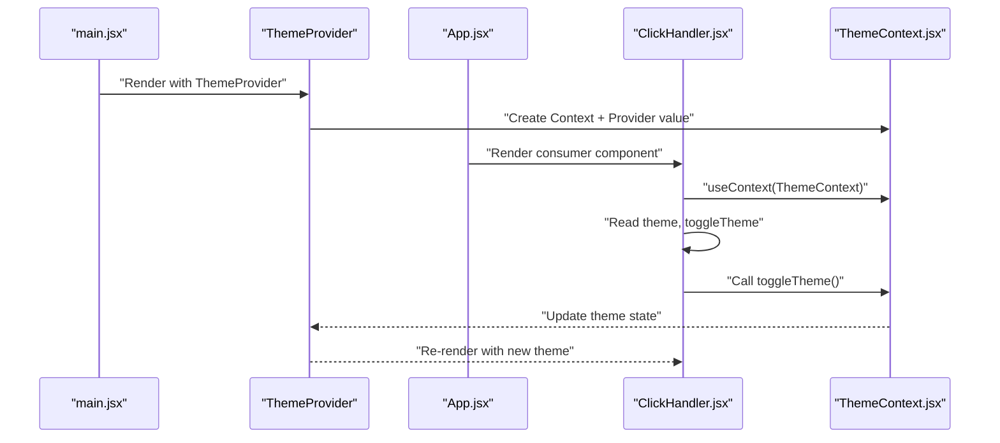
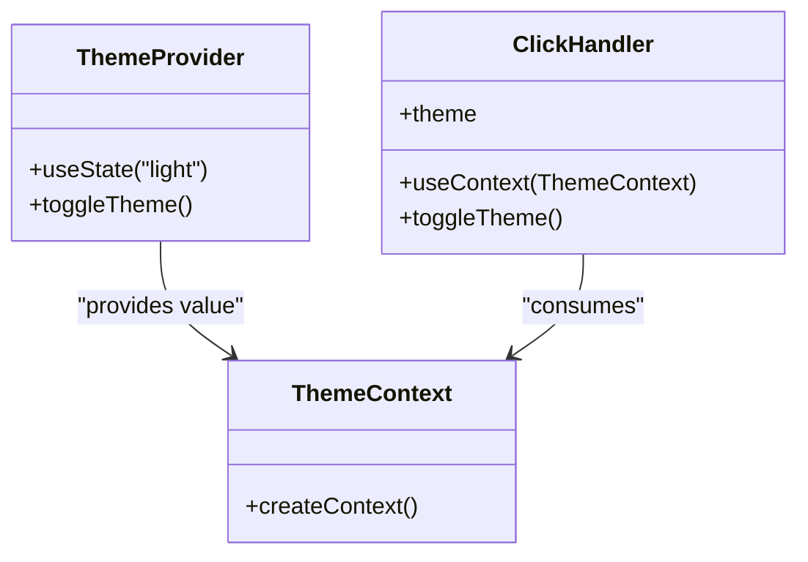
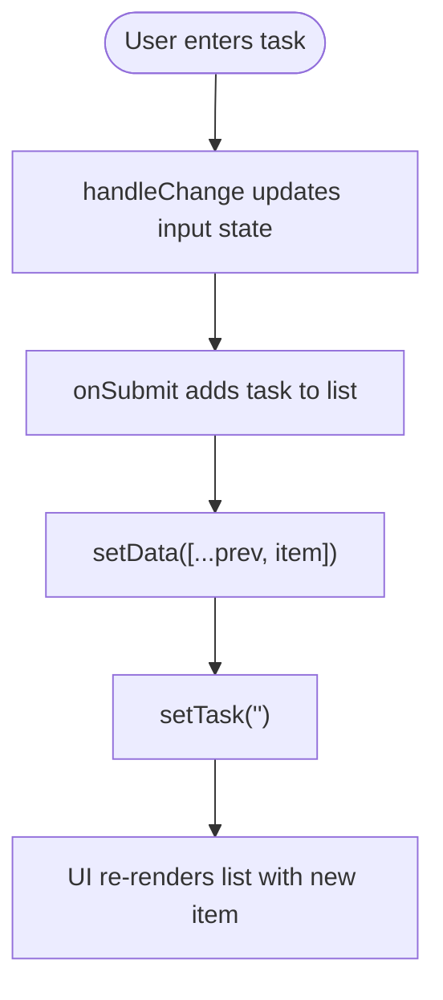
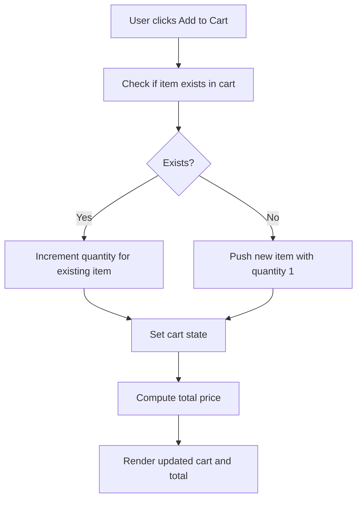
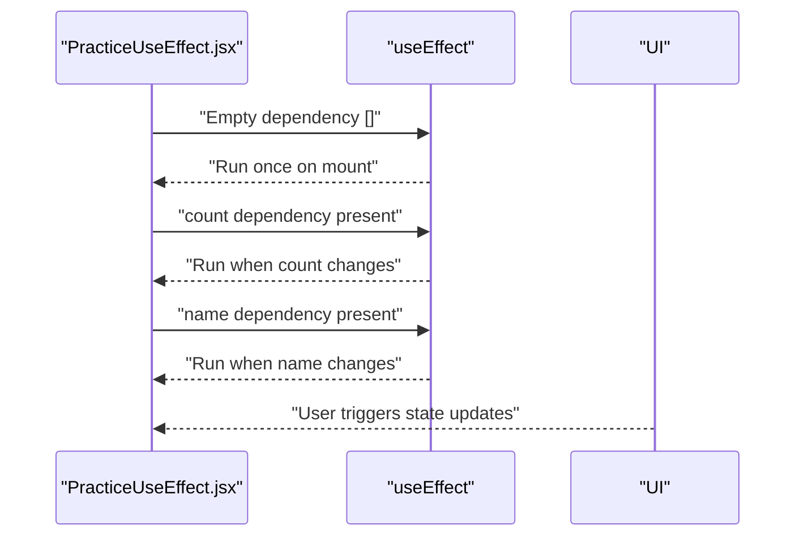
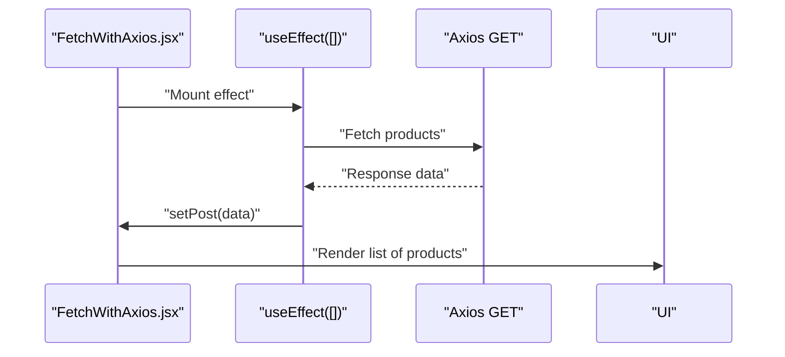
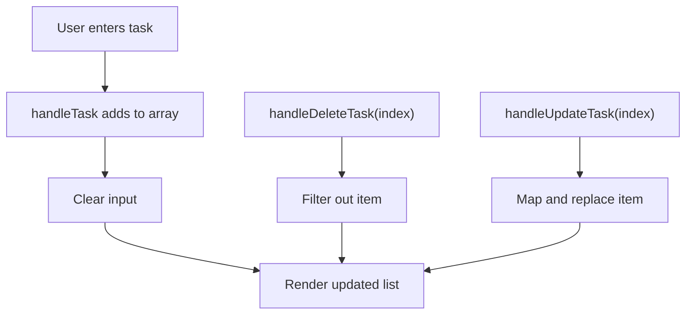
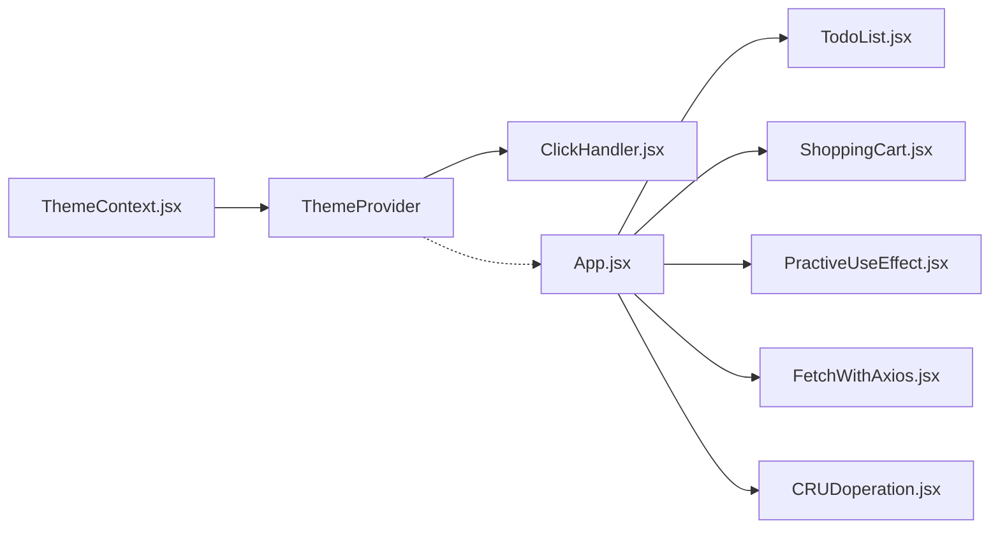

# State Management

<cite>
**Referenced Files in This Document**
- [ThemeContext.jsx](file://src/components/ThemeContext.jsx)
- [main.jsx](file://src/main.jsx)
- [ClickHandler.jsx](file://src/components/ClickHandler.jsx)
- [TodoList.jsx](file://src/components/TodoList.jsx)
- [ShoppingCart.jsx](file://src/components/ShoppingCart.jsx)
- [PractiveUseEffect.jsx](file://src/components/PractiveUseEffect.jsx)
- [FetchWithAxios.jsx](file://src/components/FetchWithAxios.jsx)
- [CRUDoperation.jsx](file://src/components/CRUDoperation.jsx)
- [keyNotes.md](file://src/keyNotes.md)
</cite>

## Table of Contents
1. [Introduction](#introduction)
2. [Project Structure](#project-structure)
3. [Core Components](#core-components)
4. [Architecture Overview](#architecture-overview)
5. [Detailed Component Analysis](#detailed-component-analysis)
6. [Dependency Analysis](#dependency-analysis)
7. [Performance Considerations](#performance-considerations)
8. [Troubleshooting Guide](#troubleshooting-guide)
9. [Conclusion](#conclusion)

## Introduction
This document explains the state management strategies implemented in the car-rental-frontend application. It covers:
- Global state management using React Context (ThemeContext) for light/dark theme toggling
- Component-level state management using useState and side effects with useEffect
- Practical examples from TodoList, ShoppingCart, and PractiveUseEffect
- Data flow from user interaction to state change to UI update
- Common issues such as state synchronization and unnecessary re-renders
- Best practices for state colocating and performance optimizations

## Project Structure
The application initializes the ThemeProvider at the root level and renders feature components that demonstrate local state and effects. ThemeContext is consumed inside components that need global theme state.

**Diagram sources**
- [main.jsx](file://src/main.jsx#L1-L12)
- [ClickHandler.jsx](file://src/components/ClickHandler.jsx#L1-L41)
- [TodoList.jsx](file://src/components/TodoList.jsx#L1-L56)
- [ShoppingCart.jsx](file://src/components/ShoppingCart.jsx#L1-L75)
- [PractiveUseEffect.jsx](file://src/components/PractiveUseEffect.jsx#L106-L149)
- [FetchWithAxios.jsx](file://src/components/FetchWithAxios.jsx#L1-L42)
- [CRUDoperation.jsx](file://src/components/CRUDoperation.jsx#L1-L77)

**Section sources**
- [main.jsx](file://src/main.jsx#L1-L12)

## Core Components
- ThemeContext and ThemeProvider: Provide global theme state and a toggle function to consumers.
- ClickHandler: Demonstrates consuming theme state and invoking the toggle function.
- TodoList: Local state for task input and list, with add and toggle actions.
- ShoppingCart: Local state for cart items, add/remove/update quantity, and computed total price.
- PractiveUseEffect: Exercises useEffect lifecycle patterns with different dependency arrays.
- FetchWithAxios: Fetches remote data on mount and updates state.
- CRUDoperation: Demonstrates adding, updating, and deleting items in a local array.

**Section sources**
- [ThemeContext.jsx](file://src/components/ThemeContext.jsx#L1-L14)
- [ClickHandler.jsx](file://src/components/ClickHandler.jsx#L1-L41)
- [TodoList.jsx](file://src/components/TodoList.jsx#L1-L56)
- [ShoppingCart.jsx](file://src/components/ShoppingCart.jsx#L1-L75)
- [PractiveUseEffect.jsx](file://src/components/PractiveUseEffect.jsx#L106-L149)
- [FetchWithAxios.jsx](file://src/components/FetchWithAxios.jsx#L1-L42)
- [CRUDoperation.jsx](file://src/components/CRUDoperation.jsx#L1-L77)

## Architecture Overview
The global theme state is provided at the root and consumed anywhere in the component tree. Local state is scoped to individual components. Effects orchestrate side effects around state updates.

**Diagram sources**
- [main.jsx](file://src/main.jsx#L1-L12)
- [ThemeContext.jsx](file://src/components/ThemeContext.jsx#L1-L14)
- [ClickHandler.jsx](file://src/components/ClickHandler.jsx#L1-L41)

## Detailed Component Analysis

### Theme Context and Provider
- Creation: ThemeContext is created and exported.
- Provider: ThemeProvider holds theme state and exposes a toggle function.
- Consumption: Components use useContext to read theme and call toggleTheme.

**Diagram sources**
- [ThemeContext.jsx](file://src/components/ThemeContext.jsx#L1-L14)
- [ClickHandler.jsx](file://src/components/ClickHandler.jsx#L1-L41)

**Section sources**
- [ThemeContext.jsx](file://src/components/ThemeContext.jsx#L1-L14)
- [main.jsx](file://src/main.jsx#L1-L12)
- [ClickHandler.jsx](file://src/components/ClickHandler.jsx#L1-L41)
- [keyNotes.md](file://src/keyNotes.md#L1-L29)

### TodoList: Component-Level State and Effects
- State initialization: Two local states for input and list.
- Update patterns: Controlled input updates and immutable list updates.
- Side effects: None in this component; state updates trigger re-renders.

**Diagram sources**
- [TodoList.jsx](file://src/components/TodoList.jsx#L1-L56)

**Section sources**
- [TodoList.jsx](file://src/components/TodoList.jsx#L1-L56)

### ShoppingCart: Component-Level State and Derived Values
- State initialization: Cart initialized as an empty array.
- Update patterns: Functional updates to add items, increment quantities, and remove items.
- Derived values: Total price computed from cart items.

**Diagram sources**
- [ShoppingCart.jsx](file://src/components/ShoppingCart.jsx#L1-L75)

**Section sources**
- [ShoppingCart.jsx](file://src/components/ShoppingCart.jsx#L1-L75)

### PractiveUseEffect: useEffect Patterns
- Mount-only effect: Runs once on initial render.
- Dependency-driven effects: Run when count or name changes.
- Demonstrates logging behavior for different dependency scenarios.

**Diagram sources**
- [PractiveUseEffect.jsx](file://src/components/PractiveUseEffect.jsx#L106-L149)

**Section sources**
- [PractiveUseEffect.jsx](file://src/components/PractiveUseEffect.jsx#L106-L149)

### FetchWithAxios: API Fetch with useEffect
- Initialization: On mount, fetches data and sets state.
- Error handling: Updates loading state and logs errors.
- Rendering: Displays fetched items.

**Diagram sources**
- [FetchWithAxios.jsx](file://src/components/FetchWithAxios.jsx#L1-L42)

**Section sources**
- [FetchWithAxios.jsx](file://src/components/FetchWithAxios.jsx#L1-L42)

### CRUDoperation: Local Array Manipulation
- State initialization: Array of tasks and input field.
- Update patterns: Add, delete, and update operations using immutable updates.
- Effects: Logs task updates when the array changes.

**Diagram sources**
- [CRUDoperation.jsx](file://src/components/CRUDoperation.jsx#L1-L77)

**Section sources**
- [CRUDoperation.jsx](file://src/components/CRUDoperation.jsx#L1-L77)

## Dependency Analysis
- ThemeContext is a lightweight context that holds theme and toggle function.
- ClickHandler depends on ThemeContext for theme-aware rendering and toggling.
- Local components (TodoList, ShoppingCart, PractiveUseEffect, FetchWithAxios, CRUDoperation) manage their own state and effects independently.
- There are no circular dependencies among the analyzed components.

**Diagram sources**
- [ThemeContext.jsx](file://src/components/ThemeContext.jsx#L1-L14)
- [main.jsx](file://src/main.jsx#L1-L12)
- [ClickHandler.jsx](file://src/components/ClickHandler.jsx#L1-L41)
- [TodoList.jsx](file://src/components/TodoList.jsx#L1-L56)
- [ShoppingCart.jsx](file://src/components/ShoppingCart.jsx#L1-L75)
- [PractiveUseEffect.jsx](file://src/components/PractiveUseEffect.jsx#L106-L149)
- [FetchWithAxios.jsx](file://src/components/FetchWithAxios.jsx#L1-L42)
- [CRUDoperation.jsx](file://src/components/CRUDoperation.jsx#L1-L77)

**Section sources**
- [ThemeContext.jsx](file://src/components/ThemeContext.jsx#L1-L14)
- [main.jsx](file://src/main.jsx#L1-L12)
- [ClickHandler.jsx](file://src/components/ClickHandler.jsx#L1-L41)
- [TodoList.jsx](file://src/components/TodoList.jsx#L1-L56)
- [ShoppingCart.jsx](file://src/components/ShoppingCart.jsx#L1-L75)
- [PractiveUseEffect.jsx](file://src/components/PractiveUseEffect.jsx#L106-L149)
- [FetchWithAxios.jsx](file://src/components/FetchWithAxios.jsx#L1-L42)
- [CRUDoperation.jsx](file://src/components/CRUDoperation.jsx#L1-L77)

## Performance Considerations
- Prefer functional state updates when the new state depends on the previous state to avoid stale closures.
- Minimize state updates by batching related changes and avoiding redundant re-renders.
- Use dependency arrays in useEffect to prevent infinite loops and unnecessary runs.
- For derived values like totals, compute them on demand rather than storing redundant copies.
- Avoid heavy computations inside render; move to useMemo/useCallback when appropriate.
- Keep global context providers near the root to reduce unnecessary re-renders in deep trees.

[No sources needed since this section provides general guidance]

## Troubleshooting Guide
Common issues and remedies:
- State synchronization problems:
  - Symptom: UI does not reflect latest state immediately.
  - Cause: Using outdated props or state in callbacks.
  - Fix: Use functional updates or capture values in refs when necessary.
- Unnecessary re-renders:
  - Symptom: Components re-render too often.
  - Cause: Missing or incorrect dependency arrays in useEffect/useMemo/useCallback.
  - Fix: Define precise dependencies; extract stable callbacks with useCallback.
- Stale closures:
  - Symptom: Event handlers use old state values.
  - Cause: Capturing state in closures without updating dependencies.
  - Fix: Use functional updates or keep references up to date.
- Global theme flicker:
  - Symptom: Theme appears inconsistent during initial render.
  - Cause: Theme not persisted across mounts.
  - Fix: Persist theme preference in storage and hydrate at startup.

**Section sources**
- [ShoppingCart.jsx](file://src/components/ShoppingCart.jsx#L1-L75)
- [PractiveUseEffect.jsx](file://src/components/PractiveUseEffect.jsx#L106-L149)
- [FetchWithAxios.jsx](file://src/components/FetchWithAxios.jsx#L1-L42)

## Conclusion
The application demonstrates two complementary state management approaches:
- Global state via React Context for cross-cutting concerns like theme.
- Component-level state with useState and useEffect for feature-specific logic.

By following best practices—functional updates, precise dependency arrays, and careful state colocating—the app remains predictable, performant, and maintainable.