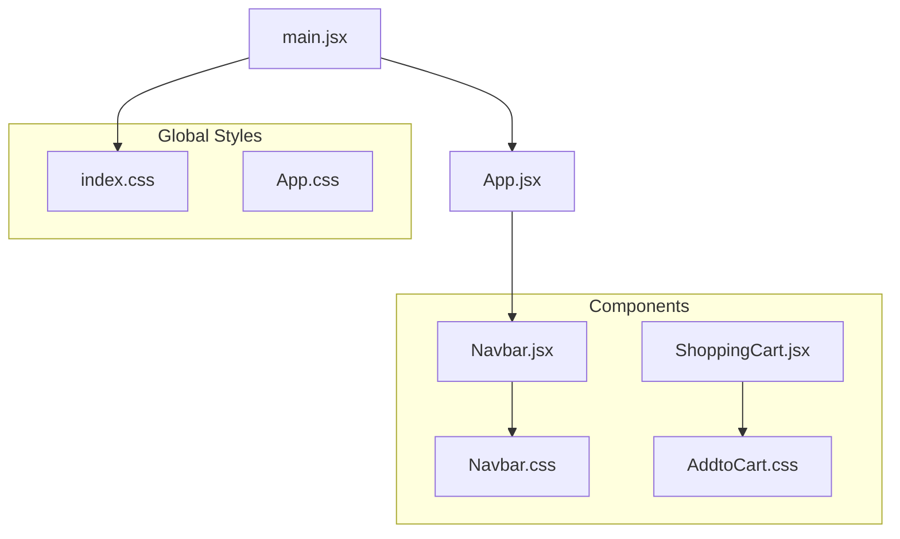
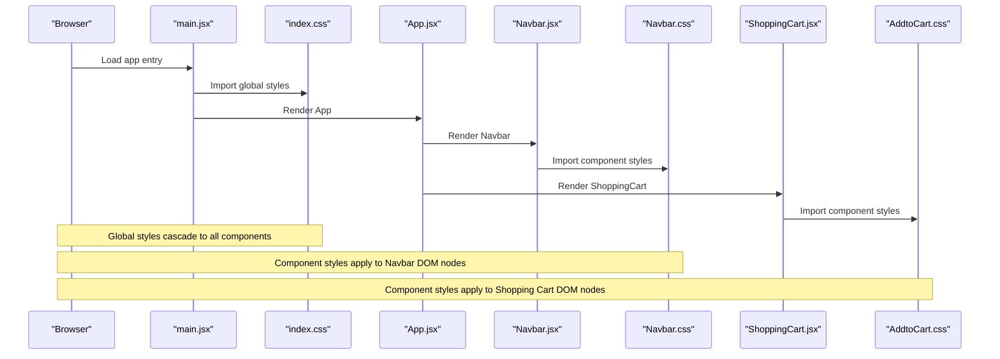
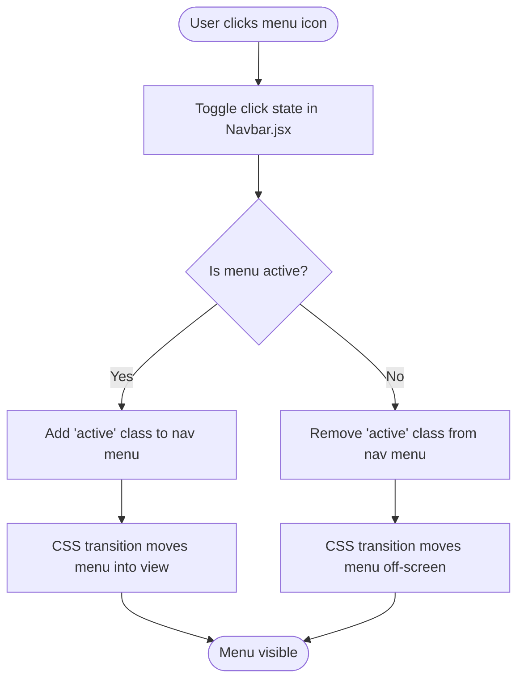
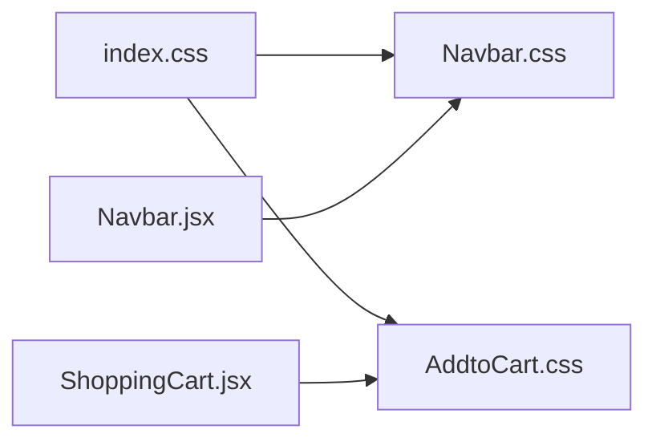

# Styling Strategy

<cite>
**Referenced Files in This Document**
- [index.css](file://src/index.css)
- [App.css](file://src/App.css)
- [Navbar.jsx](file://src/components/Navbar.jsx)
- [Navbar.css](file://src/components/CSS/Navbar.css)
- [AddtoCart.css](file://src/components/AddtoCart.css)
- [ShoppingCart.jsx](file://src/components/ShoppingCart.jsx)
- [main.jsx](file://src/main.jsx)
- [App.jsx](file://src/App.jsx)
- [ThemeContext.jsx](file://src/components/ThemeContext.jsx)
- [vite.config.js](file://vite.config.js)
- [package.json](file://package.json)
</cite>

## Table of Contents
1. [Introduction](#introduction)
2. [Project Structure](#project-structure)
3. [Core Components](#core-components)
4. [Architecture Overview](#architecture-overview)
5. [Detailed Component Analysis](#detailed-component-analysis)
6. [Dependency Analysis](#dependency-analysis)
7. [Performance Considerations](#performance-considerations)
8. [Troubleshooting Guide](#troubleshooting-guide)
9. [Best Practices](#best-practices)
10. [Conclusion](#conclusion)

## Introduction
This document explains the styling architecture of the car-rental-frontend application. It focuses on how global styles are established in index.css and App.css, how component-specific styles are organized using CSS modules (as implemented in Navbar.css and AddtoCart.css), and how these styles are imported and applied within React components. The approach relies on traditional CSS without CSS-in-JS or preprocessors, emphasizing maintainability, consistency, and performance.

## Project Structure
The styling architecture is organized around:
- Global base styles: index.css sets foundational typography, colors, and resets.
- Application-wide layout and animations: App.css defines layout containers, animations, and shared utilities.
- Component-specific styles: Navbar.css and AddtoCart.css encapsulate component styling with scoped class names.
- Component integration: Navbar.jsx imports Navbar.css and applies classes to DOM nodes; ShoppingCart.jsx imports AddtoCart.css similarly.

**Diagram sources**
- [main.jsx](file://src/main.jsx#L1-L13)
- [index.css](file://src/index.css#L1-L69)
- [App.jsx](file://src/App.jsx#L1-L53)
- [Navbar.jsx](file://src/components/Navbar.jsx#L1-L81)
- [Navbar.css](file://src/components/CSS/Navbar.css#L1-L164)
- [ShoppingCart.jsx](file://src/components/ShoppingCart.jsx#L1-L75)
- [AddtoCart.css](file://src/components/AddtoCart.css#L1-L126)

**Section sources**
- [main.jsx](file://src/main.jsx#L1-L13)
- [index.css](file://src/index.css#L1-L69)
- [App.jsx](file://src/App.jsx#L1-L53)

## Core Components
- Global reset and theme foundation: index.css establishes root variables, link and button defaults, and media queries for color scheme preferences.
- Layout and animations: App.css defines the root container, logo hover effects, keyframe animations, and shared card/read-the-docs classes.
- Component-specific styling:
  - Navbar.css: Defines navbar layout, glass-like backdrop, hover states, buttons, and a mobile hamburger menu with media queries.
  - AddtoCart.css: Provides a complete shopping cart UI with product cards, cart items, and responsive grid layout.

These files are imported and applied as follows:
- index.css is imported at the application entry point (main.jsx).
- Component styles are imported directly within the component files (Navbar.jsx imports Navbar.css; ShoppingCart.jsx imports AddtoCart.css).

**Section sources**
- [index.css](file://src/index.css#L1-L69)
- [App.css](file://src/App.css#L1-L43)
- [Navbar.jsx](file://src/components/Navbar.jsx#L1-L81)
- [Navbar.css](file://src/components/CSS/Navbar.css#L1-L164)
- [ShoppingCart.jsx](file://src/components/ShoppingCart.jsx#L1-L75)
- [AddtoCart.css](file://src/components/AddtoCart.css#L1-L126)

## Architecture Overview
The styling pipeline integrates global and component styles as shown below.

**Diagram sources**
- [main.jsx](file://src/main.jsx#L1-L13)
- [index.css](file://src/index.css#L1-L69)
- [App.jsx](file://src/App.jsx#L1-L53)
- [Navbar.jsx](file://src/components/Navbar.jsx#L1-L81)
- [Navbar.css](file://src/components/CSS/Navbar.css#L1-L164)
- [ShoppingCart.jsx](file://src/components/ShoppingCart.jsx#L1-L75)
- [AddtoCart.css](file://src/components/AddtoCart.css#L1-L126)

## Detailed Component Analysis

### Global Styles: index.css
Purpose:
- Establishes root-level typography, color scheme, and accessibility-friendly font smoothing.
- Provides base styles for links, buttons, and body layout.
- Uses a media query to adapt colors based on user preference for reduced motion or color scheme.

Key characteristics:
- Uses CSS variables in :root for consistent theming.
- Applies transitions and focus-visible behavior for interactive elements.
- Ensures a centered layout with minimum viewport dimensions.

Integration:
- Imported at the application entry point (main.jsx) so all components inherit these base styles.

**Section sources**
- [index.css](file://src/index.css#L1-L69)
- [main.jsx](file://src/main.jsx#L1-L13)

### Global Layout and Animations: App.css
Purpose:
- Defines the root container width and padding.
- Adds hover and spin animations for logos.
- Provides reusable classes for cards and documentation text.

Key characteristics:
- Declares keyframes for continuous rotation under reduced-motion preferences.
- Uses class selectors (.card, .read-the-docs) for consistent layout and typography.

Integration:
- Typically imported alongside index.css; used by pages/components that need the shared layout and animations.

**Section sources**
- [App.css](file://src/App.css#L1-L43)

### Component-Specific Styling: Navbar.css
Approach:
- Uses CSS custom properties (:root variables) for consistent theming across the navbar.
- Implements a sticky, glass-like navigation bar with backdrop filters and subtle shadows.
- Provides hover states for links and buttons with smooth transitions.
- Includes a mobile hamburger menu with a slide-in transition controlled by a class toggle.

Responsive design:
- A media query targets screens narrower than a threshold, switching the navigation menu to a vertical stack and hiding desktop buttons.
- The active class toggles the menu’s horizontal position for a slide-in/out effect.

Mobile hamburger transitions:
- The menu icon toggles a click state in Navbar.jsx, which adds/removes the active class on the nav menu element.
- The CSS transition animates the menu’s left offset and background for a smooth reveal.

Practical examples from Navbar.css:
- Class-based styling: .navbar, .nav-menu, .nav-link, .btn, .menu-icon.
- Responsive design: @media screen and (max-width: 768px) {...}.
- Mobile hamburger transitions: .nav-menu.active controls the slide-in behavior.

**Diagram sources**
- [Navbar.jsx](file://src/components/Navbar.jsx#L1-L81)
- [Navbar.css](file://src/components/CSS/Navbar.css#L131-L164)

**Section sources**
- [Navbar.css](file://src/components/CSS/Navbar.css#L1-L164)
- [Navbar.jsx](file://src/components/Navbar.jsx#L1-L81)

### Component-Specific Styling: AddtoCart.css
Approach:
- Encapsulates a complete shopping cart UI with product listings and cart items.
- Uses a container class to center content and provide spacing.
- Defines product cards with hover and button states.
- Includes cart item list styles and remove button styling.

Responsive design:
- Uses flexbox and gap to arrange product cards responsively.
- Maintains readability and spacing across different viewport widths.

Integration:
- Imported by ShoppingCart.jsx, which renders product cards and cart items with matching class names.

**Section sources**
- [AddtoCart.css](file://src/components/AddtoCart.css#L1-L126)
- [ShoppingCart.jsx](file://src/components/ShoppingCart.jsx#L1-L75)

### Component Integration: Navbar.jsx
- Imports Navbar.css to apply component-specific styles.
- Uses Link from react-router-dom to navigate routes.
- Manages a click state to toggle the mobile menu and close it on navigation item clicks.
- Renders buttons with class names defined in Navbar.css.

**Section sources**
- [Navbar.jsx](file://src/components/Navbar.jsx#L1-L81)
- [Navbar.css](file://src/components/CSS/Navbar.css#L1-L164)

## Dependency Analysis
The styling dependencies are straightforward and explicit:
- Global styles depend on browser defaults and are loaded first.
- Component styles depend on the presence of matching class names in the component JSX.
- There are no runtime CSS-in-JS dependencies; styling is static and deterministic.

**Diagram sources**
- [index.css](file://src/index.css#L1-L69)
- [Navbar.jsx](file://src/components/Navbar.jsx#L1-L81)
- [Navbar.css](file://src/components/CSS/Navbar.css#L1-L164)
- [ShoppingCart.jsx](file://src/components/ShoppingCart.jsx#L1-L75)
- [AddtoCart.css](file://src/components/AddtoCart.css#L1-L126)

**Section sources**
- [index.css](file://src/index.css#L1-L69)
- [Navbar.jsx](file://src/components/Navbar.jsx#L1-L81)
- [Navbar.css](file://src/components/CSS/Navbar.css#L1-L164)
- [ShoppingCart.jsx](file://src/components/ShoppingCart.jsx#L1-L75)
- [AddtoCart.css](file://src/components/AddtoCart.css#L1-L126)

## Performance Considerations
- CSS loading: Global styles are imported at the entry point, ensuring they are available before components render. This avoids FOUC (flash of unstyled content) for critical base styles.
- Rendering: CSS custom properties and transitions are lightweight and hardware-accelerated where supported.
- Build pipeline: Vite handles asset bundling and minification during production builds. No special CSS preprocessing is configured in the project.

Potential improvements:
- CSS minification: Vite minifies CSS in production builds by default; ensure production builds are used for deployment.
- Modularization: Consider splitting Navbar.css into smaller files (e.g., _navbar-layout.css, _navbar-responsive.css) to improve maintainability as the navbar grows.
- Critical CSS: Inline critical above-the-fold CSS and defer non-critical CSS to reduce render-blocking resources.

**Section sources**
- [vite.config.js](file://vite.config.js#L1-L8)
- [package.json](file://package.json#L1-L32)

## Troubleshooting Guide
Common issues and resolutions:
- Style conflicts:
  - Cause: Global styles (e.g., button, a) overriding component-specific styles.
  - Resolution: Scope component styles with unique class names and avoid overly broad selectors in global CSS. Prefer component-scoped classes and limit global resets to essential elements.
- Specificity wars:
  - Cause: Overly specific selectors in component CSS fighting with global styles.
  - Resolution: Keep component selectors simple and consistent. Use BEM-like naming to avoid deep nesting and reduce specificity.
- Maintenance challenges with global CSS:
  - Cause: Hard-to-track changes across the app.
  - Resolution: Centralize global resets and variables in index.css; keep component styles in dedicated files and import them only where needed.
- Media query mismatches:
  - Cause: Conflicting breakpoints between components.
  - Resolution: Define a single breakpoint strategy and reuse it consistently across component CSS files.

**Section sources**
- [index.css](file://src/index.css#L1-L69)
- [Navbar.css](file://src/components/CSS/Navbar.css#L131-L164)
- [AddtoCart.css](file://src/components/AddtoCart.css#L1-L126)

## Best Practices
Organization:
- Keep global styles minimal and focused (typography, base elements, color scheme).
- Place component styles adjacent to components (as done with Navbar.css and AddtoCart.css).
- Import component styles directly in the component file to ensure they load with the component.

Naming conventions:
- Use descriptive class names that reflect the component and state (e.g., .navbar, .nav-link, .nav-menu.active).
- Maintain consistency across components for similar UI patterns (buttons, cards, lists).

Consistency:
- Centralize theme tokens in CSS variables for easy updates.
- Reuse animations and transitions across components for a cohesive feel.

Accessibility:
- Ensure focus-visible and hover states are clearly defined.
- Respect user preferences for reduced motion and color schemes.

**Section sources**
- [index.css](file://src/index.css#L1-L69)
- [Navbar.css](file://src/components/CSS/Navbar.css#L1-L164)
- [AddtoCart.css](file://src/components/AddtoCart.css#L1-L126)

## Conclusion
The car-rental-frontend employs a clean, traditional CSS architecture:
- index.css provides a robust foundation for typography, colors, and base elements.
- App.css offers shared layout and animation utilities.
- Component-specific styles in Navbar.css and AddtoCart.css are imported directly into components, ensuring modularity and maintainability.
- The Navbar demonstrates responsive design and mobile-first transitions using media queries and class toggling.
- Following the best practices outlined here will help sustain a scalable and consistent styling system as the application evolves.