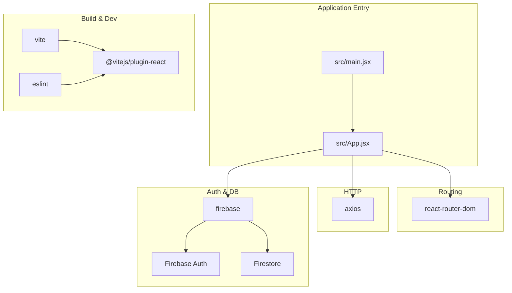
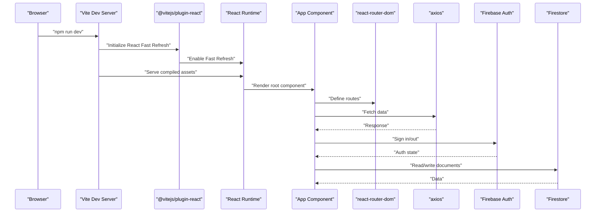
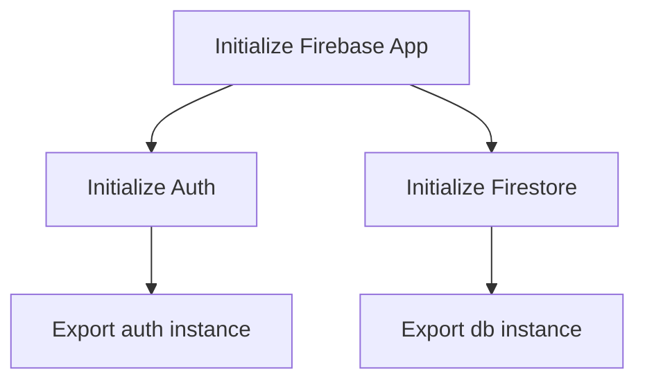
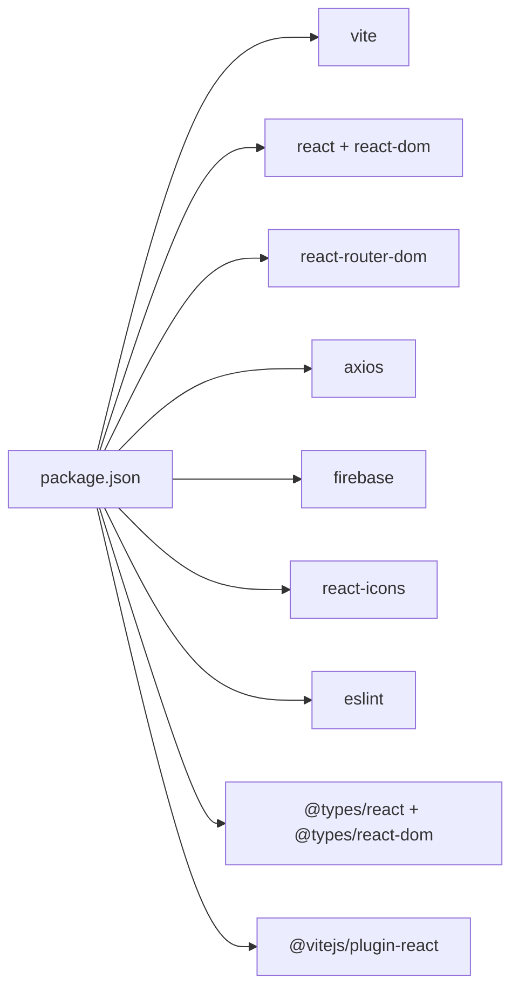

# Technology Stack & Dependencies

<cite>
**Referenced Files in This Document**
- [package.json](file://package.json)
- [vite.config.js](file://vite.config.js)
- [eslint.config.js](file://eslint.config.js)
- [README.md](file://README.md)
- [src/main.jsx](file://src/main.jsx)
- [src/App.jsx](file://src/App.jsx)
- [src/components/FirebaseConfig.jsx](file://src/components/FirebaseConfig.jsx)
- [src/components/FetchWithAxios.jsx](file://src/components/FetchWithAxios.jsx)
- [src/index.css](file://src/index.css)
- [package-lock.json](file://package-lock.json)
</cite>

## Table of Contents
1. [Introduction](#introduction)
2. [Project Structure](#project-structure)
3. [Core Components](#core-components)
4. [Architecture Overview](#architecture-overview)
5. [Detailed Component Analysis](#detailed-component-analysis)
6. [Dependency Analysis](#dependency-analysis)
7. [Performance Considerations](#performance-considerations)
8. [Troubleshooting Guide](#troubleshooting-guide)
9. [Conclusion](#conclusion)

## Introduction
This section documents the technology stack powering the car-rental-frontend application. It covers the primary frameworks and libraries, build tooling, and development tooling, along with practical examples from the repository’s configuration files. The goal is to help developers understand how the stack is assembled, how components integrate, and how to manage upgrades and troubleshooting.

## Project Structure
The project follows a conventional React + Vite setup with a small set of integrated libraries. The application initializes React, sets up routing, integrates Firebase for authentication and Firestore, and uses Axios for HTTP requests. Vite serves as the build tool and development server, while ESLint enforces code quality during development.

**Diagram sources**
- [src/main.jsx](file://src/main.jsx#L1-L13)
- [src/App.jsx](file://src/App.jsx#L1-L53)
- [src/components/FetchWithAxios.jsx](file://src/components/FetchWithAxios.jsx#L1-L42)
- [src/components/FirebaseConfig.jsx](file://src/components/FirebaseConfig.jsx#L1-L26)
- [vite.config.js](file://vite.config.js#L1-L8)
- [eslint.config.js](file://eslint.config.js#L1-L30)
- [package.json](file://package.json#L1-L32)

**Section sources**
- [src/main.jsx](file://src/main.jsx#L1-L13)
- [src/App.jsx](file://src/App.jsx#L1-L53)
- [vite.config.js](file://vite.config.js#L1-L8)
- [eslint.config.js](file://eslint.config.js#L1-L30)
- [package.json](file://package.json#L1-L32)

## Core Components
- React 19.2.0 and React DOM 19.2.0: Application UI framework and DOM renderer. The main entry point mounts the root and wraps the app with a theme provider.
- React Router DOM 7.9.6: Client-side routing for navigation between pages.
- Firebase 12.6.0: Authentication and Firestore integration for user and data persistence.
- Axios 1.13.2: HTTP client for fetching remote resources.
- React Icons 5.5.0: Iconography library for UI icons.
- Vite 7.2.2: Build tool and development server with Hot Module Replacement (HMR).
- @vitejs/plugin-react: Enables Fast Refresh for React components.
- ESLint 9.x with TypeScript types for React (@types/react, @types/react-dom): Linting and type safety enforcement.

Practical examples from configuration:
- Script commands for development, building, linting, and previewing are defined in the package scripts.
- Vite configuration registers the React plugin for Fast Refresh.
- ESLint configuration extends recommended rules and integrates React hooks and refresh plugins.

**Section sources**
- [package.json](file://package.json#L1-L32)
- [vite.config.js](file://vite.config.js#L1-L8)
- [eslint.config.js](file://eslint.config.js#L1-L30)
- [README.md](file://README.md#L1-L17)
- [src/main.jsx](file://src/main.jsx#L1-L13)

## Architecture Overview
The application architecture centers around React components orchestrated by Vite. Routing is handled by React Router DOM, HTTP requests by Axios, and identity/data by Firebase. Vite’s React plugin enables Fast Refresh, improving developer productivity. ESLint ensures consistent code quality.

**Diagram sources**
- [vite.config.js](file://vite.config.js#L1-L8)
- [src/App.jsx](file://src/App.jsx#L1-L53)
- [src/components/FetchWithAxios.jsx](file://src/components/FetchWithAxios.jsx#L1-L42)
- [src/components/FirebaseConfig.jsx](file://src/components/FirebaseConfig.jsx#L1-L26)
- [package.json](file://package.json#L1-L32)

## Detailed Component Analysis

### React and React DOM
- Role: UI rendering and DOM updates.
- Integration: The entry point creates the root and renders the App component, wrapped by a theme provider.
- Version alignment: Both React and React DOM are pinned to 19.2.0.

**Section sources**
- [src/main.jsx](file://src/main.jsx#L1-L13)
- [package.json](file://package.json#L1-L32)

### React Router DOM
- Role: Client-side navigation and route management.
- Integration: The App component imports Router, Routes, and Route to define page-level routes.
- Current state: Routes are present in the App component but commented out; uncommenting them activates routing.

**Section sources**
- [src/App.jsx](file://src/App.jsx#L1-L53)
- [package.json](file://package.json#L1-L32)

### Firebase (Authentication and Firestore)
- Role: Identity management and data persistence.
- Integration: Firebase is initialized with a configuration object, and Auth and Firestore instances are exported for use across components.
- Usage example: Components can import auth and db to sign in users and read/write documents.

**Diagram sources**
- [src/components/FirebaseConfig.jsx](file://src/components/FirebaseConfig.jsx#L1-L26)

**Section sources**
- [src/components/FirebaseConfig.jsx](file://src/components/FirebaseConfig.jsx#L1-L26)
- [package.json](file://package.json#L1-L32)

### Axios for HTTP Requests
- Role: Fetching remote data.
- Integration: A component demonstrates fetching products from a public API endpoint and rendering the results.
- Best practices: Wrap network calls in effects, handle errors, and avoid logging sensitive data.

**Section sources**
- [src/components/FetchWithAxios.jsx](file://src/components/FetchWithAxios.jsx#L1-L42)
- [package.json](file://package.json#L1-L32)

### React Icons
- Role: Iconography for UI elements.
- Integration: Available as a dependency; import specific icons in components as needed.

**Section sources**
- [package.json](file://package.json#L1-L32)

### Vite and Fast Refresh
- Role: Build tool and development server with HMR.
- Integration: Vite is configured with @vitejs/plugin-react, enabling Fast Refresh for React components.
- Notes: The template README mentions Fast Refresh support via Babel or SWC; the current setup uses the React plugin for Fast Refresh.

**Section sources**
- [vite.config.js](file://vite.config.js#L1-L8)
- [README.md](file://README.md#L1-L17)
- [package.json](file://package.json#L1-L32)

### ESLint and TypeScript Types
- Role: Code quality and type safety.
- Integration: ESLint configuration extends recommended rules, integrates React hooks and refresh plugins, and includes TypeScript types for React and React DOM.
- Scripts: The package defines lint and dev/build/preview commands.

**Section sources**
- [eslint.config.js](file://eslint.config.js#L1-L30)
- [package.json](file://package.json#L1-L32)

## Dependency Analysis
The dependency graph highlights the relationships among core libraries and dev tooling.

**Diagram sources**
- [package.json](file://package.json#L1-L32)

Coupling and cohesion:
- Low coupling: Each library serves a distinct purpose (routing, HTTP, auth, build).
- Cohesion: Vite and the React plugin are tightly coupled to enable Fast Refresh.
- External integrations: Firebase and Axios are used directly in components.

Potential circular dependencies:
- None observed in the provided configuration and component files.

External dependencies and integration points:
- Vite orchestrates asset builds and HMR.
- ESLint enforces code quality and integrates with the React plugin.
- Firebase and Axios are consumed by components.

**Section sources**
- [package.json](file://package.json#L1-L32)
- [vite.config.js](file://vite.config.js#L1-L8)
- [eslint.config.js](file://eslint.config.js#L1-L30)
- [src/components/FetchWithAxios.jsx](file://src/components/FetchWithAxios.jsx#L1-L42)
- [src/components/FirebaseConfig.jsx](file://src/components/FirebaseConfig.jsx#L1-L26)

## Performance Considerations
- Fast Refresh: Enabled via the React plugin, reducing reload cycles during development.
- Build speed: Vite’s native ES module support accelerates dev server startup and HMR.
- Bundle size: Keep external libraries minimal; lazy-load heavy components where appropriate.
- Network efficiency: Use Axios interceptors for retries and timeouts; cache where safe.
- Auth performance: Initialize Firebase once and reuse instances; avoid unnecessary re-renders by scoping auth state to necessary components.

[No sources needed since this section provides general guidance]

## Troubleshooting Guide
Common issues and resolutions:
- Dependency conflicts:
  - Symptom: Errors during install or runtime.
  - Action: Review the lockfile to identify mismatched versions; align major versions of React and React DOM; update Vite and its plugin together.
- Version compatibility:
  - React 19.x requires compatible ReactDOM and Vite plugins; ensure @vitejs/plugin-react is recent enough for React 19.
  - Firebase 12.x works with modern React; verify auth and Firestore imports match the SDK version.
- Installation problems:
  - Clear caches and reinstall dependencies if lockfile inconsistencies occur.
  - Use a supported Node.js version as implied by the lockfile engines.
- Lint errors:
  - Run the lint script to identify issues; adjust ESLint rules or add missing types as needed.
- Fast Refresh not working:
  - Confirm the React plugin is registered in Vite config and that components are written as functions or hooks.

**Section sources**
- [package.json](file://package.json#L1-L32)
- [vite.config.js](file://vite.config.js#L1-L8)
- [eslint.config.js](file://eslint.config.js#L1-L30)
- [package-lock.json](file://package-lock.json#L1-L200)

## Conclusion
The car-rental-frontend leverages a modern, efficient stack: React 19 with Vite for rapid development, React Router DOM for navigation, Firebase for authentication and data, Axios for HTTP, and React Icons for UI polish. Vite’s React plugin enables Fast Refresh, while ESLint and TypeScript types enforce code quality and type safety. By following the configuration examples and troubleshooting guidance here, teams can maintain a stable, scalable frontend architecture.