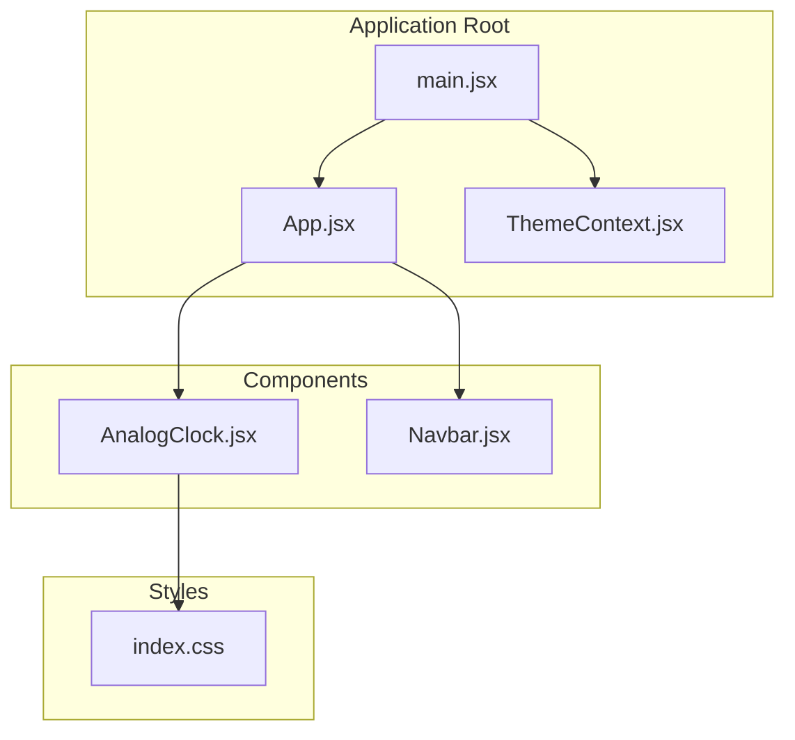
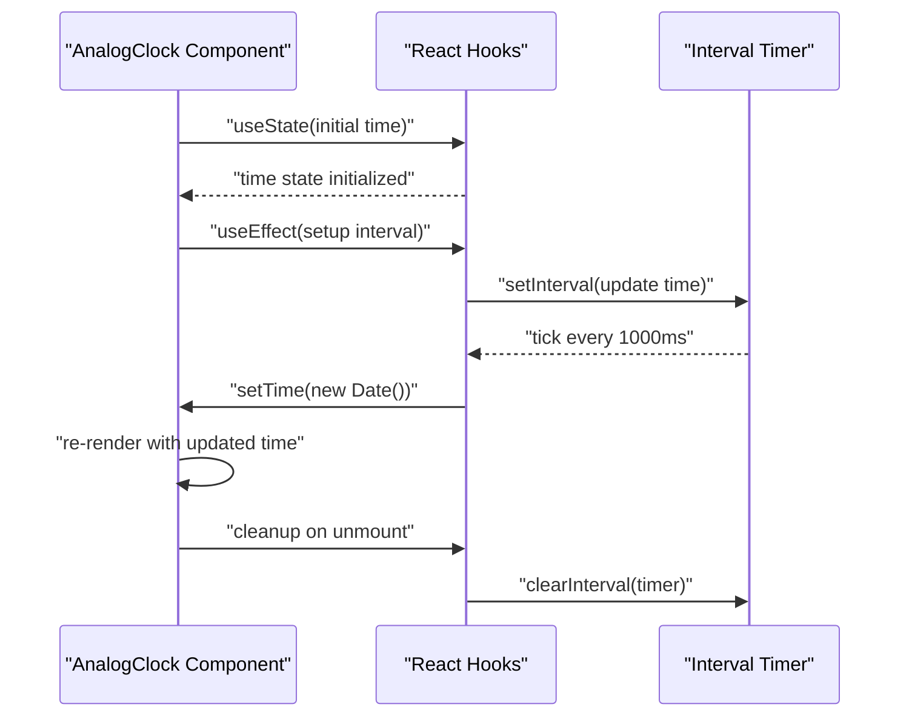
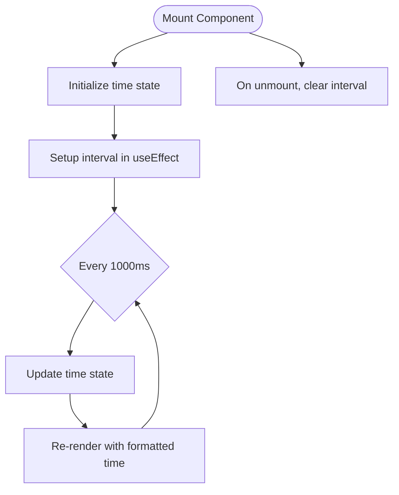
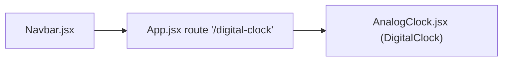
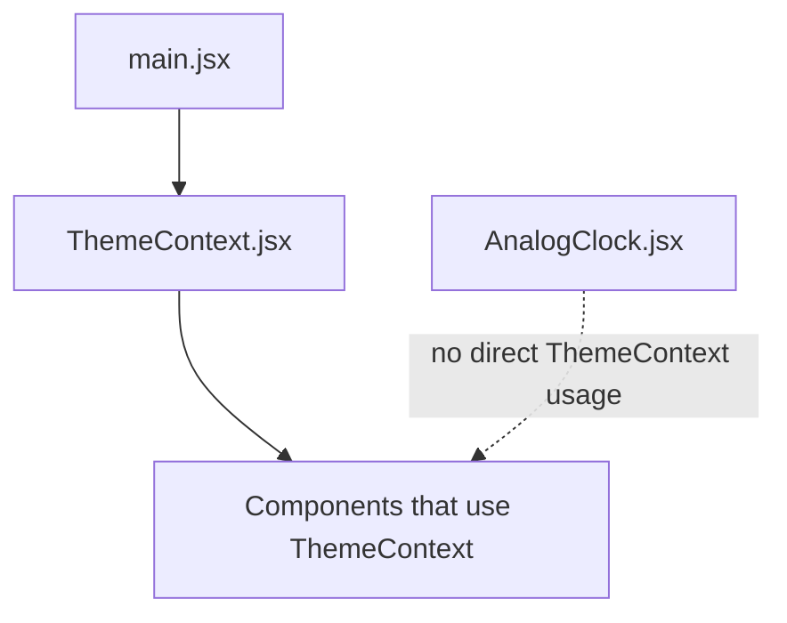
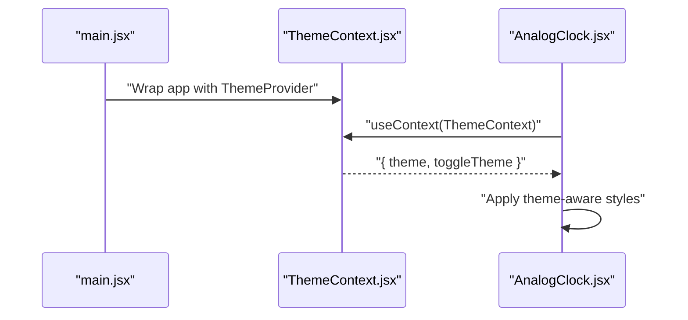

# Analog Clock

<cite>
**Referenced Files in This Document**
- [AnalogClock.jsx](file://src/components/AnalogClock.jsx)
- [ThemeContext.jsx](file://src/components/ThemeContext.jsx)
- [main.jsx](file://src/main.jsx)
- [App.jsx](file://src/App.jsx)
- [Navbar.jsx](file://src/components/Navbar.jsx)
- [index.css](file://src/index.css)
- [ClickHandler.jsx](file://src/components/ClickHandler.jsx)
</cite>

## Table of Contents
1. [Introduction](#introduction)
2. [Project Structure](#project-structure)
3. [Core Components](#core-components)
4. [Architecture Overview](#architecture-overview)
5. [Detailed Component Analysis](#detailed-component-analysis)
6. [Dependency Analysis](#dependency-analysis)
7. [Performance Considerations](#performance-considerations)
8. [Accessibility Guidance](#accessibility-guidance)
9. [Enhancements and Alternatives](#enhancements-and-alternatives)
10. [Integration with ThemeContext](#integration-with-themecontext)
11. [Troubleshooting Guide](#troubleshooting-guide)
12. [Conclusion](#conclusion)

## Introduction
This document explains the AnalogClock component as currently implemented in the repository. The component is named AnalogClock but is implemented as a DigitalClock. It demonstrates time display using React hooks, interval-based updates, and basic styling. The document covers the useState and useEffect patterns, cleanup of intervals, locale-based time formatting, and how to evolve the component toward an analog visual representation. It also provides guidance on integrating with ThemeContext for consistent theming across light and dark modes, accessibility considerations for screen readers, and performance implications of interval-based updates.

## Project Structure
The relevant parts of the project structure for this component include:
- The component itself under src/components/AnalogClock.jsx
- Theme provider setup in main.jsx
- Theme context definition in src/components/ThemeContext.jsx
- Routing and usage in App.jsx and Navbar.jsx
- Global styles in index.css

**Diagram sources**
- [main.jsx](file://src/main.jsx#L1-L12)
- [App.jsx](file://src/App.jsx#L1-L56)
- [ThemeContext.jsx](file://src/components/ThemeContext.jsx#L1-L14)
- [AnalogClock.jsx](file://src/components/AnalogClock.jsx#L1-L28)
- [Navbar.jsx](file://src/components/Navbar.jsx#L1-L81)
- [index.css](file://src/index.css#L1-L69)

**Section sources**
- [AnalogClock.jsx](file://src/components/AnalogClock.jsx#L1-L28)
- [ThemeContext.jsx](file://src/components/ThemeContext.jsx#L1-L14)
- [main.jsx](file://src/main.jsx#L1-L12)
- [App.jsx](file://src/App.jsx#L1-L56)
- [Navbar.jsx](file://src/components/Navbar.jsx#L1-L81)
- [index.css](file://src/index.css#L1-L69)

## Core Components
- AnalogClock.jsx: Implements a digital clock that updates every second using useState and useEffect. It renders the time using toLocaleTimeString() and displays day and year information. It applies inline styling for font size and layout.
- ThemeContext.jsx: Provides a theme context with light/dark mode state and a toggle function.
- main.jsx: Wraps the app with ThemeProvider so components can consume theme values.
- App.jsx and Navbar.jsx: Define routing and navigation; the Digital Clock route is present and linked from the navbar.

Key implementation highlights:
- useState initializes the time state with the current date.
- useEffect sets up an interval to update the time every second and cleans it up on unmount.
- toLocaleTimeString() formats the time according to the user’s locale.
- Inline styles adjust font size and layout.

**Section sources**
- [AnalogClock.jsx](file://src/components/AnalogClock.jsx#L1-L28)
- [ThemeContext.jsx](file://src/components/ThemeContext.jsx#L1-L14)
- [main.jsx](file://src/main.jsx#L1-L12)
- [App.jsx](file://src/App.jsx#L1-L56)
- [Navbar.jsx](file://src/components/Navbar.jsx#L1-L81)

## Architecture Overview
The component lifecycle and data flow:
- Initialization: The component mounts and sets the initial time.
- Interval loop: useEffect starts a timer that updates the time state every second.
- Rendering: The component re-renders with the new time, applying locale formatting and displaying day/year.
- Cleanup: On unmount, the interval is cleared to prevent memory leaks.

**Diagram sources**
- [AnalogClock.jsx](file://src/components/AnalogClock.jsx#L1-L28)

## Detailed Component Analysis

### Current Implementation: DigitalClock
- State initialization: The component initializes time with the current date.
- Interval-based updates: An interval updates the time every second and is cleaned up on unmount.
- Locale formatting: toLocaleTimeString() produces a localized time string.
- Rendering: Displays time and day/year information with inline font sizing.

**Diagram sources**
- [AnalogClock.jsx](file://src/components/AnalogClock.jsx#L1-L28)

**Section sources**
- [AnalogClock.jsx](file://src/components/AnalogClock.jsx#L1-L28)

### Routing and Navigation
- The Digital Clock route is defined in App.jsx and linked from Navbar.jsx.
- The component is imported as DigitalClock in App.jsx, while the file is named AnalogClock.jsx.

**Diagram sources**
- [Navbar.jsx](file://src/components/Navbar.jsx#L1-L81)
- [App.jsx](file://src/App.jsx#L1-L56)
- [AnalogClock.jsx](file://src/components/AnalogClock.jsx#L1-L28)

**Section sources**
- [Navbar.jsx](file://src/components/Navbar.jsx#L1-L81)
- [App.jsx](file://src/App.jsx#L1-L56)

## Dependency Analysis
- ThemeContext dependency chain:
  - main.jsx wraps the app with ThemeProvider.
  - ThemeContext.jsx defines the context and exposes theme/toggleTheme.
  - Components can consume theme via useContext.
- AnalogClock.jsx does not currently consume ThemeContext; it relies on inline styles and global defaults.

**Diagram sources**
- [main.jsx](file://src/main.jsx#L1-L12)
- [ThemeContext.jsx](file://src/components/ThemeContext.jsx#L1-L14)
- [AnalogClock.jsx](file://src/components/AnalogClock.jsx#L1-L28)

**Section sources**
- [main.jsx](file://src/main.jsx#L1-L12)
- [ThemeContext.jsx](file://src/components/ThemeContext.jsx#L1-L14)
- [AnalogClock.jsx](file://src/components/AnalogClock.jsx#L1-L28)

## Performance Considerations
- Interval frequency: Updating every second is generally acceptable for clocks. However, consider debouncing or throttling if the component becomes part of a frequently re-rendering tree.
- Re-render cost: Each tick triggers a state update and a re-render. For simple text rendering, this is lightweight.
- Cleanup: The effect cleanup prevents memory leaks and dangling timers.
- Alternative approaches:
  - Use requestAnimationFrame for smoother updates in UI-heavy scenarios.
  - Debounce updates if the component is nested within frequent re-render contexts.
  - Consider memoization of formatted strings if locale formatting is expensive (rarely needed).

[No sources needed since this section provides general guidance]

## Accessibility Guidance
- Screen reader announcements:
  - Announce time changes using aria-live regions or dynamic text updates.
  - Provide concise announcements like “Time updated to HH:MM:SS”.
- Focus and semantics:
  - Wrap time display in a role="timer" container if appropriate.
  - Ensure readable contrast against backgrounds.
- Keyboard and interaction:
  - If controls exist (e.g., theme toggle), ensure keyboard accessibility.
- Localization:
  - Continue using toLocaleTimeString() for user-friendly time display.

[No sources needed since this section provides general guidance]

## Enhancements and Alternatives
- Analog visual representation:
  - CSS transforms: Rotate hour/minute/second hands using rotate transforms.
  - SVG: Draw clock face and hands with SVG elements for crisp rendering.
  - Animation smoothness: requestAnimationFrame can improve smoothness compared to 1-second intervals.
- Additional features:
  - Seconds counter for analog hands.
  - Timezone selection or UTC toggle.
  - Period indicators (AM/PM) or 24-hour toggle.
- Styling:
  - Move inline styles to CSS modules or styled-components for maintainability.
  - Use CSS custom properties for theme-aware colors.

[No sources needed since this section provides general guidance]

## Integration with ThemeContext
- Current state:
  - ThemeContext is provided at the root via ThemeProvider in main.jsx.
  - Other components demonstrate consuming theme via useContext.
- Recommended integration steps:
  - Import useContext in AnalogClock.jsx.
  - Read theme and toggleTheme from ThemeContext.
  - Apply theme-aware styles to the clock container (e.g., color, background).
  - Optionally expose a theme toggle within the clock if desired.
- Example pattern reference:
  - See ClickHandler.jsx for a practical useContext usage example.

**Diagram sources**
- [main.jsx](file://src/main.jsx#L1-L12)
- [ThemeContext.jsx](file://src/components/ThemeContext.jsx#L1-L14)
- [AnalogClock.jsx](file://src/components/AnalogClock.jsx#L1-L28)
- [ClickHandler.jsx](file://src/components/ClickHandler.jsx#L1-L41)

**Section sources**
- [main.jsx](file://src/main.jsx#L1-L12)
- [ThemeContext.jsx](file://src/components/ThemeContext.jsx#L1-L14)
- [AnalogClock.jsx](file://src/components/AnalogClock.jsx#L1-L28)
- [ClickHandler.jsx](file://src/components/ClickHandler.jsx#L1-L41)

## Troubleshooting Guide
- Time not updating:
  - Verify useEffect runs and interval is set.
  - Confirm cleanup clears the interval on unmount.
- Incorrect time display:
  - Ensure toLocaleTimeString() is used for formatting.
  - Check that the state update occurs every second.
- Styling issues:
  - Inline styles are applied; confirm font sizes and layout.
  - Review global styles in index.css for base typography and colors.
- Theming not applied:
  - Ensure ThemeProvider is wrapping the app.
  - Consume ThemeContext in the component and apply theme-aware styles.

**Section sources**
- [AnalogClock.jsx](file://src/components/AnalogClock.jsx#L1-L28)
- [ThemeContext.jsx](file://src/components/ThemeContext.jsx#L1-L14)
- [main.jsx](file://src/main.jsx#L1-L12)
- [index.css](file://src/index.css#L1-L69)

## Conclusion
The AnalogClock component (currently implemented as DigitalClock) demonstrates a clean use of React hooks for time display with periodic updates and proper cleanup. It uses locale-based formatting and inline styling for layout. To evolve toward an analog clock, consider CSS transforms or SVG for visual hands and requestAnimationFrame for smoother updates. Integrating with ThemeContext enables consistent theming across light and dark modes. Accessibility improvements can enhance screen reader support for time announcements. These enhancements will improve user experience while maintaining performance and maintainability.

[No sources needed since this section summarizes without analyzing specific files]