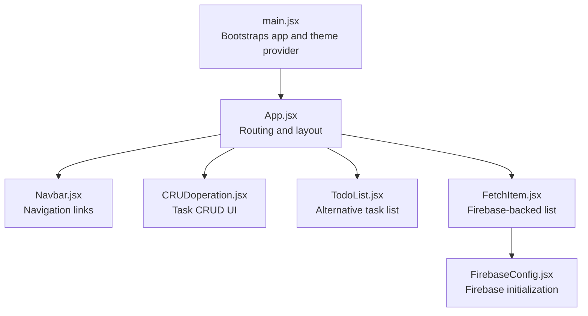
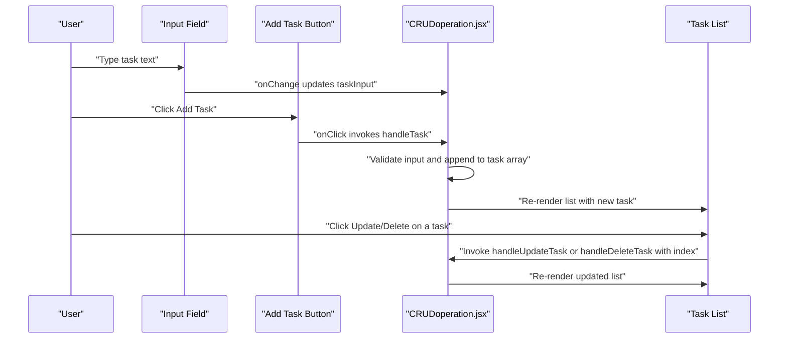
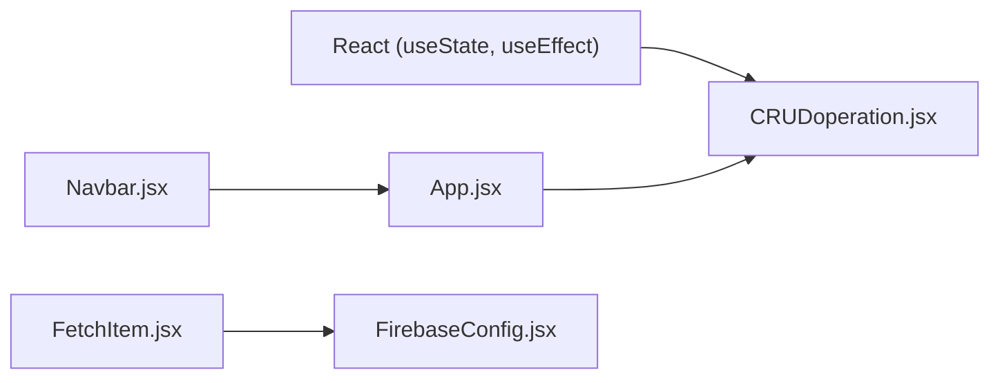

# CRUD Operation

<cite>
**Referenced Files in This Document**
- [CRUDoperation.jsx](file://src/components/CRUDoperation.jsx)
- [App.jsx](file://src/App.jsx)
- [Navbar.jsx](file://src/components/Navbar.jsx)
- [TodoList.jsx](file://src/components/TodoList.jsx)
- [FetchItem.jsx](file://src/components/FetchItem.jsx)
- [FirebaseConfig.jsx](file://src/components/FirebaseConfig.jsx)
- [main.jsx](file://src/main.jsx)
</cite>

## Table of Contents
1. [Introduction](#introduction)
2. [Project Structure](#project-structure)
3. [Core Components](#core-components)
4. [Architecture Overview](#architecture-overview)
5. [Detailed Component Analysis](#detailed-component-analysis)
6. [Dependency Analysis](#dependency-analysis)
7. [Performance Considerations](#performance-considerations)
8. [Troubleshooting Guide](#troubleshooting-guide)
9. [Conclusion](#conclusion)
10. [Appendices](#appendices)

## Introduction
This document provides comprehensive documentation for the CRUDoperation component, focusing on its data management interface for task creation, reading, updating, and deletion. It explains the useState hooks managing the task array and taskInput field, and the useEffect hook that logs task updates for debugging. It also documents the handleTask function for adding new tasks with input validation, handleDeleteTask for removing tasks by index, and handleUpdateTask using a browser prompt for editing. Inline styling is included for visual presentation. The document addresses common issues such as index-based operations in dynamic lists, security considerations with prompt input, and state immutability best practices. It also outlines potential improvements including form-based updates, error handling, and Firebase integration for persistent storage, along with integration patterns with routing and global state management.

## Project Structure
The CRUDoperation component resides in the components directory and is integrated into the application via routing. The Navbar provides navigation to the CRUD page, while the main application bootstraps the theme provider and renders the App component.

**Diagram sources**
- [main.jsx](file://src/main.jsx#L1-L13)
- [App.jsx](file://src/App.jsx#L1-L56)
- [Navbar.jsx](file://src/components/Navbar.jsx#L1-L81)
- [CRUDoperation.jsx](file://src/components/CRUDoperation.jsx#L1-L77)
- [TodoList.jsx](file://src/components/TodoList.jsx#L1-L56)
- [FetchItem.jsx](file://src/components/FetchItem.jsx#L1-L105)
- [FirebaseConfig.jsx](file://src/components/FirebaseConfig.jsx#L1-L26)

**Section sources**
- [main.jsx](file://src/main.jsx#L1-L13)
- [App.jsx](file://src/App.jsx#L1-L56)
- [Navbar.jsx](file://src/components/Navbar.jsx#L1-L81)

## Core Components
- CRUDoperation component:
  - Manages two pieces of local state: a task array and a taskInput string.
  - Provides functions to add, update, and delete tasks.
  - Uses useEffect to log updates for debugging.
  - Renders an input field and a button for adding tasks, and a list of tasks with Update and Delete buttons.

Key implementation references:
- State declarations and effect: [CRUDoperation.jsx](file://src/components/CRUDoperation.jsx#L1-L10)
- Add task handler: [CRUDoperation.jsx](file://src/components/CRUDoperation.jsx#L10-L18)
- Delete task handler: [CRUDoperation.jsx](file://src/components/CRUDoperation.jsx#L20-L25)
- Update task handler: [CRUDoperation.jsx](file://src/components/CRUDoperation.jsx#L27-L38)
- Input and button rendering: [CRUDoperation.jsx](file://src/components/CRUDoperation.jsx#L42-L50)
- List rendering with inline styles: [CRUDoperation.jsx](file://src/components/CRUDoperation.jsx#L51-L71)

**Section sources**
- [CRUDoperation.jsx](file://src/components/CRUDoperation.jsx#L1-L77)

## Architecture Overview
The CRUDoperation component is a self-contained UI module that manages its own state and performs local operations. It does not currently integrate with Firebase or external persistence. Routing is configured to render the component under the "/crud" path, and the Navbar provides a link to navigate to this route.

**Diagram sources**
- [CRUDoperation.jsx](file://src/components/CRUDoperation.jsx#L1-L77)
- [App.jsx](file://src/App.jsx#L22-L51)
- [Navbar.jsx](file://src/components/Navbar.jsx#L1-L81)

## Detailed Component Analysis

### State Management and Hooks
- useState for task array:
  - Initializes an empty array and holds the list of tasks.
  - Used in add, update, and delete handlers to derive new arrays and update state.
- useState for taskInput:
  - Controlled input bound to the input field; cleared after successful addition.
- useEffect for debugging:
  - Logs the entire task array whenever it changes, aiding development and debugging.

Best practices demonstrated:
- Local state isolation for the component.
- Immutability: new arrays are created using spread syntax and map/filter operations.

Potential improvements:
- Add error handling for invalid inputs.
- Consider form submission to prevent accidental reloads.
- Introduce keys for list items that are stable and unique.

**Section sources**
- [CRUDoperation.jsx](file://src/components/CRUDoperation.jsx#L1-L10)

### Add Task (handleTask)
- Validates that the input is not empty after trimming whitespace.
- Creates a new array by appending the input to the current task array.
- Updates state with the new array and clears the input field.
- Logs the operation and the resulting array for debugging.

Common pitfalls:
- Empty or whitespace-only entries are rejected.
- The input field is reset after successful addition.

**Section sources**
- [CRUDoperation.jsx](file://src/components/CRUDoperation.jsx#L10-L18)

### Delete Task (handleDeleteTask)
- Filters out the task at the specified index.
- Updates state with the filtered array.
- Logs the index and remaining tasks for debugging.

Index-based operations:
- Using index as a key can cause issues if list order changes or items are reordered. Prefer stable identifiers (e.g., unique IDs) for keys.

**Section sources**
- [CRUDoperation.jsx](file://src/components/CRUDoperation.jsx#L20-L25)

### Update Task (handleUpdateTask)
- Uses a browser prompt to edit the task at the given index.
- Validates that the updated value is not null and not empty after trimming.
- Creates a new array by mapping over the original array and replacing the item at the specified index.
- Updates state with the new array.
- Logs the index and updated array for debugging.

Security considerations:
- Browser prompt is synchronous and runs in the user’s context. It is not suitable for sensitive data or untrusted environments.
- Consider replacing with a controlled form field for safer, structured input.

**Section sources**
- [CRUDoperation.jsx](file://src/components/CRUDoperation.jsx#L27-L38)

### Rendering and Styling
- Input field:
  - Controlled via taskInput state.
  - On change, updates taskInput.
  - See [CRUDoperation.jsx](file://src/components/CRUDoperation.jsx#L42-L47).
- Add button:
  - Triggers handleTask on click.
  - See [CRUDoperation.jsx](file://src/components/CRUDoperation.jsx#L48-L50).
- Task list:
  - Maps over the task array.
  - Each item displays the task text and action buttons.
  - Inline styles define spacing, borders, background, and flex layout.
  - Keys are currently based on index.
  - See [CRUDoperation.jsx](file://src/components/CRUDoperation.jsx#L51-L71).

Inline styling highlights:
- Padding, margins, borders, rounded corners, background color, and flex container properties are applied directly to list items.

**Section sources**
- [CRUDoperation.jsx](file://src/components/CRUDoperation.jsx#L42-L71)

### Comparison with Alternative Implementations
- TodoList component:
  - Demonstrates a form-based approach with controlled inputs and a submit handler.
  - Stores tasks as objects with unique IDs and completion status.
  - See [TodoList.jsx](file://src/components/TodoList.jsx#L1-L56).
- Firebase-backed list (FetchItem):
  - Integrates with Firestore for persistent storage and real-time updates.
  - Provides form-based editing with controlled inputs and asynchronous updates/deletes.
  - See [FetchItem.jsx](file://src/components/FetchItem.jsx#L1-L105) and [FirebaseConfig.jsx](file://src/components/FirebaseConfig.jsx#L1-L26).

**Section sources**
- [TodoList.jsx](file://src/components/TodoList.jsx#L1-L56)
- [FetchItem.jsx](file://src/components/FetchItem.jsx#L1-L105)
- [FirebaseConfig.jsx](file://src/components/FirebaseConfig.jsx#L1-L26)

## Dependency Analysis
- Internal dependencies:
  - CRUDoperation.jsx depends on React’s useState and useEffect.
  - App.jsx registers the CRUD route and includes the component.
  - Navbar.jsx provides navigation to the CRUD route.
- External dependencies:
  - No external libraries are imported in CRUDoperation.jsx.
  - Firebase integration exists in other components (FetchItem and FirebaseConfig) but is not used here.

**Diagram sources**
- [CRUDoperation.jsx](file://src/components/CRUDoperation.jsx#L1-L10)
- [App.jsx](file://src/App.jsx#L22-L51)
- [Navbar.jsx](file://src/components/Navbar.jsx#L1-L81)
- [FetchItem.jsx](file://src/components/FetchItem.jsx#L1-L105)
- [FirebaseConfig.jsx](file://src/components/FirebaseConfig.jsx#L1-L26)

**Section sources**
- [CRUDoperation.jsx](file://src/components/CRUDoperation.jsx#L1-L10)
- [App.jsx](file://src/App.jsx#L22-L51)
- [Navbar.jsx](file://src/components/Navbar.jsx#L1-L81)
- [FetchItem.jsx](file://src/components/FetchItem.jsx#L1-L105)
- [FirebaseConfig.jsx](file://src/components/FirebaseConfig.jsx#L1-L26)

## Performance Considerations
- Re-rendering:
  - Each state change re-renders the component. For large lists, consider memoization or virtualization.
- Array operations:
  - Spread, map, and filter are efficient for small to medium lists. For very large datasets, consider immutable update libraries or indexed updates.
- Rendering cost:
  - Inline styles are applied per item. For heavy styling, consider CSS classes or styled-components.

[No sources needed since this section provides general guidance]

## Troubleshooting Guide
Common issues and resolutions:
- Index-based keys causing incorrect updates:
  - Problem: Using index as key can lead to stale updates when list order changes.
  - Resolution: Assign and use stable unique IDs for each task.
- Prompt input security:
  - Problem: Using prompt for edits can be insecure and inconsistent across browsers.
  - Resolution: Replace with a controlled form field inside the list item.
- State immutability:
  - Problem: Direct mutation of state is not allowed.
  - Resolution: Always create new arrays/objects when updating state (already demonstrated).
- Validation:
  - Problem: Empty or whitespace-only entries accepted.
  - Resolution: Enforce trim and non-empty checks (already implemented).
- Debugging:
  - Problem: Hard to track state changes.
  - Resolution: Use useEffect logging (already implemented).

**Section sources**
- [CRUDoperation.jsx](file://src/components/CRUDoperation.jsx#L1-L77)

## Conclusion
The CRUDoperation component provides a straightforward, local-first implementation of task CRUD operations with clear state management and debugging support. It demonstrates fundamental React patterns including controlled inputs, immutable updates, and event-driven UI updates. While functional, it can be enhanced with form-based editing, robust error handling, persistent storage via Firebase, and improved key stability for dynamic lists.

[No sources needed since this section summarizes without analyzing specific files]

## Appendices

### API and Interaction Summary
- Add Task:
  - Trigger: Button click
  - Behavior: Validates input, appends to task array, clears input
  - References: [CRUDoperation.jsx](file://src/components/CRUDoperation.jsx#L10-L18)
- Update Task:
  - Trigger: Update button click
  - Behavior: Prompt for new value, validate, replace item at index
  - References: [CRUDoperation.jsx](file://src/components/CRUDoperation.jsx#L27-L38)
- Delete Task:
  - Trigger: Delete button click
  - Behavior: Filter out item at index
  - References: [CRUDoperation.jsx](file://src/components/CRUDoperation.jsx#L20-L25)

### Routing Integration
- Navigation:
  - Navbar link to "/crud" route
  - See [Navbar.jsx](file://src/components/Navbar.jsx#L41-L44)
- Route registration:
  - App registers the "/crud" route pointing to CRUDoperation
  - See [App.jsx](file://src/App.jsx#L32-L34)

### Persistent Storage Integration (Optional Improvements)
- Firebase setup:
  - Initialize Firestore and export db instance
  - See [FirebaseConfig.jsx](file://src/components/FirebaseConfig.jsx#L1-L26)
- Real-time list with updates/deletes:
  - Subscribe to collection snapshots, update state, and provide form-based editing
  - See [FetchItem.jsx](file://src/components/FetchItem.jsx#L1-L105)

### Best Practices Checklist
- Use stable keys for list items (unique IDs)
- Replace prompt with controlled form fields for editing
- Add error handling and user feedback
- Consider memoization for large lists
- Persist state to a backend for cross-session continuity

[No sources needed since this section provides general guidance]