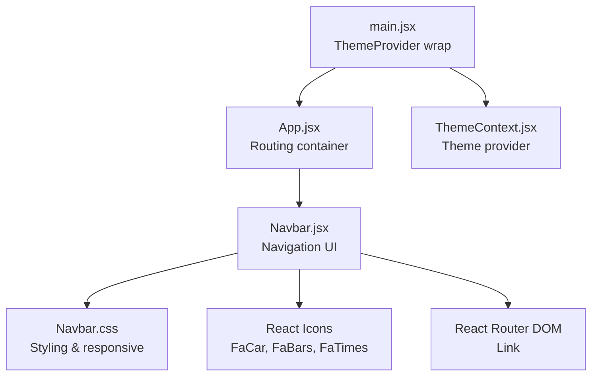
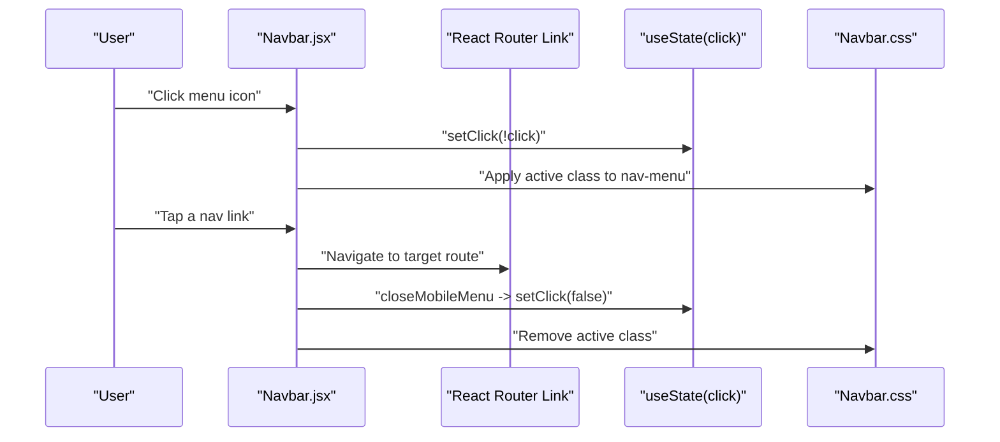
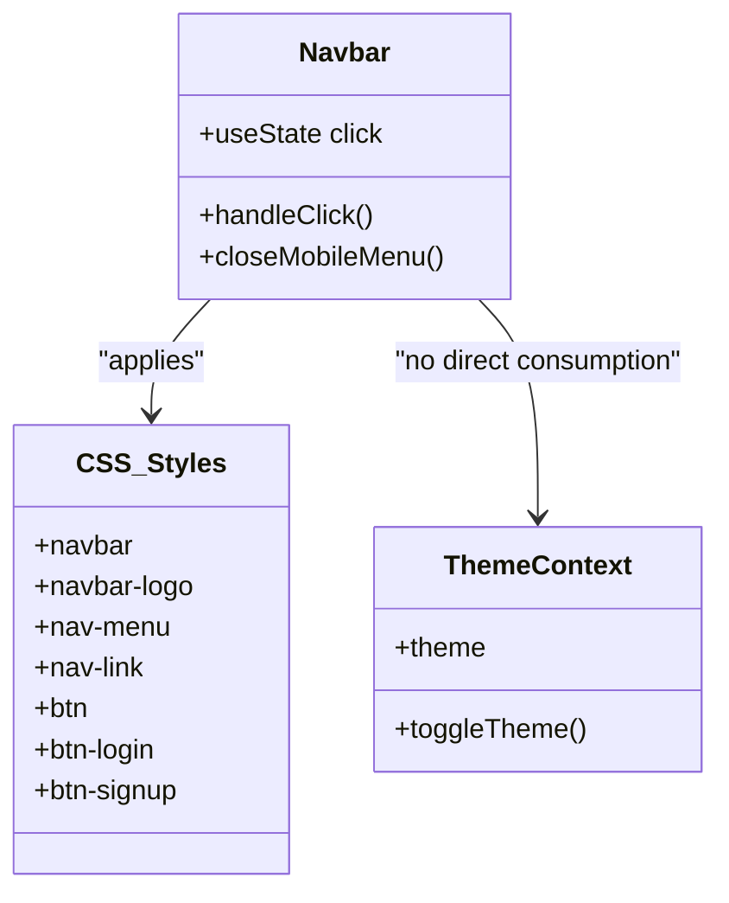
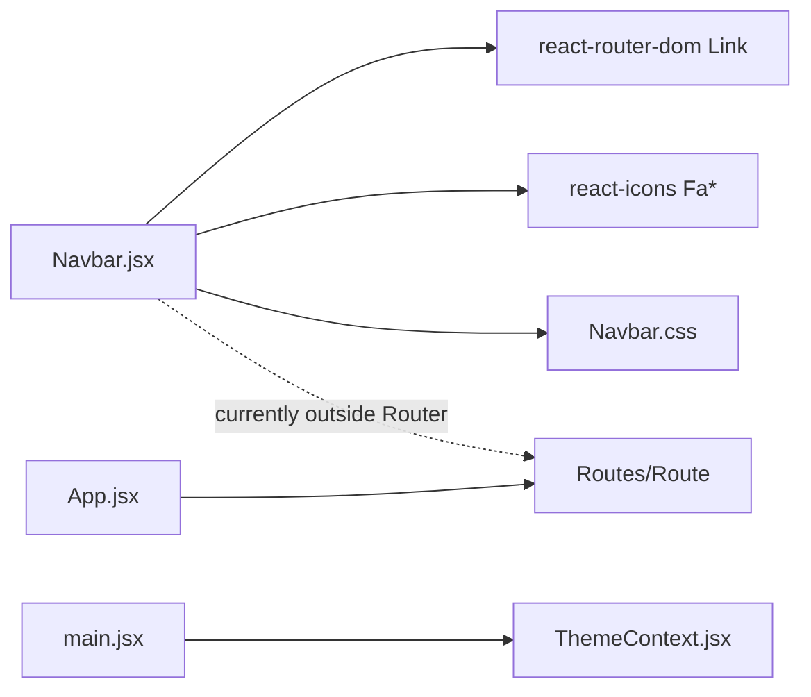

# Navbar

<cite>
**Referenced Files in This Document**
- [Navbar.jsx](file://src/components/Navbar.jsx)
- [Navbar.css](file://src/components/CSS/Navbar.css)
- [ThemeContext.jsx](file://src/components/ThemeContext.jsx)
- [main.jsx](file://src/main.jsx)
- [App.jsx](file://src/App.jsx)
- [index.css](file://src/index.css)
</cite>

## Table of Contents
1. [Introduction](#introduction)
2. [Project Structure](#project-structure)
3. [Core Components](#core-components)
4. [Architecture Overview](#architecture-overview)
5. [Detailed Component Analysis](#detailed-component-analysis)
6. [Dependency Analysis](#dependency-analysis)
7. [Performance Considerations](#performance-considerations)
8. [Accessibility Guidance](#accessibility-guidance)
9. [Customization Guide](#customization-guide)
10. [Troubleshooting Guide](#troubleshooting-guide)
11. [Conclusion](#conclusion)

## Introduction
This document provides comprehensive documentation for the Navbar component in the car-rental-frontend application. It explains the responsive design with mobile menu toggle functionality, visual appearance using React Icons, integration with React Router for navigation, state management with useState, and styling via Navbar.css. It also covers accessibility considerations, customization options, and how the component integrates with ThemeContext.

## Project Structure
The Navbar component resides under src/components and is styled via src/components/CSS/Navbar.css. It is integrated into the application via ThemeContext wrapping in main.jsx and is rendered conditionally within App.jsx.

**Diagram sources**
- [main.jsx](file://src/main.jsx#L1-L13)
- [App.jsx](file://src/App.jsx#L1-L56)
- [Navbar.jsx](file://src/components/Navbar.jsx#L1-L81)
- [Navbar.css](file://src/components/CSS/Navbar.css#L1-L164)
- [ThemeContext.jsx](file://src/components/ThemeContext.jsx#L1-L14)

**Section sources**
- [main.jsx](file://src/main.jsx#L1-L13)
- [App.jsx](file://src/App.jsx#L1-L56)
- [Navbar.jsx](file://src/components/Navbar.jsx#L1-L81)
- [Navbar.css](file://src/components/CSS/Navbar.css#L1-L164)
- [ThemeContext.jsx](file://src/components/ThemeContext.jsx#L1-L14)

## Core Components
- Navbar.jsx: Implements the navigation bar with a logo, mobile menu toggle, navigation links, and two action buttons. Uses React Router Link for navigation and React Icons for visual cues.
- Navbar.css: Provides base styles, hover effects, glass-like backdrop, and responsive breakpoints for mobile.
- ThemeContext.jsx: Supplies theme state and a toggle function to switch themes globally.
- main.jsx: Wraps the application with ThemeProvider so components can consume theme context.
- App.jsx: Contains routing definitions; the Navbar is currently rendered outside the Router in the current code.

Key implementation highlights:
- State management: useState manages the mobile menu open/close state.
- Event handlers: handleClick toggles the menu; closeMobileMenu ensures the menu closes after navigation.
- Navigation: Links use react-router-dom Link with onClick handlers to close the mobile menu.
- Styling: CSS variables define primary and text colors; media queries handle responsiveness.

**Section sources**
- [Navbar.jsx](file://src/components/Navbar.jsx#L1-L81)
- [Navbar.css](file://src/components/CSS/Navbar.css#L1-L164)
- [ThemeContext.jsx](file://src/components/ThemeContext.jsx#L1-L14)
- [main.jsx](file://src/main.jsx#L1-L13)
- [App.jsx](file://src/App.jsx#L1-L56)

## Architecture Overview
The Navbar participates in a layered architecture:
- Presentation layer: Navbar renders UI elements and handles user interactions.
- State layer: useState controls the mobile menu state.
- Routing layer: React Router Link drives navigation; closeMobileMenu ensures UX consistency.
- Theming layer: ThemeContext provides theme-awareness for consumers.

**Diagram sources**
- [Navbar.jsx](file://src/components/Navbar.jsx#L1-L81)
- [Navbar.css](file://src/components/CSS/Navbar.css#L131-L164)

## Detailed Component Analysis

### Navbar.jsx
Responsibilities:
- Render the brand/logo area with a car icon and text.
- Provide a mobile menu toggle using bars/times icons.
- Render a list of navigation links using react-router Link.
- Provide Login and Sign Up buttons styled via Navbar.css.
- Manage mobile menu state with useState and event handlers.

State and hooks:
- useState initializes click to false.
- handleClick toggles click.
- closeMobileMenu sets click to false.

Navigation and UX:
- Each Link has an onClick handler that calls closeMobileMenu, ensuring the mobile menu closes after navigation.
- The logo Link also uses closeMobileMenu to maintain consistent behavior.

Accessibility considerations:
- The component does not currently include explicit aria attributes for screen readers or keyboard navigation. See Accessibility Guidance for recommendations.

Responsive behavior:
- On small screens, the menu slides in from the left and becomes active when click is true.
- The mobile menu icon appears only below the breakpoint.

Integration with ThemeContext:
- The Navbar itself does not directly consume ThemeContext. However, the theme provider is available globally, enabling downstream components to adapt to theme changes.

**Section sources**
- [Navbar.jsx](file://src/components/Navbar.jsx#L1-L81)
- [Navbar.css](file://src/components/CSS/Navbar.css#L131-L164)
- [ThemeContext.jsx](file://src/components/ThemeContext.jsx#L1-L14)

### Navbar.css
Design and theming:
- CSS variables define primary color, secondary color, text color, glass backgrounds, and shadow.
- The navbar uses a sticky position, backdrop-filter blur, and subtle borders for depth.

Logo and links:
- Logo combines an icon and text with hover scaling.
- Links have hover effects with underline animation and background glass effect.

Buttons:
- Login and Sign Up buttons use shared button styles with distinct hover states and shadows.

Mobile responsiveness:
- Media query at 768px switches the menu to a vertical slide-in panel.
- Active class triggers the slide-in transition.
- The mobile menu icon is hidden by default and shown on small screens.

**Section sources**
- [Navbar.css](file://src/components/CSS/Navbar.css#L1-L164)

### ThemeContext.jsx
Purpose:
- Exposes a theme state and a toggle function to switch between light and dark modes.
- Provider wraps the application in main.jsx.

Consumption:
- The Navbar does not directly consume ThemeContext in the current code. Downstream components can subscribe to theme changes to adjust colors or styles accordingly.

**Section sources**
- [ThemeContext.jsx](file://src/components/ThemeContext.jsx#L1-L14)
- [main.jsx](file://src/main.jsx#L1-L13)

### Integration with React Router
- The Navbar uses react-router-dom Link for navigation.
- Each Link includes onClick={closeMobileMenu} to close the mobile menu after navigation.
- App.jsx defines routes; the Navbar is currently rendered outside the Router in the current code. This may cause navigation to not update the URL until the Navbar is placed inside the Router.

**Section sources**
- [Navbar.jsx](file://src/components/Navbar.jsx#L1-L81)
- [App.jsx](file://src/App.jsx#L1-L56)

### Class Diagram

**Diagram sources**
- [Navbar.jsx](file://src/components/Navbar.jsx#L1-L81)
- [Navbar.css](file://src/components/CSS/Navbar.css#L1-L164)
- [ThemeContext.jsx](file://src/components/ThemeContext.jsx#L1-L14)

## Dependency Analysis
- Navbar.jsx depends on:
  - React Router Link for navigation.
  - React Icons for visual elements.
  - Navbar.css for styling.
- Navbar.jsx does not depend on ThemeContext directly; ThemeContext is provided globally by main.jsx.
- App.jsx contains routing definitions; the Navbar is currently rendered outside the Router in the current code.

**Diagram sources**
- [Navbar.jsx](file://src/components/Navbar.jsx#L1-L81)
- [Navbar.css](file://src/components/CSS/Navbar.css#L1-L164)
- [ThemeContext.jsx](file://src/components/ThemeContext.jsx#L1-L14)
- [main.jsx](file://src/main.jsx#L1-L13)
- [App.jsx](file://src/App.jsx#L1-L56)

**Section sources**
- [Navbar.jsx](file://src/components/Navbar.jsx#L1-L81)
- [Navbar.css](file://src/components/CSS/Navbar.css#L1-L164)
- [ThemeContext.jsx](file://src/components/ThemeContext.jsx#L1-L14)
- [main.jsx](file://src/main.jsx#L1-L13)
- [App.jsx](file://src/App.jsx#L1-L56)

## Performance Considerations
- The mobile menu uses a simple state toggle and CSS transitions. No heavy computations occur during interactions.
- Backdrop-filter blur is used for visual effect; ensure device support and performance characteristics are acceptable on older devices.
- Consider lazy-loading icons if bundle size becomes a concern.

## Accessibility Guidance
Current state:
- The component does not include explicit aria attributes for screen readers or keyboard navigation.
- Focus styles rely on global button focus rules from index.css.

Recommended improvements:
- Add aria-expanded to the menu icon to reflect the open/closed state.
- Add aria-controls linking the menu icon to the menu list.
- Ensure keyboard navigation: the menu icon and links should be focusable and operable via Enter/Space.
- Provide visible focus indicators consistent with the global focus styles.
- Consider adding aria-labels to the menu icon and links for clarity.
- Ensure touch targets meet minimum size guidelines for mobile devices.

These recommendations align with WCAG guidelines and improve usability for assistive technologies.

**Section sources**
- [index.css](file://src/index.css#L38-L69)
- [Navbar.jsx](file://src/components/Navbar.jsx#L1-L81)
- [Navbar.css](file://src/components/CSS/Navbar.css#L131-L164)

## Customization Guide
- Customize the logo:
  - Replace the icon and text within the logo Link.
  - Adjust the logo icon class and text content as needed.
- Customize menu items:
  - Add or remove Link entries in the nav menu.
  - Ensure each new Link includes onClick={closeMobileMenu} to maintain consistent UX.
- Theming:
  - Modify CSS variables in Navbar.css to change primary color, text color, and background effects.
  - ThemeContext provides theme switching; downstream components can adapt to theme changes.
- Buttons:
  - Adjust button styles in Navbar.css for Login and Sign Up.
  - Keep hover and focus states accessible and visible.

**Section sources**
- [Navbar.jsx](file://src/components/Navbar.jsx#L1-L81)
- [Navbar.css](file://src/components/CSS/Navbar.css#L1-L164)
- [ThemeContext.jsx](file://src/components/ThemeContext.jsx#L1-L14)

## Troubleshooting Guide
- Mobile menu does not close after navigation:
  - Verify that each Link includes onClick={closeMobileMenu}.
  - Confirm that the closeMobileMenu function is defined and bound correctly.
- Mobile menu does not appear on small screens:
  - Ensure the media query breakpoint is met.
  - Confirm that the active class is toggled when click is true.
- Navigation not updating URL:
  - The Navbar is currently rendered outside the Router in App.jsx. Move the Navbar inside the Router to enable proper route updates.
- Button focus styles:
  - Global focus styles are defined in index.css. Ensure they remain visible and accessible.

**Section sources**
- [Navbar.jsx](file://src/components/Navbar.jsx#L1-L81)
- [Navbar.css](file://src/components/CSS/Navbar.css#L131-L164)
- [App.jsx](file://src/App.jsx#L1-L56)
- [index.css](file://src/index.css#L38-L69)

## Conclusion
The Navbar component delivers a clean, responsive navigation experience with mobile-friendly interactions, styled visuals, and seamless integration with React Router. While it currently lacks explicit accessibility attributes and is rendered outside the Router, the structure supports easy enhancements for improved accessibility and routing behavior. Theming is available via ThemeContext, enabling future adaptations to light/dark modes.