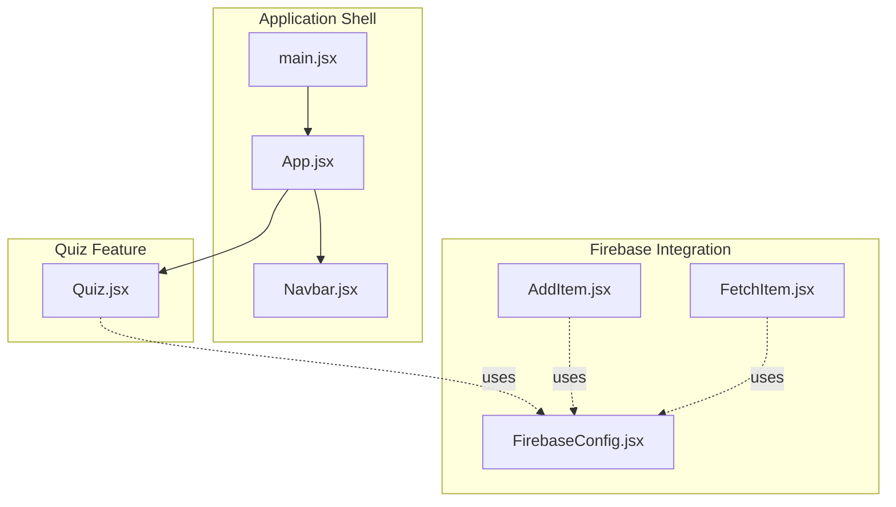
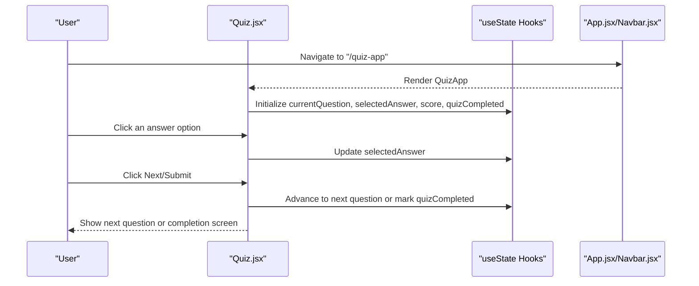
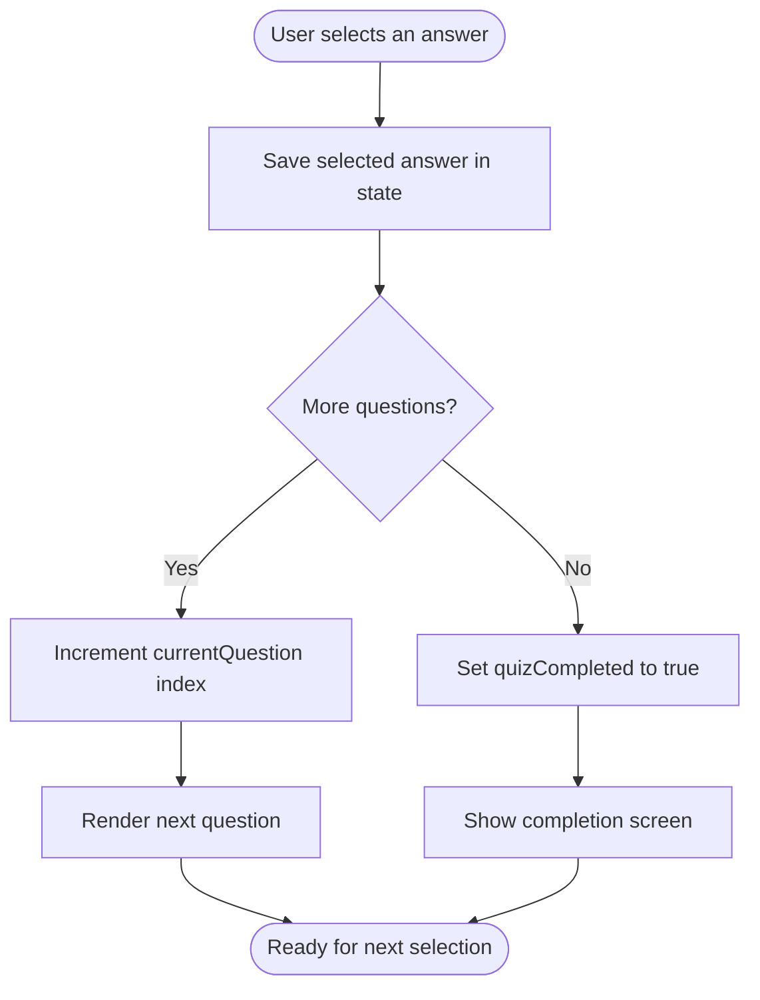
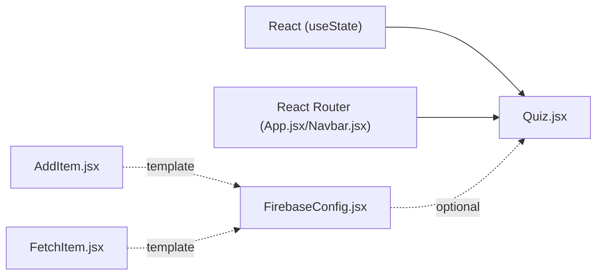

# Quiz App

<cite>
**Referenced Files in This Document**
- [Quiz.jsx](file://src/components/Quiz.jsx)
- [App.jsx](file://src/App.jsx)
- [Navbar.jsx](file://src/components/Navbar.jsx)
- [FirebaseConfig.jsx](file://src/components/FirebaseConfig.jsx)
- [FetchItem.jsx](file://src/components/FetchItem.jsx)
- [AddItem.jsx](file://src/components/AddItem.jsx)
- [index.css](file://src/index.css)
- [main.jsx](file://src/main.jsx)
</cite>

## Table of Contents
1. [Introduction](#introduction)
2. [Project Structure](#project-structure)
3. [Core Components](#core-components)
4. [Architecture Overview](#architecture-overview)
5. [Detailed Component Analysis](#detailed-component-analysis)
6. [Dependency Analysis](#dependency-analysis)
7. [Performance Considerations](#performance-considerations)
8. [Troubleshooting Guide](#troubleshooting-guide)
9. [Conclusion](#conclusion)
10. [Appendices](#appendices)

## Introduction
This document provides comprehensive documentation for the Quiz component, focusing on its interactive quiz interface implementation. It explains the structure of the questions array, the state management using useState, and the planned functionality of selection, progression, and completion handlers. It also covers conditional rendering, dynamic answer button styling, accessibility considerations, and potential extensions such as scoring logic, time limits, and Firebase integration for storing results.

## Project Structure
The Quiz component resides under src/components and is integrated into the application via routing. The Navbar provides navigation to the Quiz route, while Firebase configuration is available for future integrations.

**Diagram sources**
- [main.jsx](file://src/main.jsx#L1-L13)
- [App.jsx](file://src/App.jsx#L1-L56)
- [Navbar.jsx](file://src/components/Navbar.jsx#L1-L81)
- [Quiz.jsx](file://src/components/Quiz.jsx#L1-L81)
- [FirebaseConfig.jsx](file://src/components/FirebaseConfig.jsx#L1-L26)
- [AddItem.jsx](file://src/components/AddItem.jsx#L1-L37)
- [FetchItem.jsx](file://src/components/FetchItem.jsx#L1-L58)

**Section sources**
- [main.jsx](file://src/main.jsx#L1-L13)
- [App.jsx](file://src/App.jsx#L1-L56)
- [Navbar.jsx](file://src/components/Navbar.jsx#L1-L81)
- [Quiz.jsx](file://src/components/Quiz.jsx#L1-L81)
- [FirebaseConfig.jsx](file://src/components/FirebaseConfig.jsx#L1-L26)
- [AddItem.jsx](file://src/components/AddItem.jsx#L1-L37)
- [FetchItem.jsx](file://src/components/FetchItem.jsx#L1-L58)

## Core Components
- Quiz component: Manages questions, current question index, selected answer, score, and completion state. Provides placeholders for selection, progression, and finish handlers.
- App and Navbar: Provide routing and navigation to the Quiz route.
- FirebaseConfig: Exposes Firestore and Auth instances for potential integrations.

Key responsibilities:
- Quiz.jsx: Renders questions and answer options, tracks selection, and toggles completion state.
- App.jsx: Declares routes and includes the QuizApp component.
- Navbar.jsx: Adds a link to the Quiz route.
- FirebaseConfig.jsx: Initializes Firebase and exports db and auth.

**Section sources**
- [Quiz.jsx](file://src/components/Quiz.jsx#L1-L81)
- [App.jsx](file://src/App.jsx#L1-L56)
- [Navbar.jsx](file://src/components/Navbar.jsx#L1-L81)
- [FirebaseConfig.jsx](file://src/components/FirebaseConfig.jsx#L1-L26)

## Architecture Overview
The Quiz component is a self-contained UI module that renders questions and answer options. It uses React’s useState to manage local state and conditionally renders either the quiz interface or a completion message. Routing integrates the component into the application.

**Diagram sources**
- [Quiz.jsx](file://src/components/Quiz.jsx#L1-L81)
- [App.jsx](file://src/App.jsx#L1-L56)
- [Navbar.jsx](file://src/components/Navbar.jsx#L1-L81)

## Detailed Component Analysis

### Quiz Component Structure and State
The Quiz component defines:
- A questions array with each entry containing questionText, answerOptions, and correctAnswer.
- Four useState hooks:
  - currentQuestion: Tracks the index of the active question.
  - selectedAnswer: Stores the user’s current selection.
  - score: Tracks the number of correct answers.
  - quizCompleted: Controls whether to show the quiz or the completion screen.

Conditional rendering:
- If quizCompleted is false, the component renders the current question and answer options.
- If quizCompleted is true, it displays a completion message.

Dynamic answer buttons:
- The component maps over answerOptions to render buttons.
- Selected answer is visually highlighted via inline styles.

Planned handlers (currently unimplemented):
- handleSelectAnswer: To capture the selected answer.
- handleNextQuestion: To move to the next question or finalize the quiz.
- handleFinishQuiz: To compute the final score and mark completion.

Implementation suggestions:
- handleSelectAnswer: Store the clicked answer in selectedAnswer.
- handleNextQuestion: Increment currentQuestion if not at the last question; otherwise set quizCompleted to true.
- handleFinishQuiz: Compute score based on comparisons against correctAnswer for each question, then set quizCompleted to true.

**Diagram sources**
- [Quiz.jsx](file://src/components/Quiz.jsx#L1-L81)

**Section sources**
- [Quiz.jsx](file://src/components/Quiz.jsx#L1-L81)

### Conditional Rendering and Dynamic Styling
- Conditional rendering: The component switches between the quiz interface and completion screen based on quizCompleted.
- Dynamic styling: The selected answer button is highlighted using inline styles that change based on the selectedAnswer state.

Accessibility considerations:
- Provide aria-live regions to announce dynamic content changes.
- Ensure keyboard navigation among answer buttons using tab order and focus management.
- Use role="radiogroup" and role="radio" semantics for mutually exclusive choices.
- Associate labels with buttons for screen readers.

Styling techniques:
- Inline styles are used to highlight the selected answer.
- Consider migrating to CSS classes for better maintainability and theme support.

**Section sources**
- [Quiz.jsx](file://src/components/Quiz.jsx#L1-L81)
- [index.css](file://src/index.css#L1-L68)

### Routing and Navigation
- Navbar.jsx includes a link to the Quiz route.
- App.jsx declares the route for QuizApp.

Potential improvements:
- Ensure the Quiz route is active and rendered within the Router configuration.
- Add a back button or progress indicator to improve UX.

**Section sources**
- [Navbar.jsx](file://src/components/Navbar.jsx#L1-L81)
- [App.jsx](file://src/App.jsx#L1-L56)

### Firebase Integration for Results Storage
FirebaseConfig.jsx initializes Firebase and exposes db and auth. The project includes examples of Firestore usage in AddItem.jsx and FetchItem.jsx. These can serve as templates for storing quiz results.

Integration ideas:
- On quiz completion, write a document to a “quiz_results” collection with fields such as userId, score, totalQuestions, date, and answers.
- Use auth.currentUser to associate results with a logged-in user.
- Optionally store per-question details for review.

**Section sources**
- [FirebaseConfig.jsx](file://src/components/FirebaseConfig.jsx#L1-L26)
- [AddItem.jsx](file://src/components/AddItem.jsx#L1-L37)
- [FetchItem.jsx](file://src/components/FetchItem.jsx#L1-L58)

## Dependency Analysis
The Quiz component depends on React’s useState and is integrated into the application via routing. FirebaseConfig is available for optional integrations.

**Diagram sources**
- [Quiz.jsx](file://src/components/Quiz.jsx#L1-L81)
- [App.jsx](file://src/App.jsx#L1-L56)
- [Navbar.jsx](file://src/components/Navbar.jsx#L1-L81)
- [FirebaseConfig.jsx](file://src/components/FirebaseConfig.jsx#L1-L26)
- [AddItem.jsx](file://src/components/AddItem.jsx#L1-L37)
- [FetchItem.jsx](file://src/components/FetchItem.jsx#L1-L58)

**Section sources**
- [Quiz.jsx](file://src/components/Quiz.jsx#L1-L81)
- [App.jsx](file://src/App.jsx#L1-L56)
- [Navbar.jsx](file://src/components/Navbar.jsx#L1-L81)
- [FirebaseConfig.jsx](file://src/components/FirebaseConfig.jsx#L1-L26)
- [AddItem.jsx](file://src/components/AddItem.jsx#L1-L37)
- [FetchItem.jsx](file://src/components/FetchItem.jsx#L1-L58)

## Performance Considerations
- Keep the questions array small and static for simplicity.
- Avoid unnecessary re-renders by passing stable references to event handlers and keys.
- Consider memoizing derived data (e.g., computed score) if the dataset grows.
- Defer heavy computations until after quiz completion.

[No sources needed since this section provides general guidance]

## Troubleshooting Guide
Common issues and resolutions:
- Quiz does not appear: Verify the route is active and QuizApp is rendered within the Router.
- Answer selection not reflected: Ensure handleSelectAnswer updates selectedAnswer and that the button key is stable.
- Next button not advancing: Implement handleNextQuestion to increment currentQuestion or set quizCompleted when finished.
- Completion screen not shown: Ensure handleFinishQuiz sets quizCompleted to true.
- Styling inconsistencies: Replace inline styles with CSS classes for consistent theming.

**Section sources**
- [Quiz.jsx](file://src/components/Quiz.jsx#L1-L81)
- [App.jsx](file://src/App.jsx#L1-L56)
- [Navbar.jsx](file://src/components/Navbar.jsx#L1-L81)

## Conclusion
The Quiz component establishes a solid foundation for an interactive quiz interface with clear state management and conditional rendering. By implementing the missing handlers, enhancing accessibility, and integrating Firebase for result storage, the component can become a robust feature. The provided templates from FirebaseConfig, AddItem, and FetchItem offer practical patterns for persistence.

[No sources needed since this section summarizes without analyzing specific files]

## Appendices

### Appendix A: Questions Array Schema
Each question object includes:
- questionText: The text of the question.
- answerOptions: An array of possible answers.
- correctAnswer: The correct answer string.

**Section sources**
- [Quiz.jsx](file://src/components/Quiz.jsx#L1-L81)

### Appendix B: Accessibility Checklist
- Provide aria-live region to announce question and selection changes.
- Ensure all answer buttons are keyboard focusable and operable.
- Use role="radiogroup" and role="radio" for mutually exclusive selections.
- Associate labels with buttons for screen readers.
- Announce dynamic content updates (e.g., “Question 1 of N”, “Selected answer”).

[No sources needed since this section provides general guidance]

### Appendix C: Firebase Integration Patterns
- Initialize Firebase and export db and auth from FirebaseConfig.
- Use onSnapshot in components to listen to real-time updates.
- Use addDoc to persist new records.

**Section sources**
- [FirebaseConfig.jsx](file://src/components/FirebaseConfig.jsx#L1-L26)
- [FetchItem.jsx](file://src/components/FetchItem.jsx#L1-L58)
- [AddItem.jsx](file://src/components/AddItem.jsx#L1-L37)