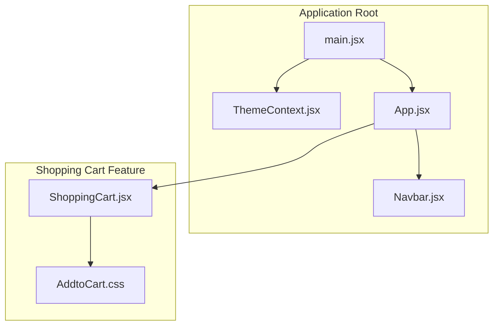
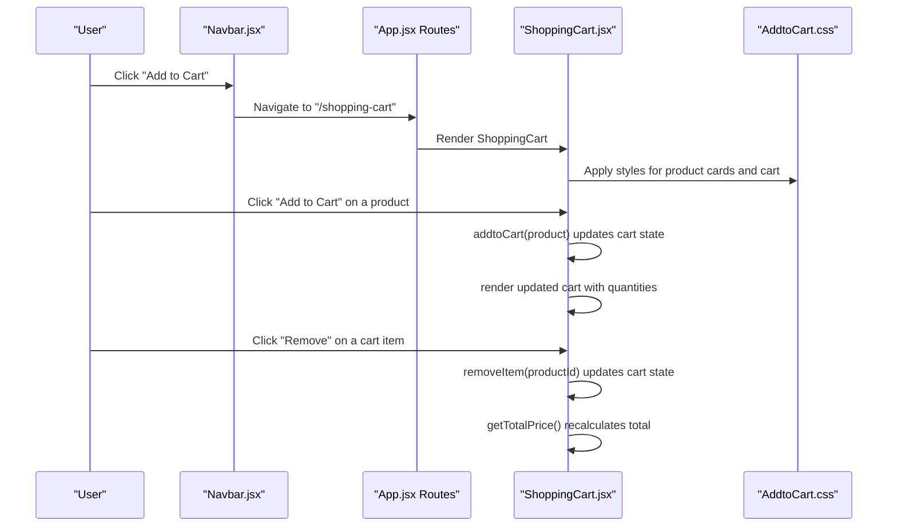
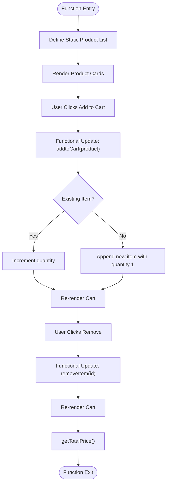
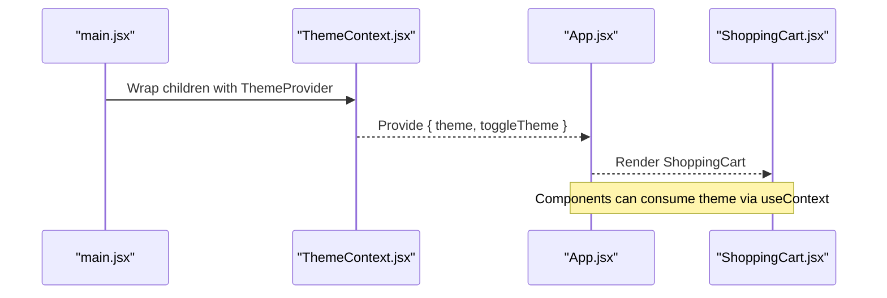
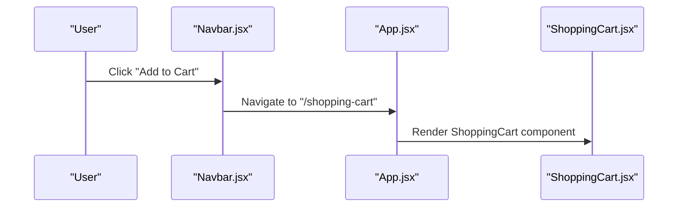
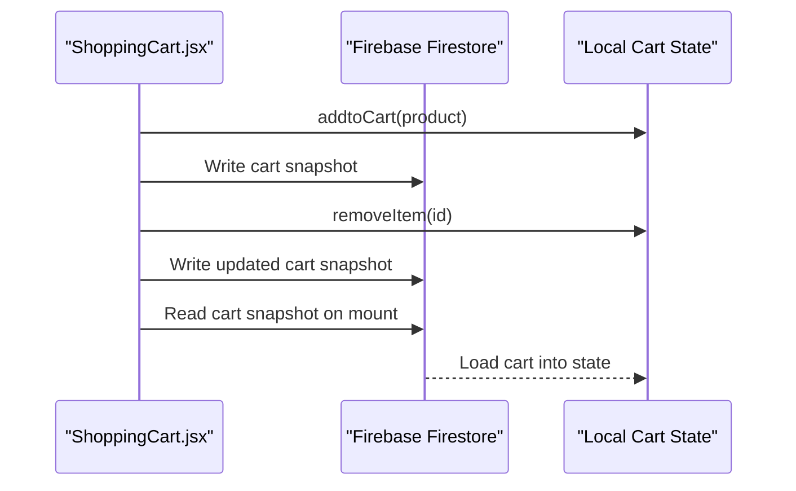
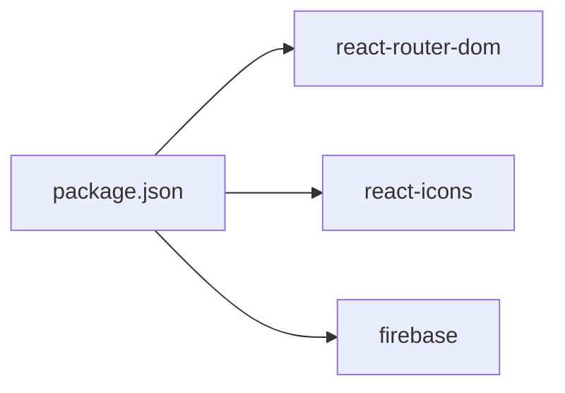

# Shopping Cart

<cite>
**Referenced Files in This Document**
- [ShoppingCart.jsx](file://src/components/ShoppingCart.jsx)
- [AddtoCart.css](file://src/components/AddtoCart.css)
- [ThemeContext.jsx](file://src/components/ThemeContext.jsx)
- [Navbar.jsx](file://src/components/Navbar.jsx)
- [App.jsx](file://src/App.jsx)
- [main.jsx](file://src/main.jsx)
- [FirebaseConfig.jsx](file://src/components/FirebaseConfig.jsx)
- [package.json](file://package.json)
</cite>

## Table of Contents
1. [Introduction](#introduction)
2. [Project Structure](#project-structure)
3. [Core Components](#core-components)
4. [Architecture Overview](#architecture-overview)
5. [Detailed Component Analysis](#detailed-component-analysis)
6. [Dependency Analysis](#dependency-analysis)
7. [Performance Considerations](#performance-considerations)
8. [Troubleshooting Guide](#troubleshooting-guide)
9. [Conclusion](#conclusion)
10. [Appendices](#appendices)

## Introduction
This document explains the ShoppingCart component and its role in product selection and cart management. It covers the state management with useState, the add-to-cart logic that handles existing items and quantity updates, removal of items, and total price calculation. It also describes how the product list is statically defined and rendered, how “Add to Cart” triggers state updates, and how the cart displays items with quantity and price. Styling is handled via AddtoCart.css for layout and visual presentation. Finally, it addresses common issues such as state mutation best practices using functional updates, performance optimization for re-renders, and potential enhancements like persistence with Firebase, along with integration guidance for routing via Navbar and theming support through ThemeContext.

## Project Structure
The ShoppingCart component resides under src/components and is integrated into the application via routing and theming providers. The main entry point wraps the application with ThemeProvider so components can consume theme context. Routing is configured in App.jsx and linked from Navbar.jsx.

**Diagram sources**
- [main.jsx](file://src/main.jsx#L1-L13)
- [ThemeContext.jsx](file://src/components/ThemeContext.jsx#L1-L14)
- [App.jsx](file://src/App.jsx#L1-L56)
- [Navbar.jsx](file://src/components/Navbar.jsx#L1-L81)
- [ShoppingCart.jsx](file://src/components/ShoppingCart.jsx#L1-L75)
- [AddtoCart.css](file://src/components/AddtoCart.css#L1-L126)

**Section sources**
- [main.jsx](file://src/main.jsx#L1-L13)
- [ThemeContext.jsx](file://src/components/ThemeContext.jsx#L1-L14)
- [App.jsx](file://src/App.jsx#L1-L56)
- [Navbar.jsx](file://src/components/Navbar.jsx#L1-L81)
- [ShoppingCart.jsx](file://src/components/ShoppingCart.jsx#L1-L75)
- [AddtoCart.css](file://src/components/AddtoCart.css#L1-L126)

## Core Components
- ShoppingCart: Implements product selection, cart state, add-to-cart, remove item, and total price calculation.
- AddtoCart.css: Provides layout and visual styling for product cards, buttons, and cart display.
- ThemeContext: Supplies theme state and toggle function to the app.
- Navbar: Provides navigation links, including a route to the shopping cart page.
- App: Declares routes and includes the ShoppingCart route.
- main.jsx: Wraps the app with ThemeProvider.

Key responsibilities:
- State management: useState manages the cart array.
- Product rendering: Static product list is mapped to product cards.
- Event handlers: Add to Cart button triggers addtoCart; Remove button triggers removeItem.
- Calculations: getTotalPrice computes the total cost from item prices and quantities.
- Styling: CSS classes define responsive layout and interactive elements.

**Section sources**
- [ShoppingCart.jsx](file://src/components/ShoppingCart.jsx#L1-L75)
- [AddtoCart.css](file://src/components/AddtoCart.css#L1-L126)
- [ThemeContext.jsx](file://src/components/ThemeContext.jsx#L1-L14)
- [Navbar.jsx](file://src/components/Navbar.jsx#L1-L81)
- [App.jsx](file://src/App.jsx#L1-L56)
- [main.jsx](file://src/main.jsx#L1-L13)

## Architecture Overview
The shopping cart feature is a self-contained component that renders a static product list and maintains a local cart state. Navigation to the shopping cart is provided by Navbar, and routing is declared in App. Theming is provided globally via ThemeContext.

**Diagram sources**
- [Navbar.jsx](file://src/components/Navbar.jsx#L1-L81)
- [App.jsx](file://src/App.jsx#L1-L56)
- [ShoppingCart.jsx](file://src/components/ShoppingCart.jsx#L1-L75)
- [AddtoCart.css](file://src/components/AddtoCart.css#L1-L126)

## Detailed Component Analysis

### ShoppingCart Component
The ShoppingCart component encapsulates:
- Product list definition and rendering
- Cart state with useState
- addtoCart function with existence check and quantity increment
- removeItem function with filtering
- getTotalPrice function with reduction
- Rendering of product cards and cart items with dynamic totals

Implementation highlights:
- Product list: A static array of product objects is defined and mapped to product cards.
- State: cart is initialized as an empty array and updated immutably using functional updates.
- addtoCart: Uses a functional update to find an existing item by id and either increments quantity or appends a new item with quantity 1.
- removeItem: Uses a functional update to filter out the item with the given id.
- getTotalPrice: Uses reduce to compute the total cost from item price and quantity.
- Rendering: Product cards display name and price with an “Add to Cart” button. Cart lists items with remove buttons and a total.

**Diagram sources**
- [ShoppingCart.jsx](file://src/components/ShoppingCart.jsx#L1-L75)

**Section sources**
- [ShoppingCart.jsx](file://src/components/ShoppingCart.jsx#L1-L75)

### Styling with AddtoCart.css
The stylesheet defines:
- Global resets and base layout
- Container and card layouts for product display
- Button styles for “Add to Cart” and “Remove”
- Cart item layout and total price styling

Key selectors and roles:
- .app: Main container with shadow and padding
- .product-list: Flex container for product cards
- .product-card: Card with border, padding, and shadow
- .add-to-cart-btn: Green button with hover effect
- .cart: Section separator and padding
- .cart-item: Item row with space-between layout and remove button
- .remove-btn: Red button with hover effect
- h2 and h3: Headings with theme-appropriate colors

**Section sources**
- [AddtoCart.css](file://src/components/AddtoCart.css#L1-L126)

### Theming Integration via ThemeContext
ThemeContext provides theme state and a toggle function. The app is wrapped with ThemeProvider at the root level, enabling components to consume theme context. While ShoppingCart does not directly use theme context, it benefits from global theming applied by the provider.

**Diagram sources**
- [main.jsx](file://src/main.jsx#L1-L13)
- [ThemeContext.jsx](file://src/components/ThemeContext.jsx#L1-L14)
- [App.jsx](file://src/App.jsx#L1-L56)

**Section sources**
- [main.jsx](file://src/main.jsx#L1-L13)
- [ThemeContext.jsx](file://src/components/ThemeContext.jsx#L1-L14)
- [App.jsx](file://src/App.jsx#L1-L56)

### Routing Integration via Navbar
Navbar provides navigation to the shopping cart route. The route is declared in App.jsx, and clicking the link navigates to the ShoppingCart component.

**Diagram sources**
- [Navbar.jsx](file://src/components/Navbar.jsx#L1-L81)
- [App.jsx](file://src/App.jsx#L1-L56)
- [ShoppingCart.jsx](file://src/components/ShoppingCart.jsx#L1-L75)

**Section sources**
- [Navbar.jsx](file://src/components/Navbar.jsx#L1-L81)
- [App.jsx](file://src/App.jsx#L1-L56)

### Persistence with Firebase (Enhancement)
The project includes Firebase dependencies and a Firebase configuration module. While the current ShoppingCart component uses local state, Firebase can be used to persist cart data. Recommended steps:
- Initialize Firestore and Auth in the app
- On addtoCart/removeItem/getTotalPrice, write/read cart data to/from Firestore
- Sync cart state with Firestore on mount and on changes
- Handle offline scenarios and conflict resolution

**Diagram sources**
- [ShoppingCart.jsx](file://src/components/ShoppingCart.jsx#L1-L75)
- [FirebaseConfig.jsx](file://src/components/FirebaseConfig.jsx#L1-L26)
- [package.json](file://package.json#L1-L32)

**Section sources**
- [FirebaseConfig.jsx](file://src/components/FirebaseConfig.jsx#L1-L26)
- [package.json](file://package.json#L1-L32)

## Dependency Analysis
External dependencies relevant to the shopping cart feature:
- react-router-dom: Enables routing to the shopping cart page
- react-icons: Used by Navbar for icons
- firebase: Provides Firestore and Auth for persistence enhancement

**Diagram sources**
- [package.json](file://package.json#L1-L32)

**Section sources**
- [package.json](file://package.json#L1-L32)

## Performance Considerations
- Functional updates: The component already uses functional updates for state changes, which avoids stale closures and ensures predictable updates.
- Re-renders: The cart re-renders when state changes. To minimize unnecessary re-renders:
  - Memoize derived values (e.g., total) with useMemo if calculations become expensive.
  - Use React.memo for child components if present.
  - Avoid re-creating handler functions inside render; bind handlers at component level.
- Keys: Product and cart items use stable keys (id), preventing unnecessary remounts.
- Lists: Keep product and cart arrays small or paginate if scaling up.

[No sources needed since this section provides general guidance]

## Troubleshooting Guide
Common issues and resolutions:
- State mutation: Ensure immutability by returning new arrays/objects rather than mutating existing ones. The component already uses functional updates and spread operators, which is correct.
- Type coercion: Prices are stored as strings. Convert to numbers before arithmetic to avoid concatenation errors.
- Duplicate items: The addtoCart function checks for existing items by id and increments quantity, which prevents duplicates.
- Removal correctness: removeItem filters by id; ensure ids are unique and stable.
- Total calculation: getTotalPrice multiplies price by quantity; ensure price is numeric.
- Styling conflicts: Verify CSS selectors match the component’s class names (.product-card, .add-to-cart-btn, .cart-item, .remove-btn).

**Section sources**
- [ShoppingCart.jsx](file://src/components/ShoppingCart.jsx#L1-L75)
- [AddtoCart.css](file://src/components/AddtoCart.css#L1-L126)

## Conclusion
The ShoppingCart component provides a clean, functional implementation of product selection and cart management. It uses React hooks for state, immutable updates for safety, and CSS for layout and styling. Integration with routing and theming is straightforward. For production readiness, consider converting price types to numbers, memoizing expensive computations, and adding persistence with Firebase.

[No sources needed since this section summarizes without analyzing specific files]

## Appendices

### API and Behavior Summary
- addtoCart(product): Adds a product to the cart or increments quantity if already present.
- removeItem(productId): Removes the item with the given id from the cart.
- getTotalPrice(): Computes the total cost from item prices and quantities.
- Product rendering: Static product list mapped to cards with “Add to Cart” buttons.
- Cart rendering: Dynamic list with remove buttons and a total price display.

**Section sources**
- [ShoppingCart.jsx](file://src/components/ShoppingCart.jsx#L1-L75)