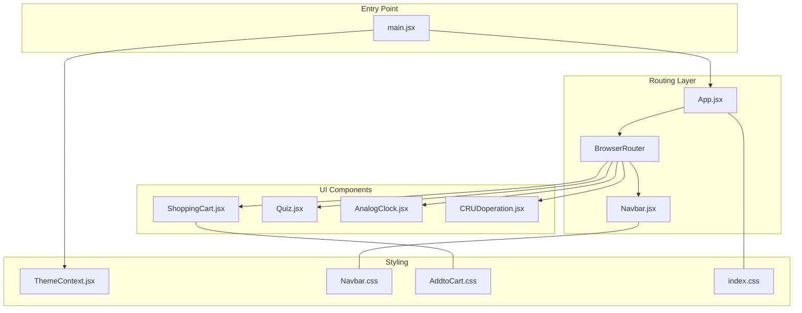
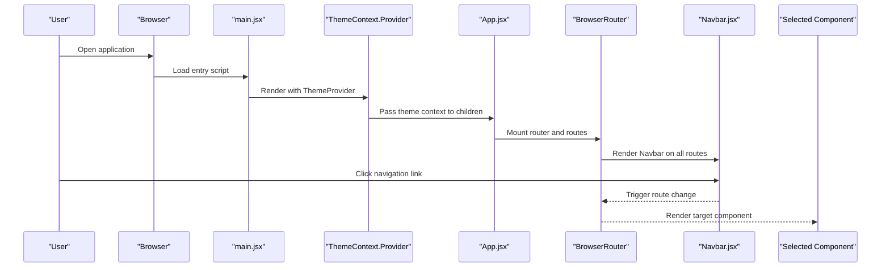
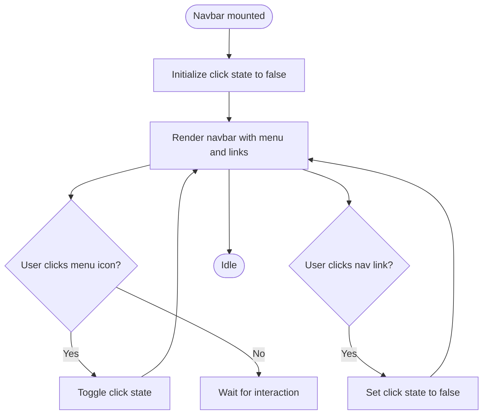
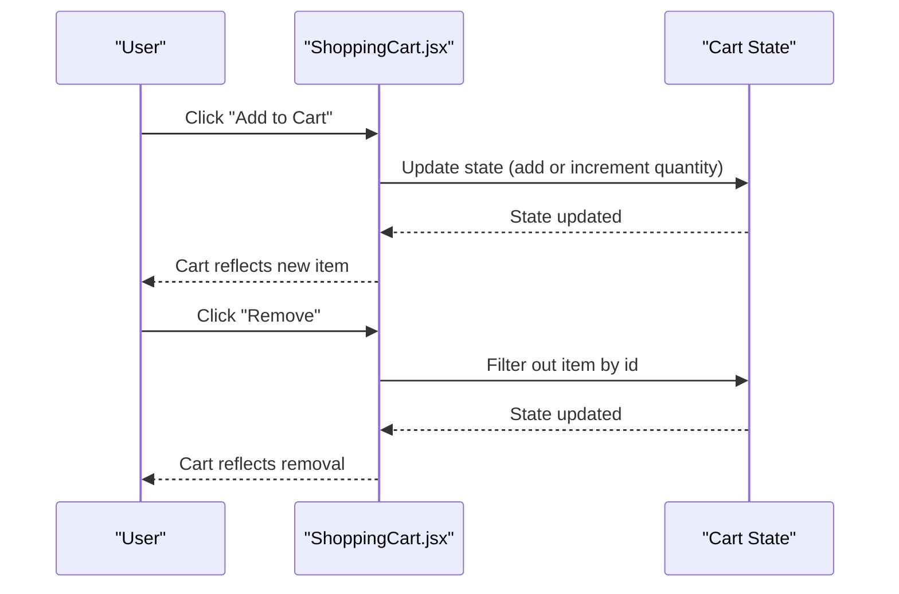
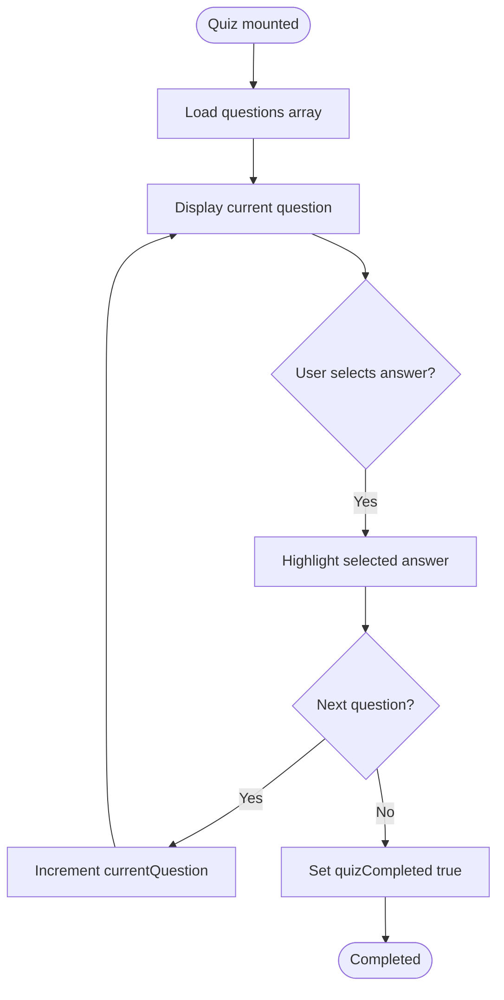
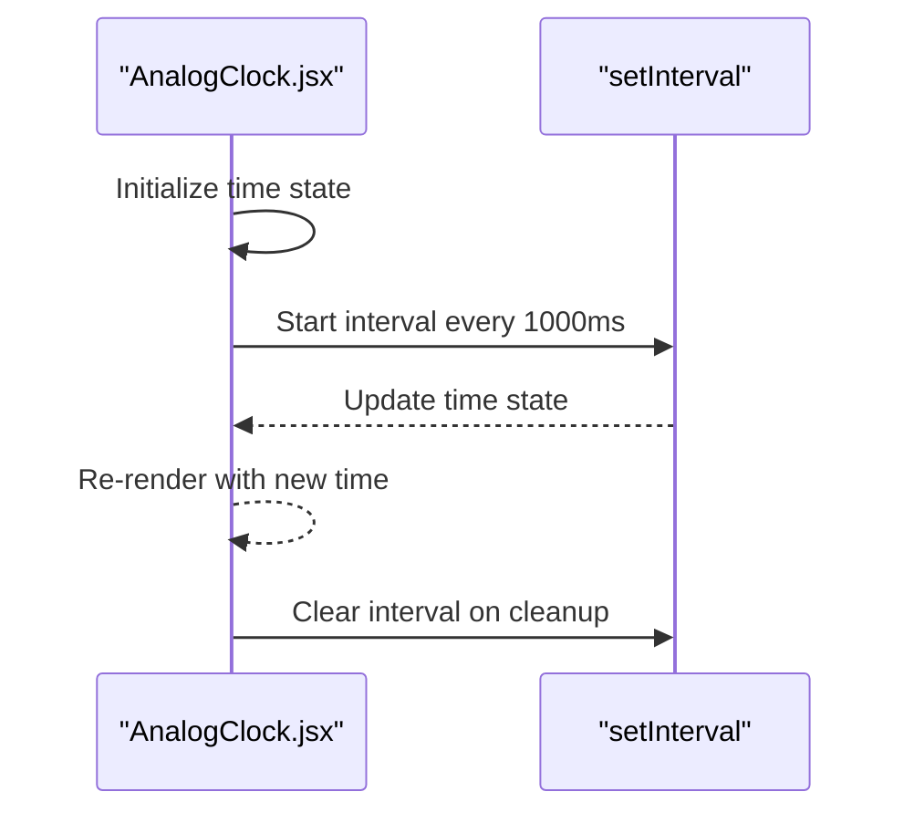
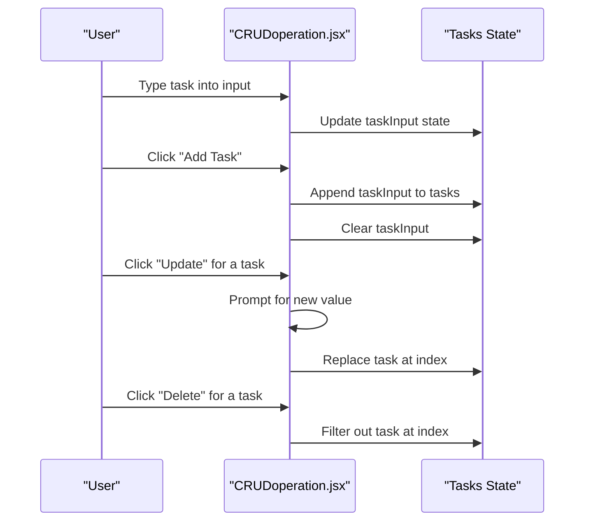
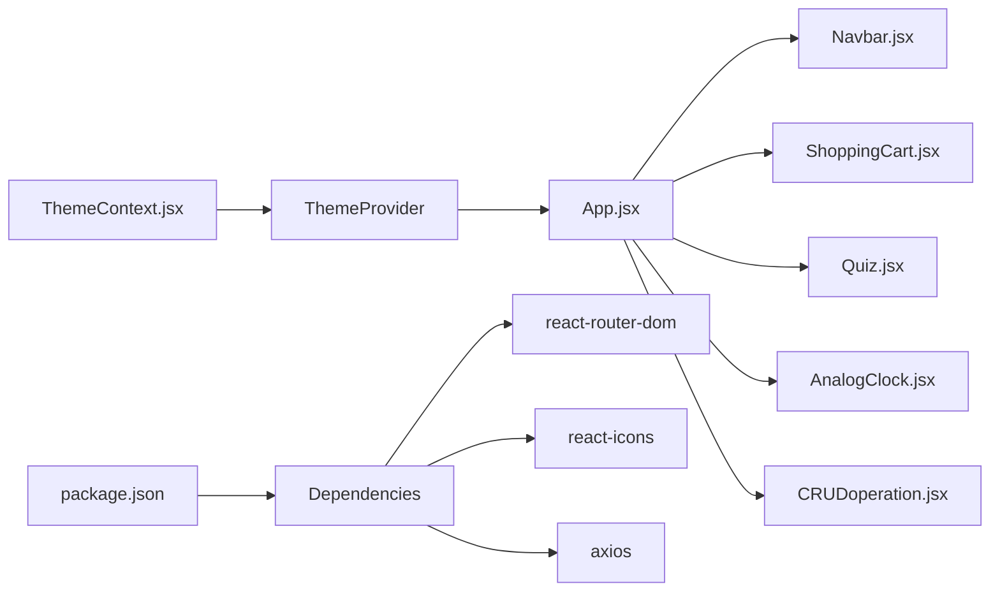

# UI Components

<cite>
**Referenced Files in This Document**
- [Navbar.jsx](file://src/components/Navbar.jsx)
- [Navbar.css](file://src/components/CSS/Navbar.css)
- [ShoppingCart.jsx](file://src/components/ShoppingCart.jsx)
- [AddtoCart.css](file://src/components/AddtoCart.css)
- [Quiz.jsx](file://src/components/Quiz.jsx)
- [AnalogClock.jsx](file://src/components/AnalogClock.jsx)
- [CRUDoperation.jsx](file://src/components/CRUDoperation.jsx)
- [ThemeContext.jsx](file://src/components/ThemeContext.jsx)
- [App.jsx](file://src/App.jsx)
- [main.jsx](file://src/main.jsx)
- [index.css](file://src/index.css)
- [package.json](file://src/package.json)
</cite>

## Table of Contents
1. [Introduction](#introduction)
2. [Project Structure](#project-structure)
3. [Core Components](#core-components)
4. [Architecture Overview](#architecture-overview)
5. [Detailed Component Analysis](#detailed-component-analysis)
6. [Dependency Analysis](#dependency-analysis)
7. [Performance Considerations](#performance-considerations)
8. [Troubleshooting Guide](#troubleshooting-guide)
9. [Conclusion](#conclusion)

## Introduction
This document provides comprehensive UI component documentation for the car-rental-frontend application. It focuses on five major components: Navbar (responsive navigation with mobile menu), ShoppingCart (product selection and cart management), Quiz (interactive quiz interface), AnalogClock (time display), and CRUDoperation (data management interface). For each component, we describe visual appearance, behavior, user interaction patterns, props/attributes, event handlers, customization options, and styling approaches using CSS modules. We also provide guidelines for responsive design, accessibility, theming via ThemeContext, cross-browser compatibility, performance optimization, component composition, and integration with routing and state management.

## Project Structure
The application is a React project bootstrapped with Vite. Components are organized under src/components, with dedicated CSS modules for styling. Routing is handled by react-router-dom, and theming is provided by a simple ThemeContext provider. The main entry point wraps the app with ThemeProvider.

**Diagram sources**
- [main.jsx](file://src/main.jsx#L1-L13)
- [App.jsx](file://src/App.jsx#L1-L53)
- [Navbar.jsx](file://src/components/Navbar.jsx#L1-L81)
- [ShoppingCart.jsx](file://src/components/ShoppingCart.jsx#L1-L75)
- [Quiz.jsx](file://src/components/Quiz.jsx#L1-L81)
- [AnalogClock.jsx](file://src/components/AnalogClock.jsx#L1-L28)
- [CRUDoperation.jsx](file://src/components/CRUDoperation.jsx#L1-L77)
- [ThemeContext.jsx](file://src/components/ThemeContext.jsx#L1-L14)
- [Navbar.css](file://src/components/CSS/Navbar.css#L1-L164)
- [AddtoCart.css](file://src/components/AddtoCart.css#L1-L126)
- [index.css](file://src/index.css#L1-L69)

**Section sources**
- [main.jsx](file://src/main.jsx#L1-L13)
- [App.jsx](file://src/App.jsx#L1-L53)
- [package.json](file://src/package.json#L1-L32)

## Core Components
This section summarizes the primary UI components and their roles within the application.

- Navbar: Provides responsive navigation with a mobile hamburger menu, links to various pages, and login/signup buttons.
- ShoppingCart: Displays a list of products and manages a shopping cart with add/remove actions and total calculation.
- Quiz: Presents interactive questions with selectable answers and placeholders for scoring and progression.
- AnalogClock: Renders a digital clock that updates every second.
- CRUDoperation: Implements basic task management with add, update, and delete operations.

**Section sources**
- [Navbar.jsx](file://src/components/Navbar.jsx#L1-L81)
- [ShoppingCart.jsx](file://src/components/ShoppingCart.jsx#L1-L75)
- [Quiz.jsx](file://src/components/Quiz.jsx#L1-L81)
- [AnalogClock.jsx](file://src/components/AnalogClock.jsx#L1-L28)
- [CRUDoperation.jsx](file://src/components/CRUDoperation.jsx#L1-L77)

## Architecture Overview
The UI components are integrated into a routing-driven layout. The ThemeProvider wraps the application to enable theme switching. Styling is modularized via CSS modules and global base styles.

**Diagram sources**
- [main.jsx](file://src/main.jsx#L1-L13)
- [ThemeContext.jsx](file://src/components/ThemeContext.jsx#L1-L14)
- [App.jsx](file://src/App.jsx#L1-L53)
- [Navbar.jsx](file://src/components/Navbar.jsx#L1-L81)

## Detailed Component Analysis

### Navbar Component
- Purpose: Responsive navigation bar with a mobile menu toggle, logo, and multiple internal links.
- Visual appearance:
  - Sticky navbar with backdrop blur and subtle shadow.
  - Logo with icon and hover scaling effect.
  - Navigation links with hover underline and glass-like hover background.
  - Login and Sign Up buttons styled with theme-aware colors and hover effects.
  - Mobile menu appears as a vertical overlay sliding in from the left when toggled.
- Behavior:
  - Toggles mobile menu visibility on icon click.
  - Closes mobile menu when any navigation link is clicked.
  - Uses react-icons for hamburger and close icons.
- User interactions:
  - Clicking the menu icon toggles the mobile menu.
  - Clicking a nav link navigates to the target route and closes the mobile menu.
  - Hovering buttons and links triggers transitions and color shifts.
- Props/Attributes:
  - None (no external props). Uses internal state for menu open/close.
- Event handlers:
  - handleClick: toggles click state.
  - closeMobileMenu: sets click state to false.
- Customization options:
  - Theming via CSS variables in Navbar.css.
  - Responsive breakpoints controlled in Navbar.css media query.
  - Button and link styles are defined in Navbar.css.
- Styling approach:
  - CSS module Navbar.css defines variables, navbar layout, logo, links, buttons, and mobile responsiveness.
  - Uses CSS variables for primary color, text color, and background effects.
- Accessibility:
  - Links are keyboard focusable; consider adding aria-labels and role attributes for improved semantics.
  - Ensure sufficient color contrast for links and buttons against the dark background.
- Cross-browser compatibility:
  - Backdrop filter and CSS variables are supported in modern browsers; consider fallbacks for older environments.
- Performance:
  - Minimal re-renders; state change is local to component.
  - Icon rendering is lightweight.

**Diagram sources**
- [Navbar.jsx](file://src/components/Navbar.jsx#L1-L81)
- [Navbar.css](file://src/components/CSS/Navbar.css#L1-L164)

**Section sources**
- [Navbar.jsx](file://src/components/Navbar.jsx#L1-L81)
- [Navbar.css](file://src/components/CSS/Navbar.css#L1-L164)

### ShoppingCart Component
- Purpose: Product catalog with add-to-cart functionality and cart management.
- Visual appearance:
  - Clean card-based product list with centered content.
  - Add to Cart buttons with hover effects.
  - Cart panel displaying items with remove buttons and a total price.
- Behavior:
  - Maintains an internal cart state with items and quantities.
  - Adds items to cart or increments quantity if already present.
  - Removes items by filtering out the selected product.
  - Calculates total price by summing item prices multiplied by quantities.
- User interactions:
  - Clicking "Add to Cart" adds the product to the cart.
  - Clicking "Remove" removes the item from the cart.
- Props/Attributes:
  - None (no external props).
- Event handlers:
  - addtoCart: handles adding items and updating quantities.
  - removeItem: handles removing items by id.
  - getTotalPrice: computes total cost.
- Customization options:
  - Modify product list and styling via AddtoCart.css.
  - Adjust button colors and spacing in AddtoCart.css.
- Styling approach:
  - CSS module AddtoCart.css defines layout, cards, buttons, and cart item styles.
  - Uses flexbox and grid-like wrapping for product cards.
- Accessibility:
  - Buttons should have accessible labels; consider ARIA attributes for dynamic content.
  - Ensure keyboard navigation works for buttons.
- Cross-browser compatibility:
  - CSS flexbox is widely supported; ensure fallbacks if targeting legacy browsers.
- Performance:
  - State updates use functional setState for predictable updates.
  - Rendering uses map over arrays; consider memoization for large lists.

**Diagram sources**
- [ShoppingCart.jsx](file://src/components/ShoppingCart.jsx#L1-L75)
- [AddtoCart.css](file://src/components/AddtoCart.css#L1-L126)

**Section sources**
- [ShoppingCart.jsx](file://src/components/ShoppingCart.jsx#L1-L75)
- [AddtoCart.css](file://src/components/AddtoCart.css#L1-L126)

### Quiz Component
- Purpose: Interactive quiz interface with multiple-choice questions.
- Visual appearance:
  - Question section and answer options rendered as buttons.
  - Selected answer highlighted with a distinct background.
- Behavior:
  - Tracks current question index, selected answer, score, and completion state.
  - Contains placeholder handlers for selecting answers, navigating to the next question, and finishing the quiz.
- User interactions:
  - Clicking an answer selects it.
  - Placeholder handlers indicate where navigation and scoring logic will be implemented.
- Props/Attributes:
  - None (no external props).
- Event handlers:
  - handleSelectAnswer: currently empty (placeholder).
  - handleNextQuestion: currently empty (placeholder).
  - handleFinishQuiz: currently empty (placeholder).
- Customization options:
  - Extend questions array and styling via inline styles or CSS modules.
- Styling approach:
  - Inline styles define button appearance and selection feedback.
- Accessibility:
  - Buttons should be keyboard accessible; consider using radio inputs or role="radiogroup".
  - Provide ARIA attributes for selected state and instructions.
- Cross-browser compatibility:
  - Inline styles are broadly compatible; ensure consistent behavior across browsers.
- Performance:
  - Stateless component with minimal rendering; performance is not a concern here.

**Diagram sources**
- [Quiz.jsx](file://src/components/Quiz.jsx#L1-L81)

**Section sources**
- [Quiz.jsx](file://src/components/Quiz.jsx#L1-L81)

### AnalogClock Component
- Purpose: Displays the current time in digital format with periodic updates.
- Visual appearance:
  - Large time display with date information.
- Behavior:
  - Initializes time state to current time.
  - Sets up an interval to update time every second.
  - Clears interval on component unmount to prevent memory leaks.
- User interactions:
  - No user interactions; updates automatically.
- Props/Attributes:
  - None (no external props).
- Event handlers:
  - None (uses useEffect lifecycle).
- Customization options:
  - Adjust font sizes and layout via inline styles.
- Styling approach:
  - Inline styles define typography and spacing.
- Accessibility:
  - Static display; ensure sufficient contrast and readable sizes.
- Cross-browser compatibility:
  - setInterval and toLocaleTimeString are widely supported.
- Performance:
  - Lightweight component; frequent updates occur every second.

**Diagram sources**
- [AnalogClock.jsx](file://src/components/AnalogClock.jsx#L1-L28)

**Section sources**
- [AnalogClock.jsx](file://src/components/AnalogClock.jsx#L1-L28)

### CRUDoperation Component
- Purpose: Basic task management interface with add, update, and delete operations.
- Visual appearance:
  - Input field for task entry.
  - List of tasks with update and delete controls.
  - Styled list items with borders and layout.
- Behavior:
  - Manages task list state and input value.
  - Adds tasks when input is non-empty.
  - Updates tasks via prompt dialog and replaces the old value.
  - Deletes tasks by filtering out the selected index.
- User interactions:
  - Typing in input updates local state.
  - Clicking "Add Task" appends the task.
  - Clicking "Update" opens a prompt to edit the task.
  - Clicking "Delete" removes the task.
- Props/Attributes:
  - None (no external props).
- Event handlers:
  - handleTask: adds a new task.
  - handleDeleteTask: deletes a task by index.
  - handleUpdateTask: updates a task by index.
- Customization options:
  - Adjust styling via inline styles or external CSS.
- Styling approach:
  - Inline styles define layout, borders, and colors.
- Accessibility:
  - Inputs and buttons should be keyboard accessible.
  - Consider replacing prompts with modals for better UX and accessibility.
- Cross-browser compatibility:
  - Prompt dialogs are supported across browsers; consider custom modals for consistency.
- Performance:
  - Simple state updates; performance is not a concern.

**Diagram sources**
- [CRUDoperation.jsx](file://src/components/CRUDoperation.jsx#L1-L77)

**Section sources**
- [CRUDoperation.jsx](file://src/components/CRUDoperation.jsx#L1-L77)

## Dependency Analysis
- ThemeContext:
  - Provides theme state and toggle function to children via context.
  - Consumed by components indirectly through the ThemeProvider wrapper.
- Routing:
  - App.jsx defines routes and includes Navbar and target components.
  - Router is commented out in App.jsx; ensure it is enabled for navigation to work.
- External dependencies:
  - react-router-dom for routing.
  - react-icons for icons.
  - axios for HTTP requests (used by other components).

**Diagram sources**
- [ThemeContext.jsx](file://src/components/ThemeContext.jsx#L1-L14)
- [App.jsx](file://src/App.jsx#L1-L53)
- [Navbar.jsx](file://src/components/Navbar.jsx#L1-L81)
- [ShoppingCart.jsx](file://src/components/ShoppingCart.jsx#L1-L75)
- [Quiz.jsx](file://src/components/Quiz.jsx#L1-L81)
- [AnalogClock.jsx](file://src/components/AnalogClock.jsx#L1-L28)
- [CRUDoperation.jsx](file://src/components/CRUDoperation.jsx#L1-L77)
- [package.json](file://src/package.json#L1-L32)

**Section sources**
- [ThemeContext.jsx](file://src/components/ThemeContext.jsx#L1-L14)
- [App.jsx](file://src/App.jsx#L1-L53)
- [package.json](file://src/package.json#L1-L32)

## Performance Considerations
- Rendering:
  - Use keys in list renders (already present for product and cart items).
  - Avoid unnecessary re-renders by keeping state local to components where possible.
- Animations:
  - CSS transitions are lightweight; avoid heavy JavaScript-based animations.
- Memory:
  - Ensure intervals are cleared on unmount (already handled in AnalogClock).
- Bundle size:
  - Keep CSS modules scoped to components to reduce global style conflicts.
- Accessibility:
  - Prefer native elements and ARIA attributes for keyboard and screen reader support.
- Theming:
  - Centralize theme variables in CSS variables for efficient updates.

[No sources needed since this section provides general guidance]

## Troubleshooting Guide
- Navigation not working:
  - Verify that Router is enabled in App.jsx and routes are correctly defined.
  - Ensure Navbar links use react-router Link components.
- Mobile menu not closing:
  - Confirm that closeMobileMenu is attached to nav links and that click state toggles correctly.
- Shopping cart not updating:
  - Check that addtoCart and removeItem functions update state correctly.
  - Ensure product ids match between products and cart items.
- Quiz interactions:
  - Implement handleSelectAnswer, handleNextQuestion, and handleFinishQuiz to manage state transitions.
- Clock not updating:
  - Confirm useEffect runs and interval is cleared on unmount.
- Theme not applying:
  - Ensure ThemeProvider wraps the application and components consume the context.

**Section sources**
- [App.jsx](file://src/App.jsx#L1-L53)
- [Navbar.jsx](file://src/components/Navbar.jsx#L1-L81)
- [ShoppingCart.jsx](file://src/components/ShoppingCart.jsx#L1-L75)
- [Quiz.jsx](file://src/components/Quiz.jsx#L1-L81)
- [AnalogClock.jsx](file://src/components/AnalogClock.jsx#L1-L28)
- [ThemeContext.jsx](file://src/components/ThemeContext.jsx#L1-L14)

## Conclusion
The car-rental-frontend application demonstrates modular UI components with responsive design and basic interactivity. Navbar provides a robust mobile-friendly navigation experience, ShoppingCart offers straightforward cart management, Quiz lays the groundwork for an interactive assessment, AnalogClock delivers a simple time display, and CRUDoperation enables basic task management. Styling is handled via CSS modules and global base styles, while theming is centralized through ThemeContext. For production readiness, implement missing handlers in Quiz, enable routing in App.jsx, enhance accessibility, and consider performance optimizations for larger datasets.